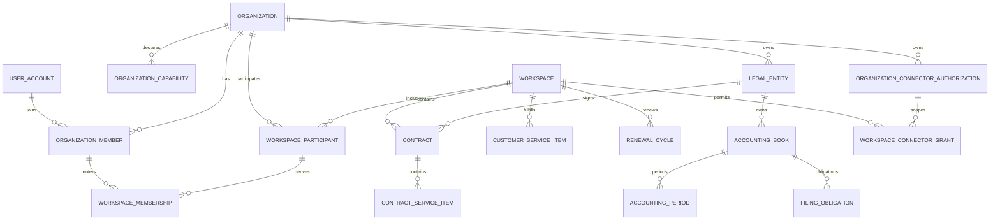

# 财税服务协作 SaaS 术语与概念 v3.0

---

## 1. 术语与概念模型

> 版本：v3.0 
> 适用范围：需求、页面、API、事件、数据、权限、测试、迁移、合同和培训材料

### 1.1 目的与使用规则

本文为重构文档包的术语权威来源。所有新文档和制品必须遵守：

1. 一个概念使用一个稳定英文名和一个中文标准名称；显示别名不得改变语义。
2. Organization、LegalEntity、Workspace、AccountingBook 不得互相替代。
3. `PRIMARY_PROVIDER/PRIMARY_CLIENT/PARTNER` 是 Workspace 关系角色，不是 Organization 永久类型。
4. `PLATFORM/PROVIDER/ENTERPRISE` 是会话 Audience，不是成员角色。
5. 服务机构内部客户经营、财税作业、经营财务和内部管理是业务域，不是 Workspace。
6. “客户”单独出现时歧义过大；需求、数据和 API 必须明确是 Organization、LegalEntity、provider-customer profile、Workspace participant 还是联系人。

### 1.2 核心术语

#### 1.2.1 平台、主体与服务关系

| ID | 中文标准名称 | 稳定英文名/代码 | 定义 | 禁止混用 |
|---|---|---|---|---|
| DOM-TERM-001 | 财税服务协作 SaaS | Product | 面向服务机构与客户企业的公有云多组织财税服务协作产品 | 不称为单一租户 CRM、客户自助记账软件 |
| DOM-TERM-002 | 组织 | `Organization` | 平台中统一的组织行动主体，可雇佣成员、拥有 LegalEntity、购买或提供服务 | 不直接等同租户、客户、法人、Workspace |
| DOM-TERM-003 | 组织能力 | `OrganizationCapability` | Organization 可承担业务的资格；本期至少 `PROVIDE_SERVICE`、`RECEIVE_SERVICE` | 不是永久组织类型，也不直接授权成员 |
| DOM-TERM-004 | 法律主体 | `LegalEntity` | 归属于 Organization 的具体法人、其他经营主体或自然人业务主体，是签约、核算、纳税、开票和外部授权主体 | 不由 Organization、Workspace 或客户组替代 |
| DOM-TERM-005 | 服务工作空间 | `Workspace` / Service Workspace | 一个长期服务关系的协作边界，连接参与 Organization，承载多合同、服务项目、续费周期和共享协作 | 不是销售/会计工作区，不是账套，不是租户 |
| DOM-TERM-006 | 工作空间参与关系 | `workspace_participant` | 一个 Organization 以关系角色加入一个 Workspace 的事实 | 不等于 organization_member 或业务角色 |
| DOM-TERM-007 | 主服务方 | `PRIMARY_PROVIDER` | Workspace 中主要提供服务的 Organization；必须具备 `PROVIDE_SERVICE` 能力 | 不写入 Organization 永久类型 |
| DOM-TERM-008 | 主客户方 | `PRIMARY_CLIENT` | Workspace 中主要接受服务的 Organization；必须具备 `RECEIVE_SERVICE` 能力 | 不等于某个 LegalEntity 或联系人 |
| DOM-TERM-009 | 合作方 | `PARTNER` | 经明确授权在 Workspace 中承担部分服务的其他 Organization | 不继承主服务方/主客户方权限；首期启用待决策 |
| DOM-TERM-010 | 参与状态 | `INVITED/ACTIVE/SUSPENDED/LEFT` | workspace_participant 的完整稳定状态集合 | 不使用租户 ACTIVE/CLOSED 代替 |
| DOM-TERM-011 | 工作空间成员资格 | `workspace_membership` | Organization 成员经其 participant 获得进入 Workspace 的资格 | 仅有资格不等于拥有业务动作权限 |
| DOM-TERM-012 | 组织关系 | `organization_relationship` | 集团、控制、品牌、介绍或其他组织间关系的版本化事实 | 不自动授予 Workspace、LegalEntity 或对象权限 |

#### 1.2.2 身份、入口与权限

| ID | 中文标准名称 | 稳定英文名/代码 | 定义 | 禁止混用 |
|---|---|---|---|---|
| DOM-TERM-013 | 统一登录身份 | `user_account` | 平台级自然人登录身份，不继承 Organization 或 Workspace | 不等于员工、联系人、客户账号 |
| DOM-TERM-014 | 组织成员 | `organization_member` | user_account 与 Organization 的有效关系 | 不自动获得角色或 Workspace 访问权 |
| DOM-TERM-015 | 员工档案 | `employee` | PROVIDER Organization 内的人事、任职和岗位档案，可与 organization_member 关联 | 不等于统一登录身份或角色 |
| DOM-TERM-016 | 平台控制台 | `PLATFORM_CONSOLE` | PLATFORM Audience 的平台运营入口 | 不进入活动 Organization/Workspace 上下文 |
| DOM-TERM-017 | 服务机构工作端 | `PROVIDER_PORTAL` | PROVIDER Audience 的服务机构员工工作入口 | 不称租户销售 Workspace/租户会计 Workspace |
| DOM-TERM-018 | 客户企业门户 | `ENTERPRISE_PORTAL` | ENTERPRISE Audience 的长期企业成员入口 | 不等于限时 H5 或 PROVIDER 工作端 |
| DOM-TERM-019 | 安全受众 | `Audience` | 会话和 API 的顶层互斥安全边界：`PLATFORM/PROVIDER/ENTERPRISE` | 不等于角色或 participant role |
| DOM-TERM-020 | 角色 | `role` | 版本化原子权限集合 | 不等于岗位、入口、Workspace 或审批解析器 |
| DOM-TERM-021 | 角色授权 | `role_assignment` | 将角色按受众、组织/Workspace/对象和有效期显式授给主体的事实 | 不由岗位、菜单或 participant 自动生成 |
| DOM-TERM-022 | 数据范围 | `data_scope` | SELF、DEPARTMENT、DEPARTMENT_TREE、ORGANIZATION、WORKSPACE、LEGAL_ENTITY、BOOK、OBJECT 等对象集合约束 | 不按“大小”线性比较或由页面推断 |
| DOM-TERM-023 | 审批任务能力 | `derived_task_grant` | 仅对当前实际分派任务派生的对象级最小权限 | 不创建可持久分配的全局审批人角色 |
| DOM-TERM-024 | 限时事项能力 | `capability_token` | 绑定单个对象、版本、动作、接收人、有效期和次数的令牌 | 不替代 ENTERPRISE membership，不接受员工 Bearer 扩权 |

#### 1.2.3 客户经营、合同与服务

| ID | 中文标准名称 | 稳定英文名/代码 | 定义 | 禁止混用 |
|---|---|---|---|---|
| DOM-TERM-025 | 私有线索 | `lead` | 属于单个 PROVIDER Organization 的潜在客户信息、来源、负责人和跟进事实 | 不提前创建全局 Organization，不跨服务商查重返回信息 |
| DOM-TERM-026 | 企业认领 | `organization_claim` | 申请人证明其对 Organization/LegalEntity 管理权的受控流程 | 不以掌握名称或税号即自动取得权限 |
| DOM-TERM-027 | 主体解析 | `organization_resolution` | 平台按法定主体摘要解析、创建或关联 Organization/LegalEntity 的防枚举服务 | 不向 PROVIDER 泄露其他服务关系 |
| DOM-TERM-028 | 服务方客户档案 | `provider_customer_profile` | PROVIDER 对某 Organization/Workspace 保存的来源、标签、负责人、等级、风险和内部备注 | 不写入 Organization 全局主档，不向其他 PROVIDER/ENTERPRISE 共享 |
| DOM-TERM-029 | 联系人 | `contact` | 自然人及其联系方式事实，通过版本化关系关联 Organization/LegalEntity/Workspace | 不等于 organization_member；一个联系人可服务多个主体 |
| DOM-TERM-030 | 销售机会 | `opportunity` | PROVIDER 私有的成交机会、阶段、商品项、协作和金额预期 | 不等于 Workspace 或合同 |
| DOM-TERM-031 | 报价 | `quotation` | 向潜在或已核验主体提出的版本化商业条件 | 接受报价不自动替代合同 |
| DOM-TERM-032 | 合同 | `contract` | Workspace 下由双方具体 LegalEntity 签署的版本化法律/商业事实 | 不直接等于 Workspace；一个 Workspace 可有多合同 |
| DOM-TERM-033 | 合同服务项 | `contract_service_item` | 合同内冻结的服务内容、价格、数量、税和履约配置 | 不等于实际服务状态 |
| DOM-TERM-034 | 客户服务项目 | `customer_service_item` | 根据合同服务项实际履行的服务关系，关联 Workspace、LegalEntity 和周期 | 不等于服务目录项或 Workspace |
| DOM-TERM-035 | 续费周期 | `renewal_cycle` | Workspace 下针对服务项目到期、报价、续约、失效的周期事实 | 续费不默认创建新 Workspace |
| DOM-TERM-036 | 服务工单 | `work_order` | 服务项目下按流程模板执行的可分派工作 | 不等于后台 job_task 或审批任务 |
| DOM-TERM-037 | 客户材料 | `customer_document` | 客户 LegalEntity/Workspace 下按逻辑文档和版本保存的材料事实 | 不等于裸附件；已提交版本不可覆盖 |

#### 1.2.4 财务、会计与税务

| ID | 中文标准名称 | 稳定英文名/代码 | 定义 | 禁止混用 |
|---|---|---|---|---|
| DOM-TERM-038 | 服务机构经营财务 | `OperatingFinance` | PRIMARY_PROVIDER 向客户收费、开票、退款、成本和预存资金业务 | 不等于客户 LegalEntity 法定会计 |
| DOM-TERM-039 | 平台商业计费 | `PlatformBilling` | 平台向订阅 Organization 计算套餐、用量、抽成、账单、收退款和平台发票 | 不等于 OperatingFinance 或客户账套 |
| DOM-TERM-040 | 会计账套 | `AccountingBook` | 一个具体 LegalEntity 按会计制度、币种和启用期形成会计事实的边界 | 不等于 Workspace、Organization、客户组 |
| DOM-TERM-041 | 会计期间 | `AccountingPeriod` | AccountingBook 中一个期间及其版本、状态和结账事实 | 不等于合同服务周期 |
| DOM-TERM-042 | 作业分工 | `book_assignment` | 会计、复核、税务及专项成员在账套上的有效分配 | 不等于 Organization 角色；角色不自动获得全部账套 |
| DOM-TERM-043 | 客户工资资料 | `customer_payroll_batch` | 客户 LegalEntity 的个税/会计工资来源资料 | 与 PROVIDER 内部员工工资严格隔离 |
| DOM-TERM-044 | 凭证 | `voucher` | AccountingBook/AccountingPeriod 下借贷平衡、版本化并可复核/过账的会计事实 | 不由经营收款直接替代 |
| DOM-TERM-045 | 税务登记 | `tax_registration` | LegalEntity 在地区和机关下的税务身份及有效期事实 | 不等于 Workspace 设置 |
| DOM-TERM-046 | 申报义务 | `filing_obligation` | LegalEntity/账套在期间必须完成某税种申报的责任事实 | 欠费或暂停不得隐藏/自动取消 |
| DOM-TERM-047 | 税费测算 | `tax_estimation` | 基于冻结来源和规则版本计算的税费结果 | 不等于正式申报或缴款 |
| DOM-TERM-048 | 客户确认 | `confirmation_request/event` | 由真实 ENTERPRISE 联系人对绑定对象、版本和受控动作作出的事实 | 员工已阅、审批或 H5 打开不等于确认 |
| DOM-TERM-049 | 申报 | `tax_filing` | 经编制、复核、确认/豁免和授权后提交的版本化税务事实 | UNKNOWN 不等于失败，可查单不得盲重提 |
| DOM-TERM-050 | 缴退税 | `tax_payment` | 与已申报事实关联的缴款或退税申请、执行、查单和回执 | 与服务机构退款、平台退款分开 |
| DOM-TERM-051 | 电子会计档案 | `archive_package` | 以 manifest、对象版本和摘要封存的会计税务材料集合 | 不等于普通附件目录 |

#### 1.2.5 协作、连接器与平台运营

| ID | 中文标准名称 | 稳定英文名/代码 | 定义 | 禁止混用 |
|---|---|---|---|---|
| DOM-TERM-052 | Workspace 私有事实 | `workspace_private_record` | 仅指定 participant/成员可见且不发布给另一参与方的关系内事实 | 不等于 PROVIDER 全组织私有事实或共享投影 |
| DOM-TERM-053 | 已发布投影 | `published_projection` | 从领域源对象按版本、字段白名单和受众发布到 Workspace/企业门户的只读或受控协作视图 | 不复制第二套业务状态，不接受直接覆写源对象 |
| DOM-TERM-054 | 统一待办 | `todo_index` | 由领域事件生成、可重建的任务查询投影 | 不是业务状态权威来源 |
| DOM-TERM-055 | 后台任务 | `job_task` | 导入、导出、报表、连接器或批量操作的异步执行事实 | 不等于服务工单或审批任务 |
| DOM-TERM-056 | 连接器供应商 | `connector_provider` | 平台登记的外部能力提供方与商务/技术元数据 | 不保存 Organization 授权正文 |
| DOM-TERM-057 | Organization 连接器授权 | `organization_connector_authorization` | Organization 所有的外部账号/主体授权、同意、范围、密钥引用和版本 | 不属于 Workspace，不含平台密钥正文 |
| DOM-TERM-058 | Workspace 连接器许可 | `workspace_connector_grant` | Workspace 使用某 Organization 授权的能力、动作、主体、期限和额度 | grant 范围不得超过 authorization |
| DOM-TERM-059 | 连接器请求 | `connector_request` | 冻结供应商、适配器、凭证、authorization、grant、主体和业务摘要的一次外部请求 | 客户端不得覆盖上下文或把 UNKNOWN 当可直接重试 |
| DOM-TERM-060 | 支持访问许可 | `support_access_grant` | 经授权的 PLATFORM 支持人员在对象、字段、动作和期限内访问的事实 | 平台工单本身不授予访问；不得代审批/复核/确认 |

### 1.3 概念关系模型



#### 1.3.1 基数规则

| ID | 不变量 |
|---|---|
| BR-MODEL-001 | 一个 user_account 可有多个 organization_member；一个 ACTIVE 会话只固定一个 Audience 和一个 Organization。 |
| BR-MODEL-002 | 一个 Organization 可有多个 LegalEntity；一个 LegalEntity 只能归属一个 Organization。 |
| BR-MODEL-003 | 一个 Workspace 可有多个 participant 历史行；正式运行时恰有一个 ACTIVE PRIMARY_PROVIDER 和一个 ACTIVE PRIMARY_CLIENT。 |
| BR-MODEL-004 | 一个 Organization 可在不同 Workspace 扮演不同 participant role；不得由 Organization 主表推断永久角色。 |
| BR-MODEL-005 | 一个 Workspace 可有多合同、多服务项目和多续费周期；续费默认不复制 Workspace。 |
| BR-MODEL-006 | 一个 LegalEntity 可在同一 Workspace 下有多个符合规则的 AccountingBook；每个账套只属于一个 LegalEntity。 |
| BR-MODEL-007 | 合同、账套、税务、开票和外部授权都必须引用精确 LegalEntity/Account，不只引用 Organization/Workspace。 |
| BR-MODEL-008 | provider_customer_profile 的 owner 是 PROVIDER Organization 与目标 Organization/Workspace 的私有关系，不是全局 Organization。 |
| BR-MODEL-009 | workspace_connector_grant.scope 必须是 organization_connector_authorization.scope 的子集。 |
| BR-MODEL-010 | published_projection 必须引用源对象、源版本、内容摘要、发布者、受众和发布时间。 |

### 1.4 Organization 与身份模型

#### 1.4.1 Organization 不设永久类型

禁止以下主表字段或等价逻辑：

- `organization_type=PROVIDER/CLIENT`；
- `is_customer`、`is_provider` 作为不可变身份；
- 由某次成交把 Organization 永久改成客户；
- 由入口或当前用户推断 Organization participant role。

可使用版本化 Organization capability：

| 能力代码 | 含义 | 主要守卫 |
|---|---|---|
| `PROVIDE_SERVICE` | 可作为 Workspace 的 PRIMARY_PROVIDER | 订阅/资格/状态有效，成员使用 PROVIDER Audience |
| `RECEIVE_SERVICE` | 可作为 Workspace 的 PRIMARY_CLIENT | Organization/LegalEntity claim 与状态有效，成员使用 ENTERPRISE Audience |

同一 Organization 可以同时具备两项能力，例如某财税服务机构也购买另一机构的专项服务。

#### 1.4.2 LegalEntity 主体类型

- `LEGAL_PERSON`：依法具有法人资格的主体；
- `OTHER_ENTITY`：个体工商户及法律允许的其他非自然人经营主体，具体登记形态由版本化资料表达；
- `NATURAL_PERSON`：依法参与相关业务的自然人主体。

客户企业门户中的“企业”为用户界面统称；权限和业务规则不得假设所有 LegalEntity 都是公司。

#### 1.4.3 企业认领与防枚举

1. PROVIDER 的 lead 在成交前始终私有，不查询全平台客户列表。
2. 成交命令提交法定主体摘要和本次业务证据到受控 resolution 服务。
3. 服务仅返回安全处置代码，不返回其他 PROVIDER、Workspace、联系人或存在性细节。
4. 如需创建/关联 Organization 与 LegalEntity，由平台受控事务完成。
5. 企业人员申请 ENTERPRISE 管理权时必须经过 organization_claim 验证。
6. 服务机构私有标签、来源、负责人和内部备注写 provider_customer_profile。

### 1.5 Workspace 模型

#### 1.5.1 Workspace 拥有什么

- participant 与 workspace_membership；
- 关系显示名、生命周期和时间线；
- 合同、服务项目、续费周期的归属引用；
- 材料、消息、确认、协作任务和发布结果的 Workspace 关系；
- workspace_connector_grant；
- 可共享审计投影。

#### 1.5.2 Workspace 不拥有什么

- Organization/LegalEntity 全局主档；
- PROVIDER 全组织员工、人事、工资、成本和绩效；
- 线索、商机和内部客户画像；
- 合同、账套、凭证、申报等领域对象的第二套状态；
- 平台订阅、平台凭证或供应商合同；
- 由菜单分组产生的“销售 Workspace”或“会计 Workspace”。

#### 1.5.3 participant 状态语义

| 状态 | 定义 | 允许行为 |
|---|---|---|
| `INVITED` | 已发出参与邀请，尚未完成接受/激活 | 查看最小邀请摘要；无业务正文 |
| `ACTIVE` | 能力、邀请、必要验证与关系均有效 | 在角色和对象权限内协作 |
| `SUSPENDED` | 暂时停止新增或受限业务，历史关系仍存在 | 按政策只读、完成法定义务或受控恢复 |
| `LEFT` | 已退出该 Workspace；历史参与关系终态 | 不再进入新业务；保留历史责任和已发布证据 |

### 1.6 数据所有权与可见性

| 数据类别 | 权威所有者/作用域 | PRIMARY_PROVIDER 默认 | PRIMARY_CLIENT 默认 | PLATFORM 默认 |
|---|---|---|---|---|
| 线索、商机、内部客户画像 | PROVIDER Organization | 按角色/数据范围 | 不可见 | 不可见正文 |
| Organization/LegalEntity 核心主档 | Organization/LegalEntity | 关系内批准字段 | 本组织批准字段 | 受控治理元数据 |
| 合同与服务项目 | 领域对象 + Workspace + LegalEntity | 按职责 | 明确发布/协作投影 | 不可见正文 |
| PROVIDER 经营财务 | PROVIDER Organization/Workspace | 按职责 | 仅自身合同应付、收款和发票投影 | 仅平台支持授权时 |
| 客户法定账税数据 | LegalEntity/AccountingBook | 按分工和权限 | 明确发布结果/协作动作 | 不可见正文 |
| PROVIDER 内部管理 | PROVIDER Organization | 按内部角色 | 不可见 | 不可见正文 |
| 材料、确认、消息、发布结果 | Workspace/Object | 按对象关系 | 按 Workspace membership/对象关系 | 不可见正文 |
| 平台订阅与平台账单 | PlatformBilling/Organization | 订阅管理员投影 | 仅自身为订阅方时 | 按平台角色 |
| 平台凭证 | PLATFORM secret scope | 不可见 | 不可见 | 指定连接器角色且不回显 |

### 1.7 旧概念迁移与禁用表达

| 旧/歧义表达 | 重构后选择 | 迁移说明 |
|---|---|---|
| 租户 | Organization、订阅 Organization 或 PROVIDER Organization，上下文必须明确 | 不机械把所有 tenant_id 改名；按数据所有权映射 |
| 租户成员 | organization_member；进入 Workspace 另有 workspace_membership | 不能只改表名而保留隐含业务角色 |
| 客户主档 | Organization + LegalEntity + provider_customer_profile | 全局主体、法律主体和服务方私有字段拆分 |
| 客户组 | organization_relationship 或 PROVIDER 私有经营分组 | 不作为合同、账套、税务、开票或权限主体 |
| 总部/分公司租户 | Organization/LegalEntity/organization_relationship | 关联不自动继承权限；具体法律业务指向 LegalEntity |
| 工作台 | 我的工作台/业务作业台 | 不称 Workspace，避免与服务工作空间混淆 |
| 租户销售 Workspace | 客户经营工作区 | 仅导航与角色投影，不建 workspace 实体 |
| 租户会计 Workspace | 财税作业工作区 | 仅导航与角色投影，不建 workspace 实体 |
| 企业 Workspace | 客户企业门户中的服务 Workspace | 企业内部成员进入当前 Organization 参与的 Workspace |
| 客户账号 | user_account + organization_member + ENTERPRISE role | 不再只靠联系人的限时令牌；H5 仍可并存 |
| 租户连接器 | organization_connector_authorization + workspace_connector_grant | 授权所有权与具体服务关系使用许可分离 |
| 平台管理员代登录租户 | support_access_grant 下的独立支持会话 | 不伪装组织成员，不改变 Audience |

### 1.8 技术命名约定

#### 1.8.1 标识与外键

- 主键统一使用不可枚举 ID；对外编号另设稳定 `*_no`。
- 全局主档引用 `organization_id`；法律主体引用 `legal_entity_id`。
- Workspace 协作对象引用 `workspace_id`，但不能省略其法定/账套主体外键。
- PROVIDER 私有记录必须有 `owner_organization_id`；不得使用无语义的裸 `tenant_id`。
- 账务税务对象同时保存或可由强外键证明 `organization_id/workspace_id/legal_entity_id/accounting_book_id` 一致。
- 角色、权限、状态、连接器能力和业务类型保存稳定代码，不保存中文名称作为业务判断。

#### 1.8.2 版本与不可变字段

凡合同、规则、材料、确认、凭证、申报、计费、角色策略、授权或发布结果，至少具备：

- `version_no` 或不可变事件序号；
- `previous_version_id`（存在后继链时）；
- `content_hash`；
- `status`；
- `created_by/created_at`；
- 对应审批、确认、发布或外部证据；
- 乐观锁 `row_version`（当前投影可变时）。

#### 1.8.3 事件作用域

事件必须显式声明 Audience 与 scope：

```text
PLATFORM: scopeType=PLATFORM, 不伪造 organizationId/workspaceId
PROVIDER: organizationId 必填，workspaceId 按对象必填
ENTERPRISE: organizationId 必填，workspaceId/LegalEntity 按对象必填
```

事件中出现 Organization/Workspace 不代表消费者自动有权读取正文；消费者仍需服务身份和最小数据契约。

### 1.9 概念验收规则

| ID | 验收 |
|---|---|
| TEST-MODEL-001 | 同一 Organization 在 Workspace A 为 PRIMARY_PROVIDER、在 Workspace B 为 PRIMARY_CLIENT，身份和权限不冲突。 |
| TEST-MODEL-002 | 一个 Organization 拥有多个 LegalEntity，合同、账套、税务和发票只命中指定主体。 |
| TEST-MODEL-003 | PROVIDER 创建私有线索和客户标签，另一 PROVIDER/ENTERPRISE 无法通过解析、搜索或报表推断。 |
| TEST-MODEL-004 | Workspace 续费、新合同和新增服务项目不重复建立 Workspace/Organization/LegalEntity。 |
| TEST-MODEL-005 | participant 从 INVITED 到 ACTIVE，再到 SUSPENDED/LEFT；历史合同、账税和确认均保留。 |
| TEST-MODEL-006 | ENTERPRISE 门户与 H5 对同一对象共用版本和终态，不产生第二套确认事实。 |
| TEST-MODEL-007 | organization_connector_authorization 撤回影响未来 grant 使用，但不改写历史请求版本。 |
| TEST-MODEL-008 | PROVIDER 私有经营财务、客户法定账套、平台商业计费三套金额不串账。 |

### 1.10 待决策引用

| ID | 状态 | 待决策 | 影响 |
|---|---|---|---|
| DEC-WSP-001 | PENDING | 同一主参与方组合是否允许多个并行 ACTIVE Workspace | 唯一键、导航、迁移和汇总 |
| DEC-WSP-003 | PENDING | PARTNER 的准入、责任、入口和字段范围 | participant、权限、合同和计费 |
| DEC-ORG-002 | PENDING | Organization 集团/控制关系和门户聚合的本期深度 | organization_relationship、权限和报表 |
| DEC-WSP-002 | PENDING | CLOSED Workspace 再次合作时恢复或新建的判定 | 生命周期和历史连续性 |
| DEC-ENTP-002 | PENDING | 企业门户标准角色的最终名称和字段矩阵 | 权限种子、页面和 UAT |

LegalEntity 主体类型不再由本文另建待决策号，后续如需改变必须走正式变更控制。正式冻结后，术语改名或语义变化必须同步修改需求、页面、API、实体、事件、权限、状态、测试和迁移；不得只改界面文案。

---

## 2. 全局不变量

以下跨模块不变量为全部卷共享的基座约束，必须进入数据库约束、领域测试或两者共同门禁：

1. `INV-WSP-001`：每个 ACTIVE Workspace 恰有一个 ACTIVE PRIMARY_PROVIDER 和一个 ACTIVE PRIMARY_CLIENT。
2. `INV-WSP-002`：Organization 类型由 capability 与 participant 关系表达，同一 Organization 可跨 Workspace 扮演不同角色。
3. `INV-WSP-003`：续费、合同换版和新增服务项目不得自动创建新 Workspace。
4. `INV-WSP-004`：一个合同服务项至多创建一个服务项目；一个服务项目只属于一个 Workspace。
5. `INV-PORTAL-001`：PLATFORM/PROVIDER/ENTERPRISE audience 互斥，任何请求不得混用会话声明。
6. `INV-PORTAL-002`：ENTERPRISE 只能读取其 Organization 参与 Workspace 的已发布投影和获准协作对象。
7. `INV-ORG-001`：客户、服务机构和合作方共享 Organization 主实体，不按业务身份复制公司主档。
8. `INV-LEGAL-001`：合同、开票、AccountingBook、申报和缴退税必须引用具体 LegalEntity，Workspace 不能替代法律主体。
9. `INV-FIN-001`：平台账单、服务机构经营财务和客户法定账套三套资金事实不得混写。
10. `INV-ACC-001`：凭证借贷相等，复核人与编制/最后修改人不同，CLOSED 期间普通写入禁止。
11. `INV-TAX-001`：客户确认/豁免的业务版本与实际申报摘要一致；同一义务无并行有效申报。
12. `INV-CONN-001`：同一业务幂等号、供应商事件和外部资金/申报动作不得重复生效；UNKNOWN 只查单。
13. `INV-AUD-001`：合同、资金、凭证、申报、缴款、确认、审批和审计链不可物理删除或覆盖。
14. `INV-MEM-001`：Organization membership、participant 与 Workspace membership 任一失效时，不得继续产生新的受权业务动作。
15. `INV-COL-001`：PROVIDER 员工、平台支持人员和后台任务不得伪造 ENTERPRISE 客户决定。
16. `SOD-CONFLICT-001`：通用职责冲突守卫：同一自然人不得在同一业务对象上同时承担互斥职责（申请/审批/执行、编制/复核、提交/决定等）；具体互斥组合以各领域专项规则和已发布审批模板为准，命中即失败关闭并返回职责分离错误。

---

## 3. 领域编码登记

以下领域编码为全部卷共享的基座词汇：

| Domain ID | 领域模块 | 主要聚合 | 主要作用域 |
|---|---|---|---|
| `DOM-IAM-001` | Identity | UserAccount、AuthChallenge、UserSession | PLATFORM |
| `DOM-ORG-001` | Organization | Organization、Capability、Member、LegalEntityClaim、Department、Position | ORGANIZATION/LEGAL_ENTITY |
| `DOM-IAM-002` | Authorization | Role、Permission、RoleAssignment、FieldPolicy、SoDPolicy | 多作用域 |
| `DOM-WSP-001` | Workspace | Workspace、Participant、Membership、Subject、BookAssignment、SupportGrant | WORKSPACE |
| `DOM-CRM-001` | Customer | Lead、CustomerProfile、Contact、Opportunity、Quotation、SalesTarget | PROVIDER Organization |
| `DOM-CTR-001` | Contract | Contract、ContractVersion、ContractItem、PriceSnapshot、ReceivablePlan | WORKSPACE/LEGAL_ENTITY |
| `DOM-SVC-001` | Service | ServiceItem、ProvisioningCase、LifecycleCase、WorkOrder、Document、FieldTask、Exception | WORKSPACE/OBJECT |
| `DOM-ACC-001` | Accounting | AccountingBook、Period、SourceData、Chart、OpeningBalance、Voucher、Ledger、Archive | LEGAL_ENTITY/BOOK |
| `DOM-TAX-001` | Tax | TaxRegistration、Estimation、Obligation、Filing、Payment、AnnualTask | LEGAL_ENTITY/BOOK |
| `DOM-FIN-001` | OperatingFinance | Receipt、Allocation、Refund、SalesInvoice、CustomerAccount、ProviderAccount、Cost/Payment、Expense/PayrollPayment、Reconciliation | PROVIDER Organization/WORKSPACE |
| `DOM-BILL-001` | CommercialBilling | PlanVersion、PriceVersion、Subscription、UsageRecord、PlatformBill、PlatformPayment、CreditLedger、PlatformInvoice、BillingDispute | PLATFORM/ORGANIZATION/LEGAL_ENTITY |
| `DOM-INT-001` | InternalManagement | Employee lifecycle、Dividend、Broker、Knowledge、Notice | PROVIDER Organization |
| `DOM-ENTP-001` | EnterpriseCollaboration | PortalProjection、Request、Confirmation、Dispute、Delivery | WORKSPACE/LEGAL_ENTITY |
| `DOM-CONN-001` | Integration | Provider、Credential、OrganizationAuthorization、WorkspaceGrant、Request、Callback、Usage | PLATFORM/ORGANIZATION/WORKSPACE |
| `DOM-RPT-001` | Reporting | Metric、Snapshot、AggregationRun、ExportSnapshot | 多作用域 |
| `DOM-PUB-001` | PublicCapabilities | Approval、Todo、Attachment、Notification、ImportJob、JobTask、Outbox、Audit | 多作用域 |
