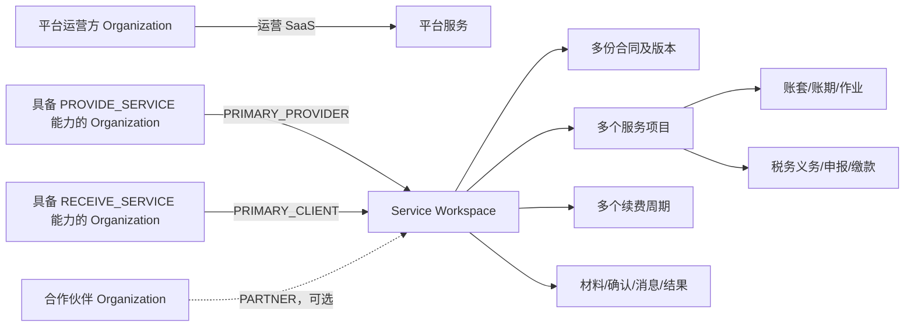

# 财税服务协作 SaaS 产品需求与页面 v3.0

---

## 产品愿景、范围与商业化

> 版本：v3.0 
> 适用范围：OWNER 与 AI 执行角色（治理模型）

### 1. 文档目的

本文冻结重构方向、产品边界、目标用户、商业模式和交付原则，作为以下文档的上位依据：

- 本卷《软件需求规格》

- 本卷《信息架构与页面清单》

本文不宣称任何外部供应商已经签约、任何 POC 已经通过、任何页面或接口已经完成。所有待决策和外部输入必须在正式冻结前取得证据。

### 2. 产品愿景

#### 2.1 一句话愿景

为财税、工商和代理记账服务机构提供一套公有云 SaaS，使服务机构与客户企业围绕长期服务关系，在统一数据、权限和审计边界内完成获客、签约、服务、代账、税务、收费、协作和续费。

#### 2.2 价值主张

| ID | 价值对象 | 价值主张 | 可验证结果 |
|---|---|---|---|
| BR-VIS-001 | 平台运营方 | 以标准化产品、订阅、计费、连接器和支持体系运营多组织 SaaS | 可开通组织、计费、监控用量并受控支持 |
| BR-VIS-002 | 服务机构 | 将客户经营、服务交付、代账、税务和内部管理放在统一系统 | 客户与服务事实只维护一份，跨域流程可追踪 |
| BR-VIS-003 | 客户企业 | 以长期账号进入客户企业门户，管理本组织参与的服务 Workspace | 可查看合同与服务、提交材料、确认、异议和下载结果 |
| BR-VIS-004 | 合作伙伴 | 在被授权的 Workspace 中承担明确服务职责 | 只访问被分配对象、动作和字段 |
| BR-VIS-005 | 管理与审计人员 | 以状态、版本、审批、事件和审计证明业务发生过程 | 关键操作可追责、可重放验证、不可静默覆盖 |

#### 2.3 产品原则

1. **Organization 是唯一组织主体模型。** 平台方、服务机构、客户企业和合作伙伴均使用 `organization` 表示，不再为不同业务身份复制公司主档。Organization 只声明 `PROVIDE_SERVICE`、`RECEIVE_SERVICE` 等能力，不固化为永久“服务方类型”或“客户方类型”。
2. **Workspace 表示稳定服务关系。** Workspace 连接一个或多个 Organization，通过 `workspace_participant` 表示 `PRIMARY_PROVIDER`、`PRIMARY_CLIENT`、`PARTNER`；同一 Organization 可在不同 Workspace 扮演不同角色。
3. **LegalEntity 承载具体法律主体。** 一个 Organization 可维护多个经核验 LegalEntity；合同、账套、税务登记、申报和法定开票必须引用具体 LegalEntity。连接器 authorization 的 owner 始终是 Organization，但 `authorized_subject_type/id` 按能力绑定 `LEGAL_ENTITY` 或受控 `CONTROLLED_ACCOUNT`；税局、银行等主体型授权强制绑定 LegalEntity，企微、外呼等组织账号不得伪造 LegalEntity。
4. **业务域不是 Workspace。** 服务机构内部的客户经营、财税作业、经营财务和内部管理是同一组织内的功能域，不创建“销售 Workspace”“会计 Workspace”。
5. **业务对象保持唯一。** 一个合同、服务项目、账套、申报或收费事实只有一个权威来源；三套入口只提供不同投影和动作。
6. **权限不由入口决定。** 页面可见性只改善体验，最终授权由受众、组织成员、Workspace 参与关系、角色动作、数据范围、字段权限、业务分配和对象状态共同计算。
7. **不可变事实优先。** 合同、资金、凭证、申报、缴款、确认、审批和审计使用版本、冲正、更正或替代，不以物理删除修复错误。
8. **客户长期账户与限时能力并存。** 客户企业门户使用长期身份；邮件、短信或企业微信中的限时 H5 capability 仍用于单事项低摩擦协作，且不得扩大长期账户权限。

### 3. 产品结构

#### 3.1 三套入口

| 入口代码 | 中文名称 | 使用者 | 主体上下文 | 核心用途 |
|---|---|---|---|---|
| `PLATFORM_CONSOLE` | 平台控制台 | 平台管理员、平台运营和受控支持人员 | `PLATFORM` audience | 组织、订阅、计费、供应商、连接器、运行与审计 |
| `PROVIDER_PORTAL` | 服务机构工作端 | 具备有效 Organization membership 的服务机构员工 | `PROVIDER` audience + 当前 Organization + 当前服务 Workspace/业务对象 | 客户经营、服务、代账、税务、经营财务和内部管理；PARTNER 是否使用本入口由 `DEC-WSP-003` 冻结，未决时不开放 |
| `ENTERPRISE_PORTAL` | 客户企业门户 | 客户企业管理员、业务联系人、财务/税务联系人和只读审阅人 | `ENTERPRISE` audience + 当前 Organization + 当前服务 Workspace | 合同服务、材料、确认、结果、账单、消息和授权管理 |

三入口的信息架构和页面 ID 见 本卷《信息架构与页面清单》。

#### 3.2 核心关系



### 4. 目标用户与角色边界

| 用户类型 | 典型角色 | 入口 | 允许范围 | 明确禁止 |
|---|---|---|---|---|
| 平台运营人员 | `platform_admin` | 平台控制台 | 平台组织、套餐、订阅、账单、供应商和运行元数据 | 默认读取服务机构或客户业务正文 |
| 服务机构管理员 | `provider_org_admin` | 服务机构工作端 | 本组织成员、组织结构、角色、规则、连接器和用量 | 因管理员身份自动取得工资、银行、凭证、申报明文 |
| 销售与客户经营人员 | 销售主管、销售专员、客户经理 | 服务机构工作端 | 被授权线索、客户、Workspace、报价、合同、回款和续费 | 激活正式账套、复核凭证或代客户确认 |
| 服务交付人员 | 客户服务主管、服务专员、外勤人员 | 服务机构工作端 | 被分配服务、工单、材料和外勤任务 | 查看无关系客户的完整账税数据 |
| 财税作业人员 | 会计主管、代账会计、复核会计、税务主管、税务专员 | 服务机构工作端 | 被分配账套、账期、凭证、税费、申报和档案 | 编制人与复核人绕过职责分离 |
| 经营财务人员 | 财务主管、财务人员 | 服务机构工作端 | 服务机构对客合同收款、销售开票、退款、成本和内部费用 | 把经营单据当作客户法定账套单据 |
| 内部管理人员 | 人事、分红、经纪业务、内容负责人 | 服务机构工作端 | 本组织内部员工与专项业务 | 通过岗位名称自动获得运行时业务权限 |
| 客户企业人员 | 企业管理员、业务联系人、财务/税务联系人、只读审阅人 | 客户企业门户 | 本组织参与 Workspace 的批准投影和动作 | 查看其他客户、服务机构内部审批意见或多客户作业队列 |
| 合作伙伴人员 | Partner 管理员、交付人员 | `DEC-WSP-003` 批准的受限入口；未决时无生产交互入口 | 被邀请 Workspace、服务项目和任务 | 继承 PRIMARY_PROVIDER 或 PRIMARY_CLIENT 的组织级权限 |

同一自然人可拥有一个统一登录身份，并通过不同 Organization membership 进入不同组织；同一服务机构员工可以拥有多个业务角色，但显式禁止和职责分离优先。

### 5. 范围

#### 5.1 本期范围

| 范围 ID | 业务域 | 本期能力 |
|---|---|---|
| BR-SCP-001 | 平台与商业化 | Organization 开通、套餐、订阅、平台账单、支付/退款申请与受控执行、平台开票申请与更正、用量、供应商、连接器、支持和审计 |
| BR-SCP-002 | Organization 与身份 | 统一账号、MFA、组织邀请、组织成员、员工档案、部门、岗位、角色、数据范围和会话 |
| BR-SCP-003 | Workspace | 创建、参与方、角色、生命周期、多个合同/服务项目/续费周期、关系时间线和退出交接 |
| BR-SCP-004 | 客户经营 | 线索、跟进、面访、商机、报价、Organization 客户视图、联系人、转移、续费和经营分析 |
| BR-SCP-005 | 合同与经营财务 | 合同、签署、收款计划、回款、服务机构销售开票、退款、合同成本和客户资金账户 |
| BR-SCP-006 | 客户服务 | 服务目录、服务项目、开通、流程、工单、材料、外勤、企业微信协同、异常和生命周期 |
| BR-SCP-007 | 代账作业 | 账套、账期、发票、银行流水、客户工资资料、科目、辅助核算、期初、凭证、账簿、报表、结账和档案 |
| BR-SCP-008 | 税务作业 | 税务登记、税种认定、税费测算、确认、申报、缴退税、个税、社保公积金、汇算清缴和企业年度报告 |
| BR-SCP-009 | 内部管理 | 组织人事、报销、内部员工工资、分红、经纪业务、知识库和通知公告 |
| BR-SCP-010 | 客户企业门户 | 长期账户、Workspace 列表、合同与服务、材料、确认/异议、结果、账单视图、消息、成员与安全 |
| BR-SCP-011 | 公共能力 | 工作台、待办、日历、搜索、审批、附件、消息、导入导出、任务、报表、审计和 Outbox |
| BR-SCP-012 | 外部连接器 | 电子签、企业微信、外呼、企业数据、发票、电子税务局、个税、社保公积金、银行和企业年度报告的适配框架 |
| BR-SCP-013 | 数据迁移 | 提供模板、校验、预览、批次、结果和对账框架；本项目切换清单内全部 Organization 必须在同一 Big-bang 窗口迁移并统一 Go/No-Go；上线后新订阅 Organization 的独立 onboarding migration 才可单独报价/验收，且不构成本项目生产分期 |

#### 5.2 非范围

| 范围 ID | 非范围 | 说明 |
|---|---|---|
| BR-OUT-001 | 客户私有化或离线部署 | 仅统一运营的公有云 SaaS |
| BR-OUT-002 | 白标、Organization 独立域名和独立品牌 | 平台统一品牌和域名；客户门户可显示业务主体名称但不构成白标 |
| BR-OUT-003 | 原生 iOS/Android 和微信小程序 | 本期为响应式 Web、客户门户和必要 H5 |
| BR-OUT-004 | 生成式 AI、录音转写和智能评分 | 不在本期承诺 |
| BR-OUT-005 | 未经合法授权的自动化 | 不绕过验证码、不共享外部账号、不调用非官方接口 |
| BR-OUT-006 | 客户自主修改法定账簿和申报事实 | 客户门户提供协作、确认和批准投影，不绕过服务机构的编制、复核和申报职责 |
| BR-OUT-007 | Organization 父子即自动权限继承 | 关联组织、集团关系或品牌关系不自动授予 Workspace 数据权限 |
| BR-OUT-008 | 把销售、会计或内部管理建成 Workspace | 它们是服务机构 Organization 内部业务域和导航视图 |
| BR-OUT-009 | 已签供应商或生产资质承诺 | 供应商、价格、SLA、资质和数据条款须经 POC 与 OWNER 冻结（外部合规意见按治理放行规则处置） |

### 6. 核心端到端流程

#### 6.1 服务关系建立

1. 平台管理员开通具备 `PROVIDE_SERVICE` 能力的 Organization 和有效订阅。
2. 服务机构管理员邀请员工、配置组织岗位、角色、服务目录和允许的连接器。
3. 线索和潜客始终保存在当前服务机构私有域。成交时，平台根据法定主体摘要受控解析或认领 Organization；响应不得泄露该主体是否正被其他服务机构服务。认领成功后把服务机构自有标签、来源、负责人和内部备注写入 provider-customer 私有关系，不写入 Organization 全局主档。
4. 报价/合同审批完成并满足签署、生效和收款策略。
5. 系统以幂等命令创建或复用 Service Workspace，写入 `PRIMARY_PROVIDER` 与 `PRIMARY_CLIENT` participant；二者状态按 `INVITED → ACTIVE` 推进。
6. 合同服务项生成服务项目；代账类服务项目创建或复用客户具体主体的账套。
7. 客户企业管理员接受邀请，建立长期门户 membership；未接受前可继续使用对象级 H5 capability。

验收引用：本卷《软件需求规格》 的 `FR-WSP-*`、`FR-CTR-*`、`FR-ENTP-*`。

#### 6.2 月度财税交付

1. 账套按服务周期生成账期、申报义务和任务。
2. 客户或服务人员提交发票、银行流水、工资及其他资料。
3. 会计编制、复核凭证并结账，系统生成账簿和报表版本。
4. 税务人员测算税费，向客户门户或 H5 发起确认。
5. 客户联系人确认、选择受控方案或提交异议；员工不得代为决定。
6. 满足审批、职责分离、授权和内容摘要后申报、缴退税并查单。
7. 回执、证明和档案发布到客户企业门户，结果版本不可覆盖。

#### 6.3 续费与退出

1. Workspace 在合同到期前生成续费周期和任务，不为每次续费新建 Workspace。
2. 新合同或续约作为同一 Workspace 下的新合同/版本和服务周期。
3. 暂停、恢复、终止或更换参与方前生成影响清单，分别处置未来任务、在途任务、法定义务、材料、连接器和数据交付。
4. Workspace 终止后保留历史，只禁止未经授权的新业务；重新合作可按规则恢复原 Workspace 或建立新 Workspace，最终规则列入待决策。

### 7. 商业化方案

#### 7.1 收费关系

必须维护两套商业结算事实与一套客户法定会计事实，共三类严格分离的资金/账务事实：

1. **平台向订阅 Organization 收费**：套餐、席位、Workspace、账套、存储、连接器调用、服务费或抽成等。
2. **服务机构向 PRIMARY_CLIENT Organization 收费**：合同价款、收款计划、回款、服务机构销售发票、退款和客户预存资金，属于经营财务域；合同和发票须进一步指向具体 LegalEntity。
3. **客户 LegalEntity 的法定会计**：客户费用、凭证、账簿、报表和税务来源属于具体 AccountingBook，不由前两套商业结算事实自动替代或过账。

三者只可通过不可变来源引用进行对账。平台账单不得直接写入客户法定账套；服务机构收到服务费也不等于客户企业取得会计收入。

#### 7.2 商业模式

| ID | 模式 | 规则 |
|---|---|---|
| BR-COM-001 | `SERVICE_FEE` | 固定订阅费与经合同冻结的按量收费项目 |
| BR-COM-002 | `REVENUE_SHARE` | 对已冻结、可审计的计费基数按规则版本计算抽成 |
| BR-COM-003 | `HYBRID` | 固定/按量费用与抽成并存，各行独立追溯 |
| BR-COM-004 | 迁移实施 | 产品含迁移工具；每个 Organization 的数据迁移、清洗和对账独立报价与验收 |
| BR-COM-005 | 外部服务成本 | 连接器成本按供应商、环境、能力、请求和 Workspace/业务对象追踪，不假设供应商已采购 |

#### 7.3 商业化约束

- 订阅主体是 Organization，不是单个 Workspace。
- Workspace、活跃席位、账套或连接器用量可作为计费维度，但定义和去重口径必须版本化。
- 欠费不得删除历史、隐藏法定义务或把未知外部状态当失败重试。
- 客户企业门户的基础协作权与增值功能边界须在正式定价前冻结。
- 任何抽成必须保存来源、基数快照、规则版本、确认状态、争议和调整记录。

### 8. 交付、部署与质量原则

| ID | 约束 | 基线 |
|---|---|---|
| NFR-DEL-001 | 交付模型 | 瀑布模型；合同全范围一次开发、一次产品生产上线，不以技术灰度替代未交付功能 |
| NFR-DEL-002 | 生产形态 | 中国大陆公有云 SaaS；不含客户私有化与离线部署 |
| NFR-DEL-004 | 架构 | 应用无状态扩容；初期共享服务与逻辑隔离，预留高负载 Organization/Workspace 分片路由 |
| NFR-DEL-005 | 环境 | 开发、测试、UAT、预生产和生产隔离；非生产使用合成或脱敏数据 |
| NFR-DEL-006 | 灾备目标 | 月可用性目标 99.9%，RPO 不超过 15 分钟，RTO 不超过 4 小时；待以真实云方案验证 |
| NFR-DEL-007 | 发布 | 自动化流水线、版本化迁移、滚动或蓝绿发布、备份和回滚演练 |
| NFR-DEL-008 | 质量门 | 页面、OpenAPI、事件 Schema、数据约束、权限种子、状态机、自动化测试和 UAT 可双向追踪 |

### 9. 成功指标与验收口径

| ID | 指标/门槛 | 验收方式 |
|---|---|---|
| BR-KPI-001 | Organization、Workspace、合同、服务项目和账套无重复事实源 | DDL/API/迁移与并发用例审查 |
| BR-KPI-002 | 同一组织可跨 Workspace 扮演不同 participant role | 至少覆盖 PRIMARY_PROVIDER、PRIMARY_CLIENT、PARTNER 组合用例 |
| BR-KPI-003 | 客户长期账户只看到本组织参与 Workspace 的批准数据 | 越权、对象键猜测、搜索、导出和文件测试 |
| BR-KPI-004 | 销售到服务、服务到账套、账套到税务、税务到客户结果链可追踪 | 全链路 UAT 和审计时间线 |
| BR-KPI-005 | 编制/复核、申请/审批、审批/执行职责分离有效 | 角色组合与状态自动化测试 |
| BR-KPI-006 | 平台账单与服务机构经营财务、客户法定账套严格分开 | 财务对账与数据库约束测试 |
| BR-KPI-007 | 重复命令、回调和网络重试不重复产生资金或外部动作 | 幂等、并发、UNKNOWN 查单测试 |
| BR-KPI-008 | 欠费、暂停和 Workspace 终止不破坏法定记录和历史证据 | 生命周期和数据保留 UAT |
| BR-KPI-009 | 客户门户与 H5 同一确认不可重复完成 | capability、会话、幂等和兄弟令牌撤销测试 |

### 10. 外部输入与质量关口

### 11. 待决策引用

本文范围与商业化口径依赖的待决策事项：`DEC-WSP-001`、`DEC-WSP-002`、`DEC-WSP-003`、`DEC-BILL-001`、`DEC-ORG-002`、`DEC-ENTP-001`、`DEC-BILL-002`、`DEC-CONN-001`、`DEC-CAP-001`。

正式冻结时，每个待决策必须记录结论、批准人、影响文档、迁移影响和生效日期；口头结论不得直接进入开发。

---

## 软件需求规格

> 版本：v3.0 
> 需求优先级：本文列出的功能需求均属于一次生产上线范围；外部输入未满足时按质量门阻断或使用已定义合法降级

### 1. 目的与依据

本文定义可实现、可测试的软件需求和验收口径。页面见 本卷《信息架构与页面清单》。

需求标识遵循 `<PREFIX>-<DOMAIN>-NNN`。同一 ID 在其他文档中出现表示引用，不得改变本文语义。

### 2. 系统范围与上下文

#### 2.1 三个安全受众与入口

| Audience | 入口代码 | 中文名称 | 会话上下文 |
|---|---|---|---|
| `PLATFORM` | `PLATFORM_CONSOLE` | 平台控制台 | `user_id + platform_role_assignment`；不得携带活动 Organization/Workspace |
| `PROVIDER` | `PROVIDER_PORTAL` | 服务机构工作端 | `user_id + organization_id + organization_member_id`；业务操作按需带活动 Workspace |
| `ENTERPRISE` | `ENTERPRISE_PORTAL` | 客户企业门户 | `user_id + organization_id + organization_member_id`；只访问本组织作为参与方的 Workspace |

同一会话只能有一个 Audience。一次性 H5 capability 不是第四种长期 Audience，仅授予一个对象、版本、动作和有效期内的能力。

#### 2.2 核心参与角色

`workspace_participant.participant_role` 只允许：

- `PRIMARY_PROVIDER`：主服务方，Organization 必须具备 `PROVIDE_SERVICE` 能力；
- `PRIMARY_CLIENT`：主客户方，Organization 必须具备 `RECEIVE_SERVICE` 能力；
- `PARTNER`：被授权合作方；生产启用范围仍为待决策，未冻结前默认不可创建 ACTIVE 业务授权。

参与状态只允许 `INVITED/ACTIVE/SUSPENDED/LEFT`。每个可开展正式业务的 Workspace 必须恰有一个 ACTIVE `PRIMARY_PROVIDER` 和一个 ACTIVE `PRIMARY_CLIENT`。

#### 2.3 数据主体层级

```text
UserAccount
 └─ OrganizationMember ── Organization(capabilities)
 ├─ LegalEntity ── AccountingBook ── Period/Tax
 └─ WorkspaceParticipant ── Workspace
 ├─ Contract / ServiceItem / RenewalCycle
 ├─ Collaboration / PublishedResult
 ├─ WorkspaceSubject ── LegalEntity
 └─ WorkspaceBookAssignment ── AccountingBook
```

Organization 不替代 LegalEntity；Workspace 不替代合同、客户主档、账套或税务主体；入口不替代权限。

### 3. 用户与角色

#### 3.1 PLATFORM 角色

| 角色代码 | 主要职责 | 默认限制 |
|---|---|---|
| `platform_admin` | 平台角色、Organization 开通、全局配置和紧急治理 | 默认不得查看 Organization 业务正文；高风险动作重新认证和审计 |
| `platform_billing_operator` | 按细粒度权限执行套餐、订阅、计量、账单、平台收退款、平台开票和争议运营 | 不得取得连接器密钥或 Organization 业务权限；高风险动作不得由同一人申请、批准并执行 |
| `platform_connector_operator` | 供应商、适配器、平台凭证版本、健康和对账 | 密钥不回显；不得借连接器读取业务正文 |
| `platform_support_agent` | 平台工单、诊断和获批支持会话 | 工单本身不授权；只按 support grant 的对象/字段/动作/期限访问 |
| `platform_security_auditor` | 平台安全和审计只读检查 | 不得修改业务、计费或连接器配置 |

#### 3.2 PROVIDER 角色

| 角色组 | 角色代码 | 主要职责 |
|---|---|---|
| 组织管理 | `provider_org_admin`、`provider_auditor` | 成员、组织、角色、设置、审计；管理员不自动取得高敏业务明文 |
| 客户经营 | `sales_manager`、`sales_specialist` | 线索、客户关系、商机、报价、合同和销售协作 |
| 客户服务 | `customer_service_manager`、`customer_manager`、`service_specialist` | 服务关系、工单、材料、确认、异常和续费 |
| 外勤（对象分派） | `customer_service_manager`、`service_specialist` | 按服务项目/任务分派管理或执行外勤、报告和异常；不另造未登记的全局外勤角色 |
| 会计 | `accounting_manager`、`bookkeeper`、`accounting_reviewer` | 账套、资料、凭证、账簿、结账、复核和档案 |
| 税务 | `tax_manager`、`tax_specialist` | 税务登记、测算、确认、申报、缴退税和年度事项 |
| 经营财务 | `finance_manager`、`finance_staff` | 服务机构合同收款、开票、退款、成本和内部资金 |
| 内部管理 | `hr_manager`、`hr_specialist`；分红/经纪使用既有角色的显式专项权限与对象分派 | 人事、工资、报销、分红和经纪业务；不得以岗位名自动生成未登记角色代码 |
| 任务派生 | 审批任务能力 | 只向当前实际分派人派生对象级最小权限；不创建可持久分配的全局审批人角色 |

#### 3.3 ENTERPRISE 候选标准角色

| 角色代码 | 主要职责 | 默认范围 |
|---|---|---|
| `enterprise_org_admin` | 本 Organization 企业门户成员、邀请和组织安全 | ORGANIZATION；不自动取得全部 Workspace 或敏感材料明文 |
| `enterprise_legal_representative` | LegalEntity 认领、主体资料和需法定代表的动作 | ORGANIZATION/LEGAL_ENTITY，需验证与重新认证 |
| `workspace_client_admin` | 当前 Workspace 企业侧成员和协作范围管理 | WORKSPACE；不得授予 PROVIDER 权限 |
| `enterprise_finance_contact` | 合同、账单、服务机构发票、财务材料和已发布财务结果 | WORKSPACE/LEGAL_ENTITY/BOOK |
| `enterprise_material_operator` | 材料上传、补传、服务协作、确认和异议 | WORKSPACE/OBJECT |
| `enterprise_viewer` | 只读查看明确发布结果 | WORKSPACE；无确认、上传或成员管理权 |

ENTERPRISE 角色是产品初始模板。

PROVIDER 平台计费自助不是经营财务角色的隐含权限。只有显式获得 `billing.subscription.view`、`billing.subscription.request`、`billing.profile.manage`、`billing.payment.request`、`billing.refund.request`、`billing.invoice.request`、`billing.dispute.submit` 或 `billing.document.download` 的成员，才能查询、维护本 Organization 资料或提交对应申请；退款执行、平台发票更正、争议关闭等平台动作只允许 PLATFORM 细粒度权限并受审批、重新认证和职责分离约束。

### 4. 功能需求

#### 4.1 身份、会话与邀请

| ID | 需求 | 验收条件 |
|---|---|---|
| FR-IAM-001 | 系统必须提供平台级统一登录身份，登录名、手机或邮箱按规范化摘要唯一，密码只保存强哈希。 | 重复标识被拒绝；日志、审计和响应不出现密码、验证码或完整令牌。 |
| FR-IAM-002 | 登录、MFA、密码重置和高风险重新认证必须使用限时、限次、一次性 challenge。 | 过期、已消费、锁定 challenge 重放失败且不泄露账号是否存在。 |
| FR-IAM-003 | `PLATFORM/PROVIDER/ENTERPRISE` 会话 Audience 必须互斥。 | 任意混合 Audience 令牌或跨入口调用返回稳定 401/403；不能通过前端切换绕过。 |
| FR-IAM-004 | 一个用户可加入多个 Organization，并在登录后只选择本人 ACTIVE membership。 | 不可提交任意 organization_id；选择结果创建固定 Organization 会话。 |
| FR-IAM-005 | 切换 Organization 或 Audience 必须创建新会话并撤销或隔离旧会话，不得原地改写安全上下文。 | 旧刷新令牌不可继续取得新上下文；前端组织级缓存和临时文件引用清除。 |
| FR-IAM-006 | 同一 Organization 会话切换 Workspace 时必须重新校验 participant、workspace_membership 和当前状态。 | 无成员、SUSPENDED/LEFT participant 或无对象权限的 Workspace 不可进入。 |
| FR-IAM-007 | Organization 邀请和 Workspace 邀请必须使用独立一次性令牌，接受前不得产生业务权限。 | 重发撤销旧令牌；重复接受幂等返回原关系，不重复建成员或授权。 |
| FR-IAM-008 | 账号停用、改密、成员离开或高风险处置必须支持单会话和全部会话撤销。 | 已撤销会话刷新和业务请求均失败；审计包含原因和操作者。 |
| FR-IAM-009 | 管理员和高风险角色必须支持强制 MFA，敏感导出、凭证轮换、缴款等动作支持重新认证。 | 缺少所需认证强度时只返回 challenge，不执行业务副作用。 |
| FR-IAM-010 | H5 capability 必须绑定对象、业务版本、允许动作、接收人摘要、有效期和使用次数。 | 员工 Bearer 或其他 Organization 会话不能扩大 capability；终态动作消费后兄弟令牌撤销。 |

#### 4.2 Organization、LegalEntity 与企业认领

| ID | 需求 | 验收条件 |
|---|---|---|
| FR-ORG-001 | Organization 必须是平台中唯一组织主体模型，不保存永久 PROVIDER/CLIENT 类型。 | 同一 Organization 可同时启用 `PROVIDE_SERVICE`、`RECEIVE_SERVICE` 能力并在不同 Workspace 扮演不同角色。 |
| FR-ORG-002 | Organization 能力的启用、暂停和撤销必须版本化并记录理由、审批和影响。 | 能力变化不改写历史 participant；不满足能力的新参与关系被拒绝。 |
| FR-ORG-003 | 一个 Organization 可管理多个 LegalEntity；LegalEntity 保存具体主体类型、法定名称、证照摘要、有效期和核验状态。 | LegalEntity 只能归属一个 Organization；法定标识摘要唯一策略由受控解析服务执行。 |
| FR-ORG-004 | 合同、账套、税务登记、申报和法定开票必须引用具体 LegalEntity；连接器 authorization 由 Organization 拥有，并按能力绑定 LegalEntity 或受控 Account。 | 税局、银行等主体型授权缺少/越权 `legal_entity_id` 返回 422；企微、外呼等组织账号使用已核验 `CONTROLLED_ACCOUNT`，不得伪造 LegalEntity；任一 subject 跨 owner Organization 引用均失败。 |
| FR-ORG-005 | 线索和潜客必须是当前 PROVIDER Organization 私有数据。 | 其他 PROVIDER、ENTERPRISE 或平台普通查询均无法推断线索存在。 |
| FR-ORG-006 | 成交建 Workspace 时，平台只可用法定主体摘要受控解析或认领 Organization。 | 调用方仅得到“可继续认领/需验证/已关联当前关系”等安全结果，不得得知该企业是否被其他服务机构服务。 |
| FR-ORG-007 | Organization claim 必须验证申请人与目标 LegalEntity/Organization 的控制关系。 | 未验证 claim 不得启用 ENTERPRISE membership 或读取现有 Workspace；证据、审核和终态留痕。 |
| FR-ORG-008 | PROVIDER 自有客户标签、来源、负责人、等级、风险备注和内部画像必须保存为 provider-customer 私有关系或 Workspace 私有档案。 | 这些字段不出现在 Organization 全局主档，也不向其他 PROVIDER/ENTERPRISE 返回。 |
| FR-ORG-009 | Organization 成员、员工档案、部门、岗位和角色授权必须分离。 | 岗位只产生授权建议；运行时必须有有效 role assignment/policy。 |
| FR-ORG-010 | Organization 和 LegalEntity 关键字段变更必须使用版本、核验和影响评估。 | 历史合同、发票、账务和申报快照不被追溯覆盖。 |
| FR-ORG-011 | 系统必须支持成员离职、停用、调岗和交接。 | 会话及时失效；未完成 Workspace、客户、账套、任务和审批进入交接清单，历史责任不变。 |
| FR-ORG-012 | Organization 关联、集团或品牌关系不得自动授予数据权限。 | 聚合查询逐 Organization/Workspace/对象鉴权，无权关系不泄露数量和名称。 |

#### 4.3 Workspace 与参与关系

| ID | 需求 | 验收条件 |
|---|---|---|
| FR-WSP-001 | Workspace 必须表示稳定服务关系，而非销售、会计或内部管理功能区。 | 功能导航变化不创建 Workspace；合同续约默认复用原 Workspace。 |
| FR-WSP-002 | 正式 Workspace 必须恰有一个 PRIMARY_PROVIDER 和一个 PRIMARY_CLIENT。 | 数据库/服务层阻止缺失、重复或同一 participant 同时占两个主角色。 |
| FR-WSP-003 | participant role 只允许 `PRIMARY_PROVIDER/PRIMARY_CLIENT/PARTNER`，状态只允许 `INVITED/ACTIVE/SUSPENDED/LEFT`。 | 非法枚举不能落库；状态迁移由受控命令执行。 |
| FR-WSP-004 | PRIMARY_PROVIDER/PRIMARY_CLIENT 的 Organization 能力必须分别匹配 PROVIDE_SERVICE/RECEIVE_SERVICE；每个 workspace_subject 同时需要 PRIMARY_CLIENT 的 CONTROL 或获批 REPRESENTATION owner mapping，以及 PRIMARY_PROVIDER 覆盖 Workspace、主体、范围和有效期的有效合同或 ACTIVE SERVICE_AUTHORIZATION 服务权证据。 | 创建、邀请、激活和每次高风险动作均重校验；provider 合同/服务授权不得写入或替代 `client_claim_id`，受监管具体动作仍须满足该动作所需 authorization。 |
| FR-WSP-005 | Workspace 可包含多份合同、合同版本、服务项目和续费周期。 | 新合同/续费不会复制客户、账套或 Workspace；对象均可追溯 Workspace。 |
| FR-WSP-006 | Workspace 必须保存编号、显示名、主参与方、状态、关系起止、创建来源和版本。 | 编号稳定且不回收；显示名变更不改变主键或历史。 |
| FR-WSP-007 | workspace_membership 必须从 ACTIVE organization_member 与 ACTIVE participant 派生，且不自动授业务角色。 | 仅 membership 无权限策略时只能进入空/无权状态，不能读取业务正文。 |
| FR-WSP-008 | PARTNER 必须按服务项目、任务、对象、动作、字段和期限显式授权。 | 未正式冻结 PARTNER 范围前系统默认拒绝激活；不得继承主参与方权限。 |
| FR-WSP-009 | Workspace 的暂停、恢复、退出和关闭必须先生成影响清单。 | 影响覆盖合同、服务、在途任务、法定义务、账套、连接器、材料、确认和数据交付。 |
| FR-WSP-010 | 暂停或欠费不得自动取消法定义务、申报或历史访问证据。 | 法定义务仍可见并按政策处理；禁止以 Workspace 状态物理删除事实。 |
| FR-WSP-011 | Workspace 关闭必须保留全部历史，停止未经授权的新业务。 | 历史合同、凭证、申报、文件、确认和审计仍按保留策略可查。 |
| FR-WSP-012 | 系统必须提供跨参与方关系时间线。 | 时间线只聚合可共享事件；服务机构私有审批意见、成本、绩效和备注不泄露。 |
| FR-WSP-013 | Workspace 创建、主参与方变化和恢复必须幂等并采用乐观锁。 | 同幂等键同摘要返回原结果；异摘要冲突；并发不产生双主参与方。 |
| FR-WSP-014 | 所有 Workspace 业务引用必须校验 participant、LegalEntity 所有权和对象关系。 | 只猜测 workspace_id/legal_entity_id/业务 ID 的跨组织请求失败且不泄露对象存在。 |
| FR-WSP-015 | Workspace 的可共享投影必须与领域源对象版本绑定。 | 源版本变化使旧投影标记过期或建立后继，不静默覆盖客户已确认内容。 |

#### 4.4 客户经营与销售

| ID | 需求 | 验收条件 |
|---|---|---|
| FR-CRM-001 | 系统必须支持待分配线索、已分配线索、重点线索、跟进、面访、来源和保护规则。 | 本人/部门/部门树/指定范围有效；分配和释放历史只追加。 |
| FR-CRM-002 | 线索去重只在当前 PROVIDER 私有域完成；平台 Organization 解析另走 FR-ORG-006。 | 不因全平台命中返回其他服务关系、负责人或 Organization 信息。 |
| FR-CRM-003 | 系统必须支持商机阶段、概率、商品项、协作人、停留规则和终态。 | 阶段迁移按发布规则；并发和越级迁移被拒绝。 |
| FR-CRM-004 | 系统必须支持报价版本、有效期、明细、金额重算、审批和转合同。 | 已发送/接受报价不可覆盖；转合同幂等并保留来源。 |
| FR-CRM-005 | 成交时必须关联经核验 Organization 与具体 LegalEntity，再创建或复用 Workspace。 | 未核验主体不得建立正式合同、账套或税务义务。 |
| FR-CRM-006 | PROVIDER 客户视图必须把全局 Organization/LegalEntity 与私有客户关系字段分开。 | ENTERPRISE 和其他 PROVIDER 只能看到各自有权字段。 |
| FR-CRM-007 | 客户负责人、部门、协作人和 Workspace 服务人员必须是不同关系事实。 | 转移客户负责人不静默改变账套会计、税务人员或工单负责人。 |
| FR-CRM-008 | 客户转移、合并和批量操作必须预览影响、逐项鉴权并返回部分结果。 | 成功项不因失败项回滚；合并保留来源映射和不可变历史。 |
| FR-CRM-009 | 系统必须支持联系人及其与 LegalEntity/Workspace 的关系版本。 | 一个自然人可服务多个主体；主要联系人唯一规则按对象执行。 |
| FR-CRM-010 | 企业数据查询必须经过合法供应商、额度、用途和授权控制。 | 无书面 SaaS 再授权时使用人工录入，不伪造自动查询。 |
| FR-CRM-011 | 客户经营分析必须按有权对象聚合。 | 无权对象不进入计数、搜索建议、分组或导出。 |
| FR-CRM-012 | 续费任务必须关联原 Workspace、服务项目和到期周期。 | 续费成功建立新合同/服务周期，不复制 Workspace 或账套。 |

#### 4.5 合同与服务机构经营财务

| ID | 需求 | 验收条件 |
|---|---|---|
| FR-CTR-001 | 合同必须关联 Workspace、PRIMARY_PROVIDER/PRIMARY_CLIENT 的具体 LegalEntity 和合同版本。 | 参与方、主体或 Workspace 不一致时拒绝；编号在 PROVIDER 范围唯一。 |
| FR-CTR-002 | 合同必须支持草稿、审批、签署、生效、变更、终止和版本化附件。 | 生效后正文不可覆盖；变更/终止保留审批、签署和影响快照。 |
| FR-CTR-003 | 合同服务项必须引用服务目录/价格版本并冻结数量、价格、税和履约配置。 | 后续目录改价不追溯已生效合同。 |
| FR-CTR-004 | 电子签必须使用合法供应商或纸质结果登记降级。 | 外部 UNKNOWN 只查单；证据链、签署主体和文件摘要可追溯。 |
| FR-FIN-001 | 系统必须支持收款计划、回款登记、认领、财务确认和核销。 | 未经财务确认不计实收；金额与可核销余额可重算。 |
| FR-FIN-002 | 系统必须支持服务机构向 PRIMARY_CLIENT 开具销售发票。 | 发票引用合同、付款和双方 LegalEntity；不得写入客户法定账套。 |
| FR-FIN-003 | 系统必须支持退款、合同成本、客户预存资金和资金流水。 | 退款/冲正不覆盖原交易；账户余额串行且不得无授权为负。 |
| FR-FIN-004 | 经营财务与客户法定会计账套必须物理或逻辑隔离。 | 服务机构收款不会自动生成客户收入凭证；经营报表不冒充会计报表。 |
| FR-FIN-005 | 客户企业门户只能查看与自身 LegalEntity/Workspace 相关的合同、应付、回款确认和服务机构发票投影。 | 不显示 PROVIDER 成本、利润、内部核销备注、其他客户或银行账户明文。 |
| FR-FIN-006 | 所有金额必须由服务端按明细、币种、税率和舍入规则重算。 | 客户端总额不作为事实；差异返回稳定错误。 |

#### 4.6 客户服务与协作

| ID | 需求 | 验收条件 |
|---|---|---|
| FR-SVC-001 | 系统必须支持服务目录、价格版本、流程模板、材料要求和 SLA。 | 已发布版本不可覆盖；现有服务项目继续引用原版本。 |
| FR-SVC-002 | 合同服务项必须幂等生成客户服务项目并关联 Workspace/LegalEntity。 | 重试不重复创建；非代账项目不伪造账套。 |
| FR-SVC-003 | 代账类服务项目开通必须创建或复用具体 LegalEntity 的 AccountingBook。 | 合同、主体、收款策略、会计制度、启用期和人员检查通过后才能激活。 |
| FR-SVC-004 | 系统必须支持服务工单、节点、分派、转派、SLA、返工和完成条件。 | 岗位只筛选候选；实际执行人仍需对象权限。 |
| FR-SVC-005 | 客户材料必须按逻辑文档和版本管理，提交、退回、复用和替换保留使用历史。 | 已提交/生效版本不可覆盖；附件扫描通过后才可用。 |
| FR-SVC-006 | 系统必须支持外勤任务、单次签到、弱网草稿、报告、客户签认和纠错链。 | 不后台持续定位；已提交报告不可覆盖。 |
| FR-SVC-007 | 系统必须支持服务异常、责任人、升级、豁免、解决、关闭和重开。 | 事件只追加；高危异常需要证据和主管确认。 |
| FR-SVC-008 | 服务暂停、恢复和终止必须复用 Workspace 影响评估并逐项执行。 | 法定义务和历史不被静默取消；失败项可恢复。 |
| FR-COL-001 | 系统必须提供跨组织材料、消息、确认、异议、结果发布和已阅协作。 | 共享内容必须绑定 Workspace、对象、版本、受众和字段白名单。 |
| FR-COL-002 | PROVIDER 私有备注、内部审批、成本、绩效和多客户队列不得发布到 Workspace。 | ENTERPRISE API、搜索、通知、文件和导出均无法推断。 |
| FR-COL-003 | 企业微信、邮件和短信消息必须按模板版本、接收人、用途、发送结果和退订规则留痕。 | 不发送超出授权的敏感明文；失败可查且不重复发送成功项。 |

#### 4.7 代账作业

| ID | 需求 | 验收条件 |
|---|---|---|
| FR-ACC-001 | AccountingBook 必须以 `owner_legal_entity_id` 永久归属一个具体 LegalEntity，并记录制度、币种和启用期；Organization 由 LegalEntity 的 owner 派生，Workspace、服务项目和服务有效期通过 `workspace_book_assignment` 关联。 | Organization 可作冗余一致性校验但不得成为可独立变更的第二 owner；客户组、Organization 或 Workspace 不能替代 LegalEntity；结束 assignment 或更换服务方不复制、转移或改写账套。 |
| FR-ACC-002 | 系统必须支持账套初始化、期初导入、试算、复核、锁定和更正版本。 | 锁定前借贷平衡且职责分离；锁定后只建后继。 |
| FR-ACC-003 | 系统必须按账套和账期分配代账会计、复核会计、税务及专项人员。 | 同期记账人与复核人不得为同一成员；无分工不能读取其他账套。 |
| FR-ACC-004 | 系统必须按服务周期生成账期、任务和依赖。 | 同账套期间当前版本唯一；反结账建立连续后继。 |
| FR-ACC-005 | 系统必须支持发票、银行流水和客户工资资料的 API/上传/人工采集。 | 来源、防重、授权、逐项结果和原始版本可追溯。 |
| FR-ACC-006 | 客户内部员工工资资料必须与 PROVIDER 自身员工工资隔离。 | 表、权限、导出和搜索均不得混合。 |
| FR-ACC-007 | 系统必须支持科目版本、辅助核算、映射和会计政策版本。 | 已使用科目/辅助项不可改码或删除；历史凭证引用原版本。 |
| FR-ACC-008 | 系统必须支持凭证草稿、导入、附件、提交、复核、过账、冲销和更正。 | 借贷平衡；本人不得复核本人编制或最后修改内容。 |
| FR-ACC-009 | 系统必须生成账簿、会计报表和快照，支持按权限穿透来源。 | 报表可由凭证重算；穿透再次校验对象和字段权限。 |
| FR-ACC-010 | 结账必须执行完整检查、WARNING 处置、职责分离和瞬时重检。 | ERROR 未清零不得关闭；已关闭期间普通写入失败。 |
| FR-ACC-011 | 反结账必须审批、评估对后续账期、报表、申报、缴款和档案的影响。 | 执行人与申请/最终审批按规则分离；不覆盖原期间。 |
| FR-ACC-012 | 电子会计档案必须包含 manifest、对象版本和摘要，封存后不可覆盖。 | 下载按原对象权限；篡改摘要检测失败。 |
| FR-ACC-013 | 企业门户只读取明确发布的财务报表、证明和材料，不进入内部编制队列。 | 无内部凭证编辑、复核意见、其他客户批量页或未发布草稿。 |

#### 4.8 税务作业

| ID | 需求 | 验收条件 |
|---|---|---|
| FR-TAX-001 | 税务登记和税种认定必须关联具体 LegalEntity、AccountingBook 和规则版本。 | 有效期不重叠；来源和人工确认可追溯。 |
| FR-TAX-002 | 税费测算必须保存来源版本、规则版本、法规依据、明细和内容摘要。 | 相同输入可重算；规则变更不改写历史。 |
| FR-TAX-003 | 税费调整必须区分普通与高风险并执行复核/审批和职责分离。 | 申请人、编制人和最后修改人不能成为被禁止的审批人。 |
| FR-TAX-004 | 客户确认必须绑定 Workspace、LegalEntity、业务对象、版本、摘要、联系人和 required_action。 | 内容变化使旧请求失效；员工不能代客户提交。 |
| FR-TAX-005 | ENTERPRISE 成员和 H5 capability 对同一确认使用统一命令幂等账本。 | 任一路径首次成功后其他路径不能重复确认；同键同摘要返回原结果。 |
| FR-TAX-006 | 系统必须生成并维护申报义务、截止期、负责人和状态。 | 欠费、暂停或 Workspace 状态不会隐藏义务；负责人失效进入待分配。 |
| FR-TAX-007 | 税务申报必须完成来源冻结、勾稽检查、复核/审批、客户确认或批准豁免和外部授权双检。 | 缺任一条件不得外发；提交人不同于最终有效审批人。 |
| FR-TAX-008 | 外部申报和缴退税 UNKNOWN 状态只能查单，不得盲目重提或重扣。 | 重复回调不回退终态；查单结果按状态优先级投影。 |
| FR-TAX-009 | 税款缴纳和退税必须分别幂等、二次确认并保存账户、授权、请求和回执。 | 审批、执行、查单权限独立；金额可追溯原申报。 |
| FR-TAX-010 | 系统必须支持个税、社保公积金、企业所得税汇算和企业年度报告。 | 各业务使用自己的规则、来源、确认、提交、回执和更正链；年度报告不称为纳税申报。 |
| FR-TAX-011 | 完税、申报和退税证明必须版本化并可发布到客户企业门户。 | 撤销/替代保留历史；文件下载即时鉴权并审计。 |
| FR-TAX-012 | 人工办理路径必须保存实际办理人、服务端时间、扫描通过回执和脱敏结果。 | 不产生虚假外部编号或 UNKNOWN，不绕过相同审批和职责守卫。 |

#### 4.9 内部管理

| ID | 需求 | 验收条件 |
|---|---|---|
| FR-INT-001 | 系统必须支持 PROVIDER Organization 的部门树、岗位版本、员工档案和入转调离事件。 | 组织变更保留历史任职；不形成 Organization 父子权限。 |
| FR-INT-002 | 系统必须支持员工报销申请、审批、财务核对、付款和冲正。 | 申请、审批、核对和付款按规则分离；金额由明细重算。 |
| FR-INT-003 | 系统必须支持 PROVIDER 内部员工工资导入、复核、发布、本人确认和异议。 | 与客户工资资料隔离；仅本人可见完整明细。 |
| FR-INT-004 | 系统必须支持分红权版本、分红结算、确认、付款和冲正。 | 比例和总额可重算；发布后更正使用后继或反向记录。 |
| FR-INT-005 | 系统必须保留经纪人、门店、订单和佣金业务。 | 身份/账户字段受控；订单、佣金和支付可追溯。 |
| FR-INT-006 | 系统必须支持知识库和通知公告的受众、版本、附件、发布和撤回。 | 无权标题、正文、附件和搜索建议均不可推断。 |
| FR-INT-007 | 内部管理对象不得自动发布到 Workspace 或企业门户。 | 只有显式定义的共享结果可跨 Organization。 |

#### 4.10 客户企业门户

| ID | 需求 | 验收条件 |
|---|---|---|
| FR-ENTP-001 | 客户企业人员必须使用长期统一账号和 ENTERPRISE membership 登录企业门户。 | 登录后只列本人 ACTIVE Organization membership；不进入 PROVIDER 工作端。 |
| FR-ENTP-002 | 企业门户必须列出当前 Organization 作为 PRIMARY_CLIENT 或获准 PARTNER 的 Workspace。 | 无 participant/membership 的 Workspace 不出现在列表、搜索、计数或直链。 |
| FR-ENTP-003 | 企业管理员必须可邀请、停用成员并分配企业门户角色和 LegalEntity/Workspace 范围。 | 邀请前无权；停用即时撤销会话；管理员不能授予 PROVIDER 角色。 |
| FR-ENTP-004 | 企业门户必须提供 Workspace 总览、参与方、合同、服务项目、周期、联系人和里程碑。 | 只展示允许共享的投影及来源版本，不展示 PROVIDER 私有字段。 |
| FR-ENTP-005 | 企业门户必须提供材料需求、上传、补传、历史版本和使用状态。 | 文件扫描通过后提交；已提交/生效版本不可覆盖。 |
| FR-ENTP-006 | 企业门户必须支持确认、受控选择、异议草稿和最终提交。 | 按 FR-TAX-005/FR-COL-* 鉴权和幂等；无自动默认同意。 |
| FR-ENTP-007 | 企业门户必须提供服务进度、异常、结果和已阅回执。 | 只能看明确发布信息；已阅不替代确认或签署。 |
| FR-ENTP-008 | 企业门户必须提供合同应付、服务机构收款确认、发票和退款投影。 | 不显示 PROVIDER 成本、内部账户、利润或其他客户。 |
| FR-ENTP-009 | 企业门户必须提供已发布会计报表、申报/缴退税结果、证明和档案下载。 | 不开放内部凭证、复核工作台、授权密钥或未发布草稿。 |
| FR-ENTP-010 | 企业门户必须提供消息、待办、日历、下载和通知偏好。 | 待办来源可追溯且对象权限在点击和下载时重校验。 |
| FR-ENTP-011 | 企业成员必须能查看自己的登录会话、MFA、活动 Organization/Workspace 和访问审计。 | 不暴露其他成员敏感终端信息；会话可撤销。 |
| FR-ENTP-012 | 企业门户和 H5 必须共享对象版本、确认事件和文件事实，不复制第二套状态。 | 同一事项两端显示一致状态；重复命令返回原结果。 |
| FR-ENTP-013 | 企业门户不得允许客户直接修改已形成的法定账簿、申报或服务机构内部记录。 | 所有客户变更以材料、确认、异议或受控申请进入后续流程。 |

#### 4.11 连接器、公共能力与平台运营

| ID | 需求 | 验收条件 |
|---|---|---|
| FR-CONN-001 | 连接器必须采用“供应商/适配器与平台凭证版本 → `organization_connector_authorization` → `workspace_connector_grant` → 请求/尝试/事件”四层授权与使用模型。 | 外部账号授权归 Organization 所有；Workspace 只使用 scope 不超过 authorization 的 grant；业务会话不得读取或指定平台密钥；请求冻结适配器、凭证、authorization 和 grant 实际版本。 |
| FR-CONN-002 | 系统必须支持 10 类能力代码：电子签、企业微信、外呼、企业数据、发票、电子税务局、个税、社保公积金、银行、企业年度报告。 | 未采购能力仍可登记模拟/人工降级，不能显示生产成功。 |
| FR-CONN-003 | 创建请求和实际外发前必须双检环境、能力、授权主体、LegalEntity/账户和有效期。 | 任一不匹配返回稳定错误且不产生外部调用。 |
| FR-CONN-004 | 回调必须先验签、防重、隔离，再受控路由到 Organization/Workspace/业务对象。 | 未路由事件不伪造 Organization；任何 Organization/Workspace 参与方均看不到隔离载荷。 |
| FR-CONN-005 | 每个请求、事件、费用和对账行必须可追溯供应商、环境、配置和业务对象。 | 供应商账单与内部请求逐项匹配；未知差异不得自动核销。 |
| FR-COL-004 | 系统必须提供统一待办、日历、消息、附件、导入导出和后台任务。 | 这些是投影/公共服务，不复制领域状态；下载即时鉴权。 |
| FR-COL-005 | 批量命令必须逐项鉴权、幂等并返回成功、失败和跳过结果。 | 部分成功不回滚成功项；重试只处理允许项目。 |
| FR-COL-006 | 审批必须解析实际人员、冻结对象版本和内容摘要，按 SINGLE/ANY/ALL/POLICY 执行。 | 无人、歧义、跨组织、失效或职责冲突进入 BLOCKED，不自动通过。 |
| FR-COL-007 | 审计必须覆盖 Audience、Organization、Workspace、用户、角色、对象、动作、前后摘要、结果、IP、请求号和时间。 | 审计只追加；敏感值仅保存脱敏摘要。 |
| FR-RPT-001 | 经营、服务、会计、税务、Workspace 和平台报表必须显示口径、版本、范围和更新时间。 | 聚合不扩大来源对象权限；UNKNOWN 单列。 |
| FR-PLT-001 | 平台必须支持 Organization 开通、能力、首位管理员、状态和受控关闭。 | 开通跨表幂等；关闭不删除业务数据。 |
| FR-PLT-002 | 平台必须支持套餐、订阅、计量、账单、支付/退款、平台开票和争议，并按逐操作权限区分 PROVIDER 申请/查询与 PLATFORM 执行/关闭。 | PROVIDER 只能处理本 Organization 的查询、资料维护和申请；退款执行、平台发票更正、争议关闭及其他高风险状态迁移由 PLATFORM 受控执行。 |
| FR-PLT-003 | 平台必须支持供应商、适配器、凭证版本、POC 证据、健康和用量对账。 | 密钥不回显；未完成 POC/采购不得标记生产可用。 |
| FR-PLT-004 | 平台必须支持工单和独立 support_access_grant。 | 工单本身不授权；访问限对象/字段/动作/期限并全程审计。 |
| FR-PLT-005 | 平台必须提供系统健康、任务、隔离事件、指标、日志和追踪。 | 平台元数据不聚合业务正文；受控重试不绕过验签与幂等。 |

### 5. 关键业务规则

| ID | 规则 |
|---|---|
| BR-ORG-001 | Organization 只表达统一组织和能力；服务方、客户方、合作方身份只能由当前 Workspace participant role 得出。 |
| BR-ORG-002 | 具体签约、核算、纳税和法定开票主体始终是 LegalEntity；authorization owner 始终是 Organization，授权 subject 按 capability 为 `LEGAL_ENTITY` 或 `CONTROLLED_ACCOUNT`，Workspace 只通过受控 grant 使用且不取得所有权。 |
| BR-ORG-003 | PROVIDER 私有线索和客户画像不得因 Organization 全局去重而泄露；平台解析结果必须防枚举。 |
| BR-WSP-001 | 一个正式 Workspace 恰有一个 ACTIVE PRIMARY_PROVIDER 和一个 ACTIVE PRIMARY_CLIENT。 |
| BR-WSP-002 | participant 状态迁移为 `INVITED → ACTIVE ↔ SUSPENDED → LEFT`；LEFT 不可原行恢复，重新参与建立新记录并关联前序。 |
| BR-WSP-003 | 合同续约、服务扩展和周期更新默认复用 Workspace；是否允许同一主参与方组合多个活动 Workspace 由 `DEC-WSP-001` 冻结。 |
| BR-WSP-004 | Workspace 共享区只包含明确发布或需要协作的事实；PROVIDER 内部备注、成本、绩效、人员工资和审批意见保持私有。 |
| BR-AUTH-001 | 最终权限 = Audience ∩ Organization membership ∩ Workspace membership/participant ∩ role policy ∩ data/field scope ∩ assignment ∩ object state ∩ SOD ∩ approval/reauth。 |
| BR-AUTH-002 | DENY、受众不匹配、职责冲突和对象状态禁止优先于 ALLOW；前端隐藏不能替代服务端授权。 |
| BR-DATA-001 | 合同、收款、退款、发票、凭证、账簿、申报、缴退税、确认、审批、档案和审计不得物理删除。 |
| BR-DATA-002 | 跨域引用同时校验 Organization、Workspace participant、LegalEntity 所有权、AccountingBook 和有效期。 |
| BR-COL-001 | ENTERPRISE 长期账户与 H5 capability 对同一业务对象共用版本、命令幂等和终态事件。 |
| BR-FIN-001 | 平台向 Organization 收费、PROVIDER 向客户收费、客户 LegalEntity 法定会计是三套不同事实和权限域。 |
| BR-EXT-001 | 外部超时进入 UNKNOWN 并查单；只有确认未成功且满足重试条件时才能建立后继请求。 |
| BR-DEP-001 | 项目采用瀑布质量门和合同全范围一次生产上线；非生产迭代、演练和缺陷修复不构成生产分期。 |

### 6. 状态与生命周期要求

本文要求至少具备以下状态机：

| 状态 ID | 对象 | 最低状态集合 | 关键要求 |
|---|---|---|---|
| STATE-ORG-001 | Organization | DRAFT/VERIFYING/ACTIVE/SUSPENDED/CLOSED | CLOSED 前受控终止活动订阅、撤销 capability 与 owner connector authorization；其作为 ACTIVE PRIMARY_PROVIDER/PRIMARY_CLIENT 的 Workspace 必须先关闭，或完成获批 successor/handover 且旧 Workspace 收口，主 participant 不得直接 LEFT，PARTNER 才可按影响评估单独 LEFT；再结束未来 membership/grant/book assignment并处置资金/争议/外部 UNKNOWN；任何无法处置项阻断关闭；LegalEntity、授权版本与历史只读保留 |
| STATE-ORG-002 | Organization claim | DRAFT/REVIEWING/ACTIVE/SUSPENDED/REJECTED/REVOKED | ACTIVE 前不得建立企业管理权 |
| STATE-WSP-001 | Workspace | DRAFT/ACTIVE/SUSPENDED/CLOSING/CLOSED | ACTIVE 需要双主 participant；关闭前先评估 |
| STATE-WSP-002 | workspace_participant | INVITED/ACTIVE/SUSPENDED/LEFT | 角色与能力匹配；LEFT 保留历史 |
| STATE-CTR-001 | 合同 | DRAFT/PENDING_APPROVAL/APPROVED/REJECTED/SIGNING/SIGNED/SIGN_FAILED/EFFECTIVE/FULFILLED/TERMINATED/EXPIRED | 审批/签署后正文冻结；变更建立版本/补充协议 |
| STATE-SVC-001 | 服务项目 | PENDING/CONFIGURING/PENDING_ACTIVATION/ACTIVE/PAUSED/COMPLETED/EXPIRED/TERMINATED | 法定义务不随普通暂停自动取消 |
| STATE-ACC-001 | AccountingBook | DRAFT/INITIALIZING/INITIALIZATION_FAILED/ACTIVE/SUSPENDED/TERMINATED/ARCHIVED | 唯一 owner 为 `owner_legal_entity_id`，Organization 从 LegalEntity 派生；受托作业另校验有效 `workspace_book_assignment`；归档不删历史 |
| STATE-ACC-002 | 会计期间与任务 | UNOPENED/COLLECTING/BOOKKEEPING/REVIEWING/READY_TO_CLOSE/CLOSED | 关闭版本不可普通写；反结账生成后继期间版本 |
| STATE-TAX-001 | 税费测算 | DRAFT/CALCULATED/REVIEWING/CONFIRMING/CONFIRMED/SUPERSEDED | 内容变化建立后继测算，不覆盖已确认版本 |
| STATE-TAX-002 | 申报 | DRAFT/REVIEWING/READY_TO_SUBMIT/SUBMITTING/UNKNOWN/ACCEPTED/REJECTED/CORRECTED/VOIDED | UNKNOWN 只查单；更正/作废保留原链 |
| STATE-COL-001 | 材料与外勤 | 材料需求 WAITING/SUBMITTED/UNDER_REVIEW/ACCEPTED/REJECTED/WAIVED/EXPIRED；材料版本 DRAFT/SUBMITTED/ACTIVE/REJECTED/SUPERSEDED/REVOKED/EXPIRED；外勤报告 DRAFT/SUBMITTED/ACCEPTED/REJECTED/CORRECTED |已提交/生效版本不可覆盖，纠错建立后继 |
| STATE-COL-002 | 确认请求 | DRAFT/SENT/OPENED/ACKNOWLEDGED/CONFIRMED/DISPUTED/EXPIRED/CANCELLED/SUPERSEDED | 内容变化使旧请求 SUPERSEDED；终态幂等 |
| STATE-BILL-001 | 订阅 | DRAFT/TRIAL/ACTIVE/GRACE/READ_ONLY/SUSPENDED/EXPIRED/TERMINATED | 欠费传播不得删除历史或隐藏法定义务；终止不删除历史 |

### 7. 非功能需求

#### 7.1 安全与隐私

| ID | 需求 | 验收条件 |
|---|---|---|
| NFR-SEC-001 | 所有网络通信使用 TLS；密码使用强哈希；密钥、令牌和证书只保存密钥服务引用或摘要。 | 静态扫描、配置检查和渗透测试无明文秘密。 |
| NFR-SEC-002 | 手机、证件、银行账号、工资和税务授权使用加密、检索摘要、脱敏和字段级权限。 | 未获明文权限时 API 不返回完整值；查看、复制、导出均审计。 |
| NFR-SEC-003 | 必须测试跨 Audience、跨 Organization、跨 Workspace、跨 LegalEntity、跨 AccountingBook 和对象键猜测。 | 所有越权用例失败且不泄露对象存在、数量、名称或缓存内容。 |
| NFR-SEC-004 | 上传文件必须校验类型、大小、摘要并进行恶意文件扫描。 | 扫描未通过文件不能进入材料、签署、申报或下载流程。 |
| NFR-SEC-005 | 导出必须即时鉴权、短时有效、带 Organization/用户/时间/追踪号水印；敏感导出按规则审批。 | 撤权后旧链接失败；CSV 公式注入被处理。 |
| NFR-SEC-006 | 日志、指标、追踪和审计不得记录密码、验证码、完整令牌、密钥或 L4 明文。 | 日志采样和自动扫描通过。 |
| NFR-AUD-001 | 审计事件必须只追加并保存 Audience、Organization、Workspace、LegalEntity/Book、用户、动作、对象、结果、请求号和服务端时间。 | 数据库权限禁止普通用户 UPDATE/DELETE；跨域链可由 correlation_id 还原。 |
| NFR-AUD-002 | 高风险动作必须保存前后业务摘要、理由、审批、重新认证和执行结果。 | 仅保存必要脱敏值；审计可证明谁在何上下文做了什么。 |
| NFR-AUD-003 | PLATFORM 支持会话必须以独立身份条、授权范围、开始/结束和访问统计记录。 | 到期/撤销立即失效；平台人员不得代企业确认或代服务机构复核。 |

#### 7.2 性能与容量

| ID | 需求 | 验收条件 |
|---|---|---|
| NFR-PERF-001 | 普通列表/详情 P95 目标不超过 2 秒，普通保存 P95 目标不超过 3 秒。 | 在正式容量模型和代表性权限过滤下压测通过。 |
| NFR-PERF-002 | 导入、导出、打印、报表、批量采集、申报和大文件处理必须异步。 | API 快速返回 task_id；任务可查进度、逐项结果、取消/重试允许项。 |
| NFR-PERF-003 | 列表必须使用稳定游标或受控分页，索引以主要隔离键和查询条件开头。 | 无未授权全表扫描；翻页在并发写入时不重复/遗漏超出约定。 |
| NFR-CAP-001 | 基线设计支持超过 10,000 个活动 Organization，并为高负载 Organization/Workspace 分片预留路由。 | 真实容量表、分区/分片方案和四类负载压测在 GATE-EXT-001 完成。 |
| NFR-CAP-002 | 票据、流水、工资、凭证明细、申报事件、消息、连接器和审计按 Organization/Workspace/LegalEntity/时间适当分区。 | 分区键、保留、归档和跨分区查询方案评审通过。 |

#### 7.3 可用性、灾备与一致性

| ID | 需求 | 验收条件 |
|---|---|---|
| NFR-AVAIL-001 | 月可用性目标 99.9%。 | 以平台可用性口径、排除项和监控数据在生产就绪评审确认。 |
| NFR-AVAIL-002 | 核心业务使用数据库事务、幂等键、乐观锁和 Outbox；RabbitMQ 不作为唯一事实。 | 故障注入下不丢失已提交事实、不重复资金或外部动作。 |
| NFR-AVAIL-003 | 回调、消息和消费者必须按事件 ID 与业务键防重并容忍乱序。 | 重复/迟到事件不回退终态或覆盖新版本。 |
| NFR-AVAIL-004 | 平台必须监控 API、数据库、缓存、队列、任务、连接器、存储、备份和安全事件。 | 严重故障告警、关联追踪、响应时限和复盘流程可演练。 |
| NFR-DR-001 | 灾备目标为 RPO 不超过 15 分钟、RTO 不超过 4 小时。 | 数据库、对象文件、消息和任务恢复演练均达到目标，差异有闭环。 |
| NFR-DR-002 | 备份必须加密、异地或跨可用区保存并定期验证可恢复性。 | 备份清单、校验、恢复抽样和权限审计通过。 |
| NFR-DR-003 | 一次生产切换前必须完成完整回滚和灾难恢复演练。 | 演练记录包含责任人、时间、数据点、失败项和批准结论。 |

#### 7.4 可用性、响应式与无障碍

| ID | 需求 | 验收条件 |
|---|---|---|
| NFR-UX-001 | 三入口均为响应式 Web；PROVIDER 作业桌面优先，ENTERPRISE 门户同时适配桌面和手机。 | 关键页面在冻结断点、键盘和触屏用例通过。 |
| NFR-UX-002 | 状态、风险、必填和错误不得只依赖颜色；页面必须支持焦点、标签、键盘和读屏基础语义。 | WCAG 基础检查及人工关键流程验收通过。 |
| NFR-UX-003 | 页面必须提供加载、空、错误、无权、过期、冲突、部分成功和外部 UNKNOWN 状态。 | 无静默失败、假成功或无恢复路径。 |

#### 7.5 部署与交付

以下需求引用 本卷《产品愿景、范围与商业化》 的 `NFR-DEL-001～008`，并补充：

| ID | 需求 | 验收条件 |
|---|---|---|
| NFR-OPS-001 | 生产部署于中国大陆公有云，数据库、缓存、队列、对象存储和备份境内。 | 架构、资产清单与合规检查一致；无未批准跨境同步。 |
| NFR-OPS-002 | 应用采用容器化无状态横向扩容，数据库使用版本化迁移，禁止生产手工改表。 | 部署、回滚、向前兼容和备份恢复演练通过。 |
| NFR-OPS-003 | 开发、测试、UAT、预生产和生产环境及凭证必须隔离。 | 非生产不使用生产密钥或未脱敏生产数据。 |

#### 7.6 兼容、迁移与测试性

| ID | 需求 | 验收条件 |
|---|---|---|
| NFR-COMPAT-001 | API、事件、权限目录、计费目录和状态枚举必须版本化并遵循向前兼容策略。 | 非兼容变化有新版本、迁移和弃用期；旧消费者不会静默误解。 |
| NFR-COMPAT-002 | 响应式 Web 支持项目正式冻结的浏览器版本矩阵；不把供应商 WebView 特性作为唯一实现。 | 浏览器/企业微信 WebView 兼容测试通过，降级路径可用。 |
| NFR-COMPAT-003 | 文件导入导出模板必须包含模板版本和字段错误定位。 | 旧模板按明确策略拒绝或迁移，不静默错列。 |
| NFR-MIG-001 | 旧租户、客户、主体、员工、合同、账套和权限必须通过显式映射迁移为 Organization、LegalEntity、Workspace 和 membership。 | 每条迁移保留 source_system/source_id、批次、映射规则和结果。 |
| NFR-MIG-002 | 迁移必须支持校验、预览、试迁移、对账、增量追平、切换和可控回滚。 | 正式切换前至少两轮全量试迁移和一轮增量追平通过。 |
| NFR-MIG-003 | 跨服务商 Organization 解析不得在迁移报告中泄露其他 PROVIDER 的关系。 | 冲突进入平台受控队列；服务机构只见自身处置结果。 |
| NFR-TEST-001 | 核心金额、状态、权限、职责分离、幂等和并发规则必须可自动化测试。 | 对应 FR/BR 至少关联一条正向和一条失败用例。 |
| NFR-TEST-002 | 连接器必须提供可确定的模拟器或沙箱契约，用于成功、失败、UNKNOWN、迟到和重复回调。 | 测试不依赖生产凭证且可重复。 |
| NFR-TEST-003 | 测试数据必须按 Audience/Organization/Workspace/LegalEntity/Book 标记，使用合成或合法脱敏数据。 | 无生产明文；跨边界测试可证明隔离。 |
| NFR-TEST-004 | 页面、API、实体、状态、权限、事件和测试必须在追踪矩阵机器检查无悬空。 | GATE-LLD、GATE-SIT 和 GATE-UAT 生成一致性报告。 |

### 8. 数据保留、删除与退出

| ID | 需求 | 验收条件 |
|---|---|---|
| NFR-DATA-001 | 法定、合同和隐私保留期取法规、合同与策略中更长且合法者。 | 每类数据有 owner、期限、legal hold、归档和删除/匿名化规则。 |
| NFR-DATA-002 | Organization/Workspace 关闭后，允许按权限导出和受控交付数据，不允许成员物理删除法定事实。 | 退出包 manifest、文件摘要和交付审计完整。 |
| NFR-DATA-003 | 符合法定删除条件的个人信息使用匿名化或受控删除，并保留不含明文的必要审计证据。 | 请求、审批、执行、失败和重试可追踪。 |
| NFR-DATA-004 | 测试 Organization 和测试 Workspace 不放宽不可变、审计和保留规则。 | TEST 数据同样通过删除、越权和历史保留测试。 |

### 9. 端到端验收场景

| ID | 场景 | 必须证明 |
|---|---|---|
| TEST-E2E-001 | 平台开通 PROVIDE_SERVICE Organization、订阅和首位管理员 | Audience 隔离、跨表幂等、无初始明文密码、平台不见业务正文 |
| TEST-E2E-002 | PROVIDER 私有线索成交并认领企业 | 不泄露其他服务商关系；claim/LegalEntity 核验；私有客户字段未写全局主档 |
| TEST-E2E-003 | 建立 Workspace、邀请 PRIMARY_CLIENT、客户长期账号进入门户 | 双主 participant、状态、企业 membership、三入口互斥和越权失败 |
| TEST-E2E-004 | 报价、合同、签署、收款策略、服务项目和账套开通 | Workspace 复用、LegalEntity 一致、幂等、审批与会计主管激活 |
| TEST-E2E-005 | 月度资料、凭证、复核、结账、税费确认、申报、缴款和档案 | 版本、摘要、职责分离、客户真实确认、UNKNOWN 查单和结果发布 |
| TEST-E2E-006 | 企业门户与 H5 并发确认/异议 | 首次成功唯一、同键重放稳定、兄弟令牌撤销、员工不能代确认 |
| TEST-E2E-007 | 合同续费和新增服务项目 | 原 Workspace/客户/账套复用，周期和版本可追溯 |
| TEST-E2E-008 | Workspace 暂停、恢复、终止和退出 | 影响清单、法定义务保留、在途任务处置、历史/文件/审计不删除 |
| TEST-E2E-009 | Organization 欠费进入宽限、只读、暂停和恢复 | 按 传播；企业可取已有结果；法定义务不隐藏；恢复幂等 |
| TEST-E2E-010 | PLATFORM 支持请求与限时访问 | 工单不授权、企业/服务机构批准范围、到期即时失效、全程审计 |
| TEST-SEC-001 | 跨 Audience/Organization/Workspace/LegalEntity/Book/API/文件/缓存越权 | 所有入口、批量、搜索、报表、导出、消息和异步任务均失败关闭 |
| TEST-MIG-001 | 旧租户/客户迁移为 Organization/LegalEntity/Workspace 的全链验收 | 去重不泄露、映射可回滚；金额/数量/文件摘要/权限对账分别以 `TEST-MIG-004～008` 作为子证据并全部通过 |

### 10. 需求验收与追踪规则

1. 每个 FR/NFR 必须在 仓库追踪制品 关联至少一个设计条目、页面或 API、数据实体/约束和测试；纯规则可没有页面，但不能没有执行与测试证据。
2. 页面存在不等于需求完成；必须验证服务端授权、状态、事务、幂等、事件、审计和异常恢复。
3. 外部供应商未冻结时，测试只能证明模拟、沙箱或人工合法路径，不得把其记为生产供应商验收通过。
4. 标记为待决策的功能不得由研发自行选择；如果阻断核心流程，必须在 `GATE-REQ` 前结论化。
5. 全部一次上线需求在 `GATE-UAT` 前完成放行，在 `GATE-PRR` 前完成非功能、迁移、供应商和恢复证据。

### 11. 假设、外部依赖与需求冻结条件

#### 11.1 假设

| ID | 假设 | 失效处理 |
|---|---|---|
| BR-ASM-001 | 产品采用统一运营的中国大陆公有云 SaaS，不交付私有化或离线版本。 | 若改变，必须重新评估身份、部署、密钥、运维、许可、成本和交付计划。 |
| BR-ASM-002 | 一个用户可加入多个 Organization，但一个长期会话只固定一个 Audience 和一个 Organization。 | 若要求跨组织单会话聚合，必须重做令牌、缓存、审计和越权模型。 |
| BR-ASM-003 | Workspace 是长期服务关系，销售/会计/内部管理只是 PROVIDER 功能域。 | 若将功能域实体化为 Workspace，必须重新冻结所有数据所有权。 |
| BR-ASM-004 | 客户企业愿意通过长期账号使用门户，同时保留 H5 单事项协作。 | 若只采用 H5，企业成员、门户页面和长期审计范围需变更。 |
| BR-ASM-005 | 所有生产外部能力仅使用合法官方接口或人工合法降级。 | 无合法路径的功能在生产阻断，不以自动化绕过。 |

#### 11.2 外部依赖检查项

#### 11.3 GATE-REQ 冻结条件

需求冻结的可机检子条件 `GATE-REQ-001～006` 属交付治理域（基座）定义；本文需求内容满足其口径即可提交冻结。

### 12. 待决策事项

| ID | 状态 | 待决策 | 阻断点 |
|---|---|---|---|
| DEC-WSP-001 | PENDING | 同一 PRIMARY_PROVIDER/PRIMARY_CLIENT 是否可按服务线或地区并行多个 ACTIVE Workspace | 数据唯一键、门户选择、迁移；GATE-REQ |
| DEC-WSP-002 | PENDING | CLOSED Workspace 再次合作是恢复还是新建 | 生命周期、编号、账套复用；GATE-LLD |
| DEC-WSP-003 | PENDING | PARTNER 首期是否启用及使用哪个入口 | Audience、权限、责任、计费；GATE-REQ |
| DEC-ORG-001 | PENDING | 企业 claim 的证据类型、人工复核 SLA 和申诉流程 | 企业门户开通；GATE-REQ |
| DEC-ORG-002 | PENDING | 集团/关联 Organization 与跨 LegalEntity 门户聚合范围 | 权限、报表、法务；GATE-REQ |
| DEC-ENTP-001 | PENDING | 企业门户在线支付、电子签和自助开票资料的本期深度 | 页面、连接器、支付合规；GATE-REQ |
| DEC-ENTP-002 | PENDING | 企业初始标准角色及敏感字段默认矩阵 | 权限种子、UAT；GATE-LLD |
| DEC-BILL-001 | PENDING | 企业门户基础权益及增值收费项 | 套餐、账单、销售合同；GATE-REQ |
| DEC-BILL-002 | PENDING | 欠费阶段天数及各阶段可执行动作 | 状态、前端、法定义务；GATE-REQ |
| DEC-CONN-001 | PENDING | 十类连接器供应商、模式、报价、SLA 与生产资质 | 外发、成本、UAT；GATE-SIT |
| DEC-CAP-001 | PENDING | 真实三年容量、峰值和最大单 Organization/Workspace | 分区、分片、压测、预算；GATE-HLD |
| DEC-LEGAL-001 | PENDING | 隐私、抽成、客户门户、电子签、外呼和企业数据法律意见 | 高风险功能生产准入；GATE-UAT |

---

## 信息架构与页面清单

> 版本：v3.0 
> 页面范围：响应式 Web；服务机构复杂作业桌面优先，客户企业门户桌面/移动并重，限时 H5 移动优先

### 1. 目标与原则

本文定义三套入口的信息架构、导航、稳定页面 ID 和首版页面范围。功能与验收源自 本卷《软件需求规格》。

页面设计遵循：

1. `PLATFORM_CONSOLE`、`PROVIDER_PORTAL`、`ENTERPRISE_PORTAL` 使用互斥 Audience 和 API；不能靠隐藏菜单隔离。
2. Organization 是入口内组织上下文；Workspace 是服务关系上下文。没有活动 Workspace 的 PROVIDER 内部页面仍可使用。
3. 客户经营、财税作业、经营财务和内部管理是工作区域，不创建 Workspace。
4. 客户企业门户只显示已发布投影和允许协作动作，不复用 PROVIDER 多客户作业页面。
5. 全局待办、搜索、消息和下载是跨模块壳，但每次点击、查询和下载仍执行对象权限。
6. 页面、按钮、路由、列表数量和空状态不得泄露无权 Organization、Workspace、LegalEntity 或业务对象存在。

### 2. 三入口信息架构

#### 2.1 平台控制台 `PLATFORM_CONSOLE`

```text
平台运营总览
├─ Organization 与能力/认领
├─ 套餐、订阅、计量、账单、平台收退款和开票
├─ 供应商、适配器、平台凭证和用量对账
├─ 平台工单与限时支持访问
├─ 平台账号、角色、安全和审计
└─ 系统健康、任务、隔离事件和发布运行
```

只允许 PLATFORM Audience；平台普通页面不显示服务机构或客户企业业务正文。

#### 2.2 服务机构工作端 `PROVIDER_PORTAL`

```text
当前 Organization ▼ | 当前 Workspace（按需）▼ | 全局搜索/创建/消息/用户
├─ 我的工作台
├─ 服务 Workspace
├─ 客户经营
├─ 客户服务
├─ 经营财务
├─ 代账作业
├─ 税务作业
├─ 内部管理
├─ 经营分析
└─ Organization 与系统设置
```

Workspace 选择器是业务筛选/对象上下文，不改变 PROVIDER Audience 和 Organization 会话。客户经营的 lead、PROVIDER 内部管理、全组织设置等页面不要求 Workspace；合同、服务、账套和税务页面按对象自动确定或要求选择 Workspace。

#### 2.3 客户企业门户 `ENTERPRISE_PORTAL`

```text
当前 Organization ▼ | 当前 Workspace ▼ | 消息/帮助/用户
├─ 企业首页
├─ 我的服务 Workspace
├─ 合同与服务
├─ 材料与确认
├─ 进度、异常与结果
├─ 账单、发票和收退款
├─ 财务税务结果与档案
├─ 消息、待办、日历与下载
└─ 企业资料、LegalEntity、成员与安全
```

ENTERPRISE 成员没有多客户批量队列、PROVIDER 内部审批意见、内部成本、员工管理、账套编辑、凭证复核或申报执行入口。

#### 2.4 限时 H5

H5 是单事项 capability 入口，可用于未建长期账号或消息直达场景。已登录 ENTERPRISE 用户打开 H5 时仍按 capability 与接收人校验；长期会话不得扩大令牌动作。H5 与门户共享材料、确认和结果事实。

### 3. 页面编号与通用状态

#### 3.1 编号

页面 ID 固定为 `PAGE-<DOMAIN>-NNN`，发布后不复用。领域代码：

| 代码 | 页面域 |
|---|---|
| IAM | 公共认证、个人和会话 |
| PLT | 平台控制台 |
| WB | PROVIDER 我的工作台 |
| ORG | Organization、LegalEntity 和组织成员 |
| WSP | Service Workspace |
| CRM | 客户经营 |
| CTR | 合同 |
| FIN | 经营财务 |
| SVC | 客户服务与协作 |
| ACC | 代账作业 |
| TAX | 税务作业 |
| INT | 内部管理 |
| RPT | 经营/作业分析 |
| SET | PROVIDER 设置 |
| ENTP | 客户企业门户 |
| H5 | 限时 capability 页面 |

#### 3.2 每页通用验收

| ID | 规则 |
|---|---|
| FR-IA-001 | 每页必须定义 Audience、Organization、可选 Workspace、角色/权限、对象关系、字段和状态守卫。 |
| FR-IA-002 | 每页必须覆盖加载、空、错误、无权、会话失效、冲突、部分成功和外部 UNKNOWN 中适用状态。 |
| FR-IA-003 | 危险动作必须显示对象、版本、影响、幂等状态和二次确认；需要审批/重新认证时不能先执行。 |
| FR-IA-004 | 搜索、筛选、数量、聚合、导出和文件下载与详情使用相同权限，不能只在详情拦截。 |
| FR-IA-005 | 移动端不隐藏必须完成的审批/确认信息；无法安全编辑的复杂页面提供明确只读和桌面提示。 |
| FR-IA-006 | 状态、风险和错误同时使用文字/图标，不仅依赖颜色；表单有标签、焦点、键盘和读屏语义。 |

### 4. 公共认证与个人页面

| Page ID | 页面 | 路由 | Audience/主要用户 | 核心验收 |
|---|---|---|---|---|
| PAGE-IAM-001 | 登录 | `/auth/login` | 未登录用户 | 不接受 Organization/Workspace；统一失败提示、限流和匿名审计 |
| PAGE-IAM-002 | 二次验证 | `/auth/mfa` | 已通过第一因素用户 | challenge 限时限次、成功原子消费 |
| PAGE-IAM-003 | 选择入口/Audience | `/auth/select-audience` | 具备多 Audience 资格用户 | 只列本人资格；选择后会话只含一个 Audience |
| PAGE-IAM-004 | 选择 Organization | `/auth/select-organization` | PROVIDER/ENTERPRISE 用户 | 仅 ACTIVE membership；不可输入任意 organization_id |
| PAGE-IAM-005 | 接受 Organization 邀请 | `/auth/organization-invitations/:token` | 受邀人 | 验证接收人、一次性令牌和安全策略，幂等接受 |
| PAGE-IAM-006 | 接受 Workspace 邀请 | `/auth/workspace-invitations/:token` | 受邀 Organization/成员 | 只显示最小关系摘要；接受前无正文权限 |
| PAGE-IAM-007 | 找回/重置密码 | `/auth/reset-password` | 未登录/待重置用户 | 不泄露账号存在；重置后撤销旧会话 |
| PAGE-IAM-008 | 会话失效 | `/auth/session-ended` | 会话过期/撤销用户 | 说明安全原因类别，不泄露内部详情，提供重新登录 |
| PAGE-IAM-009 | 无权限/功能不可用 | `/errors/access` | 已登录用户 | 区分无权、Audience 错、订阅/状态限制和对象不存在的安全文案 |
| PAGE-IAM-010 | 个人资料 | `/me/profile` | 全部长期会话 | 仅允许本人白名单字段，组织任职字段只读 |
| PAGE-IAM-011 | 账号与安全 | `/me/security` | 全部长期会话 | MFA、会话、改密、撤销、重新认证和安全审计 |
| PAGE-IAM-012 | 我的消息与下载 | `/me/activity` | PROVIDER/ENTERPRISE | 对象点击/下载即时鉴权，过期文件不可恢复 |

### 5. 平台控制台页面

| Page ID | 页面 | 路由 | 主要角色 | 核心范围 |
|---|---|---|---|---|
| PAGE-PLT-001 | 平台运营总览 | `/platform/overview` | platform_admin/各平台运营角色 | Organization、订阅、账单、连接器和系统健康元数据，不显示业务正文 |
| PAGE-PLT-002 | Organization 列表 | `/platform/organizations` | platform_admin | 编号、名称、状态、能力、订阅和安全元数据 |
| PAGE-PLT-003 | Organization 开通向导 | `/platform/organizations/new` | platform_admin | 主体资料、能力、订阅、首位管理员邀请；跨表幂等 |
| PAGE-PLT-004 | Organization 详情 | `/platform/organizations/:id` | platform_admin/授权平台角色 | 资料/核验申请版本、证据、安全审核决定与能力状态，LegalEntity 元数据、订阅、用量、支持访问；暂停/恢复 case、紧急收窄与补审状态；受控关闭 case、影响清单、审批/执行状态、失败关闭原因与只读 manifest，禁止无审核激活或无审批直接置 CLOSED |
| PAGE-PLT-005 | 主体解析与企业认领队列 | `/platform/organization-claims` | platform_admin/获授权核验人员 | 防枚举冲突、安全证据、审核、申诉和不可变历史 |
| PAGE-PLT-006 | 套餐与价格版本 | `/platform/plans` | platform_billing_operator | 套餐/价格草稿、权益、有效期、模拟、独立审批和发布证据；拟定者不得终批本人版本 |
| PAGE-PLT-007 | 订阅与账单 | `/platform/subscriptions` | platform_billing_operator | 订阅、用量、账单、支付；PROVIDER 申请队列；受控退款执行；平台发票独立资格审核、初次开具/UNKNOWN 权威查单与更正；争议关闭和对账 |
| PAGE-PLT-008 | 收费与抽成规则 | `/platform/billing-rules` | platform_billing_operator | 固定/按量/抽成规则版本、基数、封顶、模拟和审批 |
| PAGE-PLT-009 | 供应商与适配器 | `/platform/connectors/providers` | platform_connector_operator | 10 类能力、适配器、POC、SLA、状态和生产门 |
| PAGE-PLT-010 | 平台凭证版本 | `/platform/connectors/credentials` | platform_connector_operator | 密钥引用、指纹、轮换、重新认证和健康；永不回显秘密 |
| PAGE-PLT-011 | 供应商用量对账 | `/platform/connectors/reconciliation` | platform_connector_operator/platform_billing_operator | 外部账单、请求、版本、差异和加密报告 |
| PAGE-PLT-012 | 平台工单 | `/platform/support-tickets` | platform_support_agent | 受理、分派、升级、证据和 SLA；工单本身不授权 |
| PAGE-PLT-013 | 限时支持访问 | `/platform/support-access/:id` | platform_support_agent | 授权对象、字段、动作、期限、会话和访问审计 |
| PAGE-PLT-014 | 平台账号与角色 | `/platform/users` | platform_admin | 五类平台角色、MFA、会话、停用和最后管理员守卫 |
| PAGE-PLT-015 | 平台安全审计 | `/platform/audit` | platform_security_auditor | PLATFORM 只读审计、完整性和受控导出 |
| PAGE-PLT-016 | 系统健康与任务 | `/platform/operations` | platform_admin/platform_support_agent | 指标、任务、Outbox、隔离事件、追踪和受控重试 |

### 6. 服务机构工作端：公共、Organization 与 Workspace

#### 6.1 我的工作台

| Page ID | 页面 | 路由 | 主要用户 | 核心范围 |
|---|---|---|---|---|
| PAGE-WB-001 | 我的工作台 | `/app/workbench` | 全部 PROVIDER 成员 | 本人有权待办、提醒、指标和最近 Workspace |
| PAGE-WB-002 | 全部待办 | `/app/tasks` | 全部 PROVIDER 成员 | 来源对象、期限、状态；进入对象再次鉴权 |
| PAGE-WB-003 | 业务日历 | `/app/calendar` | 全部 PROVIDER 成员 | 合同、服务、账期、申报、外勤和审批日程 |
| PAGE-WB-004 | 全局搜索 | `/app/search` | 全部 PROVIDER 成员 | 按 Lead/Organization/Workspace/合同/服务/账套/任务分组且防泄露 |

#### 6.2 Organization 页面

| Page ID | 页面 | 路由 | 主要角色 | 核心范围 |
|---|---|---|---|---|
| PAGE-ORG-001 | 本 Organization 资料 | `/app/organization/profile` | provider_org_admin | 当前资料、能力、核验和历史版本 |
| PAGE-ORG-002 | LegalEntity 管理 | `/app/organization/legal-entities` | provider_org_admin/授权法务财务 | 法定主体、证照、核验、有效期和影响 |
| PAGE-ORG-003 | Organization 成员 | `/app/organization/members` | provider_org_admin | 邀请、状态、角色摘要、会话影响和离开交接 |
| PAGE-ORG-004 | 部门与岗位 | `/app/organization/structure` | provider_org_admin/hr_manager | 部门树、岗位版本、建议角色和数据范围上限 |
| PAGE-ORG-005 | 员工档案与任职 | `/app/organization/employees` | hr_manager/hr_specialist | 员工、任职段、入转调离、账号/邀请状态 |
| PAGE-ORG-006 | 组织能力与资质 | `/app/organization/capabilities` | provider_org_admin | PROVIDE_SERVICE/RECEIVE_SERVICE 能力申请、证据、有效期和状态 |
| PAGE-ORG-007 | 组织关系 | `/app/organization/relationships` | provider_org_admin | 集团/控制/品牌关系；明确不授数据权限 |
| PAGE-ORG-008 | 组织成员交接 | `/app/organization/handover` | provider_org_admin/业务主管/hr_manager | Workspace、客户、账套、工单、审批和任务影响 |

#### 6.3 Workspace 页面

| Page ID | 页面 | 路由 | 主要角色 | 核心范围 |
|---|---|---|---|---|
| PAGE-WSP-001 | Workspace 列表 | `/app/workspaces` | 有 Workspace 权限成员 | 双主参与方、主体、服务、状态、到期和本人角色 |
| PAGE-WSP-002 | Workspace 创建/开通 | `/app/workspaces/new` | sales_manager/customer_manager/workspace_provider_manager | 安全主体解析、双主 participant、subject、来源和幂等 |
| PAGE-WSP-003 | Workspace 总览 | `/app/workspaces/:id` | 关系授权成员 | 参与方、合同、服务、续费、里程碑、账套和共享时间线 |
| PAGE-WSP-004 | 参与方与邀请 | `/app/workspaces/:id/participants` | workspace_provider_manager/provider_org_admin | PRIMARY_PROVIDER/PRIMARY_CLIENT/PARTNER、INVITED/ACTIVE/SUSPENDED/LEFT |
| PAGE-WSP-005 | Workspace 成员与权限摘要 | `/app/workspaces/:id/members` | workspace_provider_manager | membership、角色、LegalEntity/Book/Object 范围和交接 |
| PAGE-WSP-006 | 服务主体 | `/app/workspaces/:id/subjects` | customer_manager/accounting_manager/tax_manager | PRIMARY_CLIENT LegalEntity、claim、服务/账套/义务影响 |
| PAGE-WSP-007 | 合同、服务与续费关系图 | `/app/workspaces/:id/relationship` | 销售/服务/财税授权角色 | 多合同、服务项目、续费周期和来源穿透 |
| PAGE-WSP-008 | 连接器使用许可 | `/app/workspaces/:id/connector-grants` | provider_org_admin/授权管理员 | authorization 来源、grant 能力/主体/期限/额度；无秘密 |
| PAGE-WSP-009 | 暂停、恢复与关闭 | `/app/workspaces/:id/lifecycle` | workspace_provider_manager/审批任务处理人 | 申请、评估轮次、法定义务、未结资金、执行和恢复 |
| PAGE-WSP-010 | 迁出与交接包 | `/app/workspaces/:id/handover` | customer_service_manager/accounting_manager/tax_manager | 账套、期间、申报、文件、授权、摘要和 successor Workspace |
| PAGE-WSP-011 | 对客发布记录 | `/app/workspaces/:id/publications` | 有发布权限角色/provider_auditor | 源版本、字段、受众、摘要、撤销/替代和企业已阅 |
| PAGE-WSP-012 | Workspace 审计时间线 | `/app/workspaces/:id/audit` | provider_auditor/关系授权主管 | 参与、生命周期、共享与发布事件；私有信息按字段控制 |

### 7. 服务机构工作端：客户经营、合同与经营财务

#### 7.1 客户经营

客户经营页面处理 PROVIDER 私有线索、商机及客户关系。线索/潜客不因名称相同直接展示或合并平台 Organization；成交时才通过安全解析流程关联法定主体。

| Page ID | 页面 | 路由 | 主要角色 | 核心范围 |
|---|---|---|---|---|
| PAGE-CRM-001 | 销售工作台 | `/app/crm/workbench` | sales_manager/sales_specialist | 本人/部门漏斗、待跟进、超期、重点线索和续费提醒 |
| PAGE-CRM-002 | 线索池 | `/app/crm/leads` | sales_manager/sales_specialist | 待分配、已分配、重点、保护期、来源和私有去重；不显示平台命中 |
| PAGE-CRM-003 | 线索详情 | `/app/crm/leads/:id` | 关系授权销售 | 私有公司摘要、联系人、跟进、负责人、协作人、阶段和只追加历史 |
| PAGE-CRM-004 | 跟进与外呼记录 | `/app/crm/follow-ups` | sales_manager/sales_specialist | 用途、接收人、模板/录音权限、结果、下次跟进和审计 |
| PAGE-CRM-005 | 面访与签到 | `/app/crm/visits` | sales_manager/sales_specialist | 单次定位、弱网草稿、报告、附件、纠错和主管复核 |
| PAGE-CRM-006 | 商机列表 | `/app/crm/opportunities` | sales_manager/sales_specialist | 阶段、概率、金额、停留、协作人和终态 |
| PAGE-CRM-007 | 商机详情 | `/app/crm/opportunities/:id` | 关系授权销售/主管 | 商品项、活动、竞争信息、阶段守卫、报价和来源穿透 |
| PAGE-CRM-008 | 报价列表 | `/app/crm/quotes` | sales_manager/sales_specialist | 版本、有效期、金额、审批、发送/接受状态和转合同结果 |
| PAGE-CRM-009 | 报价编辑与版本 | `/app/crm/quotes/:id` | 关系授权销售/审批任务处理人 | 服务目录/价格版本、服务端重算、附件、审批和不可覆盖版本 |
| PAGE-CRM-010 | 客户关系列表 | `/app/crm/customers` | sales/customer_service 授权角色 | Organization/LegalEntity 公共摘要与 PROVIDER 私有标签、来源、负责人分栏 |
| PAGE-CRM-011 | 客户关系详情 | `/app/crm/customers/:id` | 关系授权销售/客户服务/财税角色 | 法定主体只读主档、私有画像、Workspace、合同、服务与分权业务摘要 |
| PAGE-CRM-012 | 客户归属转移 | `/app/crm/customer-transfers` | sales_manager/customer_service_manager | 影响预览、审批、逐项交接、部分结果和不可变历史 |
| PAGE-CRM-013 | 客户合并与纠错 | `/app/crm/customer-merges` | sales_manager/数据治理授权人员 | 仅合并 PROVIDER 私有关系/误建引用；不得越权合并全局 Organization |
| PAGE-CRM-014 | 联系人与关系 | `/app/crm/contacts` | 关系授权销售/customer_manager | 自然人、LegalEntity/Workspace 关系版本、主联系人规则和敏感字段 |
| PAGE-CRM-015 | 续费机会 | `/app/crm/renewals` | sales_manager/sales_specialist/customer_manager | 原 Workspace、服务项、到期周期、任务、商机和新合同来源 |
| PAGE-CRM-016 | 企业数据查询 | `/app/crm/company-data` | 有授权销售/客户服务角色 | 用途、额度、LegalEntity、供应商结果版本；无生产资质时人工录入 |

#### 7.2 合同

| Page ID | 页面 | 路由 | 主要角色 | 核心范围 |
|---|---|---|---|---|
| PAGE-CTR-001 | 合同列表 | `/app/contracts` | sales/customer_service/finance 授权角色 | Workspace、双方 LegalEntity、版本、金额、签署、生效和到期 |
| PAGE-CTR-002 | 合同创建与编辑 | `/app/contracts/new` | sales_manager/sales_specialist | 经核验主体、Workspace、服务/价格版本、条款和服务端金额重算 |
| PAGE-CTR-003 | 合同详情与版本 | `/app/contracts/:id` | 对象关系授权角色 | 正文版本、服务项、付款计划、附件、审批、签署和履约穿透 |
| PAGE-CTR-004 | 合同审批与签署 | `/app/contracts/:id/approval-signing` | 当前审批任务处理人/签署运营角色 | 冻结摘要、职责分离、纸质或电子签证据、UNKNOWN 查单 |
| PAGE-CTR-005 | 合同变更与终止 | `/app/contracts/:id/changes` | sales_manager/customer_service_manager/审批任务处理人 | 新版本、影响快照、未结资金、服务/法定义务和执行结果 |
| PAGE-CTR-006 | 合同服务项与续期 | `/app/contracts/:id/service-items` | sales/customer_service/finance 授权角色 | 冻结目录/价格/税、履约配置、收款策略、生成服务项和续期来源 |

#### 7.3 服务机构经营财务

该区域是 PROVIDER 自身的合同收支管理，不是客户企业法定账套，也不是平台向订阅 Organization 收费的商业账单。

| Page ID | 页面 | 路由 | 主要角色 | 核心范围 |
|---|---|---|---|---|
| PAGE-FIN-001 | 经营财务工作台 | `/app/finance/workbench` | finance_manager/finance_staff | 应收、实收、待认领、待开票、退款、预存和异常 |
| PAGE-FIN-002 | 收款计划 | `/app/finance/receivable-plans` | finance_manager/finance_staff | 合同/服务项、到期日、金额、状态和变更影响 |
| PAGE-FIN-003 | 回款登记与认领 | `/app/finance/receipts` | finance_manager/finance_staff | 银行/人工来源、付款方、金额、待认领和财务确认 |
| PAGE-FIN-004 | 回款核销 | `/app/finance/allocations` | finance_manager/finance_staff | 实收与计划多对多核销、余额、并发和冲正 |
| PAGE-FIN-005 | 服务机构销售发票 | `/app/finance/sales-invoices` | finance_manager/finance_staff | 双方 LegalEntity、合同、收款、开票、作废/红冲和交付投影 |
| PAGE-FIN-006 | 退款与冲正 | `/app/finance/refunds` | finance_manager/finance_staff/审批任务处理人 | 原交易、原因、金额、审批、执行、UNKNOWN 和反向记录 |
| PAGE-FIN-007 | 客户预存账户 | `/app/finance/customer-balances` | finance_manager/finance_staff | 串行余额、充值、抵扣、退回、冻结和不可覆盖流水 |
| PAGE-FIN-008 | 合同成本 | `/app/finance/contract-costs` | finance_manager/finance_staff | Workspace/合同成本、供应商、凭证附件和利润口径；不对 ENTERPRISE 发布 |
| PAGE-FIN-009 | 经营资金流水 | `/app/finance/cash-ledger` | finance_manager/finance_staff/provider_auditor | 账户、方向、来源、状态、余额和对账引用 |
| PAGE-FIN-010 | 经营对账与结算 | `/app/finance/reconciliation` | finance_manager/finance_staff | 收款、核销、开票、退款、预存差异及结算锁定 |

### 8. 服务机构工作端：客户服务与财税作业

#### 8.1 客户服务与跨组织协作

| Page ID | 页面 | 路由 | 主要角色 | 核心范围 |
|---|---|---|---|---|
| PAGE-SVC-001 | 服务目录与版本 | `/app/services/catalog` | customer_service_manager/授权配置人员 | 服务定义、价格引用、流程模板、材料、SLA、发布和失效 |
| PAGE-SVC-002 | 客户服务项目 | `/app/services/items` | customer_service_manager/customer_manager/service_specialist | Workspace/LegalEntity、合同项、周期、负责人、状态和 SLA |
| PAGE-SVC-003 | 服务项目详情 | `/app/services/items/:id` | 对象关系授权角色 | 里程碑、工单、材料、异常、发布、续费和来源穿透 |
| PAGE-SVC-004 | 服务开通与账套准备 | `/app/services/onboarding` | customer_service_manager/accounting_manager/tax_manager | 主体、合同/收款策略、分工、账套、授权和首期任务门 |
| PAGE-SVC-005 | 服务工单中心 | `/app/services/work-orders` | customer_service_manager/customer_manager/service_specialist | 模板版本、节点、分派、转派、SLA、返工和批量逐项结果 |
| PAGE-SVC-006 | 服务工单详情 | `/app/services/work-orders/:id` | 对象关系授权执行人/主管 | 输入、材料、动作、节点证据、完成条件、变更和审计 |
| PAGE-SVC-007 | 材料需求与文档 | `/app/services/materials` | customer_manager/service_specialist/财税对象角色 | 逻辑文档、版本、需求、提交、退回、复用、扫描和使用历史 |
| PAGE-SVC-008 | 外勤任务 | `/app/services/field-tasks` | service_specialist/customer_manager | 计划、单次定位、弱网、报告、客户签认、纠错和证据 |
| PAGE-SVC-009 | 服务异常 | `/app/services/exceptions` | customer_service_manager/customer_manager/service_specialist | 严重度、来源、升级、豁免、解决、关闭、重开和只追加事件 |
| PAGE-SVC-010 | 服务续费与到期 | `/app/services/renewals` | customer_service_manager/customer_manager/sales 授权角色 | 服务周期、到期、续费任务、商机/合同及原 Workspace |
| PAGE-SVC-011 | 客户确认与异议中心 | `/app/collaboration/confirmations` | customer_manager/财税发起角色 | 业务版本、联系人、动作、期限、发送、提醒、客户事件和豁免 |
| PAGE-SVC-012 | 对客发布与消息 | `/app/collaboration/publications` | 有发布权限角色/customer_manager | 字段白名单、文件版本、受众、渠道、已阅、撤回/替代；不含私有备注 |

#### 8.2 代账作业

| Page ID | 页面 | 路由 | 主要角色 | 核心范围 |
|---|---|---|---|---|
| PAGE-ACC-001 | 代账作业工作台 | `/app/accounting/workbench` | accounting_manager/bookkeeper/accounting_reviewer | 按账套/账期/分工的任务、阻断、复核、结账和质量指标 |
| PAGE-ACC-002 | 账套列表 | `/app/accounting/books` | 会计/税务对象授权角色 | Workspace、LegalEntity、制度、币种、启用期、账期和分工 |
| PAGE-ACC-003 | 账套详情 | `/app/accounting/books/:id` | 账套分配角色/accounting_manager | 主档版本、服务项、期间、政策、授权、报表和档案 |
| PAGE-ACC-004 | 账套初始化 | `/app/accounting/books/:id/initialization` | accounting_manager/获授权实施人员 | 制度、币种、启用期、科目、期初、税务登记和激活检查 |
| PAGE-ACC-005 | 作业分工 | `/app/accounting/assignments` | accounting_manager/tax_manager | 账套/期间、记账、复核、税务和专项分工；职责分离 |
| PAGE-ACC-006 | 账期任务 | `/app/accounting/period-tasks` | accounting_manager/bookkeeper/accounting_reviewer | 周期生成、依赖、责任人、处理、提交、退回、完成和豁免 |
| PAGE-ACC-007 | 发票采集与映射 | `/app/accounting/invoices` | bookkeeper/accounting_reviewer/accounting_manager | 来源、防重、票面原版、映射、异常、确认和复核分离 |
| PAGE-ACC-008 | 银行流水采集与映射 | `/app/accounting/bank-transactions` | bookkeeper/accounting_reviewer/accounting_manager | 授权、采集、流水、匹配、映射、异常和逐项确认 |
| PAGE-ACC-009 | 客户工资资料 | `/app/accounting/client-payroll` | 对象授权会计/税务角色 | 客户员工、工资、验证、个税来源和客户确认；与内部工资隔离 |
| PAGE-ACC-010 | 科目与辅助核算 | `/app/accounting/chart-and-auxiliaries` | accounting_manager/bookkeeper/accounting_reviewer | 科目/辅助版本、映射、停用和已使用约束 |
| PAGE-ACC-011 | 期初余额 | `/app/accounting/opening-balances` | bookkeeper/accounting_reviewer/accounting_manager | 导入、编辑、试算、提交、复核、锁定和更正后继 |
| PAGE-ACC-012 | 凭证中心 | `/app/accounting/vouchers` | bookkeeper/accounting_reviewer/accounting_manager | 草稿、导入、附件、借贷平衡、提交、复核、过账、冲销和更正 |
| PAGE-ACC-013 | 凭证详情与来源穿透 | `/app/accounting/vouchers/:id` | 账套对象授权角色 | 分录、辅助、原始资料、版本、复核、过账和即时字段鉴权 |
| PAGE-ACC-014 | 账簿 | `/app/accounting/ledgers` | 账套对象授权角色 | 总账、明细账、科目/辅助余额及凭证穿透 |
| PAGE-ACC-015 | 会计报表 | `/app/accounting/statements` | bookkeeper/accounting_reviewer/accounting_manager | 资产负债/利润/现金流、重算、快照、复核和发布 |
| PAGE-ACC-016 | 结账检查与结账 | `/app/accounting/period-close` | accounting_manager/bookkeeper/accounting_reviewer | ERROR/WARNING、处置、瞬时重检、职责分离、锁定和后继任务 |
| PAGE-ACC-017 | 反结账与更正影响 | `/app/accounting/period-reopen` | accounting_manager/审批任务处理人 | 后续期间、报表、申报/缴款、档案影响及分离执行 |
| PAGE-ACC-018 | 电子会计档案 | `/app/accounting/archives` | accounting_manager/provider_auditor/对象授权角色 | manifest、对象版本、摘要、封存、替代和受控下载 |

#### 8.3 税务作业

| Page ID | 页面 | 路由 | 主要角色 | 核心范围 |
|---|---|---|---|---|
| PAGE-TAX-001 | 税务工作台 | `/app/tax/workbench` | tax_manager/tax_specialist | 义务、截止期、确认、待审、申报、缴款、UNKNOWN 和风险 |
| PAGE-TAX-002 | 税务登记与税种认定 | `/app/tax/registrations` | tax_manager/tax_specialist | LegalEntity/账套、税务机关、税种/税目、有效期、来源和规则版本 |
| PAGE-TAX-003 | 税务义务与征期 | `/app/tax/obligations` | tax_manager/tax_specialist | 税种、期间、截止、责任人、状态和欠费/暂停下持续可见 |
| PAGE-TAX-004 | 税费测算 | `/app/tax/calculations` | tax_manager/tax_specialist/accounting_reviewer | 来源/规则版本、法规依据、明细、勾稽、摘要和重算 |
| PAGE-TAX-005 | 税费调整 | `/app/tax/adjustments` | tax_manager/tax_specialist/accounting_reviewer/审批任务处理人 | 证据、风险路线、提交、复核/审批、反向记录和职责分离 |
| PAGE-TAX-006 | 税务确认中心 | `/app/tax/confirmations` | tax_manager/tax_specialist/customer_manager | 确认对象、版本、联系人、选择、提醒、异议、豁免和门户/H5 统一事件 |
| PAGE-TAX-007 | 申报编制与复核 | `/app/tax/filings` | tax_manager/tax_specialist/审批任务处理人 | 来源冻结、完整性、勾稽、确认/豁免、复核和待提交 |
| PAGE-TAX-008 | 电子税务局提交与查单 | `/app/tax/e-tax-submissions` | tax_specialist/tax_manager | 授权双检、职责分离、外发、回调、UNKNOWN 查单和回执 |
| PAGE-TAX-009 | 缴税与退税 | `/app/tax/payments-refunds` | tax_specialist/tax_manager/授权付款人 | 金额、账户、审批、二次确认、执行、查单和反向记录 |
| PAGE-TAX-010 | 个税批次 | `/app/tax/individual-income-tax` | tax_specialist/tax_manager | 客户工资来源、人员验证、测算、确认、申报、缴退税和更正 |
| PAGE-TAX-011 | 社保公积金 | `/app/tax/social-security` | tax_specialist/tax_manager | 人员/基数、预览、导入、验证、确认、申报、缴款和更正 |
| PAGE-TAX-012 | 企业所得税汇算 | `/app/tax/corporate-annual-settlement` | tax_specialist/tax_manager/accounting_reviewer | 年度来源、纳税调整、确认、复核、申报、缴退税和更正 |
| PAGE-TAX-013 | 企业年度报告 | `/app/tax/enterprise-annual-report` | tax_specialist/tax_manager | 工商年度数据、来源、确认、提交、回执和更正；不称纳税申报 |
| PAGE-TAX-014 | 申报作废与更正 | `/app/tax/filing-corrections` | tax_manager/tax_specialist/审批任务处理人 | 原申报、期限、影响、审批、作废/更正版和外部结果 |
| PAGE-TAX-015 | 税务证明与档案 | `/app/tax/certificates` | tax_manager/tax_specialist/provider_auditor | 申报、完税、退税证明版本、撤销/替代、发布和受控下载 |

### 9. 服务机构工作端：内部管理、分析与设置

#### 9.1 内部管理

内部管理对象归 PROVIDER Organization 私有，不因员工服务某 Workspace 而向客户企业或 PARTNER 开放。

| Page ID | 页面 | 路由 | 主要角色 | 核心范围 |
|---|---|---|---|---|
| PAGE-INT-001 | 内部管理工作台 | `/app/internal/workbench` | hr_manager/finance_manager/授权管理角色 | 人事、报销、工资、分红、经纪/订单和公告待办 |
| PAGE-INT-002 | 员工入转调离 | `/app/internal/employment-events` | hr_manager/hr_specialist | 员工、任职段、试用、转岗、离职、账号和业务交接 |
| PAGE-INT-003 | 报销申请 | `/app/internal/expenses` | PROVIDER 员工/finance_staff | 申请、明细、附件、金额重算、状态和撤回 |
| PAGE-INT-004 | 报销审批与付款 | `/app/internal/expense-settlement` | 当前审批任务处理人/finance_manager/finance_staff | 审批、财务核对、付款、UNKNOWN、冲正和职责分离 |
| PAGE-INT-005 | 内部工资批次 | `/app/internal/payroll` | hr_manager/hr_specialist/finance_manager | 导入、校验、复核、发布、付款引用和更正；与客户工资隔离 |
| PAGE-INT-006 | 我的工资与异议 | `/app/internal/my-payroll` | PROVIDER 员工 | 仅本人明细、确认、异议和历史版本 |
| PAGE-INT-007 | 分红权版本 | `/app/internal/dividend-rights` | 获授权分红管理员/finance_manager | 权利人、比例、有效期、审批、发布和不可追溯覆盖 |
| PAGE-INT-008 | 分红结算 | `/app/internal/dividend-settlements` | 获授权分红管理员/finance_manager/finance_staff | 基数、计算、确认、付款、冲正和后继版本 |
| PAGE-INT-009 | 经纪人与门店 | `/app/internal/brokers-stores` | 获授权经纪业务管理员 | 经纪人、门店、账户敏感字段、状态和历史关系 |
| PAGE-INT-010 | 房产订单 | `/app/internal/property-orders` | 获授权经纪业务管理员/finance_staff | 客户关系引用、房源/订单、收款、状态和凭证附件 |
| PAGE-INT-011 | 佣金结算 | `/app/internal/commissions` | 获授权经纪业务管理员/finance_manager | 订单、规则版本、佣金、审批、支付和冲正 |
| PAGE-INT-012 | 知识库与公告 | `/app/internal/knowledge` | provider_org_admin/获授权内容管理员 | 受众、版本、附件、发布、撤回、已阅和防泄露搜索 |

#### 9.2 经营与质量分析

| Page ID | 页面 | 路由 | 主要角色 | 核心范围 |
|---|---|---|---|---|
| PAGE-RPT-001 | 经营总览 | `/app/reports/operations` | provider_org_admin/业务主管 | 冻结口径下客户、合同、收入、服务和续费聚合 |
| PAGE-RPT-002 | 销售漏斗与来源 | `/app/reports/sales` | sales_manager | 线索、转化、阶段、来源、负责人和停留；仅有权对象 |
| PAGE-RPT-003 | 客户与续费分析 | `/app/reports/customers` | sales_manager/customer_service_manager | 新增、存量、流失、到期、续费和服务组合 |
| PAGE-RPT-004 | 服务与 SLA 分析 | `/app/reports/service-quality` | customer_service_manager | 工单、材料、异常、SLA、返工和发布及时性 |
| PAGE-RPT-005 | 经营财务分析 | `/app/reports/finance` | finance_manager | 应收、实收、开票、退款、成本、利润口径和对账差异 |
| PAGE-RPT-006 | 会计质量分析 | `/app/reports/accounting-quality` | accounting_manager | 资料完整、异常、复核、结账、返工和账期时效 |
| PAGE-RPT-007 | 税务风险与申报分析 | `/app/reports/tax-quality` | tax_manager | 义务、确认、申报、缴退税、UNKNOWN、逾期和更正 |

#### 9.3 Organization 系统设置

| Page ID | 页面 | 路由 | 主要角色 | 核心范围 |
|---|---|---|---|---|
| PAGE-SET-001 | 业务基础设置 | `/app/settings/business` | provider_org_admin/各领域主管 | 编号、地区、币种、期间和业务参数版本 |
| PAGE-SET-002 | 客户标签与来源 | `/app/settings/crm` | sales_manager/provider_org_admin | PROVIDER 私有标签、来源、保护和分配规则版本 |
| PAGE-SET-003 | 服务与流程模板 | `/app/settings/service-templates` | customer_service_manager/provider_org_admin | 服务、节点、材料、SLA、有效期和发布 |
| PAGE-SET-004 | 会计与税务规则引用 | `/app/settings/accounting-tax` | accounting_manager/tax_manager | 可用制度/规则版本、地区适用和生效策略；不在线改法规事实 |
| PAGE-SET-005 | 审批策略 | `/app/settings/approvals` | provider_org_admin/各领域主管 | 模板、解析器、职责分离、发布和影响模拟 |
| PAGE-SET-006 | 通知模板与偏好策略 | `/app/settings/notifications` | provider_org_admin/customer_service_manager | 渠道、用途、模板版本、敏感字段、退订和发布 |
| PAGE-SET-007 | Organization 连接器授权 | `/app/settings/connector-authorizations` | provider_org_admin/授权连接器管理员 | authorization 账号/主体/能力/期限/状态和重授权；不回显秘密 |
| PAGE-SET-008 | Workspace grant 总览 | `/app/settings/workspace-connector-grants` | provider_org_admin/授权连接器管理员 | 各 Workspace grant 子集、额度、期限、使用和撤销影响 |
| PAGE-SET-009 | 导入、导出与后台任务 | `/app/settings/jobs` | 各领域获授权角色/provider_auditor | 模板版本、逐项结果、文件期限、重试和审计 |
| PAGE-SET-010 | PROVIDER 安全审计 | `/app/settings/audit` | provider_auditor/provider_org_admin | Organization 范围登录、角色、业务动作、导出和连接器审计 |
| PAGE-SET-011 | 平台订阅与账单 | `/app/settings/subscription-billing` | 获细粒度 BILL 权限的 provider_org_admin/finance_manager | 仅查询本 Organization 套餐、权益、用量、账单和申请状态，维护 billing profile，提交支付/退款/平台发票/争议申请及下载；不得执行退款、发票更正、争议关闭或改写账单 |

### 10. 客户企业门户页面

企业门户所有页面均为 ENTERPRISE Audience，并同时校验企业 Organization membership、Workspace participant/membership、LegalEntity/对象范围和源对象发布状态。

| Page ID | 页面 | 路由 | 主要角色 | 核心范围 |
|---|---|---|---|---|
| PAGE-ENTP-001 | 企业首页 | `/enterprise/home` | 全部 ENTERPRISE 成员 | 本人有权 Workspace、待办、材料、确认、到期、结果和消息 |
| PAGE-ENTP-002 | 我的 Workspace | `/enterprise/workspaces` | 全部 ENTERPRISE 成员 | 本 Organization 为 PRIMARY_CLIENT/获准 PARTNER 的活动及历史关系 |
| PAGE-ENTP-003 | Workspace 总览 | `/enterprise/workspaces/:id` | workspace_client_admin/对象授权成员 | 参与方、主体、合同、服务、里程碑和可共享时间线 |
| PAGE-ENTP-004 | 参与方与服务联系人 | `/enterprise/workspaces/:id/participants` | workspace_client_admin/enterprise_viewer | 公开参与方、服务联系人、角色摘要和有效期；不显示内部人员信息 |
| PAGE-ENTP-005 | 合同与服务项 | `/enterprise/contracts` | enterprise_org_admin/enterprise_finance_contact/对象授权成员 | 已发布合同版本、双方 LegalEntity、服务项、周期和签署状态 |
| PAGE-ENTP-006 | 合同详情与文件 | `/enterprise/contracts/:id` | 合同对象授权成员 | 已发布正文/附件、变更、签署证据、应付和服务来源 |
| PAGE-ENTP-007 | 服务进度 | `/enterprise/services` | 对象授权成员 | 已发布服务项目、里程碑、材料状态、SLA 摘要和结果 |
| PAGE-ENTP-008 | 材料需求 | `/enterprise/materials` | enterprise_material_operator/对象授权成员 | 需求、截止、说明、逻辑文档、历史版本和使用状态 |
| PAGE-ENTP-009 | 材料上传与补交 | `/enterprise/materials/:id` | enterprise_material_operator | 扫描、版本、提交、退回、补交、幂等和使用范围 |
| PAGE-ENTP-010 | 我的确认与选择 | `/enterprise/confirmations` | 对象授权成员/企业法定代表授权角色 | 内容摘要、附件、required_action、期限、草稿和最终提交 |
| PAGE-ENTP-011 | 确认详情与异议 | `/enterprise/confirmations/:id` | 对象授权成员 | 来源版本、选择、异议、证据、提交结果和被替代历史 |
| PAGE-ENTP-012 | 服务异常与反馈 | `/enterprise/exceptions` | 对象授权成员 | 已发布异常、影响、反馈、解决方案和关闭/重开结果 |
| PAGE-ENTP-013 | 结果与发布记录 | `/enterprise/publications` | enterprise_viewer/对象授权成员 | 服务结果、源版本、发布时间、已阅和替代关系 |
| PAGE-ENTP-014 | 应付、回款与发票 | `/enterprise/billing` | enterprise_finance_contact/enterprise_org_admin | 合同应付、服务机构回款确认、销售发票和退款投影 |
| PAGE-ENTP-015 | 会计报表 | `/enterprise/accounting-reports` | enterprise_finance_contact/对象授权成员 | 已发布财务报表和快照；不显示内部凭证队列/复核意见 |
| PAGE-ENTP-016 | 税务结果与证明 | `/enterprise/tax-results` | enterprise_finance_contact/对象授权成员 | 已发布申报、缴退税、完税及年度事项结果和证明 |
| PAGE-ENTP-017 | 档案与下载 | `/enterprise/archives` | 对象授权成员 | 已发布电子档案 manifest、文件版本、期限和下载审计 |
| PAGE-ENTP-018 | 待办、消息与日历 | `/enterprise/activity` | 全部 ENTERPRISE 成员 | 材料/确认/签署/到期任务、消息、日历和对象即时鉴权 |
| PAGE-ENTP-019 | 企业资料、LegalEntity 与外部授权 | `/enterprise/organization` | enterprise_org_admin/enterprise_legal_representative | Organization 资料、LegalEntity、核验与变更；本 Organization 拥有的 connector authorization 和 Workspace grant 的申请、批准、撤销、影响及历史；不回显秘密 |
| PAGE-ENTP-020 | 企业认领与代表验证 | `/enterprise/claims` | enterprise_legal_representative | 证据、活体/签章等待定方式、人工审核、申诉和防枚举结果 |
| PAGE-ENTP-021 | 企业成员、角色与范围 | `/enterprise/members` | enterprise_org_admin | 邀请、状态、角色、LegalEntity/Workspace 范围、停用和最后管理员守卫 |
| PAGE-ENTP-022 | 企业安全与访问审计 | `/enterprise/security` | enterprise_org_admin/enterprise_viewer | 本人/组织会话、MFA、敏感动作、下载和成员变更摘要 |

### 11. 限时 H5 页面

| Page ID | 页面 | 路由 | 主要用户 | 核心范围 |
|---|---|---|---|---|
| PAGE-H5-001 | 单事项安全入口 | `/h5/action/:token` | capability 接收人 | 最小对象摘要、接收人校验、动作、期限、风险和登录可选 |
| PAGE-H5-002 | 材料上传 | `/h5/action/:token/material` | capability 接收人 | 单一需求、扫描、版本、提交和结果；不可浏览 Workspace |
| PAGE-H5-003 | 确认、选择与异议 | `/h5/action/:token/confirm` | capability 接收人 | 绑定版本/摘要的确认、受控选择或异议，首次成功原子消费 |
| PAGE-H5-004 | 签署跳转与回执 | `/h5/action/:token/sign` | capability 接收人 | 合法供应商跳转、主体/文件摘要、UNKNOWN 查单和最终回执 |
| PAGE-H5-005 | 结果查看与下载 | `/h5/action/:token/result` | capability 接收人 | 明确允许的结果/文件版本、已阅、期限和即时鉴权 |
| PAGE-H5-006 | 失效与人工联系 | `/h5/action/ended` | capability 接收人 | 过期、撤销、已完成、被替代和安全失败文案；不泄露正文 |

### 12. 跨入口流程与页面跳转

| 流程 | PROVIDER 起点 | ENTERPRISE/H5 动作 | 回流页面 | 关键守卫 |
|---|---|---|---|---|
| 成交建立服务关系 | PAGE-CRM-007/009 → PAGE-CTR-002 → PAGE-WSP-002 | PAGE-ENTP-019/020 完成企业 claim（需要时） | PAGE-WSP-003/007 | 平台安全解析，不泄露其他 PROVIDER；合同指向 LegalEntity |
| 合同签署 | PAGE-CTR-004 | PAGE-ENTP-005/006 或 PAGE-H5-004 | PAGE-CTR-003/004 | 文件摘要、签署人权限、供应商查单和幂等 |
| 材料协作 | PAGE-SVC-007/011 | PAGE-ENTP-008/009 或 PAGE-H5-002 | PAGE-SVC-007、PAGE-ACC-007/008/009 | 逻辑文档版本、扫描和使用范围 |
| 税务确认 | PAGE-TAX-004/006 | PAGE-ENTP-010/011 或 PAGE-H5-003 | PAGE-TAX-006/007 | 业务版本/摘要一致；两入口共享命令账本 |
| 会计/税务结果发布 | PAGE-ACC-015/018 或 PAGE-TAX-015 → PAGE-SVC-012 | PAGE-ENTP-013/015/016/017 或 PAGE-H5-005 | PAGE-WSP-011 | 字段白名单、发布版本、撤回/替代和下载即时鉴权 |
| 合作关闭与交接 | PAGE-WSP-009/010 | PAGE-ENTP-003/017 查看允许历史 | PAGE-WSP-012 | 法定义务、资金、账期、授权和保留逐项评估 |

跨入口跳转只传不透明对象引用或一次性 capability；不得在 URL 中携带证件、税号、手机号、银行账号、密钥或文件真实存储地址。登录后若 Audience 不匹配，必须重新选择入口并建立新会话，不得静默切换。

### 13. 页面数量与需求追踪

#### 13.1 首版页面总量

| 入口/区域 | 页面域 | 数量 |
|---|---|---:|
| 公共认证与个人 | IAM | 12 |
| 平台控制台 | PLT | 16 |
| PROVIDER 公共/组织/Workspace | WB/ORG/WSP | 24 |
| PROVIDER 客户经营/合同/经营财务 | CRM/CTR/FIN | 32 |
| PROVIDER 客户服务/代账/税务 | SVC/ACC/TAX | 45 |
| PROVIDER 内部管理/分析/设置 | INT/RPT/SET | 30 |
| 客户企业门户 | ENTP | 22 |
| 限时 H5 | H5 | 6 |
| **合计** | 16 个页面域 | **187** |

上述数量是稳定 Page ID 基线，不等于菜单项数或开发工时；详情抽屉、弹窗和复用组件不单独编号。若冻结后拆页/合页，原 Page ID 标记替代关系，不复用给其他语义。

#### 13.2 需求到页面的主追踪

| 需求域 | 主页面范围 | 说明 |
|---|---|---|
| FR-IAM/FR-ORG | PAGE-IAM-001..012、PAGE-ORG-001..008、PAGE-ENTP-019..022 | Audience、Organization、LegalEntity、claim、成员和安全 |
| FR-WSP | PAGE-WSP-001..012、PAGE-ENTP-002..004 | 稳定服务关系、participant、成员、subject、发布和生命周期 |
| FR-CRM | PAGE-CRM-001..016 | PROVIDER 私有获客、销售与客户关系；成交时安全解析 |
| FR-CTR | PAGE-CTR-001..006、PAGE-ENTP-005..006 | 双方 LegalEntity、版本、服务项、签署、变更与终止 |
| FR-FIN | PAGE-FIN-001..010、PAGE-ENTP-014 | PROVIDER 经营财务和受控客户投影 |
| FR-SVC/FR-COL | PAGE-SVC-001..012、PAGE-ENTP-007..013、PAGE-H5-001..006 | 服务交付、材料、异常、确认、发布和消息 |
| FR-ACC | PAGE-ACC-001..018、PAGE-ENTP-015/017 | 账套、资料、凭证、账簿、报表、结账和档案 |
| FR-TAX | PAGE-TAX-001..015、PAGE-ENTP-010/016、PAGE-H5-003/005 | 登记、测算、确认、申报、缴退税、年度事项和证明 |
| FR-INT | PAGE-INT-001..012、PAGE-ORG-004/005/008 | PROVIDER 私有人事、报销、工资、分红、经纪和知识 |
| FR-RPT | PAGE-RPT-001..007 | 权限内聚合、口径、版本和更新时间 |
| FR-CONN | PAGE-PLT-009..011、PAGE-WSP-008、PAGE-SET-007/008、PAGE-ENTP-019 | 平台供应商/凭证，以及 PROVIDER/ENTERPRISE 各自拥有的 Organization authorization 与 Workspace grant |
| FR-PLT/平台计费 | PAGE-PLT-001..016、PAGE-SET-011 | 平台运营与订阅 Organization 自助；|

### 14. 页面验收与发布门

| ID | 验收条件 |
|---|---|
| TEST-IA-001 | 以 PLATFORM/PROVIDER/ENTERPRISE 三类会话遍历全部 187 个 Page ID；错误 Audience 均不能通过路由、API、搜索或下载读取对象。 |
| TEST-IA-002 | 同一 Organization 在两个 Workspace 分别为 PRIMARY_PROVIDER 和 PRIMARY_CLIENT 时，入口、导航与对象权限按当前 Audience/participant 解析，无永久组织类型假设。 |
| TEST-IA-003 | 两家 PROVIDER 各自录入同法定主体线索时，任一方均无法从重复提示、数量、错误或搜索推断另一方关系；成交解析仍复用合法 Organization。 |
| TEST-IA-004 | 合同、账套、税务和法定开票页面缺少/越权 `legal_entity_id` 时失败；连接器页面按 capability 强制 `LEGAL_ENTITY` 或已核验 `CONTROLLED_ACCOUNT`，任一 subject 跨 owner Organization 均失败，Workspace 不替代授权主体。 |
| TEST-IA-005 | PAGE-ENTP-* 不返回 PROVIDER 私有标签、来源、负责人、成本、利润、审批意见、绩效、多客户队列或未发布财税草稿。 |
| TEST-IA-006 | PAGE-ENTP-010/011 与 PAGE-H5-003 并发提交同一确认，仅一个终态事实；同幂等键同摘要返回原结果，异摘要冲突。 |
| TEST-IA-007 | 订阅/Workspace SUSPENDED 或 READ_ONLY 场景下，法定义务、UNKNOWN 查单、历史证据及明确允许的合规动作可访问，普通新增和收费动作按政策禁用。 |
| TEST-IA-008 | 列表、计数、自动完成、导出、文件、通知深链和错误页均通过对象级权限与防枚举测试。 |
| TEST-IA-009 | 桌面和移动断点、键盘、读屏、焦点、错误关联、文字状态、对比度及关键确认内容通过无障碍验收。 |
| TEST-IA-010 | 每个 Page ID 至少追踪一个 FR/NFR、API 或明确只读数据契约、权限守卫和测试用例；GATE-REQ 前核心页面无悬空需求。 |

一次生产上线要求三入口、187 个 Page ID 及其被基线范围引用的能力共同通过 SIT、UAT、安全、迁移和生产就绪评审；“页面可打开”不等于业务验收通过。

### 15. 待决策引用

| ID | 状态 | 待决策 | 页面影响 |
|---|---|---|---|
| DEC-WSP-003 | PENDING | PARTNER 首期使用 PROVIDER_PORTAL、ENTERPRISE_PORTAL 受限模式还是暂不开放交互入口 | PAGE-WSP-004/005、Audience、导航和许可 |
| DEC-WSP-001 | PENDING | 一个双主参与方组合允许多个活动 Workspace 时的默认选择、分组和跨 Workspace 汇总 | PAGE-IAM-004、PAGE-WSP-001、PAGE-ENTP-002 |
| DEC-ENTP-001 | PENDING | 客户企业门户在线支付、电子签、自助开票资料维护的完整深度 | PAGE-ENTP-005/006/014、PAGE-H5-004 |
| DEC-ORG-001 | PENDING | 企业 claim 的证据、自动核验方式、人工审核 SLA 和申诉文案 | PAGE-PLT-005、PAGE-ENTP-020 |
| DEC-ORG-002 | PENDING | 集团/控制关系是否允许客户企业门户跨 Organization 聚合 | PAGE-ENTP-001/002/019/021 |

复杂 PROVIDER 作业页的移动行为按 FR-IA-005 逐页 UAT：无法安全编辑时提供完整只读与桌面提示，不再作为独立产品待决策。待决策不影响 Page ID 保留，但影响字段、动作和验收。
