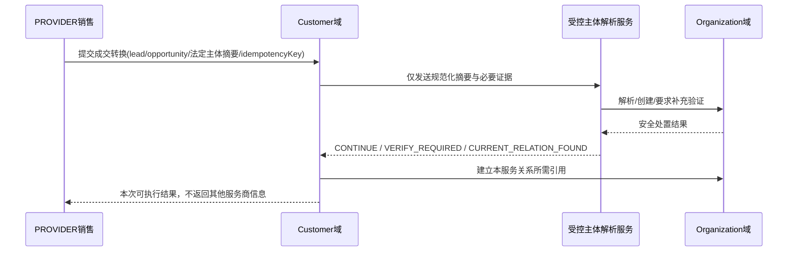
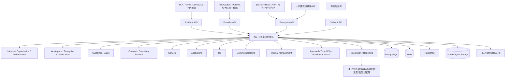
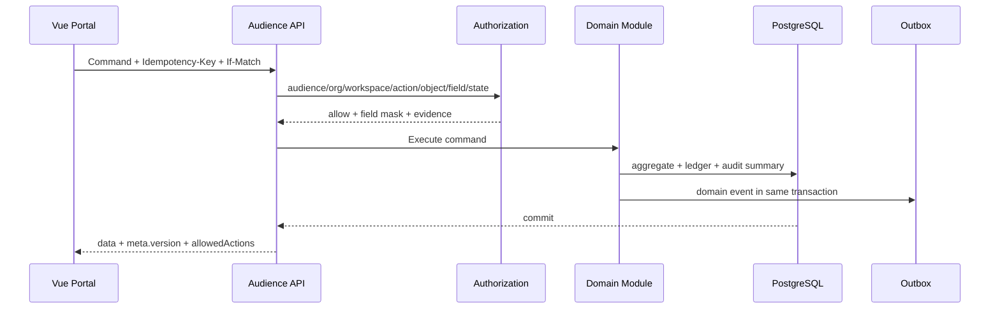

# 财税服务协作 SaaS 系统设计 v3.0

---

## Organization与Workspace业务设计
## 财税服务协作 SaaS Organization 与 Workspace 业务设计

> 版本：v1.0 
> 核心目标：以统一 Organization、具体 LegalEntity 和长期 Service Workspace 替代“一个租户既是公司又是客户又是数据边界”的混合模型

### 1. 文档边界

本文规定 Organization、LegalEntity、企业认领、Workspace、participant、membership、服务主体、生命周期和跨组织协作的业务设计。本文不重复会计、税务、平台计费和技术部署细节。


- 领域聚合：本卷《领域详细设计》

- 状态：本卷《状态机与计算规则》


### 2. 业务决策与不变量

| ID | 决策/不变量 |
|---|---|
| BR-WSP-101 | Organization 是唯一组织主体，不设置永久 PROVIDER/CLIENT 类型；服务身份由当前 participant role 决定。 |
| BR-WSP-102 | Organization 通过版本化 capability 表达 `PROVIDE_SERVICE/RECEIVE_SERVICE` 能力；能力不直接授予成员权限。 |
| BR-WSP-103 | 每个 ACTIVE Workspace 必须恰有一个 ACTIVE PRIMARY_PROVIDER 和一个 ACTIVE PRIMARY_CLIENT。 |
| BR-WSP-104 | Workspace 是长期服务关系；合同、服务项目、续费周期是 Workspace 内对象，不与 Workspace 一一对应。 |
| BR-WSP-105 | PROVIDER 内部客户经营、财税作业、经营财务和内部管理是功能域，不创建 Workspace 实体。 |
| BR-WSP-106 | 具体合同、账套、税务和法定开票必须指向 LegalEntity；connector authorization owner 是 Organization，授权 subject 按 capability 指向 `LEGAL_ENTITY` 或 `CONTROLLED_ACCOUNT`，Workspace 只证明服务关系并通过受控 grant 使用。 |
| BR-WSP-107 | PROVIDER 私有 lead、来源、标签、负责人、内部备注、成本和绩效不得写入 Organization 全局主档或共享区。 |
| BR-WSP-108 | ENTERPRISE 只读取本 Organization 作为 ACTIVE PRIMARY_CLIENT/PARTNER 参与 Workspace 的批准投影。 |
| BR-WSP-109 | participant/membership/授权退出不改写历史操作者、合同、凭证、申报、确认和审计。 |
| BR-WSP-110 | 平台支持、Organization 订阅、业务 Workspace 和会计账套是不同边界，不得共用一个“当前租户”字段解释全部权限。 |

### 3. 业务对象模型

#### 3.1 Organization 聚合

| 实体 ID | 实体 | 业务职责 | 核心约束 |
|---|---|---|---|
| ENT-ORG-001 | `organization` | 组织编号、显示名、状态和当前资料版本 | 无永久 PROVIDER/CLIENT 类型；编号全局唯一 |
| ENT-ORG-002 | `organization_capability` | PROVIDE_SERVICE/RECEIVE_SERVICE 申请、核验、有效期和状态 | 同能力有效期不重叠；历史版本不可覆盖 |
| ENT-ORG-003 | `organization_member` | user_account 与 Organization 的关系 | 同账号同 Organization 同时至多一个 ACTIVE 成员 |
| ENT-ORG-004 | `legal_entity` | 具体法律/经营主体、证照摘要、核验和状态 | 只归属一个 Organization；敏感标识加密+摘要 |
| ENT-ORG-005 | `organization_legal_entity_claim` | Organization 对 LegalEntity 的控制/代表关系和证据 | ACTIVE 前不授企业管理权；终态证据不可覆盖 |
| ENT-ORG-006 | `organization_relationship` | 集团、控制、品牌、介绍等关系 | 不自动授予数据权限 |
| ENT-CRM-001 | `provider_customer_profile` | PROVIDER 对目标 Organization/Workspace 的私有客户档案 | provider_organization_id 必填；不向其他参与方共享 |
| ENT-ORG-008 | `employee` | PROVIDER 人事任职档案 | 与 organization_member 一对一或受控关联；不等于角色 |

#### 3.2 Workspace 聚合

| 实体 ID | 实体 | 业务职责 | 核心约束 |
|---|---|---|---|
| ENT-WSP-001 | `workspace` | 长期服务关系编号、显示名、状态、起止、创建来源和版本 | 不保存合同/账税第二套状态 |
| ENT-WSP-002 | `workspace_participant` | Organization 的 PRIMARY_PROVIDER/PRIMARY_CLIENT/PARTNER 关系和状态 | 角色与 capability 匹配；历史行只追加 |
| ENT-WSP-003 | `workspace_membership` | organization_member 经 participant 进入 Workspace 的资格 | 成员与 participant Organization 一致；资格不自动授角色 |
| ENT-WSP-004 | `workspace_subject` | 当前服务关系覆盖的客户 LegalEntity 集合 | PRIMARY_CLIENT 必须持 ACTIVE CONTROL，或 ACTIVE REPRESENTATION + 平台批准且指向唯一 owner 的 mapping；PRIMARY_PROVIDER 另以覆盖主体、范围和有效期的有效合同或 ACTIVE SERVICE_AUTHORIZATION 证明服务权，均不能替代客户 claim |
| ENT-WSP-005 | `workspace_book_assignment` | Workspace 对 AccountingBook 的服务权、服务类型和有效期 | 不改变账套所有权；同类主服务关系不重叠 |
| ENT-WSP-006 | `workspace_lifecycle_case` | 暂停、恢复、关闭、迁出等申请和当前执行状态 | 提交后冻结原因、范围和策略版本 |
| ENT-WSP-007 | `workspace_lifecycle_impact` | 每轮影响评估的逐项结果 | 评估只追加并绑定当前内容摘要 |
| ENT-WSP-008 | `workspace_event` | 创建、激活、参与变化、生命周期和共享时间线事件 | 事件序号唯一；私有/共享可见性显式 |
| ENT-CONN-002 | `workspace_connector_grant` | Workspace 使用 Organization 授权的能力、主体、期限和额度 | scope 是 authorization 子集；不保存秘密 |
| ENT-WSP-010 | `published_projection` | 领域对象对企业门户发布的版本化投影 | 引用源对象版本、内容摘要、字段白名单和受众 |

#### 3.3 领域对象归属

| 对象 | 主要 owner/scope | 与 Workspace 的关系 |
|---|---|---|
| Lead、Opportunity、Quotation 草稿 | PROVIDER Organization | 成交前可无 Workspace；转换后只保存关联，不转成共享事实 |
| ProviderCustomerProfile | PROVIDER Organization + 目标 Organization/Workspace | 私有客户经营视图，不属于共享区 |
| Contract | Workspace + 双方 LegalEntity | 一个 Workspace 多合同/版本 |
| CustomerServiceItem | Workspace + 客户 LegalEntity | 合同项实际履约；一个 Workspace 多服务项目 |
| AccountingBook | `owner_legal_entity_id` 只指向具体 LegalEntity；owner Organization 仅由 `legal_entity.owner_organization_id` 派生 | PRIMARY_CLIENT 非 owner 时另验 ACTIVE REPRESENTATION + 平台批准 owner mapping；Workspace 仅通过 workspace_book_assignment 取得限期作业权 |
| FilingObligation/TaxFiling | LegalEntity + AccountingBook + Workspace 服务关系 | 法定义务 owner 不因服务关系退出而消失 |
| OperatingFinance | PRIMARY_PROVIDER Organization + Workspace/合同 | 客户只见与自身相关的发布投影 |
| InternalManagement | PROVIDER Organization | 不进入 Workspace |
| Confirmation/Material/Message | Workspace + LegalEntity/Object | 跨参与方协作事实 |
| PlatformSubscription/Bill | 订阅 Organization + PLATFORM | 不属于服务 Workspace |

### 4. Organization 生命周期

#### 4.1 状态

采用 `STATE-ORG-001`：

```text
DRAFT → VERIFYING → ACTIVE ↔ SUSPENDED → CLOSED
```

| 当前状态 | 动作 | 目标 | 业务守卫 |
|---|---|---|---|
| DRAFT | 提交核验 | VERIFYING | 名称、联系方式、申请能力和必要证据齐全 |
| VERIFYING | 通过 | ACTIVE | 核验责任人、证据摘要和 Organization 版本冻结 |
| VERIFYING | 退回 | DRAFT | 原因必填，不覆盖提交历史 |
| ACTIVE | 暂停 | SUSPENDED | 影响当前会话、capability、participant 和订阅的策略明确 |
| SUSPENDED | 恢复 | ACTIVE | 原因解决、重新校验能力与成员 |
| ACTIVE/SUSPENDED | 关闭 | CLOSED | 数据交付及未结资金/争议/外部 UNKNOWN 依法处置；所有活动 subscription 受控 TERMINATED 并留证，capability REVOKED，owner 的未来 `organization_connector_authorization` 撤销/失效；其作为 ACTIVE PRIMARY_PROVIDER/PRIMARY_CLIENT 的每个 Workspace 必须先经 API-WSP-008 关闭，或完成获批 successor/handover 且旧 Workspace 已收口，禁止把主参与方直接改为 LEFT 后留下 ACTIVE Workspace；PARTNER 可按获批影响评估单独 LEFT；未来 membership/grant/book assignment、claim、成员与法定留存处置完成；任一项无法完成即阻断 |

CLOSED 为 Organization 终态；不得留下 ACTIVE subscription/capability/connector authorization，也不得留下以该 Organization 为活动主参与方的 ACTIVE Workspace 继续计量、收费、外发或授予未来参与资格，LegalEntity、authorization 版本与历史关系继续只读可追溯。仅单个 Workspace 关闭时仍只结束该空间 grant，不撤销可供其他 Workspace 合法使用的 owner authorization。再次经营使用新 Organization 还是受控恢复属于正式变更，不通过普通命令完成。

#### 4.2 Organization 能力

capability 状态固定为 `REQUESTED/ACTIVE/SUSPENDED/REVOKED`；有效期到达通过 `valid_until` 使其失效，不另造 EXPIRED 状态。关键规则：

1. capability 独立于 Organization 状态，但 ACTIVE capability 要求 Organization ACTIVE。
2. `PROVIDE_SERVICE` 的核验可包含订阅、资质、服务范围和责任联系人；具体材料由待决策与法务输入冻结。
3. `RECEIVE_SERVICE` 的核验可由企业 claim 与有效 LegalEntity 支持。
4. 暂停 capability 不改变历史 Workspace participant role；仅阻止新激活和按策略限制当前行为。
5. 能力恢复或换版必须保留原核验版本、批准人和有效期。

### 5. LegalEntity 解析与企业认领

#### 5.1 PROVIDER 私有潜客边界

Lead、未转化联系人、来源、跟进、商机概率、报价策略、销售标签、评分、负责人和内部备注始终属于创建它们的 PROVIDER Organization。它们不得因为平台存在同名 Organization/LegalEntity 而自动合并或公开。

#### 5.2 成交时主体解析



| ID | 规则 |
|---|---|
| BR-ORG-101 | 服务机构不得使用名称、税号、手机号或地址枚举全平台 Organization/Workspace。 |
| BR-ORG-102 | 解析结果不得返回其他 PRIMARY_PROVIDER、合同、成员、负责人、数量或“已被服务”等可推断信息。 |
| BR-ORG-103 | 同一幂等键和主体摘要返回原解析/转换结果；异摘要冲突。 |
| BR-ORG-104 | 疑似重复或 claim 冲突进入平台受控队列，不由销售自行合并全局主体。 |
| BR-ORG-105 | PROVIDER 私有字段写 provider_customer_profile；全局 LegalEntity 只接受核验过的主体字段。 |

#### 5.3 企业 claim

claim 状态固定为 `DRAFT/REVIEWING/ACTIVE/SUSPENDED/REJECTED/REVOKED`，与 `STATE-ORG-002` 和数据字典一致。Enterprise 用户申请管理 Organization/LegalEntity 时执行：

1. 先建立仅可完成 claim 的受限身份上下文，不获得 Workspace 业务数据。
2. 选择或提交 Organization/LegalEntity 安全摘要。
3. 提交代表关系类型、证明材料、联系方式验证和声明。
4. 系统查重并使 claim 从 DRAFT 进入 REVIEWING；自动核验仅能使用已批准规则。
5. 审核冻结申请人、目标主体版本、证明摘要、有效期和批准人。
6. 审核通过后 claim 进入 ACTIVE，再创建/激活 organization_member 和允许的 Organization role；Workspace membership 仍需 participant 与邀请。
7. 驳回、撤销或控制权变化保留历史，并撤销受影响会话与未来动作。

企业 claim 的证明类型、自动核验来源、人工 SLA 和申诉流程为 `DEC-ORG-001`。

### 6. Workspace 建立

#### 6.1 创建来源

| 来源代码 | 场景 | 必要依据 |
|---|---|---|
| `OPPORTUNITY_CONVERSION` | PROVIDER 私有商机成交 | 核验主体、批准报价/合同草案、幂等转换 |
| `CONTRACT_INITIATION` | 已核验双方直接发起合同 | 双方 Organization/LegalEntity 与服务意向 |
| `MIGRATION` | 旧系统服务关系迁移 | 来源映射、对账、迁移批次和审批 |
| `PLATFORM_ASSISTED` | 平台经双方授权协助建立 | 双方授权、原因、支持工单；平台不代业务接受合同 |

#### 6.2 创建前置

1. PRIMARY_PROVIDER Organization ACTIVE 且 `PROVIDE_SERVICE` capability ACTIVE。
2. PRIMARY_CLIENT Organization 已解析，至少一个目标 LegalEntity 有有效 claim 或受控待验证路径。
3. 创建人是 PROVIDER 有权成员；平台协助场景有独立授权。
4. 主参与方组合、服务线与地区不违反 `DEC-WSP-001` 最终唯一策略。
5. `Idempotency-Key`、请求摘要和预期版本有效。

#### 6.3 原子创建结果

一次成功命令必须在同一事务或可恢复 Saga 中形成：

- DRAFT Workspace；
- PRIMARY_PROVIDER participant；
- PRIMARY_CLIENT participant（可先 INVITED）；
- 至少一个 workspace_subject 候选 LegalEntity；
- provider_customer_profile 与来源 lead/opportunity 的私有关联；
- 首次 workspace_event 和 Outbox；
- 邀请/开通任务，但不提前生成 ENTERPRISE 权限。

重复命令返回原 Workspace 和对象引用，不重复建参与方、邀请或客户档案。

#### 6.4 激活

Workspace 从 DRAFT 进入 ACTIVE 时必须重检：

- 恰有一个 ACTIVE PRIMARY_PROVIDER 与 PRIMARY_CLIENT；
- 双方 Organization 和所需 capability ACTIVE；
- 至少一个 ACTIVE workspace_subject；
- 双方必要成员、服务责任人和安全配置已建立；
- 首份合同或经批准的关系依据存在；
- 连接器、材料和账套不是激活的通用必填，具体由服务开通检查决定；
- 无阻断审批、claim 或数据冲突。

### 7. participant 与 membership

#### 7.1 participant 状态

使用 `STATE-WSP-002`：

```text
INVITED → ACTIVE ↔ SUSPENDED → LEFT
```

| 状态 | 可见/可做 | 禁止 |
|---|---|---|
| INVITED | 查看最小邀请摘要、接受/拒绝、补充核验 | 读取 Workspace 业务正文或获得角色 |
| ACTIVE | 在 membership、role、scope、对象状态内行动 | 因 participant 自动取得全 Workspace 权限 |
| SUSPENDED | 按策略查看历史、处理允许的法定义务或恢复 | 创建未经允许的新合同/服务/外部动作 |
| LEFT | 读取依法保留且有权的退出交付，历史责任可审计 | 进入新业务、恢复原行或继续使用 grant |

LEFT 后重新加入必须创建新 participant 行并引用前序，不能把旧行改回 ACTIVE。

#### 7.2 participant 变更

- PRIMARY_PROVIDER 或 PRIMARY_CLIENT 不允许在同一 Workspace 内无痕替换。
- 主客户 Organization 法律重组、主服务方更换或隔离边界变化，默认通过 successor Workspace 和交接处理；是否存在受控原地变更例外列为 `DEC-WSP-004`。
- PARTNER 可按批准范围邀请、暂停和离开；未冻结生产启用前只能在非生产验证模型。
- 任何 participant 变化均生成影响评估、旧/新快照、原因、批准和事件。

#### 7.3 workspace_membership

创建 ACTIVE workspace_membership 必须满足：

1. organization_member ACTIVE；
2. 对应 participant ACTIVE；
3. Organization 与 participant 相同；
4. 邀请或授权来源有效；
5. 需要的 Organization/Workspace role assignment 已显式创建；
6. LegalEntity/Book/Object delegation 不超出成员允许范围。

Organization member SUSPENDED/LEFT、participant SUSPENDED/LEFT、Workspace SUSPENDED/CLOSED 时，membership 按状态策略立即重算和撤销会话/缓存。

### 8. WorkspaceSubject、账套与服务权

#### 8.1 workspace_subject

workspace_subject 表示当前 Workspace 可服务的具体 LegalEntity：

- LegalEntity 必须存在唯一有效 owner；PRIMARY_CLIENT 必须持 ACTIVE CONTROL，或持 ACTIVE REPRESENTATION 且有平台批准、指向该唯一 owner 的 mapping；
- PRIMARY_PROVIDER 另以覆盖该 Workspace、主体、服务范围和有效期的有效合同，或 ACTIVE SERVICE_AUTHORIZATION，证明服务权；涉及税局、银行等受监管具体动作时仍须额外满足该动作所需 authorization。合同或服务授权都不能写入 `client_claim_id`，也不能替代客户 owner/control claim；
- `workspace_subject` 必须冻结 provider 服务权证据的类型、ID、版本/摘要和有效期；合同路径重验已签/生效及 Workspace、LegalEntity、服务范围、期限，SERVICE_AUTHORIZATION 路径重验所属 PRIMARY_PROVIDER、主体、范围和期限；
- 添加前评估合同、服务、授权、地区和数据权限；
- 移除前评估活动合同项、账套、税务义务、材料、确认和外部请求；
- 历史 subject 不删除，以有效期和状态表达退出。

#### 8.2 AccountingBook 所有权与服务权

AccountingBook 只以 `owner_legal_entity_id` 永久归属具体 LegalEntity；Organization 归属只由该 LegalEntity 的 owner 派生，不能作为第二 owner 独立转移。Workspace 通过 workspace_book_assignment 取得在有效期内的服务权：

| 字段/概念 | 要求 |
|---|---|
| service_type | BOOKKEEPING/TAX/ANNUAL/SOCIAL 等稳定服务类型 |
| valid_from/valid_until | 服务权有效期，不得无依据跨合同周期 |
| is_primary | 同账套同服务类型同一时点至多一个主服务 Workspace |
| source_service_item_id | 服务权必须来自有效服务项目或受控迁移 |
| handover_package_id | 服务方变更时关联不可变交接包 |

结束 workspace_book_assignment 不删除账套。新 PROVIDER 服务时建立 successor Workspace 和新 assignment，账套、历史期间、凭证、申报和档案保持原 ID/版本。

### 9. 私有数据、共享数据与发布

#### 9.1 数据分类

| 分类 | 示例 | 默认可见性 |
|---|---|---|
| PROVIDER Organization 私有 | lead、商机策略、内部客户标签、成本、绩效、人事工资、内部审批意见 | PROVIDER 授权成员 |
| Workspace participant 私有 | 一方内部处理备注、草稿、候选分派 | 指定 participant/成员 |
| Workspace 协作 | 材料需求、确认、异议、消息、共同里程碑 | 按 participant/membership/对象权限 |
| 领域权威事实 | 合同、账套、凭证、申报、支付、档案 | 领域权限；不因进入 Workspace 全量共享 |
| 已发布投影 | 对客合同版本、服务状态、报表、证明、结果 | 明确受众、字段和版本 |
| PLATFORM 元数据 | 订阅、用量、供应商健康、支持工单 | 对应平台角色；业务正文默认不可见 |

#### 9.2 发布规则

任何向 ENTERPRISE_PORTAL 发布的对象必须保存：

- workspace_id 与目标 participant/Organization；
- legal_entity_id/业务对象 ID；
- source_type/source_id/source_version；
- schema_version 与字段白名单；
- content_hash；
- published_by/published_at；
- effective_until（如有）；
- superseded_by/revoked_reason（如有）。

源对象新版本不会原位覆盖已确认投影；系统创建后继发布并使旧版 SUPERSEDED。下载时重新校验 membership、对象关系、字段权限、文件扫描和有效期。

### 10. Workspace 生命周期

#### 10.1 状态

使用 `STATE-WSP-001`：

```text
DRAFT → ACTIVE ↔ SUSPENDED → CLOSING → CLOSED
```

#### 10.2 暂停

暂停申请必须说明原因、预计恢复日、作用范围和策略版本。评估至少覆盖：

- 新合同、服务项目、续费和普通工单；
- 已有账套、开放账期、申报义务、申报/缴退税 UNKNOWN；
- 待客户确认、材料、已发布结果和门户访问；
- organization_connector_authorization 与 workspace_connector_grant；
- 未结收款、发票、退款和争议；
- Partner 与成员资格；
- 数据导出、保留和支持责任。

暂停不得删除历史或自动取消法定义务。允许动作由原因（欠费、双方业务决定、风险、合规）和冻结策略共同决定。

#### 10.3 恢复

恢复前重新评估 Organization/capability/participant、合同与服务、成员、账套、法定义务、连接器 grant、欠费和安全事件。恢复成功追加事件并重新激活允许的未来任务；不得重放暂停期间已明确完成的命令。

#### 10.4 关闭

关闭分两步：

1. ACTIVE/SUSPENDED → CLOSING：冻结申请、终止日、数据交付和影响摘要；禁止未列明的新业务。
2. CLOSING → CLOSED：外部 UNKNOWN 已明确，未结资金/争议按策略处置，必要交接包完成；原子结束本 Workspace 在终止日后仍 ACTIVE 的全部 `workspace_book_assignment` 与未来 connector grant，或引用已批准的 successor assignment/交接处置；保留 AccountingBook 唯一 owner、历史事实及保留/访问策略。

CLOSED 不通过普通命令恢复。再次合作默认新建 Workspace 并可只读关联旧 Workspace；最终政策由 `DEC-WSP-002` 冻结。

### 11. 关键跨域流程

#### 11.1 获客到服务开通

```text
PROVIDER私有Lead/Opportunity
→ 主体安全解析与LegalEntity核验
→ ProviderCustomerProfile
→ DRAFT Workspace + 双主participant
→ 报价/合同/签署/收款策略
→ Workspace ACTIVE
→ 合同服务项
→ 服务开通检查
→ CustomerServiceItem
→ CREATE/REUSE AccountingBook
→ workspace_book_assignment + 作业分工
```

销售人员不能直接激活正式账套；会计主管或获授实施人员完成会计制度、启用期、税务登记、期初和分工。

#### 11.2 月度协作

```text
账套生成账期/义务/任务
→ ENTERPRISE/PROVIDER提交材料
→ 会计编制与复核
→ 结账与报表
→ 税费测算
→ ENTERPRISE确认/异议或受控内部豁免
→ 申报/缴退税/查单
→ 发布证明和档案
→ 服务质量与续费任务
```

ENTERPRISE 长期账户和 H5 capability 共用确认事件和幂等键；PROVIDER 员工不得代客户提交。

#### 11.3 续费

1. 按服务项目到期日生成 renewal_cycle。
2. PROVIDER 评估服务范围、价格、主体、欠费和异常。
3. 新报价/合同版本或续约合同仍关联原 Workspace。
4. 生效后延长/新建服务周期，复用符合条件的账套。
5. 未续费只结束对应服务项目/周期，不自动关闭整个 Workspace。

#### 11.4 主服务方更换与迁出

1. 原 Workspace 进入 CLOSING 或结束目标服务权。
2. 冻结未结资金、开放账期、申报、UNKNOWN、材料、凭证、档案和授权影响。
3. 生成不可变 handover_package 与摘要，双方按权限确认交付。
4. 结束原 workspace_book_assignment 和 workspace_connector_grant；不撤销客户 Organization 自有 authorization。
5. 新 PROVIDER 与 PRIMARY_CLIENT 建 successor Workspace 和新的服务权。
6. 历史账套和法定事实保留，新的作业从约定有效期开始。

### 12. 权限求值与审计

每个 Workspace 命令必须服务端求值：

```text
Audience
∩ OrganizationMember ACTIVE
∩ Organization capability/state
∩ Workspace state
∩ WorkspaceParticipant ACTIVE
∩ WorkspaceMembership ACTIVE
∩ RoleAssignment / PermissionPolicy
∩ DataScope / FieldScope
∩ LegalEntity/Book/Object relation
∩ Assignment
∩ Object state/version
∩ SOD / Approval / Reauthentication
```

最小审计字段：Audience、user、Organization/member、Workspace/participant/membership、LegalEntity/Book、角色、动作、对象、前后摘要、命令/请求号、理由、审批、结果、IP/终端摘要和服务端时间。

平台支持访问使用 support_access_grant，不把平台人员变成 organization_member 或 workspace_membership，不允许代确认、代复核、代申报或代缴款。

### 13. 业务命令与事件目录

#### 13.1 Organization 命令

| 操作 ID | 命令 | 核心输入/守卫 |
|---|---|---|
| API-ORG-001 | CreateOrganization | 规范化名称、申请能力、幂等键；PLATFORM 或受控自助 |
| API-ORG-002 | ManageOrganizationVerification | PROVIDER/ENTERPRISE submit 与 PLATFORM review/approve/reject 子操作；当前 Organization 版本、证明摘要、申请能力、内容 hash、核验人和决定理由。审核只返回当前申请的安全结果，不枚举其他 Organization/关系；批准原子写 ACTIVE 与事件，退回保留历史 |
| API-ORG-003 | ManageOrganizationCapability | request/approve/suspend/resume/revoke 子操作；capability 类型、版本、有效期、理由、影响清单、内容摘要和审批。恢复重验 Organization、资质、订阅/安全及受影响 Workspace；终态历史不覆盖 |
| API-ORG-004 | ManageOrganizationMember | invite/accept/suspend/leave/handover 子操作；目标联系方式、角色建议、安全策略、一次性令牌、原因与预期版本。SUSPENDED/LEFT 原子撤销活动会话、Workspace membership 与派生授权，离职交接不复制角色或业务正文；同命令幂等，重新加入建后继关系 |
| API-ORG-005 | ResolveLegalEntity | 法定主体摘要、用途、请求方；防枚举响应 |
| API-ORG-006 | Submit/ReviewOrganizationClaim | LegalEntity、代表关系、证据、申请人、审批 |
| API-ORG-007 | CloseOrganization | request/submit 子操作冻结影响清单、处置计划、manifest/content hash 与 requested_by；获批后由 execute 子操作重验并消费 case。先终止订阅、撤销 capability 与 owner connector authorization；作为主参与方的 ACTIVE Workspace 须先经 API-WSP-008 关闭，或完成获批 successor/handover 且旧 Workspace 已收口，PARTNER 才可单独 LEFT；再结束未来 membership/grant/book assignment并处置资金、争议、UNKNOWN、交付和留存；SOD-ORG-001 保证申请人、批准人、执行人排他，历史只读保留 |
| API-ORG-008 | Suspend/ResumeOrganization | 暂停冻结原因、影响策略、case/incident 与预期版本；获准紧急暂停立即收窄会话、能力和未来动作并限时补审。恢复必须消费获批 case，重验 Organization/capability、成员、安全、订阅及 Workspace 影响；不得复活已终止 participant、membership、grant、assignment 或外部请求 |

#### 13.2 Workspace 命令

| 操作 ID | 命令 | 核心输入/守卫 |
|---|---|---|
| API-WSP-001 | CreateWorkspace | 来源、双主 Organization、subject、幂等键 |
| API-WSP-002 | ManageParticipant | invite/accept/suspend/leave/rejoin 子操作；participant role、Organization、能力、一次性邀请、原因、影响清单和预期版本。PRIMARY_PROVIDER/PRIMARY_CLIENT 不得直接 LEFT，须先关闭旧 Workspace 或完成获批 successor/handover 且旧关系收口；PARTNER 才可按影响评估单独 LEFT；重加入建后继行，不复活原行 |
| API-WSP-003 | ActivateWorkspace | 双主 ACTIVE、subject、关系依据、无阻断 |
| API-WSP-004 | ManageWorkspaceMembership | invite/accept/suspend/resume/leave/revoke 子操作；participant、organization_member、role/delegation 建议、原因和预期版本。participant 或 Organization member 失效时原子收窄 membership、撤销活动会话与派生 role assignment；重加入建后继行，不复活原行；命令幂等 |
| API-WSP-005 | Add/RemoveWorkspaceSubject | LegalEntity claim、影响评估、预期版本 |
| API-WSP-006 | Assign/EndWorkspaceBook | AccountingBook、服务类型、有效期、服务项目、交接 |
| API-WSP-007 | Submit/Suspend/ResumeLifecycle | 原因、策略、影响轮次、审批、执行结果 |
| API-WSP-008 | Start/CompleteWorkspaceClosing | 终止日、交付、未结事项、保留；原子结束 ACTIVE book assignment/future grant 或引用获批 successor 处置，不转移账套 owner |
| API-WSP-009 | Publish/RevokeProjection | 源对象版本、字段白名单、受众、摘要、有效期 |

#### 13.3 核心事件

| 事件 ID | 事件 | 主要消费者 |
|---|---|---|
| EVT-ORG-001 | OrganizationActivated/Suspended/Resumed/Closed | IAM、Workspace、Billing、Audit |
| EVT-ORG-002 | OrganizationCapabilityChanged | Workspace、Authorization、Billing |
| EVT-ORG-003 | LegalEntityClaimActivated/Revoked | Workspace、Contract、Accounting、EnterprisePortal |
| EVT-WSP-001 | WorkspaceCreated/Activated | Customer、Contract、Service、Portal |
| EVT-WSP-002 | WorkspaceParticipantChanged | IAM、Portal、Connector、Audit |
| EVT-WSP-003 | WorkspaceSubjectChanged | Contract、Service、Accounting、Tax、Portal |
| EVT-WSP-004 | WorkspaceMembershipChanged | IAM、Todo、File、Audit |
| EVT-WSP-005 | WorkspaceSuspended/Resumed/ClosingStarted/Closed | 全业务域、Billing、Connector、Portal；CLOSING 开始即通知消费者停止未获准的新业务 |
| EVT-WSP-006 | WorkspaceProjectionPublished/Revoked | EnterprisePortal、Notification、Audit |
| EVT-WSP-007 | WorkspaceBookAssigned/AssignmentEnded | Accounting、Tax、Service、Reporting、Audit；只改变服务权，不转移或复制账套 owner |

### 14. 验收场景

| ID | 场景 | 预期 |
|---|---|---|
| TEST-ORG-007 | 关闭仍有活动订阅/capability/owner authorization，或仍作为 ACTIVE Workspace 主参与方、存在未来 membership/grant/book assignment 的 Organization | 关闭被阻断；主参与方 Workspace 先经 API-WSP-008 关闭，或完成获批 successor/handover 且旧 Workspace 收口，PARTNER 可按影响评估单独 LEFT；外部 UNKNOWN 明确并完成受控终止、撤销/结束及资金争议处置后才可 CLOSED，历史只读且不再计量、收费或外发；单 Workspace 关闭不误撤 owner authorization |
| TEST-ORG-008 | Organization 紧急暂停及恢复 | 暂停立即收窄会话、capability 和未来动作并留下补审期限；恢复缺审批或任一状态/安全/订阅/Workspace 重验失败即阻断，成功恢复也不复活已终止关系或外部请求 |
| TEST-WSP-001 | 同一 Organization 在两个 Workspace 分别为 PRIMARY_PROVIDER、PRIMARY_CLIENT | 两个 participant 独立，Audience/角色/数据不串 |
| TEST-WSP-002 | 同一客户 Organization 多 LegalEntity | 合同、账套、税务和授权只作用目标主体 |
| TEST-WSP-003 | 两个 PROVIDER 对同一企业开展独立销售 | 双方 lead/profile 完全私有，解析不泄露对方关系 |
| TEST-WSP-004 | 并发创建同一服务关系 | 幂等与唯一策略只产生允许数量 Workspace |
| TEST-WSP-005 | participant 邀请、暂停、离开、重新加入 | 状态合法、会话/缓存及时失效、历史责任保留 |
| TEST-WSP-006 | 续费、新合同和新增服务项目 | 复用 Workspace，领域对象版本可追溯 |
| TEST-WSP-007 | 移除仍有账套/义务的 workspace_subject | 影响评估阻断，不能孤立法定对象 |
| TEST-WSP-008 | Workspace 暂停时存在申报 UNKNOWN | 不重提、不删除；只查单和履行允许法定义务 |
| TEST-WSP-009 | 更换主服务方 | successor Workspace、交接包和新 service assignment；账套不复制 |
| TEST-WSP-010 | Enterprise 成员直链其他 Workspace 文件 | 403/404 安全响应，不泄露对象存在或文件元数据 |
| TEST-WSP-011 | PLATFORM 支持会话到期 | grant 即时失效，不能继续读取或执行；完整审计 |
| TEST-WSP-012 | 发布结果后源对象更正 | 原发布保留，新版本后继；已确认摘要不被覆盖 |

### 15. 迁移原则

| ID | 规则 |
|---|---|
| MIG-ORG-001 | 旧 tenant/客户主体显式映射为 Organization、LegalEntity 和订阅/客户经营关系，保留来源、冲突与 claim 证据；不得机械把 tenant_id 全部改成 organization_id。 |
| MIG-WSP-001 | 按 PRIMARY_PROVIDER、PRIMARY_CLIENT、隔离要求和历史连续性把旧数据归并为稳定服务关系；不得按单合同/续费建 Workspace。拟迁为 ACTIVE 时必须具备双主 participant、ACTIVE Organization/LegalEntity，以及 PRIMARY_CLIENT 的 ACTIVE CONTROL，或 ACTIVE REPRESENTATION + 平台批准且指向唯一 owner 的 mapping；PRIMARY_PROVIDER 另以覆盖 Workspace、主体、服务范围和有效期的有效合同或 ACTIVE SERVICE_AUTHORIZATION 证明服务权，二者均不得替代客户 claim；缺任一所需证据的候选保持 DRAFT/SUSPENDED。 |
| MIG-WSP-002 | 旧 customer 拆为 Organization、LegalEntity 和 provider_customer_profile；来源/标签/负责人保持 PROVIDER 私有。 |
| MIG-WSP-003 | 每个现存稳定服务关系建立 Workspace，并以合同/服务/账套证据确定双主 participant 与起始日。 |
| MIG-WSP-004 | 旧 tenant_membership 映射 organization_member；业务访问再按对象关系生成 workspace_membership/role assignment。 |
| MIG-WSP-005 | 旧 customer_group 不直接成为 Organization/Workspace；按证据迁移为 organization_relationship 或 PROVIDER 私有分组。 |
| MIG-WSP-006 | 旧 tenant_connector 拆分 organization_connector_authorization 与 workspace_connector_grant；秘密只迁移为密钥引用。 |
| MIG-WSP-007 | 合同、账套、税务、发票必须补齐 LegalEntity；无法证明的记录进入人工映射阻断队列。 |
| MIG-WSP-008 | 迁移对账覆盖 Organization、LegalEntity、Workspace、成员、合同、金额、账套、状态、文件摘要和权限。 |

### 16. 待决策事项

| ID | 状态 | 待决策 | 最晚质量门 |
|---|---|---|---|
| DEC-WSP-001 | PENDING | 同一双主 Organization 组合是否可按服务线/地区并行多个 ACTIVE Workspace | GATE-REQ |
| DEC-WSP-002 | PENDING | CLOSED Workspace 再次合作恢复或新建 | GATE-LLD |
| DEC-WSP-003 | PENDING | PARTNER 的生产启用、入口、责任、角色和计费 | GATE-REQ |
| DEC-WSP-004 | PENDING | 法律重组时主 participant 原地变更的例外条件 | GATE-REQ |
| DEC-ORG-001 | PENDING | organization_claim 证据、自动核验、人工 SLA 和申诉 | GATE-REQ |
| DEC-ORG-002 | PENDING | 集团/控制关系、多 Organization 门户聚合和权限 | GATE-REQ |
| DEC-ORG-003 | PENDING | 同一 LegalEntity 多重 REPRESENTATION/SERVICE_AUTHORIZATION claim 并存规则；CONTROL 仅限 owner Organization | GATE-LLD |
| DEC-WSP-005 | PENDING | 同账套同服务类型多 Workspace 协作与主服务权规则 | GATE-LLD |

未决事项未冻结前，服务端必须选择失败关闭或本文明确的最保守规则，不能由页面默认值代替产品决策。

---

## 领域详细设计
## 财税服务协作 SaaS 领域详细设计说明书 v1.0

> 交易原则：核心交易强一致，跨域经 Outbox 事件协作 
> 交付：商业化 SaaS，瀑布模型全范围一次上线

### 1. 文档边界

本文定义领域边界、聚合、不变量、跨域流程、事务和事件。字段、索引与分区以《09-数据模型与字段数据字典》为准；接口与错误码以《11-API事件与错误码基线》为准；角色审批以《07-身份组织权限与审批设计》和《19-权限审批初始种子》为准。

本文是详细设计基线，不表示领域代码、数据库 DDL、工作流引擎或测试已经完成。

### 2. 领域设计原则

1. Organization、LegalEntity、Workspace 和 AccountingBook 四个概念不得合并；
2. Workspace 是服务协作边界，不是服务机构内部工作区域；
3. 服务机构内部客户经营、财税作业、内部管理只作为导航视图，领域对象仍按真实归属建模；
4. 潜客/线索、服务机构标签、画像和内部备注是 PROVIDER Organization 私有事实；
5. 合同、账套、申报、开票和外部授权必须绑定具体 LegalEntity，不能仅引用 Workspace 或 Organization；
6. 业务模块拥有状态事实，统一待办和企业门户只保存查询投影；
7. 已提交、已审批、已过账、已申报、已支付和审计事实不可覆盖或物理删除；
8. 业务更正使用后继版本、反向记录、冲正、作废或反结账；
9. 命令幂等、乐观锁和职责分离是应用服务入口的固定守卫；
10. 跨模块流程不使用分布式事务，通过流程状态、Outbox 和幂等消费者恢复。

### 3. 领域与代码模块

领域编码（`DOM-*`）属基座词汇，登记于术语与概念卷。

模块拥有自己的写模型。任何模块都不得直接写另一模块的表；只读 SQL 也必须通过明确发布的查询视图或仓储契约，避免把私有表结构变成隐式 API。

### 4. Organization 领域

#### 4.1 聚合

- `Organization`：组织编号、名称、状态、当前资料版本；
- `OrganizationCapability`：`PROVIDE_SERVICE/RECEIVE_SERVICE` 能力申请、核验、有效期和状态；
- `OrganizationMember`：账号与组织关系；
- `LegalEntity`：具体法律/经营主体及敏感标识；
- `OrganizationLegalEntityClaim`：Organization 对 LegalEntity 的控制或代表关系；
- `Department/Position/EmploymentPeriod`：组织内部职责和任职历史。

#### 4.2 不变量

- Organization 不保存永久 PROVIDER/CLIENT 类型；
- 能力发布和撤销只通过命令，历史版本不可覆盖；
- PROVIDER/ENTERPRISE 会话必须分别依赖有效 `PROVIDE_SERVICE`/`RECEIVE_SERVICE` 能力；
- 同一 LegalEntity 可存在多次历史认领，但同一关系类型同一时点最多一个有效控制关系；
- 标识摘要解析只返回安全结果，不泄露其他 Organization 或 Workspace；
- 部门、岗位、任职和角色授权分离，岗位只可提供授权建议；
- 成员离开会撤销会话和 Workspace membership，但不改写历史操作人快照。

#### 4.3 企业认领流程

1. 企业成员创建认领草稿并提交主体证明；
2. 服务端规范化主体标识并调用平台受控解析；
3. 无冲突时进入自动/人工核验；疑似冲突时只返回 `REVIEW_REQUIRED`；
4. 审批冻结申请人、代表关系、证据摘要和 LegalEntity 版本；
5. 批准后创建/激活 claim 并发布 `LegalEntityClaimActivated`；
6. 撤销只追加反向事实，已签合同、账套和申报历史仍引用原 claim 证据。

### 5. Workspace 领域

#### 5.1 聚合

`Workspace` 聚合包含：

- Workspace 当前状态和服务范围；
- `WorkspaceParticipant`：`PRIMARY_PROVIDER/PRIMARY_CLIENT/PARTNER`；
- `WorkspaceMembership`：参与方成员资格；
- `WorkspaceSubject`：受控 LegalEntity 集合；
- `WorkspaceBookAssignment`：账套服务关系和有效期；
- `WorkspaceLifecycleEvent`：激活、暂停、关闭和迁出历史；
- `SupportAccessGrant`：平台支持的限时受控访问。

#### 5.2 状态机

```text
DRAFT -> ACTIVE <-> SUSPENDED -> CLOSING -> CLOSED
```

- DRAFT：可邀请参与方、协商服务范围，不允许生产财税命令；
- ACTIVE：两个主参与方均 ACTIVE，至少一个有效主体或明确的前置协作范围，激活审批完成；
- SUSPENDED：限制新业务，但法定义务、数据导出和已在途高风险事项按降级矩阵处理；
- CLOSING：冻结新增合同/账套，执行交接、归档、授权撤销和未结事项清单；
- CLOSED：只读历史，不删除服务事实。

#### 5.3 不变量

- 首期每个活动 Workspace 恰有一个 PRIMARY_PROVIDER 和一个 PRIMARY_CLIENT；
- participant Organization 的能力必须匹配角色；
- PARTNER 默认禁止生产激活，直至专项基线冻结；
- membership 必须属于同 Organization participant，且 Organization member ACTIVE；
- WorkspaceSubject 必须来自 PRIMARY_CLIENT 的 ACTIVE CONTROL，或 ACTIVE REPRESENTATION + 平台批准且指向唯一 owner 的 mapping；PRIMARY_PROVIDER 以覆盖 Workspace、主体、服务范围和期限的已签/生效合同，或 ACTIVE SERVICE_AUTHORIZATION 二选一证明服务权，两者均不能替代 owner/control claim；受监管具体动作仍另验专用 authorization；
- AccountingBook 必须通过有效 WorkspaceBookAssignment 才能由该 PRIMARY_PROVIDER 作业；
- 同一账套同一服务类型同一时点至多一个主服务 Workspace；
- 关闭/迁出不得静默取消申报义务、未知外部请求、待缴税款或法定留存。

### 6. Customer / Sales 领域

#### 6.1 聚合

`Lead`、`LeadGovernanceRuleVersion`、`ProviderCustomerProfile`、`ProviderCustomerTag`、`Contact`、`Opportunity`、`OpportunityItem`、`FollowUp`、`Visit`、`Quotation`、`SalesTarget`、`PerformanceEvent`。

#### 6.2 私有边界

- Lead、未转化联系人、服务机构评分、标签、等级、商机概率、内部备注和销售活动只属于 provider Organization；
- `ProviderCustomerProfile` 通过本服务机构可见的 Organization/LegalEntity 关系建立，但不得回写全局主体名称、标签或内部结论；
- 查询疑似企业时，只显示本 provider 已有的安全结果；其他 provider 是否服务该主体不可见；
- 客户组仅用于 provider 内部经营导航和分析，不是签约、核算、税务或开票主体。

#### 6.3 转化到 Workspace

商机成交不直接把 Lead 变成全局 Organization。转换命令必须：

1. 核验或邀请客户方建立 Organization；
2. 完成 RECEIVE_SERVICE 能力和 LegalEntity claim；
3. 创建 DRAFT Workspace 与两个主参与方；
4. 将具体 LegalEntity 加入 WorkspaceSubject；
5. 关联 ProviderCustomerProfile、Opportunity 与 Workspace，但保留 provider 私有历史；
6. 发布 `OpportunityConvertedToWorkspace`，失败可按幂等键恢复原结果。

Lead 和商机关闭后不可物理删除，合并保留来源映射和审计。

### 7. Contract 与经营财务领域

#### 7.1 合同

`Contract` 必须绑定：Workspace、PRIMARY_PROVIDER Organization、PRIMARY_CLIENT Organization、服务方签约 LegalEntity、客户方具体 LegalEntity、币种和当前版本。合同服务项引用已发布服务目录版本和价格快照。

状态建议：

```text
DRAFT -> REVIEWING -> APPROVED -> SIGNING -> ACTIVE
ACTIVE -> CHANGING -> ACTIVE
ACTIVE -> TERMINATING -> TERMINATED
```

已提交版本不可覆盖；变更产生后继版本。签署完成只能由已验签连接器事件或合法人工证据推进。

#### 7.2 OperatingFinance：回款、退款与开票

- Contract 只拥有合同、版本、服务项、价格快照和应收计划；合同事件驱动 OperatingFinance 建立应收投影，两个模块不得互写表；
- 回款、核销、退款、服务机构销售开票、客户资金账户、经营成本/支付、报销/工资支付和对账由 OperatingFinance 拥有；
- 回款与核销分离，已核销金额通过冲正修正；
- 退款引用原收款/核销并完成审批；
- 服务机构向客户开具的销售发票与客户账套进销项发票使用不同表、权限和菜单；
- 经营收入、客户法定会计收入和客户税额不得混称；
- 所有金额以十进制精确类型和服务端重算为准。

### 8. Service 领域

#### 8.1 核心聚合

`CustomerServiceItem`、`ServiceProvisioningCase/Check`、`ServiceLifecycleCase/Impact`、`WorkOrder/Item/AssignmentEvent`、`RequiredDocument`、`CustomerDocument/Usage`、`FieldTask/Report`、`ServiceException/Event`、`RenewalTask`。

#### 8.2 开通

每个合同服务项只能有一个逻辑服务项目和一个开通申请。开通申请冻结：Workspace、LegalEntity、合同项、服务模式、CREATE/REUSE 账套意图、人员计划、材料/流程模板版本和检查摘要。

账套最终事实只写 Accounting 域。Service 域保存请求与结果引用，不复制账套状态。激活前必须校验：合同有效、Workspace ACTIVE、Subject ACTIVE、收费条件、主体认领、人员授权、账套关系及最新完整检查轮次。

#### 8.3 生命周期

暂停、恢复、终止和迁出统一通过生命周期申请与逐项影响处理。每次提交、审批节点完成后和执行前都创建完整评估轮次。摘要变化使旧非终态审批失效并重新提交；法定义务、已申报事项、未知请求和待缴税款不得因服务暂停自动取消。

#### 8.4 工单与材料

- 工作流模板版本、节点、负责人、SLA 和材料要求在实例化时冻结；
- 分派和转派使用只追加事件；无候选进入 UNASSIGNED，不回退给任意管理员；
- 客户材料使用 `logical_document_id + version_no`，提交/生效版本不可覆盖；
- 每次提交、匹配、复用、退回和补传都追加 usage；
- Enterprise 门户只能看到批准对客字段、需求和自身提交版本；
- 外勤只保存主动签到的单次位置，不持续追踪。

### 9. Accounting 领域

#### 9.1 聚合

`AccountingBook`、`BookAssignment`、`AccountingPeriod`、`PeriodTask/Event`、`SourceCollectionTask`、`SourceInvoice/Line`、`BankAccount/Transaction`、`PayrollBatch`、`AccountChartVersion/Subject`、`AuxiliaryItem/Combination`、`OpeningBalanceBatch/Line`、`Voucher/Entry`、`LedgerSnapshot`、`FinancialStatement`、`CloseBatch`、`PeriodReopenCase`、`ArchivePackage/Item`。

#### 9.2 账套与 Workspace

- AccountingBook 的唯一 owner 是具体 `owner_legal_entity_id`；Organization 仅从 `LegalEntity.owner_organization_id` 派生（可冗余一致性校验但不可独立变更）；
- Workspace 通过 WorkspaceBookAssignment 获得服务权，不能改变账套所有权；
- BookAssignment 分配 provider 成员的 BOOKKEEPER/REVIEWER/TAX_SPECIALIST 等作业职责；
- 一个成员的 PROVIDER 角色不自动允许读取该 provider 服务的全部账套；
- 更换服务机构通过结束旧 WorkspaceBookAssignment、冻结交接包和建立新关系处理，不复制账套。

合同签约主体、Tax 义务/申报主体与 AccountingBook 同样以具体 LegalEntity 为权威边界；Organization 和 Workspace 只能由有效 claim/participant/subject/assignment 关系解析，不能形成与 LegalEntity 并列且可漂移的 owner 字段。

#### 9.3 核算不变量

- 同一账套期间最多一个当前有效版本；
- 已过账凭证借贷平衡且不可普通编辑，只能冲销或受控反结账后更正；
- 原始票面与会计映射分离，合法修正形成串行后继；
- 期初余额按整批试算、复核和锁定，锁定后不可覆盖；
- 科目、辅助核算和规则按版本冻结；
- 结账在同一事务锁定期间、重查阻断、生成批次和快照并写 Outbox；
- 反结账使用独立申请、影响摘要、审批和执行人分离，原 CLOSED 期间保留。

### 10. Tax 领域

#### 10.1 聚合

`TaxRegistration`、`TaxRuleVersion`、`TaxEstimation/Line`、`FilingObligation`、`ConfirmationRequest/Event/Waiver`、`TaxFiling/Form`、`TaxPayment`、`IitBatch`、`SocialSecurityBatch/Line`、`AnnualCitTask`、`AnnualReportTask/Version`、`TaxCertificate`。

#### 10.2 申报链

1. 根据 LegalEntity、账套、税种认定和规则版本生成义务；
2. 测算冻结来源、规则和内容摘要；
3. 高风险调整提供证据并按风险进入复核/审批；
4. 客户确认与获准动作的内部豁免二选一；
5. 申报复核排除编制人和最后修改人；
6. 另有 submit 权限且不同于最终审批人的人员执行；
7. 外部结果通过连接器查单/验签事件推进，UNKNOWN 只查单；
8. 缴退税独立审批、二次确认并绑定回执；
9. 年度事项只有申报、缴退税和绑定当前版本的归档包均完成后才完成。

Enterprise 门户只显示当前企业有权 LegalEntity 的批准对客快照，企业确认/异议不能由 provider 员工代提交。

### 11. OperatingFinance 与 InternalManagement

#### 11.1 OperatingFinance

服务机构自己的经营账户、合同收付、成本支付、报销付款、内部工资支付和对账属于 provider Organization，不进入客户 AccountingBook。财务角色不因处理 provider 经营财务而获得客户账套银行、工资或税务明文。

#### 11.2 InternalManagement

包括 provider 部门岗位、员工生命周期、招聘、内部工资、报销申请、分红、房产经纪业务、知识库和通知公告。内部工资与客户账套工资资料使用不同表、导入模板、权限和保留策略。

已发布工资、分红权、公告和知识版本不可覆盖；人员调岗/离职通过事件和任职段记录，并触发 Workspace、客户、账套、工单和审批交接。


### 13. EnterpriseCollaboration 领域

#### 13.1 领域定位

企业协作域是 Enterprise 门户的命令与查询边界，既不复制各业务域状态，也不让门户直接拼接内部表。它维护：

- `EnterprisePortalProjection`：按 Workspace/LegalEntity 聚合的可重建只读投影；
- `CollaborationRequest`：资料、确认、选择、签署和补件请求；
- `ConfirmationEvent/Dispute`：企业成员的决定与异议；
- `ResultDelivery`：批准对客文件、结果版本、接收人和到期时间；
- `EnterpriseDelegation`：企业成员对 LegalEntity/动作的代表关系；
- `CapabilityGrant/CapabilitySession`：一次性交换码与服务端受限会话。

#### 13.2 不变量

- 投影不可反向决定合同、服务、会计或税务状态；
- 每个请求冻结 Workspace、LegalEntity、业务对象、版本、内容摘要、接收人、允许动作和文件版本；
- 企业成员必须同时满足 ENTERPRISE 会话、当前 participant/membership、LegalEntity 代表关系和原子权限；
- capability 链接只携带 URL fragment 中的高熵一次性交换码；前端以 POST body 原子兑换后，服务端签发 `HttpOnly/Secure/SameSite` 受限会话与非秘密 context/action nonce。交换码只存摘要且不得进入路径、查询、Referrer、日志或 JS 持久存储；会话不能升级成员工或切换对象；
- VIEW/ACKNOWLEDGE/CONFIRM/CHOOSE/SIGN/UPLOAD 语义分离；
- 到期不自动同意、付款或签署，只产生人工升级事件；
- 企业异议提交原子写事件和 Outbox，provider 员工不得代替企业决定。

### 14. Integration 领域

#### 14.1 授权与使用链

统一模型为：

`ConnectorProvider/Adapter -> PlatformCredential（可选） -> OrganizationConnectorAuthorization -> WorkspaceConnectorGrant -> ConnectorRequest/Attempt/Event/Usage`。

- Provider 保存平台能力、适配器和非密钥端点；
- Credential 按环境和版本保存密钥服务引用；
- OrganizationConnectorAuthorization 由实际外部账号、LegalEntity 或 Account 所有 Organization 持有，保存授权主体、范围、配置、额度和密钥引用；
- WorkspaceConnectorGrant 由授权所有方明确授予当前 Workspace/participant 精确能力、主体和有效期，不复制授权秘密；
- authorization/grant 创建、变更、缩权和撤销先建立不可变请求，实际授权所有方与当前 Workspace grantee manager resolver 分别批准；申请、批准、执行按 `SOD-CONN-001` 分离，候选未知失败关闭；
- Workspace 暂停、结束或迁出时撤销 grant，但不删除 Organization authorization 及其历史版本；
- 每个 Request 冻结 authorization_version 与 grant_version，后续轮换不得改写历史证据。

连接器能力代码保留：`ESIGN/WECOM/CALL/ENTERPRISE_DATA/INVOICE/E_TAX/IIT/SOCIAL_SECURITY_HOUSING_FUND/BANK/ANNUAL_REPORT`。

#### 14.2 请求与回调

每个 `ConnectorRequest` 冻结 Audience、Organization、Workspace、LegalEntity/Book/Account、供应商、环境、适配器版本、Organization authorization 版本、Workspace grant 版本、实际平台凭证版本、业务对象和内容摘要。创建请求和每次外发前均重新校验授权所有方、grant、主体及当前业务关系。

回调先形成 PLATFORM 入站事件并按原始字节防重、持久化、验签；验签成功后才确认 Organization/Workspace 路由和业务事件。原始载荷、密钥和其他参与方信息不对门户暴露。

### 15. 公共能力与报表

#### 15.1 公共能力

- Approval 拥有模板、实例、任务和决定，不拥有业务状态；
- Todo 是可重建索引，不是任务事实来源；
- Attachment 保存文件元数据、版本、扫描和业务关系；
- Notification 冻结接收人、渠道、模板版本和最小内容；
- Job/Import 保存任务、租约、逐项结果、取消和恢复；
- Audit 与 Outbox 只追加。

#### 15.2 报表隔离

报表按 PLATFORM、Organization、Workspace、LegalEntity 和 Book 作用域生成。Provider 经营报表、服务质量、会计报表和税务进度分区展示；Enterprise 只可查看批准对客及自身主体数据。所有导出保存查询条件、权限版本、字段掩码、生成时间和到期时间。

### 16. 关键跨域流程

#### 16.1 获客到服务开通

```text
Lead/Opportunity(provider私有)
 -> Organization邀请/能力与LegalEntity认领
 -> Workspace草稿与双方参与
 -> WorkspaceSubject
 -> 报价/合同审批与签署
 -> Workspace激活
 -> ServiceProvisioningCase
 -> AccountingBook创建或复用
 -> 首账期与任务
```

每步保存幂等键和前一步引用；失败不撤销已生效合同，而进入可恢复流程状态或人工异常。

#### 16.2 月度/季度财税闭环

```text
账期开启 -> 资料请求/采集 -> 发票流水工资 -> 凭证编制/复核/过账
 -> 结账 -> 税费测算 -> 企业确认或内部豁免 -> 申报复核/提交/查单
 -> 缴退税 -> 完税结果 -> 归档 -> 企业结果交付
```

#### 16.3 Workspace 迁出或关闭

创建生命周期申请，冻结合同、服务、主体、账套、授权、任务、申报、缴款、文件和未决审批完整影响清单。逐项完成交接、授权撤销和归档后才关闭；UNKNOWN 外部请求与法定义务阻断关闭或进入明确的保留责任状态。

### 17. 测试与实现门槛

每个聚合必须具备：状态机测试、不变量测试、跨 Organization/Workspace 越权测试、幂等重放、乐观锁、职责分离、字段脱敏、历史不可变和事件重放测试。

业务编码前仍须完成：

1. 可执行 DDL、约束、索引、RLS 与迁移脚本；
2. OpenAPI 契约 与事件 JSON Schema；
3. 全量权限目录与审批模板模拟；
4. Workspace/Organization/LegalEntity 历史数据迁移映射；
5. 企业门户全量原型与代表关系流程放行；
6. 供应商 POC、容量表、UAT 用例和灾备演练计划。

### 18. 待冻结事项

1. PARTNER 参与方生产范围；
2. 同一 Organization 对同一 LegalEntity 的 CONTROL/REPRESENTATION 认领并存规则；
3. 同一服务双方是否允许并行多个活动 Workspace；
4. 账套在服务机构迁移期间的只读、作业和申报责任切换时点；
5. Enterprise 门户开放合同金额、会计报表和税务明细的默认字段范围；
6. 服务暂停/欠费时法定义务和企业下载的具体降级矩阵；
7. 内部豁免的适用场景、企业可见文案和审计保留期；
8. 各域容量、分区阈值和归档周期。

---

## 状态机与计算规则
## 财税服务协作 SaaS 状态机与计算规则

> 版本：v1.0 
> 适用范围：平台控制台、服务机构工作端、客户企业门户及全部业务域

### 1. 文档目的与强制约定

本文定义可由 API、数据库约束、领域服务和自动化测试共同验证的状态迁移、计算公式与不变量。发生冲突时必须登记变更，不得由页面直接改状态规避规则。

通用规则如下：

1. 所有改变状态或金额的命令必须携带 `Idempotency-Key` 与当前 `version`；同键同命令摘要返回原结果，同键异摘要返回冲突。
2. 状态只能由服务端命令或已验签外部事件迁移。客户端提交目标状态、金额汇总或受众上下文均不构成事实。
3. 每次迁移必须只追加事件，至少记录 Organization、Workspace、业务对象、前后状态、操作者、受众、原因、命令号、审批/外部事件和发生时间。
4. `PLATFORM`、`PROVIDER`、`ENTERPRISE` 三种 audience 互斥；入口隐藏、前端路由或 Workspace 菜单均不能替代后端授权。
5. 已确认资金、合同、凭证、申报、缴退税、客户决定、审批和审计事实不得普通编辑或物理删除；错误使用后继版本、冲正、作废、更正或反向记录处理。
6. 数据库时间统一为 UTC，业务日期、征期和界面时间按经冻结的业务时区计算；首版默认中国标准时间。
7. 公式中只汇总当前有效且状态合格的明细。被冲正、作废、拒绝、替代或超出作用域的记录不得计入。

### 2. 核心主体与协作边界

#### 2.1 Organization 状态 `STATE-ORG-001`

```text
DRAFT → VERIFYING → ACTIVE ↔ SUSPENDED → CLOSED
```

| 当前状态 | 动作 | 目标状态 | 必要守卫 |
|---|---|---|---|
| DRAFT | `API-ORG-002/submit` | VERIFYING | 名称、组织代码、联系方式、资料版本、必要证明与 content hash 齐全 |
| VERIFYING | `API-ORG-002/approve` | ACTIVE | 独立 PLATFORM reviewer、标识查重、证据/hash/预期状态版本和审核责任人齐全 |
| VERIFYING | `API-ORG-002/return-or-reject` | DRAFT | 非枚举原因代码必填；不泄露其他 Organization/Workspace/LegalEntity |
| ACTIVE | `API-ORG-008/suspend` | SUSPENDED | 普通暂停先审批；紧急暂停可立即收窄并产生限时补审 case，冻结成员、订阅、Workspace 与法定义务影响 |
| SUSPENDED | `API-ORG-008/resume` | ACTIVE | 先审批并重验 capability、成员、subscription、安全策略与 Workspace 影响；不得复活已终止关系 |
| ACTIVE/SUSPENDED | `API-ORG-007/execute` | CLOSED | 关闭 case 已获准且申请人/批准人不执行；活动 subscription 全部受控 TERMINATED，capability REVOKED，未来 participant/membership/grant/book assignment 结束；owner connector authorization 撤销/失效；资金、争议、UNKNOWN、交付和法定留存全部有处置证据 |

Organization 不永久标记为服务机构或客户企业。`PROVIDE_SERVICE`、`RECEIVE_SERVICE` 是可审计 capability；其在具体关系中的身份只由 `workspace_participant.role` 决定。CLOSED 为终态，但历史合同、账务、税务、确认、成员和审计继续保留。

Organization 关闭不是一个级联删除。最终命令必须锁定 Organization 和关闭 case，重验：其名下订阅无 ACTIVE/TRIAL/GRACE/READ_ONLY/SUSPENDED 订阅且每个终止都有 `billing_subscription_change`/余额退款争议证据；无 ACTIVE capability；其作为 ACTIVE PRIMARY_PROVIDER/PRIMARY_CLIENT 的每个 Workspace 已先由 `API-WSP-008` CLOSED，或获批 successor/handover 且旧 Workspace 已收口，不能直接 LEFT 造成 ACTIVE Workspace 无主，只有 PARTNER/future participant 可单独结束；相关 membership、Workspace connector grant/book assignment 已结束；其作为 owner 的 organization connector authorization 均已 REVOKED/EXPIRED，依赖 grant 先撤，外部 UNKNOWN 已权威查明且回调宽限已登记。任何未决资金、争议、法定义务或无法安全终止项阻断 CLOSED。成功后不得继续计量/收费/授予未来访问，`EVT-ORG-001` 携关闭 manifest hash；`TEST-ORG-007` 必须覆盖主 participant 先关闭/迁出、失败关闭、幂等重放与历史只读。

`STATE-ORG-001` 聚合以下受控子状态机：

- 核验 case：`SUBMITTED → REVIEWING → APPROVED/RETURNED/REJECTED`。只有 APPROVED 可原子推进 VERIFYING→ACTIVE；资料版本、证据或 `content_hash` 变化使旧 case 终结并重提，`API-ORG-003` 不得替代核验决定。
- capability：`REQUESTED → ACTIVE ↔ SUSPENDED → REVOKED`，且 REQUESTED 可由 revoke 以 `reason=REQUEST_DECLINED/WITHDRAWN` 直接终结；不存在 REJECTED capability 状态，REVOKED 为终态。`API-ORG-003` 的 request/approve/suspend/resume/revoke 每次创建不可变版本，审批时重验 Organization 状态、证据、有效期、影响与目标版本；resume 额外重验资质、subscription/security 与受影响 Workspace；重放只返回原决定。
- Organization member：`INVITED → ACTIVE ↔ SUSPENDED → LEFT`，LEFT 为终态。`API-ORG-004` 的 accept 只消费身份绑定邀请；SUSPENDED/LEFT 即时撤销 Organization session、Workspace membership/context、活动 role assignment 与派生 grant；rejoin 创建后继行。
- 状态变更 case：普通 `REQUESTED → APPROVED/REJECTED → EXECUTED`；紧急 SUSPEND 为 `EXECUTED → POST_REVIEW_PENDING → CONFIRMED/REMEDIATION_REQUIRED`。紧急动作只收窄，不扩权；补审逾期告警并保持 SUSPENDED。RESUME 只能消费 APPROVED case，执行前再次重验，成功也不复活 LEFT/REVOKED/TERMINATED/EXPIRED 或已终态外部请求。`TEST-ORG-008` 覆盖即时收窄、补审、无审批恢复阻断和不复活历史关系。
- 关闭 case：`REQUESTED → APPROVING → APPROVED/REJECTED/WITHDRAWN → EXECUTING → EXECUTED/FAILED`。`API-ORG-007/request` 冻结 termination、impact manifest、hash 与 requested_by；进入 APPROVING 后内容变化必须新建 case。`execute` 只消费 APPROVED case并按 `SOD-ORG-001` 排除申请人和批准人。

#### 2.1.1 LegalEntity claim `STATE-ORG-002`

```text
DRAFT → REVIEWING → ACTIVE ↔ SUSPENDED → REVOKED
 ↘ REJECTED
```

| 当前状态 | 动作 | 目标状态 | 必要守卫 |
|---|---|---|---|
| DRAFT | 提交 | REVIEWING | claim type、LegalEntity、证据、代表成员、范围和有效期完整；内容 hash 冻结 |
| REVIEWING | 批准 | ACTIVE | resolver/防枚举复核、`enterprise_legal_entity_claim`、CONTROL 全局排他和 owner 一致 |
| REVIEWING | 拒绝 | REJECTED | 非敏感原因代码必填，不暴露其他 Organization/Workspace |
| ACTIVE | 暂停 | SUSPENDED | 风险/证据失效；立即阻断新所有权动作，不改历史 |
| SUSPENDED | 恢复 | ACTIVE | 原因解除、证据/代表/owner/有效期全部重验 |
| ACTIVE/SUSPENDED | 撤销 | REVOKED | 理由、影响评估和批准证据齐全；历史合同/账套/申报引用不改写 |

REJECTED/REVOKED 为终态，重提建立新 claim；未知/冲突 owner 失败关闭。

#### 2.2 Workspace 状态 `STATE-WSP-001`

```text
DRAFT → ACTIVE ↔ SUSPENDED → CLOSING → CLOSED
```

| 当前状态 | 动作 | 目标状态 | 必要守卫 |
|---|---|---|---|
| DRAFT | 激活 | ACTIVE | 恰有一个 ACTIVE `PRIMARY_PROVIDER`、一个 ACTIVE `PRIMARY_CLIENT`；双方 Organization ACTIVE；每个 subject 有 PRIMARY_CLIENT 的 ACTIVE CONTROL 或 ACTIVE REPRESENTATION + 平台批准 owner mapping；provider 冻结覆盖 Workspace/主体/范围/期限的已签生效合同或 ACTIVE SERVICE_AUTHORIZATION 二选一，均不能替代 owner claim；受监管动作另验专用授权；安全与服务边界完整 |
| ACTIVE | 暂停 | SUSPENDED | 形成逐项影响清单；不得取消已经形成的申报、缴款或档案义务 |
| SUSPENDED | 恢复 | ACTIVE | 主参与方仍有效；逐项恢复允许恢复的未来任务 |
| ACTIVE/SUSPENDED | 开始关闭 | CLOSING | 关闭申请获准，冻结合同、服务、资料、连接器、资金和法定义务影响摘要 |
| CLOSING | 关闭完成 | CLOSED | 在途外部状态已明确，未结资金和必要交付已处置；同事务结束终止日后仍 ACTIVE/future 的 workspace_book_assignment 与 Workspace connector grant，或引用获批 successor assignment/handover；历史 owner、访问与留存策略已落地 |

Workspace 是稳定服务关系，不是合同、服务项目或续费周期。`STATE-WSP-001` 强制以下规则：

- 同一 Workspace 可以包含多份合同、多个服务项目和多个续费周期；续约或新增服务默认复用原 Workspace。
- Workspace 暂停或关闭不修改历史业务事实，也不允许把 UNKNOWN 外部状态当作失败重提。
- CLOSING→CLOSED 必须锁住 Workspace/assignment/grant，在一个事务中结束本 Workspace 当前及 future assignment/grant 并发布 `EVT-WSP-005`、`EVT-WSP-007` outbox；如有获批 successor assignment，先验证主体、owner、有效期不重叠和交接包。Workspace 关闭只撤 grant，不撤 owner Organization 的 connector authorization。
- CLOSED 不通过普通命令恢复。
- 服务机构内部“客户经营、财税作业、内部管理”只是工作区域，禁止创建对应 Workspace 数据记录。

#### 2.3 Workspace 参与关系 `STATE-WSP-002`

```text
INVITED → ACTIVE ↔ SUSPENDED → LEFT
```

参与角色稳定为 `PRIMARY_PROVIDER/PRIMARY_CLIENT/PARTNER`。首版每个 ACTIVE Workspace 必须恰有一个 ACTIVE 主服务方和一个 ACTIVE 主客户方；PARTNER 是否允许在生产启用由 `DEC-WSP-003` 待决策，未批准前只能保留模型和非生产测试。

`API-WSP-002` 同号管理 invite/accept/suspend/leave/rejoin：accept 只消费目标 Organization 的一次性邀请；SUSPENDED 即时收窄 membership/context/派生授权；LEFT 为终态，rejoin 建立带前序引用的新行且幂等。主参与方替换或 leave 必须使用独立变更申请，冻结旧参与方、新参与方、合同、账套、连接器、成员、任务、资料和法定义务影响，并要求旧 Workspace 先由 `API-WSP-008` CLOSED，或 successor/handover 已获批且旧 Workspace 收口；PARTNER 才可单独 LEFT。新旧主参与方不得在同一有效时间段同时成为主角色，也不得出现 ACTIVE Workspace 无主服务方或无主客户方的瞬间。

#### 2.4 Workspace 成员 `STATE-WSP-003`

```text
INVITED → ACTIVE ↔ SUSPENDED → LEFT
```

成员必须同时属于有效 Organization membership 与有效 Workspace participant。`API-WSP-004` 同号管理 invite/accept/suspend/resume/leave/revoke；accept/本人 leave 使用身份绑定邀请或 SELF，管理动作要求当前 participant 管理权。参与关系或 Organization member SUSPENDED/LEFT 时，其 Workspace 成员不得保持可写 ACTIVE并级联收窄。成员 SUSPENDED/LEFT（管理员 revoke 记作 LEFT(reason=REVOKED)）立即使新请求失败并撤销 Workspace context、活动 Workspace role assignment 与派生 grant；LEFT 不复活，rejoin 建立后继行；幂等重放不重复撤权。历史责任人、审批、工单和确认记录不得改写。

### 3. 身份、门户会话与审批

#### 3.1 身份和会话 `STATE-IAM-001`

- 账号：`ACTIVE → LOCKED/DISABLED`；LOCKED 只能在锁定期结束且风险重校验通过后恢复，DISABLED 只能经受控恢复流程回到 ACTIVE。
- MFA 因子：`PENDING → ACTIVE ↔ SUSPENDED → REVOKED`；REVOKED 为终态。
- 身份挑战：`PENDING → VERIFIED → CONSUMED`，异常分支为 `EXPIRED/CANCELLED/LOCKED`；终态不得重放。
- 会话：`ACTIVE → EXPIRED/REVOKED`；终态不可恢复。

门户会话必须固定一个 audience：

| 门户 | 稳定代码 | audience | 受信上下文 |
|---|---|---|---|
| 平台控制台 | `PLATFORM_CONSOLE` | PLATFORM | 平台身份；不得携带 Organization/Workspace 业务上下文 |
| 服务机构工作端 | `PROVIDER_PORTAL` | PROVIDER | 当前 Organization membership、可选当前 Workspace membership |
| 客户企业门户 | `ENTERPRISE_PORTAL` | ENTERPRISE | 当前 Organization membership、当前 Workspace participant/membership |

切换 Organization、Workspace 或 audience 必须重新建立受信上下文，不得原地覆盖令牌声明。PROVIDER 会话不得调用 ENTERPRISE 专属动作代客户决定；ENTERPRISE 会话不得读取服务机构私有 CRM、内部审批、成本、绩效或多客户队列。

#### 3.2 审批 `STATE-IAM-002`

```text
DRAFT → PENDING → APPROVED/REJECTED/RETURNED/WITHDRAWN/CANCELLED
 ↘ BLOCKED ↗
```

提交时把 `USER/ROLE/RESOLVER` 解析为具体有效成员，并冻结实际 `SINGLE/ANY/ALL`、quorum、职责分离和业务摘要。无人、多人歧义、跨 Organization/Workspace、成员失效、策略冲突或权限失效进入 BLOCKED，不得自动通过。BLOCKED 修复后只允许受控重解析；原输入、失败原因和每次结果只追加。审批完成不直接改业务对象，业务服务仍须重新校验状态、摘要和执行人。

### 4. CRM、客户经营与商机

#### 4.1 线索 `STATE-CRM-001`

```text
UNASSIGNED → ASSIGNED → QUALIFYING → CONVERTED
 ↘ INVALID/DUPLICATE/ARCHIVED ↗（受控恢复仅回 UNASSIGNED/ASSIGNED）
```

- UNASSIGNED 无负责人；ASSIGNED/QUALIFYING 必须有唯一主负责人。
- 认领、分配、释放、保护期和冷却期按已发布治理规则版本计算并只追加归属事件。
- 转换时必须重新查重并关联或创建唯一 Organization；不得为“客户身份”复制第二 Organization。
- 转换创建或关联联系人、商机及必要 Workspace 草稿；是否复用 Workspace 由稳定服务关系规则决定，不能按每份合同机械新建。

#### 4.2 Organization 客户视图和联系人 `STATE-CRM-002`

“客户”是 Organization 在当前服务机构经营上下文中的投影。联系人关系使用版本链：同一 Organization 与联系人在一个有效区间只有一条 ACTIVE 关系；作为签约、通知或客户确认接收人的主要联系人必须唯一。变更创建后继版本并将旧版置 SUPERSEDED，不回写历史确认。

#### 4.3 商机 `STATE-CRM-003`

```text
LEAD_IN → NEED_CONFIRMED → PROPOSAL → NEGOTIATION → CONTRACT_REVIEW → WON
 ↘ LOST/CANCELLED
LOST/CANCELLED --受控重新激活→ NEED_CONFIRMED 或冻结原阶段
```

WON 只能由已批准并满足生效门禁的合同驱动。阶段规则版本、负责人、协作人、预计金额、服务项目和进入/离开时间必须冻结；报表不得以当前更新时间推算停留时长。

### 5. 合同与经营财务

#### 5.1 合同 `STATE-CTR-001`

```text
DRAFT → PENDING_APPROVAL → APPROVED → SIGNING → SIGNED → EFFECTIVE → FULFILLED
 ↘ REJECTED ↘ SIGN_FAILED ↘ TERMINATED/EXPIRED
```

合同必须引用同一 Workspace 中有效的 PRIMARY_PROVIDER 与 PRIMARY_CLIENT，并引用具体 LegalEntity 作为签约、开票和责任主体。审批或签署后，正文、金额、服务项、收款计划只允许通过版本化变更/补充协议修正。一个 Workspace 可有多份合同及续约合同；合同编号唯一不等于 Workspace 唯一。

#### 5.2 合同金额 `CALC-CTR-001`

```text
行未税金额 = round(数量 × 未税单价, 2)
行税额 = round(行未税金额 × 税率, 2)
行含税金额 = 行未税金额 + 行税额
合同含税金额 = Σ有效服务行含税金额 - 已批准优惠金额
合同应收金额 = 合同含税金额 + 已批准调整金额
收款计划合计 = 合同应收金额
```

舍入差使用独立调整行；不得覆写单价或供应商合法票面结果。

#### 5.3 回款与核销 `STATE-FIN-001`、`CALC-FIN-001`

```text
DRAFT/UNCLAIMED → PENDING_CONFIRMATION → CONFIRMED → PARTIALLY_ALLOCATED/ALLOCATED
CONFIRMED/PARTIALLY_ALLOCATED/ALLOCATED → REVERSED（只通过冲正记录）
```

```text
计划已核销金额 = Σ有效核销金额
未收金额 = max(计划金额 - 计划已核销金额, 0)
回款可核销余额 = 回款确认金额 - Σ该回款有效核销金额
```

自动核销只允许同一 PRIMARY_CLIENT 和合同允许范围，按逾期优先、计划日期优先；财务确认前不计实收或业绩。

#### 5.4 退款 `STATE-FIN-002`、`CALC-FIN-002`

```text
DRAFT → PENDING_APPROVAL → APPROVED → REFUNDING → REFUNDED → COMPLETED
 ↘ REJECTED ↘ FAILED/UNKNOWN
```

```text
合同可退上限 = 合同累计有效回款 - 合同累计已完成退款
本次可批准退款 = min(申请金额, 合同可退上限)
```

退款完成生成资金和业绩负向事件；已开票部分必须关联红冲/作废处置。UNKNOWN 只允许查单。

#### 5.5 服务机构销售开票 `STATE-FIN-003`、`CALC-FIN-003`

```text
DRAFT → PENDING_APPROVAL → APPROVED → ISSUING → ISSUED
 ↘ REJECTED ↘ FAILED/UNKNOWN
ISSUED → REVERSING/VOIDING → REVERSED/VOIDED
```

```text
累计有效开票金额 ≤ 合同应收金额
默认可开票金额 ≤ 已确认回款 - 已开票 + 已红冲
```

先票后款只能突破第二条且必须审批，任何情况下不得突破合同应收上限。经营发票不得写入客户 AccountingBook。

#### 5.6 客户资金账户 `CALC-FIN-004`

```text
现金余额 = Σ有效流水.cash_delta
赠送余额 = Σ有效流水.gift_delta
可用余额 = 现金可用 + 赠送可用
总余额 = 可用余额 + 冻结余额
```

任一余额不得为负；流水与余额同事务串行更新，每日重算差异并冻结异常账户。

### 6. 服务、工单与续费

#### 6.1 合同服务项和服务项目 `STATE-SVC-001`

合同服务项：`DRAFT → APPROVED → EFFECTIVE ↔ SUSPENDED → COMPLETED/EXPIRED/TERMINATED`，生效前可 CANCELLED。每个合同服务项至多幂等创建一个服务项目。

服务项目：

```text
PENDING → CONFIGURING → PENDING_ACTIVATION → ACTIVE ↔ PAUSED
ACTIVE/PAUSED → COMPLETED/EXPIRED/TERMINATED
```

服务项目必须属于一个 Workspace，但 Workspace 不因服务完成而自动关闭。续费延长/新增服务周期并复用 Workspace、Organization、LegalEntity 和符合条件的 AccountingBook。

#### 6.2 服务开通 `STATE-SVC-002`

```text
DRAFT → VALIDATING → READY → REQUESTED → INITIALIZING → SUCCEEDED
 ↘ BLOCKED ↘ FAILED
```

请求后配置摘要冻结。BLOCKED/FAILED 只能沿同一逻辑申请和幂等键恢复；每次检查以递增 evaluation_no 只追加。账套 CREATE/REUSE 二选一，存在同 Workspace、同 LegalEntity、同制度可复用账套时不得无依据重复创建。

#### 6.3 工单与任务 `STATE-SVC-003`

```text
DRAFT → UNASSIGNED → READY → IN_PROGRESS → PENDING_CONFIRMATION → COMPLETED
 ↘ BLOCKED/PAUSED/EXCEPTION/CANCELLED
```

负责人来源与分配算法分开；未找到合格候选保持 UNASSIGNED。分派、转派、释放、暂停、异常、完成和返工只追加事件。COMPLETED 后更正建立后继或返工任务，不覆盖原结果。

#### 6.4 材料和外勤 `STATE-COL-001`

- 材料需求：`WAITING → SUBMITTED → UNDER_REVIEW → ACCEPTED/REJECTED/WAIVED/EXPIRED`。
- 材料版本：`DRAFT → SUBMITTED → ACTIVE/REJECTED → SUPERSEDED/REVOKED/EXPIRED`。
- 外勤报告：`DRAFT → SUBMITTED → ACCEPTED/REJECTED/CORRECTED`；纠错创建关联后继。

客户企业门户和 H5 提交必须绑定 Workspace、Organization、材料需求与内容摘要；PROVIDER 员工不得伪造 ENTERPRISE 提交人。

#### 6.5 续费 `STATE-SVC-004`

```text
PENDING → FOLLOWING → NEGOTIATING → RENEWED
 ↘ DECLINED/DEFERRED/EXPIRED
```

同一 Workspace、服务项目和续费周期键最多一条活动任务。RENEWED 由有效续约合同/服务周期驱动，不创建新的 Workspace。

### 7. 会计作业

#### 7.1 AccountingBook `STATE-ACC-001`

```text
DRAFT → INITIALIZING → ACTIVE ↔ SUSPENDED → TERMINATED → ARCHIVED
 ↘ INITIALIZATION_FAILED
```

账套唯一 owner 是具体 `owner_legal_entity_id`；Organization 由 `LegalEntity.owner_organization_id` 派生且不可独立改写，Workspace 仅通过有效 `WorkspaceBookAssignment` 获得服务关系，participant 不能替代核算主体。同一 LegalEntity、会计制度和有效期间不得存在来源不明的重复活动账套；跨 Workspace 复用/交接不复制账套或改变 owner。

#### 7.2 会计期间和任务 `STATE-ACC-002`

```text
UNOPENED → COLLECTING → BOOKKEEPING → REVIEWING → READY_TO_CLOSE → CLOSED
 ↘ BOOKKEEPING
```

每个账套、期间代码只有一个当前有效版本。任务主路径为 `PENDING → READY → PROCESSING → REVIEWING → COMPLETED`；BLOCKED 只能恢复到冻结的 blocked_from_status，不能跳级。已开始任务不能伪装为未来任务取消。

#### 7.3 原始资料 `STATE-ACC-003`

采集批次：`PENDING → RUNNING → SUCCEEDED/PARTIAL/FAILED`，未外发时可 CANCELLED。发票、流水和客户工资来源事实不可普通编辑；重复、红冲、更正保留稳定来源链。客户工资资料与服务机构内部工资严格分域。

#### 7.4 凭证 `STATE-ACC-004`、`CALC-ACC-001`

```text
DRAFT → PENDING_REVIEW → REVIEWED → POSTED → REVERSED
 ↘ RETURNED → PENDING_REVIEW
```

```text
借方合计 = Σ凭证明细借方金额
贷方合计 = Σ凭证明细贷方金额
可提交条件：借方合计 = 贷方合计 > 0
```

复核人不得为编制人或最后修改人。POSTED 后只通过冲销凭证修正；CLOSED 期间不得普通新增、编辑或过账。

#### 7.5 期初、账簿和结账 `STATE-ACC-005`、`CALC-ACC-002`

期初批次：`DRAFT → REVIEWING → VERIFIED → LOCKED`；内容变化回 DRAFT 并新建审批/复核事实。LOCKED 后更正只创建串行后继。

```text
科目期末余额 = 期初余额 + 本期方向增加额 - 本期方向减少额
试算平衡：期初借方 + 本期借方发生 = 期初贷方 + 本期贷方发生
```

结账批次：`CHECKING → BLOCKED/READY → CLOSING → CLOSED/FAILED`。反结账创建 `period_reopen_case`，批准后生成原 CLOSED 期间的唯一后继版本；原凭证、账簿、报表和税务引用永久只读。

### 8. 税务作业

#### 8.1 税费测算 `STATE-TAX-001`、`CALC-TAX-001`

```text
DRAFT → CALCULATED → REVIEWING → CONFIRMING → CONFIRMED → SUPERSEDED
```

```text
应纳税额 = max(0, 计税依据 × 适用税率 - 允许扣除 - 税收减免 + 已批准调整)
测算总额 = Σ各有效税种应纳税额
```

具体规则必须按地区、税种、纳税人类型、LegalEntity 和有效日期命中唯一已发布版本，并保存输入、规则版本和计算轨迹；前端不得提交最终税额覆盖后端结果。

#### 8.2 申报义务和申报 `STATE-TAX-002`

义务：`PENDING → PREPARING → CONFIRMING → READY → SUBMITTING → FILED → PAYING → COMPLETED`，逾期进入 OVERDUE 但仍须处理。

申报：

```text
DRAFT → REVIEWING → READY_TO_SUBMIT → SUBMITTING → ACCEPTED/REJECTED/UNKNOWN
ACCEPTED → VOIDED/CORRECTED
```

进入 REVIEWING 时冻结账期、税种认定、表单 Schema、规则版本、预检证据和内容摘要。READY_TO_SUBMIT 前必须满足摘要一致的客户确认或获准内部豁免二选一；编制、复核、最终审批和实际提交按冻结职责分离。UNKNOWN 只查单。

#### 8.3 缴退税 `STATE-TAX-003`、`CALC-TAX-002`

缴款：`PENDING → CONFIRMING → PAYING → PAID/FAILED/UNKNOWN`。退税：`REFUND_PENDING → REFUNDING → REFUNDED/FAILED/UNKNOWN`。

```text
可发起缴款金额 = 最新有效申报应缴额 - 已成功缴款额 - 有效抵扣额
可退金额 = 已成功缴款额 + 经核验预缴额 - 最新有效应纳税额 - 已完成退税额
```

缴退税必须二次确认并校验授权主体、账号、金额和最新申报状态。重复命令、回调或任务重试不得重复扣款/退税。

#### 8.4 个税、社保、公积金和年度事项 `STATE-TAX-004`

- 个税复用申报和缴款状态。
- 社保/公积金：`DRAFT → VALIDATED → CONFIRMED → SUBMITTING → ACCEPTED/PARTIALLY_ACCEPTED/REJECTED/UNKNOWN → PAYING → PAID/PARTIALLY_PAID/FAILED/UNKNOWN`；逐人逐险种保留结果，成功行不得重提。
- 汇算清缴：`PREPARING → COLLECTING → ADJUSTING → REVIEWING → CONFIRMING → FILING → SETTLING → ARCHIVING → COMPLETED`。
- 企业年度报告：`COLLECTING → REVIEWING → CONFIRMING → SUBMITTING → COMPLETED/CORRECTING`。

年度事项来源、调整、确认、申报、缴退税和档案必须绑定同一任务版本和摘要；更正创建串行后继，不覆盖旧链。

### 9. 内部管理

#### 9.1 任职 `STATE-INT-001`

```text
PENDING → PROBATION/ACTIVE ↔ SUSPENDED → LEFT
LEFT --REHIRE→ PROBATION/ACTIVE（创建新任职段）
```

调岗只改变组织/岗位版本，不改变任职状态。离职必须撤销活动会话和未来授权，但不得改写历史业务责任。岗位模板只提供角色建议，不自动授予权限。

#### 9.2 内部工资和报销 `STATE-INT-002`、`CALC-INT-001`

工资批次：`DRAFT → IMPORTED → REVIEWING → PUBLISHED → ARCHIVED`；更正创建新版本。员工确认：`PENDING → CONFIRMED/DISPUTED/OVERDUE`，逾期不自动确认。

```text
实发金额 = 应发金额 - 社保个人部分 - 公积金个人部分 - 个税 - 其他扣款
报销总额 = Σ有效费用明细金额
```

报销：`DRAFT → SUBMITTED → FINANCE_CHECK → APPROVING → APPROVED/PAYABLE → COMPLETED`，支持退回、拒绝和冲正；申请、审批、付款职责分离。

#### 9.3 分红与经纪 `CALC-INT-002`

```text
自动分红 = 期间可分红总额 × 快照日有效比例
最终分红 = 自动分红 + 已批准调整
比例佣金 = 订单确认金额 × 冻结佣金比例
应结佣金 = 自动佣金 + 已批准调整 - 有效负向调整
```

舍入差使用最大余数法确保明细合计等于总额；订单取消或退款生成负向调整。

### 10. 客户企业门户、确认与协作

#### 10.1 企业门户成员 `STATE-ENTP-001`

企业门户 Organization membership 与 Workspace membership 均使用 `INVITED → ACTIVE ↔ SUSPENDED → LEFT`。接受邀请前只允许使用精确 capability session；接受后仍只读取本 Organization 作为 ACTIVE PRIMARY_CLIENT/PARTNER 参与的 Workspace 发布投影。客户企业管理员不能查看服务机构私有 CRM、成本、绩效、内部审批意见、内部工资或其他客户作业队列。

#### 10.2 确认请求 `STATE-COL-002`

```text
DRAFT → SENT → OPENED → CONFIRMED/ACKNOWLEDGED/DISPUTED/EXPIRED/CANCELLED/SUPERSEDED
```

- ENTERPRISE 会话与 H5 capability session 都必须绑定同一 Workspace、Organization、业务对象版本、内容摘要和接收人；H5 链接的 URL fragment 一次性交换码只能通过 POST body 原子兑换为 `HttpOnly/Secure/SameSite` 会话，业务请求只携非秘密 context/action nonce，成功动作写同一确认事件账本。
- VIEW 只追加访问事件；ACKNOWLEDGE 不替代 CONFIRM/CHOOSE/SIGN。
- 员工可发起、重发、取消，但不能代客户确认或保存异议。
- 逾期只进入 EXPIRED 并生成人工升级任务，不自动同意、选择方案或触发付款。
- 内容变化创建 SUPERSEDED 后继；旧门户链接的一次性交换码、旧 capability session 和兄弟 grant 同时撤销。

#### 10.3 发布结果 `STATE-ENTP-002`

```text
DRAFT → REVIEWING → PUBLISHED → SUPERSEDED/REVOKED/EXPIRED
```

发布对象只保存对客投影及权威业务对象版本引用，不复制凭证、账簿、申报、合同或账单事实。下载时重新校验 Workspace participant、Organization membership、字段权限、附件扫描状态和有效期。

### 11. 外部连接器

#### 11.1 供应商、凭证、Organization 授权和 Workspace grant

- 供应商/适配器 `STATE-CONN-001`：`DRAFT → POC → QUALIFIED → CONTRACTED → ACTIVE ↔ SUSPENDED → RETIRED`，POC 可终止为 `REJECTED`；POC、合同/法务与生产就绪门未通过不得 ACTIVE。
- 平台凭证版本 `STATE-CONN-003`：`DRAFT → PENDING_APPROVAL → ACTIVE → ROTATING → RETIRED`，异常为 REVOKED/ERROR。
- Organization 授权 `STATE-CONN-004`：`DRAFT → REVIEWING → APPROVED → AUTHORIZING → ACTIVE ↔ SUSPENDED → EXPIRED/REVOKED/ERROR/DISABLED`，REVIEWING 可 REJECTED；创建/扩权/缩权/撤销均保留请求与实际 owner 审批证据。
- Workspace grant `STATE-CONN-005`：`DRAFT → REVIEWING → APPROVED → ACTIVE ↔ SUSPENDED → REVOKED/EXPIRED`，REVIEWING 可 REJECTED；authorization owner 与当前 grantee manager 批准后才激活。

外部账号/主体授权属于 Organization 或其具体 LegalEntity/Account；Workspace 只能通过绑定精确 participant、主体、动作、有效期和额度的 grant 使用该授权。申请人、owner/grantee 批准人和执行人按 `SOD-CONN-001` 分离；未知 owner/manager 失败关闭。更换主服务方只撤销 grant，不改写客户 Organization 原授权或历史。请求必须冻结 authorization 与 grant 双版本。任何候选供应商在合同、法务和 POC 门通过前均不是生产中标方。

#### 11.2 请求 `STATE-CONN-002` 与事件 `STATE-CONN-006`

请求：`CREATED → SENDING → ACCEPTED → SUCCEEDED/FAILED/UNKNOWN/CANCELLED`。SENDING 后只有供应商明确取消或可证明未到达外部系统才可 CANCELLED。UNKNOWN 只允许查单。

回调事件：`RECEIVED → VERIFIED → PROCESSING → PROCESSED/IGNORED/FAILED`；验签、环境或路由失败进入 QUARANTINED。不同 Workspace/Organization/授权主体不得共享回调命名空间。重复和乱序事件不得回退已确认终态。


### 13. 经营指标

#### 13.1 业绩 `CALC-RPT-001`

```text
个人签约业绩 = 合同有效业绩金额 × 冻结归属比例
个人回款业绩 = 有效核销金额 × 冻结归属比例
目标完成率 = 已确认业绩 ÷ 已发布目标
```

归属比例合计必须为 100%；合同作废、回款冲正和退款生成负向事件。经营合同应收、服务机构确认回款、客户法定账簿收入和应纳税额必须分栏展示，不得混名。

### 14. 全局不变量

全局不变量属基座词汇，必须进入数据库约束、领域测试或两者共同门禁。

### 15. 测试与追踪要求

每个 `STATE-*` 至少测试合法主路径、所有分支、非法迁移、重复命令、并发版本冲突、权限失效和终态保护；每个 `CALC-*` 至少测试零值、边界值、舍入、冲正/更正、版本变化和汇总重算。双向映射见 仓库追踪制品。

---

---

## 总体技术架构
## 财税服务协作 SaaS 总体技术架构设计 v1.0

> 交付形态：中国大陆公有云、多租户商业化 SaaS 
> 交付模型：瀑布模型，全范围设计、开发、测试、迁移与 UAT 完成后一次上线 
> 技术基线：.NET 10、Vue 3、PostgreSQL、Redis、RabbitMQ、云对象存储

### 1. 文档目的与设计结论

本文冻结目标技术架构、部署单元、模块边界、身份受众、服务协作边界、数据作用域和非功能要求。本文不是已完成代码、DDL、云资源或生产部署的声明；可执行 DDL、OpenAPI 契约、基础设施即代码、压测报告和灾备演练记录仍属于后续交付物。

核心结论如下：

1. 后端采用可水平扩容的 .NET 10 模块化单体，不在首期拆分微服务；
2. 前端采用 Vue 3 + TypeScript，以三个互相隔离的门户承载三类受众；
3. `Organization` 是统一组织主体和多租户归属模型，不固化“服务方/客户方”类型；Organization 以 `PROVIDE_SERVICE/RECEIVE_SERVICE` 能力在不同 Workspace 中承担参与角色；
4. Workspace 不替代 `organization`、`legal_entity` 或 `accounting_book`；
5. 服务机构内部的客户经营、财税作业和内部管理是工作区域，不创建 Workspace，也不形成新的数据隔离层；
6. 角色、权限和审批独立于门户菜单及工作区域，后端逐请求重新求值；
7. 领域内使用 PostgreSQL 事务与约束，跨模块通过应用服务、Outbox 和幂等消费者协作；
8. 全部业务域一次性交付，同时新增企业门户与协作域。

### 2. 统一主体与协作模型

#### 2.1 核心概念

| 概念 | 定义 | 不承担的职责 |
|---|---|---|
| `organization` | 平台运营方、财税服务机构或客户企业的统一组织主体；以能力而非永久类型表达可提供/接受服务 | 不代表具体法人、账套或服务协作关系 |
| `organization_member` | 平台账号与某 Organization 的有效人员/成员关系 | 不自动取得任何业务角色 |
| `legal_entity` | Organization 管理的具体法人、其他经营主体或自然人业务主体 | 不等于登录账号或 Workspace |
| `workspace` | 一个服务机构与一个客户企业之间的服务协作边界 | 不替代 Organization、法人主体或会计账套 |
| `workspace_participant` | Organization 以指定参与方角色加入 Workspace 的事实 | 不直接授予其全部成员访问权 |
| `workspace_membership` | Organization 成员通过某参与方进入 Workspace 的资格 | 仅有成员资格不等于拥有业务动作权限 |
| `workspace_subject` | Workspace 纳入协作的受控法人主体范围、用途及有效期 | 不改变法人主体所有权，也不暴露其他 Workspace 是否存在 |
| `accounting_book` | 具体法人主体的法定会计核算账套 | 不等于 Workspace；服务关系通过显式关联表达 |
| 工作区域 | 服务机构门户中的导航与作业视图 | 不是实体、租户、授权作用域或数据列 |

#### 2.2 Workspace 基线规则

- 首期 `workspace_type` 固定为 `SERVICE_COLLABORATION`；
- 每个活动 Workspace 恰有一个 `PRIMARY_PROVIDER` 参与方和一个 `PRIMARY_CLIENT` 参与方；前者所属 Organization 必须具备 `PROVIDE_SERVICE` 能力，后者必须具备 `RECEIVE_SERVICE` 能力；
- `PARTNER` 参与方模型保留，但生产启用条件、数据范围和责任边界仍待冻结，首期默认禁用；
- 同一企业可以分别与不同服务机构建立 Workspace；同一服务机构可以服务多个企业；
- 同一对服务机构与企业可存在历史 Workspace，但同一 `service_scope_code` 同时至多一个活动 Workspace；
- 法人主体通过 `workspace_subject` 进入协作范围；账套通过显式的 `workspace_book_assignment` 在有效期内交由该 Workspace 服务；
- Workspace 关闭不删除 Organization、法人、账套、合同、凭证、申报、文件或审计历史；
- 平台运营方不作为普通 Workspace 参与方。平台支持访问使用独立、限时、获批的 `support_access_grant`。

#### 2.3 三类互斥 Audience

| Audience | 门户代码 | 主体 | 可信上下文 |
|---|---|---|---|
| `PLATFORM` | `PLATFORM_CONSOLE`（平台控制台） | 获得平台角色的运营成员 | `user_id + platform_role_assignment`，不得携带活动 Workspace |
| `PROVIDER` | `PROVIDER_PORTAL`（服务机构工作端） | 代表具备 `PROVIDE_SERVICE` 能力 Organization 的成员 | `user_id + organization_id + organization_member_id`，按需选择 Workspace |
| `ENTERPRISE` | `ENTERPRISE_PORTAL`（客户企业门户） | 代表具备 `RECEIVE_SERVICE` 能力 Organization 的成员 | `user_id + organization_id + organization_member_id`，按需选择 Workspace |

一个 `user_session` 只能冻结一种 Audience。切换 Audience 必须新建会话并撤销或隔离原受众会话；在同一 PROVIDER 或 ENTERPRISE 会话内切换 Workspace 不改变 Organization 上下文，但必须重新校验活动 `workspace_membership`。

### 3. 总体架构



#### 3.1 架构风格

- 模块化单体是部署边界，领域模块是代码和写模型边界；
- 模块只写本模块拥有的表；跨模块读取优先使用公开查询契约或受控只读投影；
- 不使用跨模块数据库表直写和隐式触发器编排业务；
- 单聚合和强一致财务规则在同一 PostgreSQL 事务中完成；
- 跨模块长流程使用持久化流程状态、Outbox、RabbitMQ 与幂等消费者；
- 不以“最终一致”为理由放松借贷平衡、核销金额、Organization/Workspace 归属一致性和职责分离约束；
- 未来拆分服务必须以真实容量、团队边界和故障隔离证据为前提，不预先复制模型。

### 4. 解决方案与模块边界

#### 4.1 稳定领域 ID

| Domain ID | 英文域 | 说明 |
|---|---|---|
| `DOM-IAM-001` | Identity | 登录、MFA、challenge、会话 |
| `DOM-ORG-001` | Organization | Organization、能力、成员、LegalEntity 与认领 |
| `DOM-IAM-002` | Authorization | 角色、权限、作用域、字段与职责分离 |
| `DOM-WSP-001` | Workspace | 协作边界、参与方、成员、主体和账套服务关系 |
| `DOM-CRM-001` | Customer/Sales | provider 私有线索、客户画像、商机、报价和业绩 |
| `DOM-CTR-001` | Contract | 合同、版本、服务项、价格快照和应收计划 |
| `DOM-FIN-001` | OperatingFinance | 回款、核销、退款、销售开票、经营成本支付和对账 |
| `DOM-SVC-001` | Service | 服务开通、工单、材料、外勤、异常和生命周期 |
| `DOM-ACC-001` | Accounting | 账套、账期、凭证、账簿、报表和档案 |
| `DOM-TAX-001` | Tax | 认定、测算、申报、缴退税和年度事项 |
| `DOM-BILL-001` | CommercialBilling | 平台套餐、订阅、计量、账单、支付、退款、平台发票、争议和欠费治理 |
| `DOM-INT-001` | InternalManagement | provider 人事、工资、分红、经纪和知识公告 |
| `DOM-ENTP-001` | EnterpriseCollaboration | 企业门户、请求、确认、异议和结果交付 |
| `DOM-CONN-001` | Integration | 供应商、授权、Workspace grant、请求、回调和用量 |
| `DOM-RPT-001` | Reporting | 指标、聚合、看板、报告和导出 |
| `DOM-PUB-001` | PublicCapabilities | 审批、待办、附件、通知、任务、Outbox 和审计 |

以上 ID 是跨文档追踪稳定键；英文显示名调整不得复用或改写既有 ID。

建议解决方案结构：

```text
src/
 Platform.Api
 Provider.Api
 Enterprise.Api
 Callback.Api
 Platform.Worker
 BuildingBlocks.Domain
 BuildingBlocks.Application
 BuildingBlocks.Infrastructure
 Modules.Identity
 Modules.Organization
 Modules.Authorization
 Modules.Workspace
 Modules.Customer
 Modules.Contract
 Modules.Service
 Modules.Accounting
 Modules.Tax
 Modules.CommercialBilling
 Modules.OperatingFinance
 Modules.InternalManagement
 Modules.EnterpriseCollaboration
 Modules.Integration
 Modules.Reporting
 Modules.PublicCapabilities
tests/
 Unit / Integration / Contract / Security / Performance / E2E
web/
 platform-console/
 provider-portal/
 enterprise-portal/
 packages/ui/
 packages/domain-clients/
```

每个模块内部至少划分 `Domain`、`Application`、`Infrastructure` 和 `Contracts`。公共构件只提供技术能力和稳定抽象，不承载具体业务状态机。

#### 4.2 领域归属

| 模块 | 拥有的核心事实 |
|---|---|
| Identity | 登录身份、MFA、挑战、会话和会话撤销 |
| Organization | Organization、能力、成员、法人主体、企业认领、组织部门岗位 |
| Authorization | 角色、权限、授权、字段策略、职责分离策略 |
| Workspace | Workspace、参与方、成员资格、法人/账套服务范围、支持访问 |
| Customer | 线索、商机、联系人、客户关系、报价、销售目标与业绩 |
| Contract | 合同、合同版本、服务项、价格快照和应收计划 |
| Service | 服务开通、工单、材料、外勤、回访、异常、续费和生命周期 |
| Accounting | 账套、账期、资料、科目、期初、凭证、账簿、报表和档案 |
| Tax | 税种认定、测算、确认、申报、缴退税、社保个税和年度事项 |
| CommercialBilling | 平台套餐/价格、Organization 订阅、用量、账单、平台收付款/退款、平台发票、争议、credit ledger 和欠费策略；不得写 FIN/ACC 表 |
| OperatingFinance | 回款、核销、退款、服务机构销售开票、客户资金账户、经营成本/支付、报销/工资支付和对账 |
| InternalManagement | 服务机构组织人事、内部工资、分红、经纪业务和知识公告 |
| EnterpriseCollaboration | 企业门户聚合、资料请求、确认、异议、服务进度和结果交付 |
| Integration | 供应商、凭证、企业授权、请求、回调、用量和对账 |
| Reporting | 指标定义、聚合、看板、报告和导出快照 |
| PublicCapabilities | 审批、待办、附件、通知、审计、导入导出、后台任务和 Outbox |

### 5. 前端门户与工作区域

#### 5.1 门户物理边界

- `PLATFORM_CONSOLE` 只调用 `/platform-api/v1`；
- `PROVIDER_PORTAL` 只使用 PROVIDER 会话，调用 `/provider-api/v1`；
- `ENTERPRISE_PORTAL` 持久门户只使用 ENTERPRISE 会话调用 `/enterprise-api/v1`；限时 H5 使用独立 capability session 调用 `/h5-api/v1`；
- 三个门户分别使用 cookie/storage 命名空间，禁止在浏览器中共享活动令牌；
- 共享 UI 组件不共享权限判断结果；所有业务动作以服务端结果为准。

#### 5.2 服务机构工作区域

| 工作区域代码 | 导航范围 | 典型模块 |
|---|---|---|
| `PROVIDER_CUSTOMER_OPERATIONS` | 获客、销售、客户服务、合同、回款、续费 | Customer、Contract、Service、部分 Reporting |
| `PROVIDER_TAX_ACCOUNTING` | 账套、账期、资料、核算、申报、缴退税、年度事项 | Accounting、Tax、部分 Integration/Reporting |
| `PROVIDER_INTERNAL_MANAGEMENT` | 组织、权限、经营财务、人事、工资、分红、经纪、设置与审计 | Organization、Authorization、OperatingFinance、InternalManagement |

工作区域与系统域是多对多关系。切换工作区域只改变菜单、默认筛选和工作台指标，不签发新令牌、不写入业务对象，也不扩大授权。当前 Workspace 是三个工作区域中的共享业务过滤和协作上下文。

#### 5.3 企业门户

企业门户面向在当前 Workspace 中担任 `PRIMARY_CLIENT` 的 Organization 真实成员，而非服务机构员工模拟。首期包含：

- Workspace 列表与服务关系摘要；
- 本企业法人主体及受控基础资料；
- 资料请求、材料版本、补件和使用记录；
- 合同/服务项目的批准对客投影；
- 税费、申报、缴退税和年度事项的确认、异议与结果；
- 企业授权、通知、待办、文件下载和审计可见记录；
- 受权限控制的协作联系人与成员管理。

限时 H5 capability 保留用于未建立持久企业成员或一次性签认场景。链接只携带 URL fragment 中的一次性高熵交换码；H5 将交换码放入 POST body 兑换短时 `HttpOnly/Secure/SameSite` capability session，随后清除地址栏和 history。业务请求只提交非秘密 `X-Capability-Context`/动作 nonce header，并由 HttpOnly session 证明能力；任何 bearer 秘密不得进入 path、query、Referer、日志或 JavaScript 持久存储。该上下文只能访问冻结的 Workspace、对象、版本、接收人和动作。

### 6. 请求、事务与事件边界



约束：

- API 不接受客户端覆盖 `organization_id`、`workspace_id` 或 Audience；
- PROVIDER/ENTERPRISE 请求中的 Workspace 从受信会话选择结果或服务端路由解析，并验证 membership；
- 命令必须有幂等键；资源编辑和状态迁移必须有 `If-Match`；
- 同一事务写业务聚合、关键流水、审计摘要与 Outbox；
- 消费者按 `event_id + handler_code` 防重，并重新验证作用域和必要业务状态；
- 外部超时进入 `UNKNOWN`，优先查单，不盲目重发。

### 7. 数据与存储架构

#### 7.1 PostgreSQL

建议逻辑模式：

`platform`、`iam`、`organization`、`authorization`、`workspace`、`customer`、`contract`、`service`、`accounting`、`tax`、`commercial_billing`、`operating_finance`、`internal_management`、`enterprise_collaboration`、`integration`、`reporting`、`public`、`audit`。

潜客、线索、服务方内部标签、内部备注和服务方特有客户画像是提供服务 Organization 的私有数据，不写入全局 Organization 或 LegalEntity。具体主体统一社会信用代码等摘要只允许由平台受控解析；查询方只收到“可继续认领/需补充验证/已关联当前关系”等安全结果，不得据此枚举其他 Organization 或 Workspace。

数据作用域分为：

- PLATFORM：平台套餐、平台账单、供应商目录、平台凭证、平台任务；
- ORGANIZATION：组织成员、内部管理、获客阶段数据、服务机构经营数据；
- WORKSPACE：合同服务协作、材料、确认、工单、共享结果；
- LEGAL_ENTITY/BOOK：会计、税务与法定主体数据，同时保留 Organization 所有权和有效 Workspace 服务关系。

高敏表可使用 PostgreSQL RLS 作为纵深防护，但 RLS 不替代应用授权。跨作用域外键必须同时校验 Organization、Workspace 参与关系、法人所有权及有效期。

#### 7.2 Redis

用于：会话索引、短期幂等、限流、热点配置、短租约和一次性 challenge。Redis 不保存会计、税务、审批或授权的唯一事实。键必须含环境、Audience、Organization、可选 Workspace 和版本；作用域变化主动失效。

#### 7.3 RabbitMQ 与后台任务

用于通知、回调后处理、导入导出、报告文件、档案包、批量采集和连接器任务。消息封套至少包含：

`messageId`、`audience`、`scopeType`、`scopeId`、`organizationId`、可选 `workspaceId/legalEntityId/bookId`、`eventType`、`eventVersion`、`correlationId`。

任务事实保存在 PostgreSQL；Worker 使用租约或 `FOR UPDATE SKIP LOCKED` 领取。RabbitMQ 丢失后必须可由数据库任务和 Outbox 重建。

#### 7.4 对象存储

对象路径采用：

`{environment}/{scopeType}/{scopeId}/{domain}/{yyyy}/{mm}/{objectId}/{version}`。

数据库保存对象版本、MIME、大小、SHA-256、敏感级、扫描状态、保留期和精确业务关系。下载逐次鉴权后签发短时 URL；敏感导出需水印、接收人、用途和到期时间。

#### 7.5 连接器授权链

连接器统一采用：

`connector_provider/adapter -> platform_credential（可选） -> organization_connector_authorization -> workspace_connector_grant -> connector_request/attempt/event/usage`。

外部账号、LegalEntity 或 Account 的实际所有 Organization 持有授权；Workspace grant 只授予当前参与方精确使用权。authorization/grant 的创建、扩权、缩权与撤销都先形成请求，分别由实际所有方 resolver 和 Workspace grantee manager 通过冻结模板批准，申请、批准、执行受 `SOD-CONN-001` 约束。每个外发请求冻结 authorization 与 grant 的版本。Workspace 暂停、结束或迁出时撤销 grant，但不得删除 Organization 授权及历史请求证据。

### 8. 部署与运行架构

#### 8.1 逻辑部署单元

- CDN/WAF 与静态 Web；
- API Gateway/Ingress；
- `Platform.Api`、`Provider.Api`、`Enterprise.Api`、`Callback.Api` 无状态副本；
- `Platform.Worker` 可按队列和任务类型水平扩容；
- PostgreSQL 主备与只读副本；
- Redis 高可用；
- RabbitMQ 多节点；
- 多副本对象存储；
- 集中式日志、指标、追踪、告警和安全审计。

生产与非生产使用独立账号、网络、密钥和供应商环境。数据库、消息、对象存储和密钥服务使用私网访问；管理面通过受控跳板、强认证和最小权限访问。

#### 8.2 可观测性

所有入口生成或验证 `correlationId`，贯穿 API、数据库审计、Outbox、消息、连接器请求和回调。指标至少按 Audience、Organization、Workspace、模块、命令、错误码和供应商聚合，但日志不得输出令牌、密钥或 L4 明文。

### 9. 非功能基线

| 项目 | 基线 |
|---|---|
| 可用性 | `NFR-AVAIL-001` |
| RPO/RTO | `NFR-DR-001` |
| 普通查询/命令 | `NFR-PERF-001` |
| 容量 | 由 `GATE-EXT-001` 输入冻结 |
| 安全 | 全链路 TLS、管理员 MFA、高敏加密、逐请求授权与审计 |
| 数据保留 | 法定与合同规则驱动，不以 Workspace 关闭触发物理删除 |

容量数值必须由 EXE 容量输入、账套/票据/流水/文件实测和压测报告进一步冻结。

### 10. 商业化与交付边界

平台按 Organization 订阅和收费，可组合模块、席位、Workspace、活跃法人、活跃账套、申报户数、存储、批量任务和连接器额度。收费目录与服务机构向企业销售的财税服务目录严格分离。

`DOM-BILL-001` 是平台商业计费唯一写模型：业务模块只通过 Outbox 发布最小 usage/revenue snapshot；Billing 不跨域扫描业务正文。平台账单/credit、服务机构经营财务和客户法定账套分别使用独立实体、编号、余额和状态，事件驱动对账但不得互写表。

瀑布一次上线要求在编码和联调前完成：

1. 放行版全量原型与逐页验收标准；
2. 可执行 PostgreSQL DDL、迁移脚本和 RLS 策略；
3. OpenAPI 契约、事件 Schema 与兼容性报告；
4. 权限目录、初始种子、职责分离和审批模板；
5. 供应商 POC、预算、资质和合法接口确认；
6. 容量、迁移、法务、保留期和灾备输入；
7. 全角色、全状态、异常、权限、金额和迁移 UAT 用例。

### 11. 待冻结事项

1. 同一提供服务 Organization 与接受服务 Organization 是否允许按不同服务线并行多个活动 Workspace；
2. Organization 对多个 LegalEntity 的企业认领、控制关系、证明材料及核验责任；
3. Workspace 关闭、服务迁出和更换服务机构的数据移交期限；
4. 企业门户持久账号与限时 H5 capability 的并存范围；
5. PLATFORM 支持访问的批准方、最长时限和可见字段；
6. 生产拓扑、地域、云厂商托管组件、密钥服务和对象存储保留策略；
7. 可计费 Workspace、法人和账套的准确计量时点；
8. `PARTNER` 参与方的准入、责任、可见数据和生产启用条件。

---

## 数据模型与字段字典
## 财税服务协作 SaaS 数据模型与字段数据字典 v1.0

> 数据库基线：PostgreSQL 
> 说明：本文定义逻辑字段、键、约束、索引和分区要求；不表示可执行 DDL、迁移脚本或 RLS 策略已经完成

### 1. 约定

#### 1.1 标记

| 标记 | 含义 |
|---|---|
| R | 必填 |
| O | 可选 |
| C | 条件必填 |
| S | 服务端生成/维护 |
| I | 创建后不可覆盖或只追加 |

#### 1.2 通用列

除另有说明外，业务表包含：

| 字段 | 类型 | 标记 | 规则 |
|---|---|---|---|
| `id` | uuid | S/I | 应用层生成 UUID，主键 |
| `created_at/created_by` | timestamptz/uuid | S/I | 创建证据 |
| `updated_at/updated_by` | timestamptz/uuid | S | 当前投影更新时间和操作者 |
| `row_version` | bigint | S | 乐观锁，每次有效更新递增 |
| `status` | varchar(30) | R | 使用冻结枚举 |
| `deleted_at` | timestamptz | O | 仅允许软删除的低风险草稿对象使用 |

作用域列按表实际归属选择，不设置可被客户端覆盖的万能 tenant 列：

| 作用域 | 必备列 |
|---|---|
| PLATFORM | 无 Organization/Workspace 列，或 `scope_type=PLATFORM` |
| ORGANIZATION | `organization_id` |
| WORKSPACE | `workspace_id`；必要时同时保存业务所有方 Organization |
| LEGAL_ENTITY | `legal_entity_id` 和所有权/Workspace 关系可验证引用 |
| BOOK | `accounting_book_id`，通过账套取得 LegalEntity |
| OBJECT | `object_type/object_id`，资源类型来自机器目录 |

客户端请求体不得提交可覆盖可信作用域的 `organization_id/workspace_id/audience`。业务对象确需选择 LegalEntity、Book 或关联对象时，服务端按当前会话和 Workspace 重新验证。

#### 1.3 类型与精度

- 金额：`numeric(18,2)`；数量、税率、比例：`numeric(18,4)`；汇率：`numeric(18,8)`；
- 日期：`date`；时间：`timestamptz`；会计期间：`char(7)`（YYYY-MM）；
- 对外编号：`varchar(40)`，在规定作用域内唯一且不可回收；
- 敏感标识同时保存密文与规范化不可逆摘要，密钥只保存密钥服务引用；
- 字典、权限、状态和事件使用稳定代码，不以显示名称作判断；
- 完整快照可用 `jsonb`，但金额、状态、外键和检索字段必须结构化。

### 2. 平台、身份与会话

#### 2.1 核心实体稳定 ID 注册表

| Entity ID | 物理/逻辑实体 | Domain ID |
|---|---|---|
| `ENT-IAM-001` | `user_account` | `DOM-IAM-001` |
| `ENT-IAM-002` | `user_session/session_refresh_token` | `DOM-IAM-001` |
| `ENT-ORG-001` | `organization` | `DOM-ORG-001` |
| `ENT-ORG-002` | `organization_capability` | `DOM-ORG-001` |
| `ENT-ORG-003` | `organization_member` | `DOM-ORG-001` |
| `ENT-ORG-004` | `legal_entity` | `DOM-ORG-001` |
| `ENT-ORG-005` | `organization_legal_entity_claim` | `DOM-ORG-001` |
| `ENT-ORG-006` | `organization_relationship` | `DOM-ORG-001` |
| `ENT-ORG-008` | `employee` | `DOM-INT-001` |
| `ENT-CRM-001` | `provider_customer_profile` | `DOM-CRM-001` |
| `ENT-WSP-001` | `workspace` | `DOM-WSP-001` |
| `ENT-WSP-002` | `workspace_participant` | `DOM-WSP-001` |
| `ENT-WSP-003` | `workspace_membership` | `DOM-WSP-001` |
| `ENT-WSP-004` | `workspace_subject` | `DOM-WSP-001` |
| `ENT-WSP-005` | `workspace_book_assignment` | `DOM-WSP-001` |
| `ENT-WSP-006` | `workspace_lifecycle_case` | `DOM-WSP-001` |
| `ENT-WSP-007` | `workspace_lifecycle_impact` | `DOM-WSP-001` |
| `ENT-WSP-008` | `workspace_event` | `DOM-WSP-001` |
| `ENT-WSP-010` | `published_projection` | `DOM-WSP-001` |
| `ENT-IAM-101` | `permission` | `DOM-IAM-002` |
| `ENT-IAM-102` | `role` | `DOM-IAM-002` |
| `ENT-IAM-103` | `role_assignment` | `DOM-IAM-002` |
| `ENT-APR-001` | `approval_template/version/node` | `DOM-PUB-001` |
| `ENT-APR-002` | `approval_instance/task/decision_event` | `DOM-PUB-001` |
| `ENT-CTR-001` | `contract/version/item/receivable_plan` | `DOM-CTR-001` |
| `ENT-FIN-001` | `payment_receipt/allocation/refund` | `DOM-FIN-001` |
| `ENT-SVC-001` | `customer_service_item/provisioning/lifecycle` | `DOM-SVC-001` |
| `ENT-ACC-001` | `accounting_book/period/book_assignment` | `DOM-ACC-001` |
| `ENT-TAX-001` | `tax_filing/tax_payment` | `DOM-TAX-001` |
| `ENT-INT-001` | `employee_event/salary/expense/dividend/broker/knowledge/notice` | `DOM-INT-001` |
| `ENT-ENTP-001` | `collaboration_request/confirmation_event` | `DOM-ENTP-001` |
| `ENT-CONN-001` | `organization_connector_authorization` | `DOM-CONN-001` |
| `ENT-CONN-002` | `workspace_connector_grant` | `DOM-CONN-001` |
| `ENT-CONN-003` | `connector_request/attempt/event/usage` | `DOM-CONN-001` |
| `ENT-SUP-001` | `support_access_request/grant/context` | `DOM-PUB-001` |
| `ENT-PUB-001` | `audit_event/outbox_event/job_task` | `DOM-PUB-001` |

以下字段表以 Entity ID 为跨文档追踪键；拆表时必须保留父 Entity ID 并登记后继子 ID。

#### 2.2 user_account

| 字段 | 类型 | 标记 | 说明 |
|---|---|---|---|
| `login_name_normalized` | varchar(100) | R/I | 平台内唯一 |
| `mobile_cipher/mobile_hash` | text/char(64) | C | 手机密文/摘要 |
| `email_cipher/email_hash` | text/char(64) | O | 邮箱密文/摘要 |
| `password_hash` | text | R | 强自适应哈希 |
| `session_version` | bigint | S | 改密、停用、风险处置时递增 |
| `failed_count/locked_until` | integer/timestamptz | S | 登录保护 |
| `last_login_at/password_changed_at` | timestamptz | O | 安全审计 |
| `status` | varchar(20) | R | ACTIVE/LOCKED/DISABLED |

约束：`unique(login_name_normalized)`；手机/邮箱摘要非空时分别唯一。账号存在与否使用统一外部响应。

#### 2.3 user_mfa_factor / auth_challenge

`user_mfa_factor`：`user_account_id`、`factor_type(TOTP/SMS/EMAIL/WEBAUTHN)`、`secret_ref/credential_hash`、脱敏提示、验证/撤销时间、状态。

`auth_challenge`：`purpose(LOGIN_MFA/PASSWORD_RESET/REAUTHENTICATION)`、可选 `user_account_id`、`principal_hash`、`challenge_hash`、第一因素摘要、次数、过期时间、消费时间、状态。

约束：原始验证码、秘密和重置令牌不得落库；challenge 达到上限即 LOCKED，消费/过期后不可恢复；MFA 密钥仅存密钥服务引用。

#### 2.4 user_session

| 字段 | 类型 | 标记 | 说明 |
|---|---|---|---|
| `session_no` | varchar(100) | S/I | 全局唯一安全外显号 |
| `user_account_id` | uuid | R/I | 登录账号 |
| `audience` | varchar(20) | R/I | PLATFORM/PROVIDER/ENTERPRISE，互斥 |
| `organization_id` | uuid | C/I | PROVIDER/ENTERPRISE 必填；PLATFORM 必须为空 |
| `organization_member_id` | uuid | C/I | PROVIDER/ENTERPRISE 必填且属于 organization/user |
| `session_version_snapshot` | bigint | R/I | 账号版本 |
| `refresh_family_id` | uuid | R/I | 当前 refresh token family；不保存可用原值 |
| `auth_strength/mfa_at` | varchar(20)/timestamptz | R/O | PASSWORD/MFA/REAUTH |
| `started_at/last_seen_at/expires_at` | timestamptz | R | 生命周期 |
| `revoked_at/revoke_reason` | timestamptz/varchar(500) | C | 撤销证据 |
| `status` | varchar(20) | R | ACTIVE/EXPIRED/REVOKED |

约束：PLATFORM 会话不得有 Organization/Workspace；PROVIDER 会话的 Organization 必须具备 ACTIVE PROVIDE_SERVICE；ENTERPRISE 同理校验 RECEIVE_SERVICE；Audience/Organization 不原地修改。

`session_refresh_token` 保存 `session_id`、`family_id`、`generation`、全局唯一 `token_hash`、`issued_at/expires_at`、`consumed_at`、`replaced_by_token_id`、`revoked_at/revoke_reason` 和 `status(ACTIVE/CONSUMED/REVOKED/EXPIRED/REUSED)`。约束为 `unique(family_id,generation)`；刷新时必须锁定 ACTIVE 行，原子标记 CONSUMED 并创建下一代。任何已消费 token 再次出现即记为 REUSED，事务内撤销整个 family 和 session、递增账号 `session_version` 并产生高风险审计；并发刷新不得产生分叉。

#### 2.5 workspace_session_context

| 字段 | 类型 | 标记 | 说明 |
|---|---|---|---|
| `session_id/workspace_id` | uuid | R/I | 会话和当前 Workspace |
| `participant_id/workspace_membership_id` | uuid | R/I | 当前参与方与成员资格 |
| `selected_at/expires_at` | timestamptz | R | 短期上下文 |
| `context_version` | bigint | S | 参与关系变化时失效 |
| `status` | varchar(20) | R | ACTIVE/REPLACED/EXPIRED/REVOKED |

约束：同一会话最多一个 ACTIVE context；participant Organization 必须等于 session Organization；Audience 与 participant role 匹配；服务端可重建，不作为授权唯一事实。

### 3. Organization、成员与主体

#### 3.1 organization

| 字段 | 类型 | 标记 | 说明 |
|---|---|---|---|
| `organization_code` | varchar(32) | S/I | 全局唯一外显编码 |
| `display_name` | varchar(200) | R | 当前显示名，不作为主体认领证据 |
| `profile_version` | integer | S | 当前资料版本 |
| `timezone/currency` | varchar(50)/char(3) | R | 默认 Asia/Shanghai、CNY |
| `data_retention_policy_id` | uuid | R | 保留策略 |
| `opened_at/closed_at` | timestamptz | R/O | 生命周期 |
| `status_version` | integer | R/I | 乐观并发版本；每次状态决定递增 |
| `closure_case_no/closure_content_hash` | varchar(50)/char(64) | C/I | CLOSED 必填的受控关闭 case 与冻结影响摘要 |
| `closed_by/closure_approval_instance_id` | uuid | C/I | 最终执行人与批准证据 |
| `status` | varchar(20) | R | DRAFT/VERIFYING/ACTIVE/SUSPENDED/CLOSED |

禁止 `organization_type=PROVIDER/CLIENT`。显示名重复允许；唯一主体性由 LegalEntity 和 claim 表达。

`organization_verification_case` 作为 `ENT-ORG-001` 聚合内受控子表，保存 `organization_id/case_no`、提交时 `profile_version`、申请目的、证据附件组及摘要、规范化/摘要版本、`content_hash`、`submitted_by/submitted_at`、`reviewed_by/reviewed_at`、安全决定码/非枚举原因、`approval_instance_id`、`status=SUBMITTED/REVIEWING/APPROVED/RETURNED/REJECTED`、幂等键与审计引用；`unique(organization_id,case_no)`，同 Organization 至多一个非终态核验 case。提交把 DRAFT 置 VERIFYING；只有 `platform.organization.verification_review` 可在预期 `profile_version/status_version/content_hash` 未变时批准或退回/拒绝，APPROVED 原子置 Organization ACTIVE 并写 outbox，拒绝响应不得泄露其他 Organization、Workspace 或 LegalEntity 的存在。capability 决定不得替代该 case。

`organization_status_change_case` 保存 `action=SUSPEND/RESUME`、reason/evidence、影响 manifest/hash、目标/当前状态版本、`emergency`、requested/approved/executed_by、补审截止时间、approval template/version、状态与幂等键。普通动作按 REQUESTED→APPROVED/REJECTED→EXECUTED；紧急 SUSPEND 可原子置 SUSPENDED 并进入 `POST_REVIEW_PENDING`，立即递增 session/context/capability cache version、阻断未来普通动作，且必须由不同人员限时补审。RESUME 必须先 APPROVED，并在执行时重验 capability、活动成员、subscription、安全状态和每个 Workspace 影响；成功不恢复已 LEFT/REVOKED/TERMINATED/EXPIRED 的关系或外部请求。

`organization_closure_case` 作为 `ENT-ORG-001` 聚合内受控子表，保存 organization、case_no、termination_at、reason/evidence、影响 manifest/content_hash、requested/approved/executed_by、approval instance/version、幂等键、`status=REQUESTED/APPROVING/APPROVED/REJECTED/WITHDRAWN/EXECUTING/EXECUTED/FAILED` 与审计引用；`unique(organization_id,case_no)`，同 Organization 至多一个非终态 case。`API-ORG-007/request` 冻结 impact/manifest/hash/requested_by，进入审批后内容变化必须终结旧 case 并重提；`execute` 只消费 APPROVED case，申请人和批准人均不得执行。最终 ACTIVE/SUSPENDED→CLOSED 事务锁定 Organization 并要求：其名下所有活动订阅已经受控终止 且余额/退款/争议有依法处置证据；全部 ACTIVE capability 已 REVOKED；该 Organization 作为 ACTIVE PRIMARY_PROVIDER/PRIMARY_CLIENT 的每个 Workspace 已先经 `API-WSP-008` CLOSED，或已有获批 successor/handover 且旧 Workspace 完成收口，绝不直接结束主 participant 造成 ACTIVE Workspace 无主；只有 PARTNER 或尚未激活的 future participant 可单独 LEFT；相关 membership、Workspace connector grant 与 book assignment 已结束；该 Organization 拥有的全部未来 `organization_connector_authorization` 已 REVOKED/EXPIRED，依赖 grant 先撤、UNKNOWN 先查明并保留回调宽限与版本历史；claim、资金、争议、交付和法定留存均完成。任一项未满足即保持原状态并阻断 CLOSED；成功仅追加状态/撤销/结束事实和 outbox，不删除 LegalEntity、合同、账套、申报、资金或审计历史。

#### 3.2 organization_capability

| 字段 | 类型 | 标记 | 说明 |
|---|---|---|---|
| `organization_id` | uuid | R/I | Organization |
| `capability_code` | varchar(30) | R/I | PROVIDE_SERVICE/RECEIVE_SERVICE |
| `version_no` | integer | R/I | 同能力递增 |
| `request_no/requested_by/requested_at` | varchar(50)/uuid/timestamptz | R/I | request 命令及申请人证据 |
| `evidence_hash/evidence_attachment_group_id` | char(64)/uuid | R/I | 核验材料摘要/附件 |
| `reason_code/impact_manifest_hash` | varchar(50)/char(64) | R/I | 状态决定理由与影响摘要 |
| `valid_from/valid_until` | timestamptz | R/O | 有效期 |
| `approval_instance_id/decided_by/decided_at` | uuid/uuid/timestamptz | C/I | approve/suspend/resume/revoke 必填 |
| `previous_version_id` | uuid | O/I | 直接前序 |
| `content_hash/idempotency_key` | char(64)/varchar(100) | R/I | 冻结内容与命令去重 |
| `status` | varchar(20) | R | REQUESTED/ACTIVE/SUSPENDED/REVOKED |

约束：`unique(organization_id,capability_code,version_no)`、`unique(organization_id,idempotency_key)`；同能力同一时点至多一个 ACTIVE 版本；request/approve/suspend/resume/revoke 每次创建不可变后继版本，决定时锁定当前版本并重验 Organization 非 CLOSED、影响摘要和审批 content hash；平台不接受申请时以 `REQUESTED→REVOKED(reason=REQUEST_DECLINED)` 终结该版本，不引入 REJECTED capability 状态；resume 额外重验 Organization 状态、资质、subscription/security 与受影响 Workspace；REVOKED 不复活，重申请从新 REQUESTED 版本开始，历史不可覆盖。

#### 3.3 organization_member

| 字段 | 类型 | 标记 | 说明 |
|---|---|---|---|
| `organization_id/user_account_id` | uuid | R/I | 组织与账号 |
| `previous_member_id` | uuid | C/I | LEFT 后重加入引用同 Organization/user 最近历史行 |
| `member_no` | varchar(40) | S/I | Organization 内唯一 |
| `display_name` | varchar(100) | R | 成员显示名 |
| `employee_profile_id` | uuid | O | 内部员工档案引用 |
| `invitation_id/invited_by/invited_at` | uuid/uuid/timestamptz | R/I | 身份绑定邀请证据 |
| `accepted_by/joined_at` | uuid/timestamptz | C/I | 接受邀请证据 |
| `suspended_at/suspend_reason` | timestamptz/varchar(500) | C | 暂停证据 |
| `left_at/leave_reason` | timestamptz/varchar(500) | C/O | 离开/管理员 revoke 证据 |
| `handover_case_id/status_version` | uuid/integer | C/I | 交接 case 与乐观并发版本 |
| `security_policy_version` | integer | R | 已接受安全政策 |
| `status` | varchar(20) | R | INVITED/ACTIVE/SUSPENDED/LEFT |

约束：`unique(organization_id,member_no)`；`unique(organization_id,user_account_id) where status <> 'LEFT'`；`previous_member_id` 仅引用同 Organization/user 最近 LEFT 行且不分叉。INVITED→ACTIVE 只可由一次性邀请接受；ACTIVE↔SUSPENDED，ACTIVE/SUSPENDED→LEFT。SUSPENDED/LEFT 在同一事务递增安全版本并撤销 Organization session、全部 Workspace membership/context、活动 role assignment 和派生 grant；LEFT 不可恢复，重新加入创建新成员记录并保留历史；命令按 actor/action/idempotency key 去重。

#### 3.4 legal_entity

| 字段 | 类型 | 标记 | 说明 |
|---|---|---|---|
| `legal_entity_no` | varchar(40) | S/I | 全局安全外显号 |
| `owner_organization_id` | uuid | R/I | 唯一归属 Organization；历史变更必须走主体治理流程，不允许普通改写 |
| `jurisdiction_code` | varchar(20) | R/I | 法域 |
| `subject_type` | varchar(30) | R | LEGAL_PERSON/OTHER_ENTITY/NATURAL_PERSON |
| `legal_name_cipher/legal_name_search_hash` | text/char(64) | R | 名称密文/规范化检索摘要 |
| `name_normalization_version/name_hash_key_version` | integer/integer | R/I | 名称规范化与受控摘要密钥版本 |
| `identifier_type` | varchar(30) | R/I | USCC/ID/PASSPORT/OTHER |
| `identifier_cipher/identifier_hash` | text/char(64) | R/I | 标识密文/摘要 |
| `identifier_normalization_version/identifier_hash_key_version` | integer/integer | R/I | 标识规范化与摘要密钥版本 |
| `registered_region_code` | varchar(20) | O | 登记地区 |
| `verification_level/source` | varchar(20)/varchar(50) | R | 核验强度与来源 |
| `verified_at` | timestamptz | O | 核验时间 |
| `status` | varchar(20) | R | PENDING/VERIFIED/SUSPENDED/CLOSED |

`legal_entity_identifier_digest` 以 `legal_entity_id`、jurisdiction、identifier_type、`normalization_version`、`hash_algorithm`、`hash_key_version`、digest、`valid_from/valid_until` 和 `status(ACTIVE/ROTATING/RETIRED)` 保存摘要版本。平台受控唯一约束为 `unique(jurisdiction_code,identifier_type,normalization_version,hash_key_version,digest)`；密钥/规范化轮换期间双写新旧版本且 resolver 对 ACTIVE/ROTATING 全集解析，完成全量一致性核验后才退休旧版本。该索引和版本命中不得暴露给 PROVIDER/ENTERPRISE；外部解析只返回统一的 `CLAIM_REQUIRED/CLAIM_VERIFIED/REVIEW_REQUIRED` 结果，不返回其他 Workspace 或 Organization 是否存在。

#### 3.5 organization_legal_entity_claim

| 字段 | 类型 | 标记 | 说明 |
|---|---|---|---|
| `claim_no` | varchar(40) | S/I | 全局唯一 |
| `organization_id/legal_entity_id` | uuid | R/I | 认领关系 |
| `claim_type` | varchar(30) | R/I | CONTROL/REPRESENTATION/SERVICE_AUTHORIZATION |
| `representative_member_id` | uuid | C | 代表成员 |
| `evidence_hash/evidence_attachment_group_id` | char(64)/uuid | R/I | 证据 |
| `valid_from/valid_until` | date | R/O | 有效期 |
| `approval_instance_id` | uuid | C/I | 批准实例 |
| `revoked_at/revoke_reason` | timestamptz/varchar(500) | C | 撤销证据 |
| `status` | varchar(20) | R | DRAFT/REVIEWING/ACTIVE/SUSPENDED/REJECTED/REVOKED |

约束：同 Organization、LegalEntity、claim_type 同一时点至多一个 ACTIVE；对 `claim_type='CONTROL' and status='ACTIVE'` 以 LegalEntity + 有效期排他约束保证全平台同一时点恰至多一个控制方，其 Organization 必须等于 `legal_entity.owner_organization_id`。非 owner Organization 只能在有合法证据、明确动作/主体范围和有效期时持有 `REPRESENTATION/SERVICE_AUTHORIZATION`，二者不升级为 CONTROL；代表成员必须属于该 Organization。Workspace 激活或纳入 subject 必须由 PRIMARY_CLIENT 提供 owner/control 证据：ACTIVE CONTROL，或 ACTIVE REPRESENTATION 加平台批准且指向唯一 owner_organization_id 的 owner mapping；PRIMARY_PROVIDER 的 SERVICE_AUTHORIZATION 是独立服务权证据，不能替代客户 owner claim。冲突认领通过平台审批，resolver 未决时所有权相关命令失败关闭且不得返回其他关系详情。

#### 3.6 provider_customer_profile

| 字段 | 类型 | 标记 | 说明 |
|---|---|---|---|
| `provider_organization_id` | uuid | R/I | 数据所有方，须具备 PROVIDE_SERVICE |
| `target_organization_id/legal_entity_id` | uuid | O | 至少一项，均为受控引用 |
| `workspace_id` | uuid | O | 已转化后当前协作引用，不是所有权 |
| `customer_no` | varchar(40) | S/I | provider 内唯一 |
| `grade/tags/internal_note_cipher` | varchar(30)/jsonb/text | O | 服务机构私有字段 |
| `owner_member_id` | uuid | O | provider 负责人 |
| `status` | varchar(20) | R | PROSPECT/ACTIVE/INACTIVE/MERGED |

约束：`unique(provider_organization_id,customer_no)`；内部标签、评分和备注不得同步到 Organization/LegalEntity 或对其他 provider/ENTERPRISE 可见。

#### 3.7 organization_relationship（`ENT-ORG-006`）

保存 `source_organization_id`、`target_organization_id`、`relationship_type(GROUP_CONTROL/BRAND/INTRODUCTION/OTHER)`、方向、`version_no/previous_version_id`、证据摘要、`valid_from/valid_until`、批准引用和状态。约束：source ≠ target；`unique(source_organization_id,target_organization_id,relationship_type,version_no)`；有效期不得形成禁止的控制环；已生效版本不可覆盖。该关系只描述集团/控制/品牌/介绍事实，绝不自动产生 membership、role assignment、Workspace participant、LegalEntity claim 或数据继承。

#### 3.8 employee（`ENT-ORG-008`）

保存 `provider_organization_id`、`employee_no`、可选且受控的一对一 `organization_member_id`、人事身份/联系方式密文、当前 employment period、部门/岗位引用、入职/离职日、状态和版本。`unique(provider_organization_id,employee_no)`；同 provider 的活动 employee 与 organization_member 至多一对一；员工档案、Organization member、Workspace membership 和角色分配是四类独立事实，入转调离通过 `employee_event/employment_period` 追加并触发交接，不由 employee status 自动授业务权限。

### 4. Workspace 协作模型

#### 4.1 workspace

| 字段 | 类型 | 标记 | 说明 |
|---|---|---|---|
| `workspace_code` | varchar(40) | S/I | 全局不可枚举安全号或随机编码 |
| `workspace_name` | varchar(200) | R | 双方可见名称 |
| `workspace_type` | varchar(30) | R/I | 首期 SERVICE_COLLABORATION |
| `service_scope_code` | varchar(40) | R/I | 服务线/协作范围代码 |
| `current_version_no` | integer | S | 当前配置版本 |
| `activated_at/suspended_at/closed_at` | timestamptz | O | 生命周期 |
| `status` | varchar(20) | R | DRAFT/ACTIVE/SUSPENDED/CLOSING/CLOSED |

索引：`unique(workspace_code)`；按状态和更新时间游标索引。参与方唯一约束见下表。

#### 4.2 workspace_participant

| 字段 | 类型 | 标记 | 说明 |
|---|---|---|---|
| `workspace_id/organization_id` | uuid | R/I | Workspace 与 Organization |
| `previous_participant_id` | uuid | C/I | LEFT 后重新加入时引用同 Workspace/Organization 最近一条历史参与方 |
| `participant_role` | varchar(30) | R/I | PRIMARY_PROVIDER/PRIMARY_CLIENT/PARTNER |
| `invitation_id` | uuid | O/I | 邀请证据 |
| `accepted_by/accepted_at` | uuid/timestamptz | C/I | 接受人和时间 |
| `valid_from/valid_until` | timestamptz | R/O | 有效期 |
| `suspended_at/suspend_reason` | timestamptz/varchar(500) | C | 暂停证据 |
| `left_at/leave_reason` | timestamptz/varchar(500) | C | 离开证据 |
| `handover_case_id/status_version` | uuid/integer | C/I | successor/handover 与乐观并发版本 |
| `status` | varchar(20) | R | INVITED/ACTIVE/SUSPENDED/LEFT |

约束：部分唯一索引 `unique(workspace_id,organization_id) where status <> 'LEFT'` 保证同一 Organization 在一个 Workspace 同时至多一条当前参与关系，并允许 LEFT 后以新行重新加入；PostgreSQL 排他约束对 `(workspace_id,organization_id,tstzrange(valid_from,coalesce(valid_until,'infinity'),'[)'))` 使用 `&&`，禁止历史有效期重叠。`previous_participant_id` 必须引用同 Workspace/Organization 的最近一条 LEFT 记录，首条必须为空，形成无分叉链；状态迁移同步冻结 `valid_until/left_at`。另以部分唯一索引保证每个非 CLOSED Workspace 至多一个非 LEFT `PRIMARY_PROVIDER`、一个非 LEFT `PRIMARY_CLIENT`；ACTIVE 时应用服务/延迟约束保证二者各恰一个。`PRIMARY_PROVIDER`/`PRIMARY_CLIENT` 分别校验 Organization ACTIVE `PROVIDE_SERVICE`/`RECEIVE_SERVICE` 能力。主参与方 leave 必须引用已完成 `API-WSP-008` 关闭，或获批 successor/handover 且旧 Workspace 收口；PARTNER 可在影响评估后单独 LEFT。SUSPENDED/LEFT 即时级联收窄 membership/context/派生授权；rejoin 仅建后继行且幂等。PARTNER 首期生产激活失败关闭。

#### 4.3 workspace_membership

| 字段 | 类型 | 标记 | 说明 |
|---|---|---|---|
| `workspace_id/participant_id` | uuid | R/I | Workspace 与参与方 |
| `organization_member_id` | uuid | R/I | 参与方 Organization 成员 |
| `previous_membership_id` | uuid | C/I | LEFT 后重新加入引用最近历史行 |
| `membership_no` | varchar(40) | S/I | Workspace 内唯一 |
| `invited_by/invited_at` | uuid/timestamptz | R/I | 邀请证据 |
| `accepted_by/joined_at` | uuid/timestamptz | C/I | 接受邀请证据 |
| `suspended_at/suspend_reason` | timestamptz/varchar(500) | C | 暂停证据 |
| `left_at/leave_reason` | timestamptz/varchar(500) | C/O | 本人离开或管理员 revoke 证据 |
| `status_version` | integer | R/I | 乐观并发与即时撤权版本 |
| `status` | varchar(20) | R | INVITED/ACTIVE/SUSPENDED/LEFT |

约束：`unique(workspace_id,membership_no)`；`unique(participant_id,organization_member_id) where status <> 'LEFT'`；`previous_membership_id` 仅引用同 participant/member 最近 LEFT 行且不分叉；member Organization 必须等于 participant Organization；participant/member 非 ACTIVE 时 membership 不得 ACTIVE。invite/accept/suspend/resume/leave/revoke 使用同一状态版本和幂等键；revoke 记录为 LEFT(reason=REVOKED)，LEFT 不复活而以新 membership 后继行重加入。SUSPENDED/LEFT 同事务撤销当前 Workspace context、Workspace-scope role assignment 和派生 grant，participant/member 失效时级联收窄而不改写历史责任记录。

#### 4.4 workspace_subject

| 字段 | 类型 | 标记 | 说明 |
|---|---|---|---|
| `workspace_id/legal_entity_id` | uuid | R/I | Workspace 与具体主体 |
| `client_claim_id` | uuid | R/I | PRIMARY_CLIENT 的 ACTIVE CONTROL，或 ACTIVE REPRESENTATION + 平台批准 owner mapping；禁止 SERVICE_AUTHORIZATION |
| `subject_role` | varchar(30) | R | PRIMARY/ADDITIONAL |
| `service_scope_codes` | varchar(40)[] | R | 获准服务范围 |
| `provider_service_evidence_type` | varchar(30) | R/I | CONTRACT/SERVICE_AUTHORIZATION，二选一 |
| `provider_service_evidence_id/version/hash` | uuid/integer/char(64) | R/I | 覆盖 Workspace、LegalEntity、service scope 与期限的不可变证据引用 |
| `valid_from/valid_until` | date | R/O | 有效期 |
| `approval_instance_id` | uuid | C/I | 主体变更批准 |
| `status` | varchar(20) | R | PENDING/ACTIVE/SUSPENDED/ENDED |

约束：`unique(workspace_id,legal_entity_id,valid_from)`；同 Workspace/LegalEntity 同一时点至多一个 ACTIVE；client claim 必须属于当前 PRIMARY_CLIENT、覆盖有效期并解析为该 LegalEntity 的 owner/control；REPRESENTATION 必须附平台批准 owner mapping。provider_service_evidence_type=CONTRACT 时，证据须已签/生效且覆盖本 Workspace、LegalEntity、service_scope_codes 和有效期；为 SERVICE_AUTHORIZATION 时，须是 PRIMARY_PROVIDER 的 ACTIVE claim 且覆盖同一主体、范围和期限。两种证据二选一并冻结 id/version/hash，均不得写入 client_claim_id 或替代 owner/control；税局/银行等受监管动作另验动作专用 authorization。查询失败不得泄露该主体在其他 Workspace 的关系。

#### 4.5 workspace_book_assignment

| 字段 | 类型 | 标记 | 说明 |
|---|---|---|---|
| `workspace_id/accounting_book_id` | uuid | R/I | 服务关系 |
| `workspace_subject_id` | uuid | R/I | 账套 LegalEntity 对应主体范围 |
| `service_type` | varchar(30) | R/I | ACCOUNTING/TAX/ANNUAL_REPORT/OTHER |
| `is_primary` | boolean | R | 是否主服务关系 |
| `valid_from/valid_until` | date | R/O | 有效期 |
| `handover_package_id` | uuid | O | 迁入/迁出交接包 |
| `ended_by_lifecycle_case_id` | uuid | C/I | Workspace/Organization 关闭或迁出结束依据 |
| `successor_assignment_id` | uuid | O/I | 已批准后继服务关系；不得改变 AccountingBook owner |
| `status` | varchar(20) | R | PENDING/ACTIVE/SUSPENDED/ENDED |

约束：账套 LegalEntity 必须等于 WorkspaceSubject LegalEntity；同账套/service_type 同一时点至多一个 `is_primary=true, status=ACTIVE`；结束不删除历史。CLOSING→CLOSED 的同一数据库事务必须锁住 Workspace 及 assignment 集合，把终止日后仍 ACTIVE 或 future-effective 的本 Workspace assignment 置 ENDED、收敛 `valid_until=termination_at` 并写 ended_by case；如业务需连续服务，必须先引用已批准、有效期不重叠的 successor assignment/handover。该事务同时撤销/失效本 Workspace 的 ACTIVE/PENDING/future connector grant，但不得删除或撤销其 owner Organization 的 authorization 历史。

#### 4.6 workspace_lifecycle_case（`ENT-WSP-006`）

保存 Workspace、case_no、action(SUSPEND/RESUME/START_CLOSING/COMPLETE_CLOSING/MIGRATE)、termination_at、reason、requested_by、policy/version、`impact_round_no`、content_hash、approval、requested/effective_at、assignment/grant disposition manifest、状态和 row_version。`unique(workspace_id,case_no)`；同 Workspace/action 同时至多一个非终态 case；提交后原因、范围、策略版本和内容摘要冻结。COMPLETE_CLOSING 必须在 Workspace/assignment/grant/outbox 同一事务执行；失败整体回滚，不能先 CLOSED 再异步释放主服务唯一约束。

#### 4.7 workspace_lifecycle_impact（`ENT-WSP-007`）

保存 case、round_no、item_no、domain/object/version、安全摘要、阻断级别、处置动作、owner、状态、水位和 evaluated_at。`unique(case_id,round_no,item_no)`；每轮只追加，完成 case 必须引用当前 content_hash 的最新完整轮次，合同、账套、申报、资金 UNKNOWN、connector grant、成员、文件与留存项不得静默跳过。

#### 4.8 workspace_event（`ENT-WSP-008`）

保存 Workspace、单调 event_no、event_type、from/to、actor Audience/Organization/member、business object/version、visibility(PRIVATE_PROVIDER/SHARED/PARTICIPANT_SPECIFIC)、非敏感摘要、correlation/causation 和 occurred_at。`unique(workspace_id,event_no)`；只追加；共享可见性显式，provider 私有正文不得进入 SHARED 事件。

#### 4.10 published_projection（`ENT-WSP-010`）

保存 Workspace、source domain/type/id/version、content_hash、field_whitelist_version、audience/participant recipients、LegalEntity、published/revoked/expires_at、status。`unique(workspace_id,source_type,source_id,source_version,audience)`；旧 source version 不覆盖新投影；投影可重建且不反写源业务事实；撤销或权限变化使下载/查询即时失败。

### 5. 角色、权限与职责分离

#### 5.1 permission / role / role_permission

`permission` 关键字段：`permission_code`（全局唯一）、`audience`、`domain/resource/action`、`risk_level`、`sensitivity_level`、`allowed_scope_types[]`、`cross_workspace_capable`、`relationship_required`、`state_guard_code`、`reauth_required`、`catalog_version`、状态。

`role`：`role_code`、Audience、定义 Organization（平台标准为空）、`version_no`、名称、系统保留标记、内容摘要、发布/停用证据、状态。

`role_permission`：角色版本、permission、effect(ALLOW/DENY)、字段策略、默认关系/范围、条件摘要。

约束：`unique(permission_code,catalog_version)`；`unique(role_code,audience,defining_organization_id,version_no)`；已发布角色版本和子行不可改，更新创建后继版本。

#### 5.2 role_assignment

| 字段 | 类型 | 标记 | 说明 |
|---|---|---|---|
| `assignment_no` | varchar(40) | S/I | 全局唯一 |
| `audience` | varchar(20) | R/I | 与角色一致 |
| `grantee_type/grantee_id` | varchar(30)/uuid | R/I | PLATFORM_PRINCIPAL/ORGANIZATION_MEMBER/WORKSPACE_MEMBERSHIP/SERVICE_ACCOUNT |
| `role_id/role_version_no` | uuid/integer | R/I | 发布角色版本 |
| `scope_type` | varchar(20) | R/I | PLATFORM/ORGANIZATION/WORKSPACE/LEGAL_ENTITY/BOOK/OBJECT |
| `scope_id` | uuid | R/I | 作用域对象 |
| `object_type` | varchar(50) | C/I | OBJECT 必填，其他为空 |
| `valid_from/valid_until` | timestamptz | R/O | 有效期 |
| `grant_reason` | varchar(1000) | R/I | 原因 |
| `approval_instance_id` | uuid | C/I | 高风险授权必填 |
| `granted_by/granted_at` | uuid/timestamptz | R/I | 授予证据 |
| `revoked_by/revoked_at/revoke_reason` | uuid/timestamptz/varchar(500) | C | 撤销证据 |
| `status` | varchar(20) | R | PENDING/ACTIVE/SUSPENDED/REVOKED/EXPIRED |

约束：角色 Audience、grantee 和 scope 必须一致；PLATFORM scope 不得作用于业务正文；LEGAL_ENTITY/BOOK/OBJECT 必须由 resolver 验证 containment；同 grantee/role/version/scope/object 同一时点最多一个 ACTIVE。不得用 scope 枚举顺序代替包含判断。

#### 5.3 field_access_policy / permission_policy / sod_policy

`field_access_policy`：资源类型、字段代码、敏感级、Audience、查看/明文/复制/修改/下载/导出动作、掩码方式、用途、重新认证和审计要求。

`permission_policy`：Organization、Audience、permission、effect、关系代码、scope resolver、有效期、条件白名单表达式和发布版本。

`sod_policy`：规则代码、冲突动作/角色、候选排除字段、最小不同人员数、失败策略 BLOCK、版本和状态。

约束：DENY 优先；未知字段/关系/状态失败关闭；已发布策略不可覆盖。

### 6. 审批、任务与审计

#### 6.1 approval_template / version / node

`approval_template`：`template_code`、场景、允许 Audience、定义层级、当前版本。

`approval_template_version`：版本号、适用条件白名单、内容摘要、生效期、发布证据、状态。

`approval_node_version`：节点代码、顺序/依赖、selector_type(USER/ROLE/RELATIONSHIP/RESOLVER)、selector_ref、participant_role、mode(SINGLE/ANY/ALL/POLICY)、quorum、候选排除、字段投影、SLA。

约束：节点无环；selector/mode 合法；已发布版本及节点不可改；角色 Audience 与 participant role 匹配。

#### 6.2 approval_instance / task / decision_event

`approval_instance`：审批号、template/version、Audience 集合、Organization/Workspace、business_type/id/version/content_hash、申请人、条件快照、状态、提交/完成时间。

`approval_task`：实例/轮次/节点、目标 Audience、assignee member/membership、派生授权、业务最小摘要、状态、到期时间、版本。

`approval_decision_event`：任务、事件号、动作、处理人、意见、证据、发生时间、命令摘要，只追加。

约束：`unique(instance_id,round_no,node_code,assignee_key)`；决定事件号递增；实际处理前重校验任务派生权、成员、职责分离和业务版本。摘要变化取消旧非终态任务但保留历史。

#### 6.3 audit_event / outbox_event / job_task

均使用 `scope_type/scope_id`，并显式保存 Audience、Organization、Workspace、LegalEntity/Book（适用时）、业务对象、correlation_id、事件类型、版本、非敏感摘要和发生时间。

`audit_event` 还必须保存 `chain_scope_type/chain_scope_id`、单调 `chain_sequence`、`previous_event_hash`、`event_hash`、`hash_algorithm`、`hash_key_version`、`partition_key`、`partition_anchor_id`；`event_hash` 由规范化不可变字段、前序 hash 和链标识计算。唯一约束为 `unique(chain_scope_type,chain_scope_id,chain_sequence)`，同一链追加通过数据库锁/受控序列串行化。

`audit_partition_anchor` 保存分区、链范围、首末 sequence/hash、前一分区 anchor hash、记录数、`sealed_at`、签名算法/密钥版本和 KMS signature ref。分区关闭后只追加 anchor；跨分区校验从受信 anchor 验证前后链、记录数和签名，缺失/重排/改写均告警并阻断审计导出。审计与 Outbox 只追加。Job 保存租约、心跳、进度、逐项结果、取消请求、结果文件和恢复次数；RabbitMQ 不是任务唯一事实。

### 7. Customer 与销售数据

| 表 | 关键字段 | 关键约束/索引 |
|---|---|---|
| `lead` | provider_organization_id、lead_no、来源、名称/联系方式密文摘要、owner_member_id、governance_rule_version_id、status | `unique(provider_organization_id,lead_no)`；手机号/名称摘要只在 provider 内查重；按 owner/status/activity 游标索引 |
| `opportunity` | provider_organization_id、opportunity_no、lead/profile、stage_rule_version_id、amount、owner、status | 同 provider 编号唯一；阶段只通过命令迁移；WON 绑定唯一主合同 |
| `follow_up` | provider_organization_id、object_type/id、member_id、business_at、content_cipher、event_no | 只追加；按对象/时间和成员/时间索引；按月分区候选 |
| `quotation/version/line` | provider_organization_id、profile/opportunity、版本、服务产品/套餐、金额、content_hash、status | 版本/行号唯一；已发送版本不可改 |
| `sales_target/allocation` | provider_organization_id、期间、指标、版本、部门/岗位/成员分配 | 分配对象互斥、父子无环且合计一致 |
| `performance_event` | provider_organization_id、来源版本、成员/部门/岗位快照、指标、正负值、业务日 | 来源/指标/成员有效事件唯一；反向事件不覆盖原事件 |

### 8. Contract 与 OperatingFinance 数据

#### 8.1 Contract 拥有

| 表 | 关键字段 | 关键约束 |
|---|---|---|
| `contract` | workspace_id、`provider_organization_id`、contract_no、provider/client organization、provider/client legal_entity、current_version、status | `unique(provider_organization_id,contract_no)`；provider_organization_id 必须等于 Workspace 当前 ACTIVE PRIMARY_PROVIDER Organization；Workspace 内只建非唯一检索索引 |
| `contract_version` | contract_id、version_no、`provider_organization_id` 快照、服务方/客户方主体快照、币种、金额、terms、content_hash、approval/sign evidence | 版本连续不可分叉；provider 快照与合同及提交时 PRIMARY_PROVIDER 一致；提交后不可覆盖 |
| `contract_item` | contract_version_id、line_no、service_product/version、服务期、价格快照、收款策略 | 行号唯一；服务目录版本冻结 |
| `receivable_plan` | contract_item/contract_version、plan_no、due_date、amount、trigger、status | 计划合计等于合同应收口径；生效后更正用后继/调整 |

合同创建/编号变更命令在事务内解析并锁定 Workspace ACTIVE PRIMARY_PROVIDER，使用 `provider_organization_id` 参与唯一写入；并发唯一性由数据库约束兜底，不能依赖“先查后写”。验收必须覆盖同 provider 跨 Workspace 并发同号只成功一个、不同 provider 可同号，以及 participant 变更后历史合同版本快照不被改写。

#### 8.2 OperatingFinance 拥有

| 表 | 关键字段 | 关键约束 |
|---|---|---|
| `payment_receipt` | workspace_id、contract_id、payer legal_entity、金额、渠道、external_no、status | 外部单号条件唯一；确认后不可覆盖 |
| `payment_allocation` | receipt_id、receivable_plan_id、amount、event_no、status | 同收据核销不超可用额；冲正追加负向记录 |
| `refund` | receipt/allocation、workspace、amount、reason、approval、execution evidence | 不超可退额；审批和支付分离 |
| `sales_invoice_request/document` | workspace、contract、seller/buyer legal_entity、金额、税率、connector refs | 与会计进销项票分表；红冲引用原票 |
| `customer_account/transaction` | workspace、client legal_entity、币种、余额投影、只追加交易 | 余额由交易重算；交易幂等唯一 |
| `provider_cost/payment` | provider_organization_id、可选 workspace/contract、金额、审批/支付 | provider 经营事实，不写客户账套 |
| `expense/payroll_payment` | provider_organization_id、申请/工资批次、付款证据 | 与 InternalManagement 申请/工资事件协作但不互写表 |
| `finance_reconciliation` | provider_organization_id、类型、期间、来源、差异、报告 | 定稿后只通过调整批次更正 |

### 9. Service 数据

核心表与约束：

- `customer_service_item`：workspace、contract_item、subject、服务期、当前状态；`unique(workspace_id,contract_item_id)`；
- `service_provisioning_case/check`：一个 service_item 一个逻辑申请；检查按 evaluation_no/check_code 只追加；CREATE/REUSE 账套严格二选一；
- `service_lifecycle_case/impact`：每轮完整影响不可覆盖；同 action/effective_date 不得有重复活动申请；
- `work_order/item/assignment_event`：节点来自冻结模板；负责人和状态由命令投影，分派历史只追加；
- `required_document/customer_document/customer_document_usage`：logical_document/version 串行；提交/生效版本不可改；每次使用追加 usage；
- `field_task/report`：工单 FIELD 节点一对一；弱网 client_record_id 幂等；提交后更正建后继；
- `service_exception/event`：当前投影与只追加事件分离；高风险关闭必须证据和主管确认；
- `renewal_task`：workspace/service_item/到期日/负责人唯一活动任务。

常用索引以 `workspace_id` 开头，并包含状态、负责人、截止时间、业务编号。

### 10. Accounting 数据

#### 10.1 accounting_book / book_assignment / period

`accounting_book`：`book_no`、唯一所有权键 `owner_legal_entity_id`、派生/可冗余校验的 `owner_organization_id`、会计制度、币种、启用期、当前账期、初始化状态、状态。`unique(owner_legal_entity_id,book_no)`；`owner_organization_id` 必须始终等于 `legal_entity.owner_organization_id`，不能独立变更或作为第二所有权源。同 `owner_legal_entity_id`/会计制度的 ACTIVE 有效期使用排他约束防重；Workspace 只经 `workspace_book_assignment` 获取服务关系。

`book_assignment`：账套、provider workspace membership、职责 `BOOKKEEPER/REVIEWER/TAX_SPECIALIST/SUPERVISOR`、有效期、主责标记。成员必须属于有效 PRIMARY_PROVIDER participant；记账与复核职责按 SoD 校验。

`accounting_period`：账套、period_code、version_no、前序、状态、close_batch。`unique(accounting_book_id,period_code,version_no)`；每账套/期间仅一个当前版本。

#### 10.2 核算明细

| 表组 | 关键约束 |
|---|---|
| `source_collection_task` | 任务幂等，API 模式绑定有效 connector request/grant；成功项不重复 |
| `source_invoice/line` | 票头/明细内容摘要；合法修正为直接后继且不可分叉；原票面定稿后不可改 |
| `bank_account/transaction` | 账户授权属于实际所有 Organization；外部流水号条件唯一；明文字段独立权限 |
| `payroll_batch/line` | 账套工资与 provider 内部工资严格分表；版本有效唯一 |
| `account_chart_version/subject` | 已发布版本不可改；账期冻结引用版本 |
| `auxiliary_item/combination` | 组合规范化 hash 唯一；首次业务使用后不可改 |
| `opening_balance_batch/line` | 整批版本、试算、复核、锁定；同父后继不分叉；锁定后不可改 |
| `voucher/entry` | 有效凭证号唯一；借贷平衡；复核/过账后只冲销或反结账更正 |
| `ledger_snapshot/financial_statement` | 绑定账期、凭证范围和内容摘要；结账后冻结 |
| `period_close_batch` | 一个期间版本一个有效关闭批次；包含阻断快照和输出引用 |
| `period_reopen_case/impact` | 申请版本连续；申请/终审/执行分离；原 CLOSED 期间只读 |
| `archive_package/item` | manifest 绑定账套/期间/版本和精确对象 hash；SEALED 后不可改 |

### 11. Tax 数据

| 表组 | 核心字段 | 约束 |
|---|---|---|
| `tax_registration` | legal_entity/book、税号密文摘要、来源版本、connector authorization/grant | 活动登记唯一 |
| `tax_rule_version` | 地区/税种/纳税人类型、生效期、公式白名单、法规依据、测试摘要 | 发布后不可改且区间不重叠 |
| `tax_estimation/line` | obligation/period、来源摘要、规则版本、金额、调整链 | 批准后续用串行后继 |
| `filing_obligation` | legal_entity/book、税种、期间、截止期、状态 | 来源组合唯一 |
| `tax_filing/form` | obligation、版本、来源快照、content_hash、确认/豁免、审批、提交人、connector/manual evidence | 进入 REVIEWING 冻结；内容变化重提；外部号条件唯一 |
| `tax_payment` | filing、PAYMENT/REFUND、金额、账户、审批、二次确认、connector/manual evidence、状态 | UNKNOWN 仅查单；不重复扣款/退款 |
| `iit_batch` | filing 专项投影 | 共用申报状态，不建第二状态机 |
| `social_security_batch/line` | 申报月、逐行所属期/险种/人员、应缴实缴、两阶段状态 | 部分成功仅失败行建后继 |
| `annual_cit_task/source/adjustment/review` | 账套/年度/版本、来源和调整摘要、确认/豁免、申报/缴退税/归档 | 串行后继；完成条件全部可追溯 |
| `annual_report_task/version` | legal_entity/年度、来源映射、企业确认、提交 request/event | 同主体年度一个活动任务；版本只追加 |
| `tax_certificate` | filing/payment、证明类型、文件版本、有效/替代链 | 不物理删除，下载逐次鉴权 |

### 12. InternalManagement 与企业协作

#### 12.1 provider 内部管理

`employee/employee_event/employment_period`、`candidate/interview/evaluation`、`provider_salary_batch/record`、`expense_claim/item`、`dividend_right_version/settlement/line`、`broker/company/store/order/commission`、`knowledge_article/version`、`notice/recipient/read_event`。

这些表使用 `provider_organization_id`。员工事件、已发布工资、分红权、结算、佣金、知识和公告版本不可覆盖；敏感字段按 L3/L4 加密。客户账套工资不得引用 provider_salary 表。

#### 12.2 enterprise_collaboration

| 表 | 关键字段 | 约束 |
|---|---|---|
| `collaboration_request` | workspace、legal_entity、business_type/id/version/hash、recipient membership、required_action、截止期、状态 | 请求动作/对象冻结；同业务键活动请求唯一 |
| `capability_grant` | request、exchange_code_hash、recipient_hash、允许对象/版本/动作/次数、过期/原子消费时间、撤销版本 | 高熵交换码摘要唯一；原值仅放 URL fragment，不能换对象/成员；消费后不可复用 |
| `capability_session` | grant、session_handle_hash、capability_context_id、cookie key/version、客户端/风险摘要、签发/最后鉴权/过期/撤销、status | 仅由 POST body 原子兑换产生；Cookie 为 `HttpOnly/Secure/SameSite`，业务请求用非秘密 context/action nonce，逐次重鉴权 |
| `confirmation_event` | request、event_no、VIEW/ACKNOWLEDGE/CONFIRM/CHOOSE、决定快照、命令摘要、成员/capability_session | 只追加；终态动作与 action nonce 原子消费 |
| `collaboration_dispute` | request、版本、内容、附件、submitted_at、status | 草稿与提交分离；提交后更正建后继 |
| `result_delivery` | workspace、legal_entity、业务对象版本、文件精确版本、接收人、到期、水印 | 来源变化使交付失效，不改历史 |
| `enterprise_portal_projection` | workspace、legal_entity、来源类型/id/version、标题/状态安全摘要、projected_at | 可重建，不是业务事实；乱序旧版本不覆盖 |
| `enterprise_delegation` | enterprise organization member、legal_entity、动作集合、有效期、证据 | 代表关系与字段/动作最小化，过期立即失效 |

#### 12.3 support_access_request / grant / context（`ENT-SUP-001`）

`support_access_request` 保存申请人、目标 Audience/Organization/Workspace/LegalEntity/Book/Object、问题单号、用途、请求动作、字段白名单、脱敏级别、`valid_from/valid_until`、内容摘要、`approval_instance_id` 和状态；提交后正文/范围不可覆盖。`support_access_grant` 保存批准范围、责任方审批人、签发人、版本、使用上限、过期/撤销理由和状态，不创建 membership 或 role assignment。`support_access_context` 保存 grant、平台支持人员、session/risk snapshot、签发/最后重鉴权/过期/终止、使用计数和状态；每次访问追加 `support_access_event`（request/grant/context、目标对象、字段组、动作、结果、reason、correlation，禁止业务正文）。

约束：只有目标数据责任方通过通用 `API-APR-001` 决定审批后才可签发；申请人、责任方批准人和 grant 执行人按 SoD 分离；上下文每次使用重验 grant、审批、人员状态、目标关系、字段和期限，撤销/到期立即终止全部 context。索引以 `(target_organization_id,status,valid_until,id)`、`(grant_id,status,expires_at)` 和 `(support_agent_user_id,occurred_at desc,id desc)` 为基线。

### 13. Integration 数据

#### 13.1 connector_provider / adapter / platform_credential

平台表保存供应商、能力类型、环境、适配器制品/Schema 摘要、非密钥端点和 credential mode。平台凭证按环境/版本保存密钥服务引用；密钥/证书不回显。

#### 13.2 organization_connector_authorization

| 字段 | 类型 | 标记 | 说明 |
|---|---|---|---|
| `organization_id` | uuid | R/I | 外部账号/主体/账户的实际所有方 |
| `connector_provider_id/adapter_version_id` | uuid | R/I | 供应商与适配器 |
| `connector_type/environment` | varchar(50)/varchar(20) | R/I | 能力与 sandbox/production |
| `authorization_subject_type/id` | varchar(30)/uuid | R/I | ORGANIZATION/LEGAL_ENTITY/ACCOUNT |
| `version_no/previous_version_id` | integer/uuid | R/I/O | 串行版本 |
| `request_id/approval_instance_id` | uuid | R/I | 申请与实际授权所有方批准证据 |
| `requested_by/approved_by` | uuid | R/I | 申请人与批准人，按 SoD 不得相同 |
| `scope_snapshot/config_snapshot_hash` | jsonb/char(64) | R/I | 授权范围与非密钥配置摘要 |
| `secret_ref/secret_fingerprint` | varchar(500)/char(64) | C/I | Organization 授权密钥引用/指纹 |
| `valid_from/valid_until` | timestamptz | R/O | 有效期 |
| `revoked_at/revoke_reason/callback_accept_until` | timestamptz/varchar(100)/timestamptz | C/I | 撤销证据与只接收验签终态回调的宽限；宽限内禁止新外发 |
| `status` | varchar(20) | R | DRAFT/ACTIVE/SUSPENDED/EXPIRED/REVOKED |

约束：主体必须归该 Organization；同供应商/环境/主体同一时点一个 ACTIVE 主授权；版本不分叉，历史不删除。创建、扩权、缩权和撤销均先写不可变 `connector_authorization_request`（requester、目标版本、scope/config hash、reason、状态），由 `connector_authorization_owner_approver` resolver 找到实际外部账号/LegalEntity/Account 所有 Organization 的有效责任人；批准与执行分离，未知或无候选失败关闭。Organization 关闭撤销 authorization 时先撤依赖 grant、停止新外发并写 revoked_at/reason；callback_accept_until 仅允许验签、去重和收敛已存在 attempt 的终态回调，不能恢复授权或创建新业务请求。

#### 13.3 workspace_connector_grant

| 字段 | 类型 | 标记 | 说明 |
|---|---|---|---|
| `workspace_id/participant_id` | uuid | R/I | 获准 Workspace 与使用参与方 |
| `authorization_id/authorization_version_no` | uuid/integer | R/I | 授权及冻结版本 |
| `grant_version_no` | integer | R/I | grant 版本 |
| `allowed_operations` | varchar(50)[] | R/I | 精确操作集合 |
| `subject_type/subject_id` | varchar(30)/uuid | R/I | 与 authorization 和 WorkspaceSubject/Book/Account 一致 |
| `valid_from/valid_until` | timestamptz | R/O | 使用期 |
| `approved_by/approval_instance_id` | uuid | R/I | 授权所有方批准证据 |
| `grant_request_id/requested_by` | uuid | R/I | grant 申请与申请人 |
| `status` | varchar(20) | R | PENDING/ACTIVE/SUSPENDED/REVOKED/EXPIRED |

约束：participant 属于 Workspace；authorization 所有 Organization 必须是活动 participant 或依法授权主体；操作是 authorization scope 子集；Workspace 非 ACTIVE 或结束时 grant 撤销，authorization 历史不变。`connector_workspace_grant_request` 冻结 authorization/version、Workspace/participant、主体、操作和有效期，由授权所有方责任人及 `connector_grantee_manager` resolver 派生的当前 Workspace 管理者批准；请求人不得批准或执行自己的 grant，批准/撤销各自追加事件，不能原地改 ACTIVE 行。

#### 13.4 connector_request / attempt / event / usage

Request 冻结：Audience、scope、Organization、Workspace、LegalEntity/Book/Account、provider/adapter、platform credential 版本（适用时）、authorization/version、grant/version、业务对象、幂等键、命令摘要、状态。

Attempt 每次外发只追加 attempt_no、实际版本、时间、请求/响应摘要、结果、错误和费用。Event 在验签前为 PLATFORM 入站，保存原始指纹、密文对象引用、验签与路由状态；验签后关联 Organization/Workspace。Usage 引用实际 Request/Attempt、计量单位、数量、费用和对账批次。

唯一约束：可靠供应商事件号按环境+已验证账号命名空间唯一；无可靠事件号时使用验签后规范化业务载荷摘要。UNKNOWN 请求不得直接创建同业务重复请求。


### 15. Reporting、附件和导入导出

- `attachment_object/version/relation`：对象存储键、MIME、大小、hash、扫描、敏感级、保留期和精确业务关系；
- `metric_definition/snapshot`：口径版本、scope、期间、维度和数值；
- `aggregation_run`：定义版本、输入水位、状态、错误和完成时间；
- `report_export_snapshot`：查询条件、权限/字段策略版本、scope、内容 hash、文件版本、接收人和到期；
- `data_import_job/item`：模板/映射版本、逐行原文摘要、校验、目标对象和幂等结果。

导入一行失败不得回滚或重复已成功行。附件扫描通过前不能绑定为有效业务证据。

### 16. 索引与游标

1. Organization 私有表索引以 `organization_id` 开头；Workspace 表以 `workspace_id` 开头；账套表以 `accounting_book_id` 开头；
2. 对外列表使用稳定游标，索引通常为 `(scope_id, filter..., sort_at desc, id desc)`；禁止把 OFFSET 作为公开大列表契约；
3. 当前有效版本使用部分唯一索引，历史版本使用 `(parent_id,version_no)` 唯一；
4. 幂等键在其作用域和命令类型内唯一；相同键不同摘要冲突；
5. 敏感摘要索引仅供受控服务使用，应用普通角色无直接查询路径；
6. 每个索引在 DDL 评审记录目标查询、选择性、写放大、分区兼容性和删除/归档影响。

### 17. 分区基线

以下大表按业务时间或会计期间月度/季度分区，具体阈值经容量专项冻结：

- `follow_up/performance_event`；
- `source_invoice/source_invoice_line/bank_transaction/payroll_line/voucher_entry`；
- `tax_filing_event/tax_payment_event/connector_event/connector_attempt/connector_usage`；
- `usage_record/payment_event/refund_event/platform_credit_transaction/billing_reconciliation_item`；
- `notification_delivery/audit_event/outbox_event/job_item_result`；
- 大型导入暂存、报表快照和文件访问事件。

分区表唯一键必须包含分区键，或使用全局登记/受控序列表保证业务唯一。禁止仅因分区而放松外部事件号、凭证号或幂等约束。

审计分区必须同时写 `audit_partition_anchor`；关闭分区前校验每个 chain 的首末 hash、记录数和前分区 anchor，锚点签名后分区只读。

### 18. RLS 与数据访问

高敏 Workspace、LegalEntity、Book、税务、银行、工资、CommercialBilling 资金/开票/credit、附件和审计表可启用 RLS。数据库会话只能使用服务端设置且签名/受控的 Audience、Organization、Workspace 列表；连接池归还前清除上下文。

RLS 是纵深防护，不替代应用层 role assignment、字段权限、对象关系、状态和职责分离。平台运维账号不应拥有默认绕过 RLS 的业务查询权限。

### 19. 不可变、删除与保留

合同版本、金额流水、核销、退款、发票、商业计费价格/权益/政策版本、usage/correction、定稿平台账单、支付/分配/退款、credit transaction、平台发票、争议决定/对账、凭证、账簿/报表快照、客户决定、审批、申报、缴退税、证明、连接器请求/回调、授权/grant 历史和审计不得物理删除。

Workspace/Organization 关闭后执行访问隔离、法定保留、到期归档和受控匿名化。测试数据也不得通过级联删除破坏必须验证的历史链。

### 20. DDL 与迁移质量门

在领域编码前仍须交付并评审：

1. 可执行 PostgreSQL DDL、外键、检查约束、排他约束、部分唯一索引与分区；
2. Audience、Organization、Workspace、LegalEntity、Book 的 RLS 策略和穿透测试；
3. 历史 tenant/customer/book 到 Organization/Claim/Workspace/Subject 的可回滚映射；
4. 数据量估算、分区阈值、索引计划和 EXPLAIN 基线；
5. 密文迁移、摘要规范化、密钥轮换和冲突主体人工处理方案；
6. 全量数据字典到 OpenAPI/事件 Schema/权限目录的一致性校验。

### 21. 待冻结事项

1. LegalEntity 全局去重摘要的规范化规则与平台人工合并流程；
2. CONTROL/REPRESENTATION/SERVICE_AUTHORIZATION claim 的并存和优先级；
3. PARTNER participant 对 authorization/grant 的持有与使用规则；
4. 同账套多服务类型并行 WorkspaceBookAssignment 的冲突矩阵；
5. 各大表的实测分区阈值、保留期和冷热分层；
6. RLS 与只读副本、报表聚合、后台任务的安全上下文传递；
7. Workspace 迁移时授权 grant、在途 request 和 UNKNOWN 结果的责任归属；
8. 企业门户可见字段和结果交付保留期。

---

## 安全、合规、审计与灾备
## 财税服务协作 SaaS 安全、合规、审计与灾备设计 v1.0

> 部署形态：中国大陆公有云、多租户商业化 SaaS 
> 说明：本文定义控制目标与实现要求，不表示安全测评、法务意见、生产配置、备份恢复或灾备演练已经完成

### 0. 稳定追踪 ID（沿用 ，不重新定义）

| 稳定 ID | 本文实现锚点 | 沿用的控制/验收语义 |
|---|---|---|
| `NFR-SEC-001` | 4、8、9、15 | TLS、强密码哈希，密钥/令牌/证书仅保存密钥服务引用或摘要 |
| `NFR-SEC-002` | 3、5、6、9、13 | 身份、银行、工资、税务等敏感字段加密、摘要检索、脱敏、字段授权与审计 |
| `NFR-SEC-003` | 4、5、6、7、14 | 跨 Audience/Organization/Workspace/LegalEntity/Book 与对象键猜测全部失败且不泄露存在性 |
| `NFR-SEC-004` | 11、14 | 上传类型/大小/摘要/恶意文件扫描，未通过不得进入业务链 |
| `NFR-SEC-005` | 6、11、12 | 导出即时鉴权、短效、水印、敏感审批，撤权后链接失效并防 CSV 公式注入 |
| `NFR-SEC-006` | 7、10、12 | 日志、指标、追踪和审计不得记录密码、验证码、完整令牌、密钥或 L4 明文 |
| `NFR-AUD-001` | 12、15 | 审计只追加，记录完整上下文并可按 correlation_id 还原跨域链 |
| `NFR-AUD-002` | 6、12 | 高风险动作记录业务摘要、理由、审批、重新认证与执行结果 |
| `NFR-AUD-003` | 4、6、12、15 | PLATFORM 支持会话独立、限时、可撤销、全程审计且不得代业务方决定 |
| `NFR-DR-001` | 16、17 | 灾备目标以恢复演练证明 |
| `NFR-DR-002` | 9、16、17 | 备份加密、异地或跨可用区保存并定期验证可恢复性 |
| `NFR-DR-003` | 17、20 | 一次生产切换前完成完整回滚与灾难恢复演练 |
| `NFR-TEST-002` | 10、14 | 连接器模拟器/沙箱覆盖成功、失败、UNKNOWN、迟到与重复回调 |
| `NFR-TEST-003` | 5、14 | 测试数据按各边界标记并仅使用合成或合法脱敏数据 |
| `TEST-SEC-001` | 4—8、10—14 | 所有入口、批量、搜索、报表、导出、消息及异步任务跨边界越权均失败关闭 |
| `TEST-E2E-010` | 4、6、12、15 | 平台支持访问须有工单外的独立授权、目标方批准、到期失效与完整审计 |
| `GATE-EXT-005` | 13、20 | 外部合规意见未闭环时，高风险功能阻断或由 OWNER 书面接受风险并登记风险与待决策清单 |
| `GATE-EXT-006` | 14、17、20 | 权限、异常、金额、迁移与恢复 UAT 证据未齐不得通过 UAT/PRR |

### 1. 安全目标与原则

1. PLATFORM、PROVIDER、ENTERPRISE 三种 Audience 在会话、门户、API、缓存和审计上互斥；
2. Organization 是统一多租户主体，Workspace 是经参与关系建立的跨 Organization 服务协作边界；
3. LegalEntity、AccountingBook 和业务对象始终独立鉴权，不因进入 Workspace 自动全量可见；
4. 最小权限、显式 DENY、字段最小化、职责分离和失败关闭优先；
5. 密钥、令牌、身份证、银行、工资、税务授权和原始回调按最高适用等级保护；
6. 生产数据不进入非生产；非生产只使用合成或不可逆脱敏数据；
7. 关键财税、审批、连接器和审计事实不可无痕修改或物理删除；
8. Workspace 结束撤销使用 grant 和访问关系，但不删除 Organization 授权与历史证据；
9. 法律依据、保留期、客户告知、个人权利响应和跨境安排以外部合规意见正式确认（未取得按治理放行规则处置）；
10. 安全控制必须有自动化测试、运行监控、恢复演练和审计证据。

### 2. 资产、信任边界与威胁

#### 2.1 关键资产

- 账号、MFA、会话、Organization 成员和角色分配；
- Organization 能力、LegalEntity 认领、Workspace participant/membership/subject；
- 合同、回款、银行、工资、凭证、账簿、报表、申报、缴退税和证明；
- `DOM-BILL-001` 的套餐/价格/权益版本、订阅、usage、平台账单、支付/退款、credit ledger、平台发票、争议与对账；
- 企业材料、证件、授权书、签章与确认决定；
- 平台凭证、Organization connector authorization、Workspace connector grant；
- 外部请求、回调原始载荷、文件、审计、备份和恢复材料。

#### 2.2 信任边界

1. 公网用户到 WAF/CDN/API Gateway；
2. 三个门户到各自 Audience API；
3. H5 capability 到受限企业协作 API；
4. 供应商回调到隔离 Callback API；
5. API/Worker 到 PostgreSQL、Redis、RabbitMQ、对象存储和密钥服务；
6. 平台人员到平台控制台及限时支持上下文；
7. 生产到非生产、主地域到灾备环境。

#### 2.3 重点威胁

- 跨 Organization、跨 Workspace、跨 LegalEntity/Book 的 IDOR；
- 通过主体摘要、错误、计数、搜索建议或时延枚举其他服务机构客户；
- Audience 混淆、令牌重放、会话固定和前端存储串用；
- 角色越权、scope resolver 错误、字段明文泄露和职责分离绕过；
- H5 capability 猜测、转发、重放、换对象和员工代客户决定；
- 回调伪造、重放、乱序、错误路由和 UNKNOWN 重复外发；
- 文件投毒、CSV 公式注入、签名 URL 泄露和对象路径越权；
- SQL/模板/表达式注入、XSS、CSRF、SSRF、开放重定向和日志泄密；
- 平台支持滥用、备份泄露、密钥轮换失败和灾备环境权限漂移。
- 商业计费改价、usage 投毒、账单重复定稿、支付/退款重放、credit ledger 篡改、发票更正越权和争议自批自结。

### 3. 数据分类与处理

| 等级 | 示例 | 存储与访问要求 |
|---|---|---|
| L1 | 公开产品名称、一般状态代码 | 标准访问控制和完整性校验 |
| L2 | 联系方式、合同摘要、一般服务材料 | 加密传输、默认脱敏、对象关系校验 |
| L3 | 身份证、银行账号、工资、凭证明细、申报明细 | 字段级权限、密文、用途、逐次审计、导出审批 |
| L4 | 密钥、刷新令牌、外部授权、签章材料、原始回调、高敏证据 | 密钥服务引用、最小角色、重新认证、默认不可回显、短期访问 |

平台账单一般摘要为 L2；billing LegalEntity 税号/银行/付款凭证、退款/争议证据为 L3；支付授权、完整账户、credit ledger 完整性密钥和供应商原始回执为 L4。CommercialBilling DTO 不复用服务机构经营财务或客户 Accounting DTO。

数据分类写入字段目录和附件元数据。字段未分类时按 L4 失败关闭。明文查看、复制、修改、下载和导出分别授权。

### 4. 身份、会话与门户隔离

#### 4.1 认证

- 密码使用经安全评审的自适应强哈希和独立参数；
- PLATFORM 管理员、Organization 管理员及高风险财税执行人强制 MFA；
- MFA、密码重置和重新认证统一使用限时、限次、只存摘要的 challenge；
- 账号存在与否、主体存在与否使用统一外部响应；
- 登录、发送验证码、主体预检和 capability 访问按账号、设备摘要、IP 前缀和风险信号限流；
- 高风险动作校验最近 MFA/REAUTH 时间，不能只信令牌签发时声明。
- refresh token 使用 family + 单次旋转：服务端只存每代摘要，消费旧代与签发新代在同一事务；任何已消费代重用即撤销整个 family/session、递增账号 session version、告警并记录高风险审计；并发刷新不得分叉。

#### 4.2 Audience 隔离

- `PLATFORM_CONSOLE`、`PROVIDER_PORTAL`、`ENTERPRISE_PORTAL` 使用独立 origin 或至少独立 cookie/storage 命名空间；
- cookie 设置 `Secure`、`HttpOnly`、合理 `SameSite`，刷新凭证不暴露给 JavaScript；
- 一个 user_session 只有 PLATFORM/PROVIDER/ENTERPRISE 之一；
- PLATFORM 会话不含活动 Organization/Workspace；
- PROVIDER/ENTERPRISE 会话冻结 Organization，Workspace 使用可撤销不透明 context；
- 切换 Audience/Organization 新建会话并撤销旧会话；
- 浏览器退出、改密、Organization member/Workspace membership/participant 进入 SUSPENDED/LEFT、能力停用、Organization 紧急暂停和安全版本变化使相关会话、Workspace context、活动 role assignment 缓存与派生 grant 立即失效；撤销按状态版本幂等，历史责任记录不改写。

#### 4.3 Workspace context

Context 建立时校验 participant、membership、Organization capability 和 Workspace 状态，具有短 TTL 与 context_version。客户端不得提交可覆盖的 Organization/Workspace ID。Redis 只缓存上下文索引，数据库关系是事实来源。

`API-ORG-002` 的资料提交与 PLATFORM 核验决定必须分权，冻结资料/证据版本与 hash，失败使用防枚举响应；capability 决定不得隐式激活 Organization。`API-ORG-008` 的紧急暂停只允许立即收窄并创建限时补审 case，恢复必须经另一人审批并重验 capability、活动成员、subscription、安全状态与 Workspace 影响；恢复不得复活 LEFT/REVOKED/TERMINATED/EXPIRED 关系。Organization/member/participant/membership 生命周期命令均写 actor、reason、expected version、幂等键和撤权 manifest。

Workspace 激活、subject、合同、账套、税务和连接器主体解析必须把 owner/control 与服务权分开：PRIMARY_CLIENT 必须有 ACTIVE CONTROL，或 ACTIVE REPRESENTATION + 平台批准 owner mapping；PRIMARY_PROVIDER 以覆盖 Workspace、主体、范围和期限的已签/生效合同或 ACTIVE SERVICE_AUTHORIZATION 二选一，并冻结证据版本/hash，均不能替代客户 owner claim。税局、银行等受监管动作仍另验专用 authorization。任一 resolver 缺失、冲突或过期均失败关闭，并使用统一防枚举响应。

### 5. 多租户与协作边界保护

#### 5.1 数据访问

- Organization 私有表所有查询以可信 `organization_id` 开头；
- Workspace 表以当前活动 context 和 participant/membership 过滤；
- LegalEntity 必须经 Organization claim 与 WorkspaceSubject 双检；
- AccountingBook 必须经 WorkspaceBookAssignment 和具体 BookAssignment/代表关系双检；
- 后台任务、消息、导出、对象下载和连接器调用执行等价校验；
- 高敏大表使用 PostgreSQL RLS 作为纵深防护；连接池归还前清除数据库会话上下文；
- 平台数据库运维账号不得默认拥有读取业务明文的路径。

#### 5.2 防跨服务商枚举

- 潜客、线索、provider 标签、画像和备注仅 provider Organization 私有；
- LegalEntity 标识摘要的全局解析仅平台受控服务可调用；
- PROVIDER/ENTERPRISE 只收到固定安全状态，不返回其他 Organization、Workspace、服务机构或联系人；
- 搜索、自动完成、错误详情、总数、分页游标、导出和处理时延都不得构成存在性侧信道；
- 无权对象统一返回安全的 404/403 策略，具体选择由威胁建模和 API 契约冻结；
- 审计记录真实拒绝原因，但终端响应仅返回稳定非敏感错误码。

### 6. 授权、字段权限与职责分离

运行时求值：

`Audience/session ∩ Organization/Workspace ∩ participant/membership ∩ capability/subscription ∩ role_assignment(scope) ∩ permission/DENY ∩ relationship ∩ field ∩ state ∩ SoD ∩ approval/reauth`。

六类 scope 为 `PLATFORM/ORGANIZATION/WORKSPACE/LEGAL_ENTITY/BOOK/OBJECT`，必须由类型化 resolver 判断包含关系，禁止按枚举大小比较。

控制要求：

- 角色版本和权限目录发布后不可覆盖；
- 显式 DENY 优先于所有角色 ALLOW；
- Organization 级角色不绕过 Workspace membership；
- Workspace 级角色不覆盖未纳入 Subject；
- Book 角色不覆盖同 LegalEntity 其他账套；
- 审批任务使用对象级派生授权，不生成全局 approver；
- 合同、凭证、结账、税务调整、申报、支付、敏感导出和支持访问执行职责分离；
- 候选不足进入 BLOCKED，不自动降低控制。

### 7. 企业门户与 capability 安全

- Enterprise API 使用独立、最小化 DTO，不复用 provider DTO 后由前端隐藏；
- 企业成员还需 LegalEntity delegation/代表关系，不能仅凭 Workspace membership 查看全部主体；
- CollaborationRequest 冻结 Workspace、LegalEntity、对象、版本、内容摘要、接收人和动作；
- H5 链接仅在 URL fragment 携带高熵一次性交换码；浏览器以 POST body 调用 exchange API，服务端校验摘要并原子消费，随后设置 `__Host-capability_session`（`HttpOnly; Secure; SameSite=Strict; Path=/h5-api`）；
- 响应只返回非秘密 `capabilityContextId` 与短效/单次 action nonce；业务 API 使用 cookie + `X-Capability-Context`/`X-Action-Nonce`，逐次重验接收人、对象、版本、动作、次数、期限和风险；
- 交换码/capability session 原值不得进入路径、查询、URL 日志、Referer、分析系统、第三方脚本或 JS 持久存储；H5 设置严格 Referrer-Policy、CSP、no-store 和 frame-ancestors；
- VIEW、ACKNOWLEDGE、CONFIRM、CHOOSE、SIGN、UPLOAD 各自幂等并分离；
- provider 员工 Bearer 不得代企业确认、选择、签署或提交异议；
- 内容变化、撤销、终态动作和过期立即使相关 exchange code/session 失效；
- CSRF/同源、action nonce、幂等键和会话原子消费共同防重放；撤销 grant 时同步终止所有 capability session；
- H5 到期只升级人工待办，不默认同意或付款。

### 8. 应用与 API 安全

#### 8.1 输入与输出

- 使用参数化查询，不接受客户端 SQL、脚本、任意排序或动态表达式；
- 富文本使用严格白名单清洗，输出上下文编码；
- 模板变量、税费公式和工作流条件只允许受控表达式及字段白名单；
- URL、Webhook、文件抓取和连接器端点执行 SSRF 防护、DNS/IP 校验和出站白名单；
- CSV/Excel 导出防公式注入；文件名、Content-Type 与内容嗅探一致；
- 错误使用稳定 problem details，不返回堆栈、SQL、路径、密钥或供应商敏感原文。

#### 8.2 Web 安全

- 全站 TLS，启用 HSTS；
- CSP、frame-ancestors、X-Content-Type-Options 和合理 Permissions-Policy；
- cookie 认证写命令使用 CSRF token/同源校验；
- 登录/回调重定向目标采用白名单；
- 依赖、容器和基础镜像进行 SCA/CVE 扫描与签名；
- 管理端危险动作提供清晰对象、影响、原因、二次确认和重新认证。

#### 8.3 幂等与并发

命令使用 Idempotency-Key，编辑/状态迁移使用 If-Match。幂等记录绑定 Audience、作用域、命令和请求摘要。同键异摘要拒绝。批量任务逐项鉴权、逐项结果，成功项不重复。

#### 8.4 CommercialBilling 与资金安全（`DOM-BILL-001`）

- `DOM-BILL-001` 与 `DOM-FIN-001`/`DOM-ACC-001` 分表、分权限和分事件；subscriber Organization、billing LegalEntity/profile version 及资金对象关系逐次解析；
- PROVIDER 只能查询自身 Organization 或提交订阅/支付/退款/平台发票 ISSUE/CORRECTION/争议申请；CORRECTION 必须冻结原票、原因、证据和期望动作。平台强制 START/FORCE_TERMINATE/FORCE_RESTORE 只能由 `platform.billing.subscription_request` 创建有原因、证据、影响和内容摘要的 case；START 冻结并重验 terms_acceptance/获签合同，无有效同意仅 TRIAL 且不得静默转 ACTIVE；FORCE_RESTORE 重验余额、Organization/capability、安全、合同/terms，欠费恢复仍走 delinquency exception。经批准后由不同人员执行。平台发票须由独立资格审核后的 `platform.billing.invoice_issue` 开具/查单，更正只消费获批 CORRECTION request 并使用独立 `platform.billing.invoice_correct`。套餐/价格发布、订阅执行、usage 更正、账单定稿、支付/退款执行、发票开具/更正、争议关闭与欠费处置均由 PLATFORM 细粒度权限执行；
- Organization CLOSED 前执行安全失败关闭：`API-ORG-007/request` 先冻结 impact/manifest/hash/requested_by，批准后由不同人员 execute；订阅已受控 TERMINATED、capability 与 owner connector authorization 已撤销/失效、future participant/membership/grant/book assignment 已结束、UNKNOWN 与资金/争议已处置；关闭事务只追加状态、撤销、结束和 outbox 证据，不删除历史或跳过回调宽限。Workspace CLOSED 只撤本 Workspace grant，不撤 owner Organization authorization；
- 高风险命令冻结 approval template/version、SoD、重新认证、状态、金额、幂等和对象版本；退款申请/批准/执行、改价草拟/发布、usage 更正/账单定稿/人工收款、发票更正/争议处置人员按 计费职责分离规则 分离；
- PUBLISHED 价格/权益/政策、FINAL 账单、SUCCEEDED 支付/分配/退款、credit transaction 和已开票版本只追加；余额、可退额和 credit balance 必须由不可变流水重算，缓存投影持续对账；
- 外部支付/退款/发票 UNKNOWN 只允许查单，禁止重提或人工改成成功；usage source event、meter version、水位、账单版本和资金外部号均受数据库唯一约束；
- entitlement 只能收窄 IAM 计算结果，不能授予 permission 或绕过 Organization/Workspace/LegalEntity/Book/field/state 守卫。

### 9. 密码学与密钥管理

- 密钥、证书、MFA 秘密、平台凭证和 Organization 授权材料只保存 KMS/HSM/密钥服务引用；
- 数据加密密钥按环境和用途分离，生产密钥不得导出到非生产；
- 数据库、备份、对象存储、消息持久化和日志存储使用静态加密；
- 手机、证件、银行、税号等使用字段加密与不可逆查重摘要；摘要使用带秘密 pepper/受控规范化，避免离线字典攻击；
- 轮换采用版本化和宽限期，历史请求保留实际版本指纹；
- 紧急撤销即时阻断新外发，旧请求仅按安全规则查单；
- 密钥访问、轮换、回退和撤销全部审计并设置告警。

### 10. 连接器和回调安全

统一链：

`connector_provider/adapter -> platform_credential（可选） -> organization_connector_authorization -> workspace_connector_grant -> request/attempt/event/usage`。

#### 10.1 授权与 grant

- Authorization 由外部账号、LegalEntity 或 Account 的实际所有 Organization 持有；
- Workspace grant 只授予精确 participant、主体、操作和有效期；
- Authorization 与 grant 的创建/扩权/缩权/撤销分别先形成请求，按 `connector_authorization_change`/`connector_workspace_grant_change` 审批；owner resolver、Workspace grantee manager、申请人和执行人按 `SOD-CONN-001` 校验，候选不明失败关闭；
- Request 冻结 adapter、platform credential、authorization 和 grant 版本；
- 创建请求和每次外发前双检所有权、Workspace 状态、Subject/Book/Account 和 grant；
- Workspace 暂停、关闭或迁出撤销 grant，不删除 authorization 历史；
- Organization/企业角色永远不能读取平台凭证；其他参与方不能读取授权秘密。

#### 10.2 回调

1. WAF/限流和请求体大小限制；
2. 按环境和入口保存原始字节指纹与加密载荷，形成 PLATFORM 入站事件；
3. 使用同环境当前/宽限期密钥验签，校验时间戳和重放窗口；
4. 验签成功后确认已验证账号命名空间，再解析 Organization/Workspace；
5. 优先按供应商稳定事件号防重，否则按规范化业务载荷摘要；
6. 无法可靠防重或路由时进入 QUARANTINED，不推进业务；
7. 乱序事件按状态机处理，不倒退已确认终态；
8. UNKNOWN 只查单，不盲目重复提交。

### 11. 文件、导入与导出安全

上传流程：限时上传凭证 → 隔离区 → 大小/扩展名/MIME/魔数检查 → 病毒与内容扫描 → hash → 业务绑定。扫描中、感染或类型不符文件不得使用。

对象存储路径按环境、scope、domain、对象和版本隔离；bucket 默认私有。下载逐次鉴权后生成短时签名 URL，L3/L4 文件加水印、接收人、用途和到期时间。

导入使用版本化模板、暂存区、字段/业务预检、用户确认和逐项提交；原始敏感文件按保留策略清理。导出冻结查询、权限、字段掩码和内容摘要，过期文件不可恢复，只能重新鉴权生成。

### 12. 日志、审计与监控

#### 12.1 审计事件

高风险事件至少记录：

- event_id、occurred_at、correlation_id、causation_id；
- Audience、user、session、Organization、Workspace、participant/membership；
- LegalEntity/Book/object 类型与安全 ID；
- 动作、角色/权限/策略版本、scope resolver、字段策略、对象关系；
- 审批、重新认证、职责分离证据；
- 前后状态摘要、结果、稳定错误码和非敏感原因；
- chain scope/sequence、prev_hash/event_hash、算法与密钥版本、分区及 anchor 引用。

审计只追加，禁止业务管理员修改。每个关闭分区生成含首末 sequence/hash、前分区 anchor hash、记录数、sealed_at 与 KMS 签名引用的不可变 anchor；跨分区链验证失败、缺失、重排或记录数差异立即告警并阻断审计导出。查看审计仍受 Audience、scope、字段和支持访问限制。

#### 12.2 日志最小化

日志不得出现密码、access/refresh token、capability exchange code/session 原值、密钥、完整证件/银行/工资、签名 URL、原始回调或文件正文。结构化日志使用安全 ID 和摘要；异常堆栈只进入受限技术日志。

#### 12.3 告警

至少覆盖：暴力登录、MFA 异常、Audience 混淆、跨作用域拒绝激增、主体枚举模式、批量明文/下载、权限提升、支持访问、密钥操作、回调验签失败、UNKNOWN 堆积、审计链断裂、备份失败和 RPO/RTO 风险。

### 13. 隐私与合规控制

- 收集目的、字段、来源、使用方、保留期和法律依据进入数据处理目录；
- 默认最小化，不因技术方便收集无关个人信息；
- 企业联系人、员工和客户材料分别记录告知/授权/合同依据；
- 个人权利请求、数据更正、导出、限制处理和删除请求进入受控工单；法定留存数据不物理删除时应限制访问并记录理由；
- 外部供应商建立数据处理、保密、子处理方、事故通知、删除和审计条款；
- 数据跨境、境外运维或境外模型/分析服务默认禁止，只有相应合规评审与 OWNER 批准后启用；
- 生产数据进入测试、个人账号共享、绕过验证码和共享客户外部账号均禁止；
- 正式上线前以外部合规意见确认适用法律法规、备案/测评、电子签、税务接口、会话归档和数据保留要求，未取得则按治理放行规则阻断或由 OWNER 书面接受。

### 14. 安全开发生命周期

#### 14.1 设计与编码

- 每个高风险功能完成威胁建模和滥用用例；
- 代码评审检查 Audience、scope、Workspace/Subject/Book containment 和字段投影；
- 权限、状态、审批和错误码由机器目录生成/校验；
- 禁止硬编码密钥、生产 URL、默认管理员密码和关闭证书验证；
- 第三方包锁定版本并生成 SBOM。

#### 14.2 测试门槛

- SAST、SCA、secret scan、IaC/container scan；
- PLATFORM/PROVIDER/ENTERPRISE 互串、跨 Organization/Workspace/Subject/Book 越权测试；`TEST-ORG-008` 验证紧急暂停即时收窄、补审逾期保持暂停、恢复无审批/重验失败被阻断以及成功后不复活终止关系；
- Organization/member/participant/membership 生命周期测试覆盖邀请令牌绑定、并发状态版本、幂等重放、级联 session/context/role/grant 撤销、LEFT 后继行和主参与方 leave 的 successor/handover 守卫；
- 字段、附件、导出、审批派生权和职责分离测试；
- 主体认领和搜索防枚举时序/差异测试；
- capability exchange code 转发/重放/并发兑换、session CSRF/固定/过期、action nonce 重放和换对象测试；
- CommercialBilling 跨 Organization/LegalEntity、价格自批、usage 重放、并发双账单、UNKNOWN 重提、退款自批自执、credit ledger 篡改与 entitlement 扩权测试；
- 回调伪造、重放、乱序、错误环境和 UNKNOWN 测试；
- 上线前独立渗透测试和高风险问题闭环。

### 15. 生产运维安全

- 生产云账号与非生产分离，最小 IAM 和临时提权；
- 运维访问经 VPN/零信任入口、MFA、审批、命令审计和时限控制；
- 数据库、消息、对象存储和 KMS 使用私网端点；
- 配置、密钥和部署由流水线与签名制品管理，禁止生产手工漂移；
- 紧急变更事后补审不能替代事前风险门禁，必须有回退、验证和审计；
- 平台支持访问由目标数据责任方批准，默认只读、字段最小、限时、可撤销并显著标识支持身份。

### 16. 备份设计

| 资产 | 备份/保护 | 恢复验证 |
|---|---|---|
| PostgreSQL | 跨可用区主备、持续 WAL/PITR、每日全量/增量策略、加密异地副本 | 每季度抽样恢复，每半年全链路演练 |
| 对象存储 | 版本控制、生命周期、不可变/保留锁（适用对象）、跨区复制 | 文件 hash、manifest 和权限恢复验证 |
| Redis | 高可用；仅缓存/会话索引，可由数据库重建 | 故障切换和缓存全失效演练 |
| RabbitMQ | 多节点持久化；业务事实由 Outbox/job_task 重建 | 队列丢失后的重放与幂等验证 |
| KMS/密钥元数据 | 云服务高可用、受控备份/托管恢复、版本清单 | 密钥可用性和旧版本解密演练 |
| 配置/IaC/Schema | 版本库、签名制品、受控发布 | 从空环境重建演练 |
| 审计 | 独立受限存储、完整性摘要、加密备份 | 链验证和查询恢复 |

备份账号与生产运行账号分离；删除生产数据的权限不能同时删除备份。备份访问、恢复和导出全部审批与审计。

### 17. 灾备与恢复

#### 17.1 目标与场景

设计目标为 `NFR-DR-001`。场景覆盖：单实例/可用区故障、数据库误操作、对象存储损坏、消息丢失、密钥不可用、供应商大面积故障、地域灾难和安全事件隔离恢复。

#### 17.2 恢复顺序

1. 网络、KMS、配置和身份基础设施；
2. PostgreSQL 到一致时间点；
3. Identity、Organization、Authorization 与 Workspace 关系；
4. 合同、CommercialBilling（价格/订阅/usage/账单/支付/退款/credit/发票）、经营财务、服务、Accounting、Tax 等核心事实；
5. 对象存储及 manifest/hash 校验；
6. Outbox、job_task 与 RabbitMQ 重建；
7. Connector request/event 的 UNKNOWN/在途对账；
8. Reporting、Todo、Portal projection 等可重建投影；
9. 逐 Audience 只读验证后分阶段恢复写入。

CommercialBilling 恢复后、开放写入前必须核对 usage watermark、有效主账单唯一性、payment/allocation/refund 净额、credit transaction sequence/hash/balance、平台发票有效版本与对账差异；任何 UNKNOWN 仍只查单。

恢复不得简单重发 UNKNOWN 外部命令。先按冻结 request、authorization/grant 版本和供应商查单，确认未送达后才允许受控后继。

#### 17.3 演练与证据

- 每季度至少执行组件恢复或抽样 PITR；
- 每半年执行覆盖核心业务链的灾备切换/恢复演练；
- 上线前完成一次全量恢复、消息重建、对象校验和关键财税对账；
- 记录实际 RPO/RTO、丢失/重复项、人工步骤、权限、问题和改进责任人；
- 演练失败是上线阻断项，不得仅以文档推演替代。

### 18. 业务连续性与降级

- 外部供应商故障时保存请求并进入可查单/人工办理状态，不伪造成功；
- 报税期提前扩容、冻结非必要变更并建立供应商联动和值班；
- Redis 故障可降级到数据库与更严格限流；
- RabbitMQ 故障以数据库任务/Outbox 保留事实，恢复后幂等重放；
- Reporting/导出可延迟，不影响凭证、申报和支付核心状态；
- 欠费/暂停可限制新增和收费连接器，但不得静默取消法定义务或使历史不可导出；
- 企业门户不可用时提供受控人工联络和事后补录证据，不能由 provider 员工伪造企业决定。

### 19. 安全事件响应

流程：发现 → 分级 → 隔离 → 保全证据 → 遏制 → 根因分析 → 恢复 → 通知/报告 → 改进。

账号、密钥、Workspace grant、文件链接和连接器授权均须支持精确撤销。取证数据使用只读副本/快照并记录保管链。对外通知范围、时限和监管报告由安全事件预案冻结（外部合规意见如取得则一并纳入）。

### 20. 上线安全门槛

1. 威胁模型、数据分类、处理目录与合规意见（如取得）的确认记录；
2. 可执行 IAM/RLS/密钥/网络/IaC 配置与评审；
3. 全量权限种子、审批模板和 SoD 模拟通过；
4. SAST/SCA/渗透测试高风险问题清零；
5. 主体防枚举、跨 Organization/Workspace 和企业门户专项测试通过；
6. 备份、PITR、对象恢复、消息重建和全量灾备演练达到目标；
7. 供应商安全、资质、数据处理和退出条款完成；
8. 监控告警、值班、事件响应、回滚和应急手册可执行。

### 21. 待冻结事项

1. 正式云区域、灾备区域和跨区复制拓扑；
2. 适用合规义务、测评/备案、法定保留期和外部审计范围；
3. 各数据等级的具体加密算法、KMS/HSM 产品和轮换周期；
4. 主体摘要 pepper、规范化和冲突合并控制；
5. 平台支持访问涉及双方数据时的批准方与最长时限；
6. PARTNER 的安全责任和 grant 模型；
7. RLS 对后台任务、只读副本和报表的运行实现；
8. 生产容量、压测结果、备份窗口和实际可达 RPO/RTO。

---

---

## 身份、权限与审批
## 财税服务协作 SaaS 身份、组织、权限与审批设计 v1.0

> 适用范围：平台控制台、服务机构工作端、客户企业门户、限时协作 H5、后台任务和连接器回调

### 1. 设计目标

本文冻结统一身份、Organization、Workspace 参与关系、角色权限、字段保护、职责分离和审批模型。目标是同时满足：

1. 一个平台账号可代表多个 Organization，但每个会话只有一个互斥 Audience；
2. Organization 不永久固化为服务方或客户方，以能力和 Workspace 参与角色表达业务身份；
3. Workspace 是跨 Organization 的服务协作边界，成员资格与业务授权分离；
4. 角色与权限独立于门户菜单、工作区域和 Workspace 目录；
5. 授权支持 `PLATFORM/ORGANIZATION/WORKSPACE/LEGAL_ENTITY/BOOK/OBJECT` 六类作用域；
6. 后端对接口、文件、导出、批处理单项、消息消费和回调执行等价权限校验；
7. 高风险财税动作落实字段权限、对象关系、状态守卫、职责分离、审批、二次确认和重新认证；
8. 任何拒绝结果不泄露其他服务机构、Organization、Workspace 或法定主体是否存在。

本设计为实现基线，不表示身份服务、权限引擎、DDL 或种子导入已经完成。

### 2. 统一身份与互斥 Audience

#### 2.1 核心实体稳定 ID

| Entity ID | 实体 | 归属域 |
|---|---|---|
| `ENT-IAM-001` | `user_account` | `DOM-IAM-001` |
| `ENT-IAM-002` | `user_session` | `DOM-IAM-001` |
| `ENT-ORG-001` | `organization` | `DOM-ORG-001` |
| `ENT-ORG-002` | `organization_capability` | `DOM-ORG-001` |
| `ENT-ORG-003` | `organization_member` | `DOM-ORG-001` |
| `ENT-ORG-004` | `legal_entity` | `DOM-ORG-001` |
| `ENT-ORG-005` | `organization_legal_entity_claim` | `DOM-ORG-001` |
| `ENT-ORG-006` | `organization_relationship` | `DOM-ORG-001` |
| `ENT-ORG-008` | `employee` | `DOM-INT-001` |
| `ENT-WSP-001` | `workspace` | `DOM-WSP-001` |
| `ENT-WSP-002` | `workspace_participant` | `DOM-WSP-001` |
| `ENT-WSP-003` | `workspace_membership` | `DOM-WSP-001` |
| `ENT-WSP-004` | `workspace_subject` | `DOM-WSP-001` |
| `ENT-WSP-005` | `workspace_book_assignment` | `DOM-WSP-001` |
| `ENT-WSP-006` | `workspace_lifecycle_case` | `DOM-WSP-001` |
| `ENT-WSP-007` | `workspace_lifecycle_impact` | `DOM-WSP-001` |
| `ENT-WSP-008` | `workspace_event` | `DOM-WSP-001` |
| `ENT-WSP-010` | `published_projection` | `DOM-WSP-001` |
| `ENT-IAM-101` | `permission` | `DOM-IAM-002` |
| `ENT-IAM-102` | `role` | `DOM-IAM-002` |
| `ENT-IAM-103` | `role_assignment` | `DOM-IAM-002` |
| `ENT-APR-001` | `approval_template/version/node` | `DOM-PUB-001` |
| `ENT-APR-002` | `approval_instance/task/decision_event` | `DOM-PUB-001` |

以下小节编号顺延但不改变上述稳定 ID。

#### 2.2 账号与成员关系

`user_account` 是平台级登录身份；`organization_member` 表示账号与 Organization 的有效关系。账号本身不拥有业务数据，成员关系本身也不自动授予业务角色。

一个账号可有多个 Organization 成员关系。建立业务会话时必须明确选择：

- Audience；
- 对应 Organization 成员关系（PROVIDER/ENTERPRISE）；
- PLATFORM 角色入口（PLATFORM）；
- 满足风险策略时的 MFA/重新认证证据。

#### 2.3 Audience 与门户

| Audience | 门户 | 允许的主体 | 禁止事项 |
|---|---|---|---|
| `PLATFORM` | `PLATFORM_CONSOLE` / 平台控制台 | 具备有效平台角色的账号 | 不得携带活动 Organization/Workspace 成员上下文，不得默认读取 Organization 业务正文 |
| `PROVIDER` | `PROVIDER_PORTAL` / 服务机构工作端 | 代表具备 `PROVIDE_SERVICE` 能力 Organization 的活动成员 | 不得使用 ENTERPRISE 角色或绕过 Workspace 参与关系访问客户数据 |
| `ENTERPRISE` | `ENTERPRISE_PORTAL` / 客户企业门户 | 代表具备 `RECEIVE_SERVICE` 能力 Organization 的活动成员 | 不得获得服务机构内部标签、备注、利润、内部任务或其他客户数据 |

三种 Audience 在单个 `user_session` 上互斥。任何跨 Audience 切换都新建会话；令牌、cookie、Redis 键和前端存储按 Audience 隔离。

#### 2.4 登录和会话流程

1. 用户用规范化登录名、手机或邮箱完成第一因素认证；
2. 风险策略要求时创建 `auth_challenge`，完成 MFA 或重新认证；
3. 服务端查询有效平台角色和 Organization 成员关系，只返回安全摘要；
4. 用户选择 Audience 与合法主体；
5. 创建 `user_session`，冻结 `audience/user_id/session_version`，PROVIDER/ENTERPRISE 同时冻结唯一 `organization_id/organization_member_id`；
6. 选择 Workspace 时建立服务端 `workspace_session_context` 或等价短期上下文，验证活动 participant 和 membership；
7. 在同一 Organization 内切换 Workspace 不改写主会话；切换 Organization 或 Audience 必须新建会话并撤销旧会话；
8. 改密、账号停用、成员离开、平台高风险处置或安全版本变化使相关会话失效。

访问令牌和 refresh token 只保存摘要或密钥服务引用，不明文落库。refresh token 按 family 单次旋转，已消费代重用即撤销整个 family/session 并递增账号安全版本。不得仅依靠前端删除令牌实现注销。

#### 2.5 受限认证能力

登录、MFA、邀请接受、密码重置、首次选择 Audience/Organization 和一次性 capability exchange 不使用业务 RBAC。H5 链接只在 URL fragment 携带一次性交换码，前端以 POST body 原子兑换 `HttpOnly/Secure/SameSite` 受限会话；后续请求使用非秘密 context/action nonce，不使用 URL/Bearer 传递 capability。以上能力分别校验第一因素上下文、限时 challenge、邀请令牌、目标联系方式、账号安全版本和绑定对象，并执行限流、反枚举和统一失败响应。

### 3. Organization 与主体认领

#### 3.1 Organization 能力

Organization 不设置永久 `organization_type=PROVIDER/CLIENT`。能力通过版本化 `organization_capability` 表达：

| 能力代码 | 含义 | 典型准入 |
|---|---|---|
| `PROVIDE_SERVICE` | 可在 Workspace 中担任 `PRIMARY_PROVIDER` | 主体核验、服务资质、合同与平台审批 |
| `RECEIVE_SERVICE` | 可在 Workspace 中担任 `PRIMARY_CLIENT` | 主体认领、代表权验证、企业成员管理员确认 |

同一 Organization 可同时具备两项能力，并在不同 Workspace 承担不同角色。能力状态为 `REQUESTED/ACTIVE/SUSPENDED/REVOKED`，变更只追加历史且不得静默改写既有参与关系。

Organization 核验与 capability 决定是两条独立命令链。`API-ORG-002` 的提交端由当前 Organization 以 `organization.profile.manage` 冻结资料版本、证据摘要、申请目的与 `content_hash`；PLATFORM 只能由 `platform.organization.verification_review` 对同一核验 case 复核、批准或退回，且提交人不得成为复核人。核验批准才可把 Organization 从 VERIFYING 置为 ACTIVE，`API-ORG-003` 不得隐式激活 Organization。`API-ORG-003` 以同一稳定 ID 管理 capability 的 request/approve/suspend/resume/revoke，每次状态决定冻结前后版本、有效期、理由、影响清单与审批证据；不接受申请以 REQUESTED→REVOKED 并保存 reason 终结，不另造 REJECTED capability 状态；resume 还重验 Organization、资质、订阅/安全与受影响 Workspace。`platform.organization.capability_approve` 表示所有受控状态决定，不是无审计的直接改值权限。

#### 3.2 Organization 成员

`organization_member` 状态为 `INVITED/ACTIVE/SUSPENDED/LEFT`。关键规则：

- 同一账号在同一 Organization 只有一条活动成员关系；
- 邀请未接受前不签发业务会话；
- `API-ORG-004` 以同一稳定 ID 管理 invite/accept/suspend/leave/handover；接受仅消费绑定身份的一次性邀请，管理动作要求 `organization.member.manage`；
- 成员 SUSPENDED/LEFT 时即时撤销其 Organization 会话、全部 Workspace membership/context、活动 role assignment 与未完成派生授权，并触发交接检查；LEFT 不复活，重加入创建后继行；
- handover 冻结接替人、未结审批/工单/资产、状态版本和内容摘要；同一幂等键只产生一次迁移与撤权结果；
- Organization 部门、岗位和成员档案用于职责与候选选择，不直接授予角色；
- PLATFORM 角色不写入 Organization 角色分配。

#### 3.3 法定主体与企业认领

`legal_entity` 是合同、账套、申报和开票的具体主体。一个 Organization 可通过经核验的 `organization_legal_entity_claim` 控制或代表多个 LegalEntity。

防枚举要求：

- 统一社会信用代码、证件号等只保存密文与规范化摘要；
- 摘要解析由平台受控服务完成，不向 PROVIDER/ENTERPRISE 返回其他 Organization、Workspace 或认领关系；
- 外部只得到 `CLAIM_ALLOWED/ADDITIONAL_PROOF_REQUIRED/ALREADY_LINKED_TO_CURRENT_ORGANIZATION/REVIEW_REQUIRED` 等安全结果；
- 冲突认领进入平台人工核验，不得因“已存在”直接泄露主体名称、服务机构或联系方式；
- 认领批准冻结证据摘要、验证来源、有效期和责任人，撤销不删除历史。

潜客、线索、服务机构特有客户画像、等级、标签和内部备注始终属于提供服务 Organization 私有域；不得写入全局 Organization 或 LegalEntity。

### 4. Workspace 参与关系与成员资格

#### 4.1 Workspace 参与方

`workspace_participant.role` 固定为：

- `PRIMARY_PROVIDER`：首期恰一，Organization 必须具备 ACTIVE `PROVIDE_SERVICE`；
- `PRIMARY_CLIENT`：首期恰一，Organization 必须具备 ACTIVE `RECEIVE_SERVICE`；
- `PARTNER`：协作扩展预留，生产启用规则待冻结，首期默认失败关闭。

参与方状态固定为 `INVITED/ACTIVE/SUSPENDED/LEFT`。Workspace 只有在两个主参与方均 ACTIVE、服务范围已确认且激活审批完成后才能 ACTIVE。

`API-WSP-002` 以同一稳定 ID 管理 invite/accept/suspend/leave/rejoin。接受只消费目标 Organization 的一次性邀请；暂停即时收窄其 membership/context/派生授权；LEFT 为终态，rejoin 创建带 `previous_participant_id` 的后继行。ACTIVE `PRIMARY_PROVIDER/PRIMARY_CLIENT` 不能单独 LEFT：必须先经 `API-WSP-008` 关闭旧 Workspace，或完成获批 successor/handover 且旧 Workspace 收口；PARTNER 才可在影响评估后单独 LEFT。

#### 4.2 Workspace 成员资格

`workspace_membership` 把 `organization_member` 关联到本 Organization 的 `workspace_participant`，状态同样为 `INVITED/ACTIVE/SUSPENDED/LEFT`。

成员资格只证明“可以在此 Workspace 中被授权”，不自动获得查看客户、合同、账套、文件或审批的权限。本人 Workspace 列表属于关系型 SELF 能力，只返回名称、参与角色、状态和允许进入的最小摘要。

关键约束：

- membership 的 Organization 必须等于 participant 的 Organization；
- membership Audience 由参与角色决定：`PRIMARY_PROVIDER` 只能 PROVIDER，`PRIMARY_CLIENT` 只能 ENTERPRISE；
- Organization 成员非 ACTIVE 时，Workspace membership 不得 ACTIVE；
- participant SUSPENDED/LEFT 时，其全部 membership 同步失效；
- 同一成员在同一 participant 下只能有一条非 LEFT 记录；
- `API-WSP-004` 以同一稳定 ID 管理 invite/accept/suspend/resume/leave/revoke；接受/本人离开使用 SELF 与一次性邀请，其他动作要求 `workspace.membership.manage`；
- SUSPENDED/LEFT/REVOKED 即时撤销该 Workspace context、Workspace-scope role assignment 与派生任务 grant；重新加入创建后继 membership 行，幂等重放返回原结果；
- 跨 Workspace 不继承对象分工、审批任务或文件链接。

#### 4.3 Workspace 主体范围

`workspace_subject` 将已由 `PRIMARY_CLIENT` Organization 以 owner/control 证据有效认领的 LegalEntity 纳入 Workspace。owner/control 必须是 ACTIVE CONTROL，或 ACTIVE REPRESENTATION 加平台批准且指向唯一 owner 的 mapping。PRIMARY_PROVIDER 的服务权证据按不可变类型引用二选一：覆盖 Workspace、LegalEntity、服务范围和期限的已签/生效合同，或同范围的 ACTIVE SERVICE_AUTHORIZATION；任一 provider 证据都不能替代客户 owner claim。税局、银行等受监管具体动作仍须另验该动作的专用 authorization。合同、账套、申报、税务授权和开票命令必须引用具体 LegalEntity；Workspace 标识本身不能作为法律或核算主体。

服务端在创建和执行命令时均校验：

`legal_entity owner claim ACTIVE ∩ workspace_subject ACTIVE ∩ participant ACTIVE ∩ command scope`。

### 5. 权限目录与角色

#### 5.1 原子权限

权限代码采用 `{domain}.{resource}.{action}`，例如：

- `platform.organization.capability_approve`；
- `platform.organization.verification_review`；
- `platform.organization.status_manage`；
- `workspace.participant.manage`；
- `workspace.subject.manage`；
- `customer.lead.manage`；
- `contract.contract.submit`；
- `service.work_order.manage`；
- `accounting.voucher.post`；
- `tax.filing.submit`；
- `collaboration.document.upload`；
- `audit.event.view`。

首期高风险目录还固定包含：

| 场景 | PLATFORM 权限 | PROVIDER/跨方权限 |
|---|---|---|
| 平台角色 | `platform.role_assignment.manage` | 审批任务只用派生 `approval.task.decide` |
| Organization 核验 | `platform.organization.verification_review` | PROVIDER/ENTERPRISE 仅以 `organization.profile.manage` 提交本 Organization 核验材料，不能批准 |
| Organization 能力/状态 | `platform.organization.capability_approve`、`platform.organization.status_manage` | capability 申请由本 Organization 提交；紧急暂停仅即时收窄并限时补审，恢复必须先审批 |
| Organization 受控关闭 | `platform.organization.close` | 仅 PLATFORM 创建/执行关闭 case；目标 Organization 只参与派生审批/交付，不直接置 CLOSED |
| 连接器 authorization | — | `connector.authorization.view`、`connector.authorization.request`、`connector.authorization.approve`、`connector.authorization.revoke` |
| 连接器 Workspace grant | — | `connector.workspace_grant.view`、`connector.workspace_grant.request`、`connector.workspace_grant.approve`、`connector.workspace_grant.revoke`、`connector.request.execute` |
| 支持访问 | `platform.support.request`、`platform.support.issue`、`platform.support.execute`、`platform.support.revoke`；`platform.support.issue` 只给签发器服务身份，不给支持专员 | `support.access.revoke`；批准任务使用 `approval.task.decide` |
| 内部管理 | — | `internal.hr.manage`、`internal.payroll.manage`、`internal.payroll.self_view`、`internal.expense.request`、`internal.expense.approve`、`internal.expense.pay`、`internal.dividend.manage`、`internal.broker.manage`、`internal.knowledge.manage`、`internal.notice.manage` |

每项权限至少声明：Audience、风险级、敏感级、允许的 scope type、是否可跨 Workspace、是否要求对象关系、字段集合、状态守卫、审批/重新认证要求。未知权限或未知元数据失败关闭。

原子权限完整目录由本卷附件《权限审批种子》机检承载；正文示例与高风险目录为其子集。

#### 5.2 角色独立性

`role` 是原子权限的版本化组合，不属于门户、菜单、工作区域或某个 Workspace。Workspace 页面只引用所需权限，不以“进入目录”替代权限检查。

初始标准角色如下，Organization 可在冻结约束内复制为自定义角色：

| Audience/层级 | 角色代码 | 典型作用域 |
|---|---|---|
| PLATFORM | `platform_admin` | PLATFORM |
| PLATFORM | `platform_billing_operator` | PLATFORM |
| PLATFORM | `platform_connector_operator` | PLATFORM |
| PLATFORM | `platform_support_agent` | PLATFORM/OBJECT support grant |
| PLATFORM | `platform_security_auditor` | PLATFORM，只读 |
| PROVIDER Organization | `provider_org_admin` | ORGANIZATION |
| PROVIDER Organization | `sales_manager` / `sales_specialist` | ORGANIZATION/WORKSPACE |
| PROVIDER Organization | `customer_service_manager` / `customer_manager` / `service_specialist` | WORKSPACE/OBJECT |
| PROVIDER Organization | `accounting_manager` / `bookkeeper` / `accounting_reviewer` | WORKSPACE/BOOK |
| PROVIDER Organization | `tax_manager` / `tax_specialist` | WORKSPACE/LEGAL_ENTITY/BOOK |
| PROVIDER Organization | `finance_manager` / `finance_staff` | ORGANIZATION/WORKSPACE |
| PROVIDER Organization | `hr_manager` / `hr_specialist` | ORGANIZATION |
| PROVIDER Organization | `provider_auditor` | ORGANIZATION/WORKSPACE，只读 |
| PROVIDER Workspace | `workspace_provider_manager` / `workspace_provider_operator` | WORKSPACE |
| ENTERPRISE Organization | `enterprise_org_admin` | ORGANIZATION |
| ENTERPRISE Organization | `enterprise_legal_representative` | ORGANIZATION/LEGAL_ENTITY |
| ENTERPRISE Workspace | `workspace_client_admin` | WORKSPACE |
| ENTERPRISE Workspace | `enterprise_finance_contact` | WORKSPACE/LEGAL_ENTITY/BOOK |
| ENTERPRISE Workspace | `enterprise_material_operator` | WORKSPACE/OBJECT |
| ENTERPRISE Workspace | `enterprise_viewer` | WORKSPACE，只读 |

审批任务的处理权由任务分派派生，不创建可持久分配的全局 `approver` 角色。

#### 5.3 Role Assignment

`role_assignment` 至少包含：

| 字段 | 规则 |
|---|---|
| `id` | UUID 主键 |
| `audience` | PLATFORM/PROVIDER/ENTERPRISE，与角色一致 |
| `grantee_type/grantee_id` | PLATFORM_PRINCIPAL、ORGANIZATION_MEMBER、WORKSPACE_MEMBERSHIP 或 SERVICE_ACCOUNT |
| `role_id/role_version` | 已发布角色与版本 |
| `scope_type` | PLATFORM/ORGANIZATION/WORKSPACE/LEGAL_ENTITY/BOOK/OBJECT |
| `scope_id` | 对应作用域对象 UUID |
| `object_type` | scope=OBJECT 时必填稳定资源类型 |
| `valid_from/valid_until` | 生效区间 |
| `grant_reason` | 授权原因 |
| `approval_instance_id` | 高风险、超建议范围或敏感授权时必填 |
| `status` | PENDING/ACTIVE/SUSPENDED/REVOKED/EXPIRED |
| `granted_by/granted_at/revoked_by/revoked_at` | 审计证据 |

作用域不是可按大小比较的线性枚举。每次求值必须调用对应 containment resolver：

- PLATFORM：仅平台元数据与平台资源，不得传播到 Organization/Workspace 业务正文；
- ORGANIZATION：只覆盖该 Organization 私有对象，以及成员已取得 membership 的 Workspace 中明确允许组织级传播的权限；
- WORKSPACE：只覆盖该 Workspace 及其受控主体；
- LEGAL_ENTITY：只覆盖具体主体且必须在当前 Workspace 的 `workspace_subject` 中；
- BOOK：只覆盖具体账套及其期间/凭证/报表；
- OBJECT：只覆盖精确对象和显式允许的子资源。

Organization 级授权不能绕过 Workspace membership；Workspace 级授权不能扩大到未纳入的 LegalEntity；BOOK 授权不能扩到同企业其他账套。

### 6. 运行时授权计算

```text
有效动作 = 会话有效 ∩ Audience 匹配 ∩ Organization/Workspace 可信上下文
 ∩ participant/membership 状态 ∩ Organization 能力/套餐模块
 ∩ role_assignment 作用域覆盖 ∩ permission ALLOW ∩ 显式 DENY 优先
 ∩ 数据范围/对象关系/账套分工 ∩ 字段权限
 ∩ 对象状态 ∩ 职责分离 ∩ 审批/二次确认/重新认证
```

授权证据至少返回：匹配 assignment、permission version、scope resolver、对象关系、字段掩码、状态规则、显式 DENY、审批或重新认证要求。前端只使用 `allowedActions` 展示动作，不能自行推断。

#### 6.1 对象关系与数据范围

稳定关系代码：

- `SELF`：本人账号、成员、工资与本人发起对象；
- `OWNED_OR_ASSIGNED` / `ASSIGNED`：PROVIDER 私有对象的负责人或明确分工；
- `WORKSPACE_PARTICIPANT`：当前 Organization、participant 与 membership 均活动；
- `LEGAL_ENTITY_REPRESENTATIVE`：企业成员对具体主体具有已验证 claim/delegation 且主体在 WorkspaceSubject；
- `BOOK_ASSIGNMENT` / `BOOK_ASSIGNMENT_OR_REPRESENTATIVE`：服务分工或企业代表对精确账套有效；
- `REQUEST_RECIPIENT` / `DELIVERY_RECIPIENT`：冻结协作请求或交付接收人；
- `APPROVAL_TASK_ASSIGNEE`：当前 OPEN 审批任务派生的对象级处理权；
- `CONNECTOR_AUTHORIZATION_OWNER` / `CONNECTOR_ACTIVE_GRANT`：外部账号/LegalEntity/Account 实际所有方，以及 authorization + Workspace grant 精确操作链；
- `BILLING_SUBSCRIBER`：当前 PROVIDER Organization 是订阅方且拥有有效 billing LegalEntity；
- `SUPPORT_GRANT` / `SUPPORT_TARGET_OWNER`：限时支持上下文与目标数据责任方。

对象数量、隐藏页签、错误消息和导出结果同样受关系过滤，不能通过计数或差异响应侧信道泄露数据。

#### 6.2 字段权限

字段敏感级：

| 等级 | 示例 | 默认策略 |
|---|---|---|
| L1 | 编号、公开状态、服务名称 | 有对象查看权可见 |
| L2 | 联系方式、一般合同摘要 | 关系与角色校验，默认脱敏 |
| L3 | 身份证、银行账号、工资、申报明细 | 独立字段权限、用途和审计 |
| L4 | 密钥、授权材料、原始回调、高敏凭证 | 最小角色、重新认证、默认不可回显 |

查看明文、复制、下载、导出和修改是不同动作。列表权不自动授予详情、附件或导出权。

#### 6.3 状态权限

权限项声明允许的资源状态；状态机是最终守卫。例如 `tax.filing.submit` 只有在审批完成、确认/豁免满足、来源摘要未变化、外部授权有效且状态为 READY 时才可执行。通用 `PATCH status` 禁止。

### 7. 显式禁止与职责分离

显式 DENY 优先于任意 ALLOW。首期至少冻结：

| 规则代码 | 规则 |
|---|---|
| `SOD-ROLE-001` | 授权人不得给本人授予超出当前可转授权范围的高风险角色 |
| `SOD-CONTRACT-001` | 合同申请人不得作为最终批准人 |
| `SOD-VOUCHER-001` | 凭证编制人与复核/过账人按政策分离 |
| `SOD-CLOSE-001` | 反结账申请人、最终审批人和执行人互异 |
| `SOD-TAX-001` | 税费编制/最后修改人不得复核；申报执行人不得是最终审批人 |
| `SOD-PAY-001` | 税款/退款申请、批准和实际支付至少两人，具体阈值可要求三人 |
| `SOD-CLAIM-001` | 企业认领提交人不得批准冲突认领 |
| `SOD-ORG-001` | Organization 关闭申请、批准与最终执行三类职责分离，申请人/批准人均不能执行 |
| `SOD-ORG-002` | Organization 状态变更申请人与复核/执行人分离；紧急暂停由另一人限时补审，恢复申请人不得批准或执行 |
| `SOD-ORG-003` | Organization 核验提交人与平台复核/决定人分离 |
| `SOD-ORG-004` | capability 申请人与平台状态决定人分离 |
| `SOD-SUPPORT-001` | 平台支持申请人不得代表客户批准自己的支持访问 |
| `SOD-EXPORT-001` | 敏感导出申请人不得在需审批场景自批 |
| `SOD-CONN-001` | 连接器申请人、实际授权所有方批准人和 grant/撤销执行人分离 |

若合法候选不足，流程进入 `BLOCKED`，不得自动降低为单人或管理员代办。

### 8. 审批模型

#### 8.1 实体与版本

- `approval_template`：稳定模板代码、Audience 和场景；
- `approval_template_version`：不可覆盖的已发布条件、节点、时限和职责分离策略；
- `approval_node_version`：选择器、完成模式、quorum、字段投影和候选排除；
- `approval_instance`：业务对象、版本、内容摘要、条件快照和模板版本；
- `approval_task`：冻结到具体处理人的最小任务；
- `approval_decision_event`：通过、拒绝、退回、转交、加签、撤回等只追加事件；
- `derived_task_grant`：仅限当前任务和最小字段的临时授权。

#### 8.2 节点选择器与完成模式

选择器固定为 `USER/ROLE/RELATIONSHIP/RESOLVER`；完成模式为 `SINGLE/ANY/ALL/POLICY`。模板发布时必须验证：

- 角色和权限存在且 Audience 匹配；
- RELATIONSHIP/RESOLVER 来自机器白名单，不执行 Organization 自定义脚本；
- SINGLE 恰好解析一人；ANY/ALL 的 quorum 合法；
- 跨 Organization 节点明确 participant role；
- 候选排除和职责分离后仍有足够人员；
- 任务字段投影不扩大业务正文访问权。

提交时解析并冻结具体 `organization_member/workspace_membership`、实际模式、quorum、排除证据、业务版本和 `content_hash`。内容变化使旧非终态实例失效，重提必须创建新实例。

#### 8.3 初始审批模板

下列代码必须与 本卷附件《权限审批种子》 一致：

| 模板代码 | Audience/层级 | 关键节点与控制 |
|---|---|---|
| `organization_verification` | PROVIDER/ENTERPRISE + PLATFORM | Organization 提交冻结资料/证据版本与 hash；平台独立复核并批准或退回，不以 capability 命令代替激活 |
| `organization_capability_activation` | PROVIDER/ENTERPRISE + PLATFORM | capability request/approve/suspend/resume/revoke 共用版本化 case；申请人与状态决定人分离 |
| `organization_status_change` | PLATFORM | 紧急暂停立即收窄并限时补审；恢复先审批并重验 capability、成员、订阅、安全及 Workspace 影响，不复活终止关系 |
| `organization_closure` | PLATFORM | 冻结关闭终止日与全域影响清单；申请、批准、执行分离，任何订阅/资金/争议/UNKNOWN/授权未处置项阻断 |
| `enterprise_legal_entity_claim` | ENTERPRISE + PLATFORM | 企业代表提交，冲突认领由平台独立核验 |
| `workspace_activation` | PROVIDER + ENTERPRISE | PRIMARY_PROVIDER 管理人和 PRIMARY_CLIENT 管理人分别确认 |
| `workspace_participant_change` | PROVIDER + ENTERPRISE | 现有双方确认；PARTNER 启用时还需平台门禁 |
| `workspace_subject_change` | PROVIDER + ENTERPRISE | 企业法人代表确认主体范围，服务方管理人确认服务影响 |
| `contract_approval` | PROVIDER | 销售主管与授权管理人；禁止自审 |
| `service_lifecycle_change` | PROVIDER + ENTERPRISE | 服务、会计、税务影响解析；必要时企业确认 |
| `book_activation` | PROVIDER | 会计主管批准，主体与 Workspace/账套关系双检 |
| `period_reopen` | PROVIDER | 会计主管、条件性税务主管；执行人与申请/终审互异 |
| `tax_adjustment` | PROVIDER | 复核会计与税务主管，排除编制/最后修改人 |
| `tax_filing` | PROVIDER | 税务主管或双人复核策略；执行人与最终审批人分离 |
| `finance_refund` | PROVIDER | 经营财务主管与服务机构授权管理人；申请、批准和执行按 `SOD-PAY-001` 分离 |
| `tax_payment` | PROVIDER + ENTERPRISE | 税务主管、企业授权付款人，二次确认 |
| `platform_role_assignment` | PLATFORM | 排除申请人/被授权人；`SOD-ROLE-001`；仅 `platform.role_assignment.manage` 执行 |
| `connector_authorization_change` | PROVIDER + ENTERPRISE | 实际外部账号/LegalEntity/Account 所有方 resolver 批准，申请人排除 |
| `connector_workspace_grant_change` | PROVIDER + ENTERPRISE | authorization owner 与当前 Workspace grantee manager 批准；`SOD-CONN-001` |
| `sensitive_export` | 按请求 Audience | 数据负责人审批、水印、接收人和到期时间 |
| `support_access` | PLATFORM + PROVIDER/ENTERPRISE | 平台支持申请，目标 Workspace 双方按数据归属批准，限时默认只读 |

`billing.invoice.request` 的审批模板不能静态写死：服务端必须按不可变 `request_type` 将 ISSUE 路由到 `billing_invoice_issue`，将 CORRECTION 路由到 `billing_invoice_correction`；类型或原发票/动作内容变化使既有批准失效并重提。两类请求都只派生申请、撤回未处理项、查询和下载能力，不派生 PLATFORM 开具或更正权限。

### 9. 失败关闭与审计

以下情况统一拒绝或进入 BLOCKED：未知权限、未知 scope、Audience 不匹配、参与方/成员失效、LegalEntity 未纳入 Workspace、账套分工失效、字段策略缺失、状态不允许、候选为空、SINGLE 多人、quorum 不足、职责冲突、摘要变化、审批过期或重新认证不足。

每次高风险授权与审批至少记录：主体、Audience、Organization、Workspace、对象、角色/权限版本、作用域解析、字段掩码、状态、决定、原因、关联审批、重新认证强度、时间、相关请求号和结果。审计事件只追加并带完整性摘要。

### 10. 待冻结事项

1. `PARTNER` 参与方的准入、Audience、数据责任和生产启用条件；
2. PLATFORM 角色是否要求物理独立账号而不仅是独立会话；
3. 企业成员对多个 LegalEntity 的代表关系和授权委托有效期；
4. Organization 自定义角色可修改的风险、字段和作用域上限；
5. Workspace 级角色是否允许 Organization 管理员批量传播到新成员；
6. 支持访问涉及双方数据时的批准顺序、最长时限与紧急撤销；
7. 税款支付三人分离阈值、企业付款人解析和银行授权责任；
8. 企业门户一次性 capability 与持久会话并存时的优先级和撤销规则。

---

## API、事件与错误码
## 财税服务协作 SaaS API、事件与错误码基线 v1.0

> 接口风格：REST 查询 + 意图明确的命令端点 + OpenAPI 3.1 
> 说明：本文是契约设计基线，不表示 OpenAPI 文件、服务端代码、SDK 或事件 Schema 已生成

### 1. API 入口与版本

#### 1.1 基础路径

| 入口 | 基础路径 | Audience/认证 |
|---|---|---|
| 平台控制台 | `/platform-api/v1` | PLATFORM Bearer |
| 服务机构工作端 | `/provider-api/v1` | PROVIDER Bearer |
| 客户企业门户 | `/enterprise-api/v1` | ENTERPRISE Bearer |
| 限时协作 H5 | `/h5-api/v1` | URL fragment 一次性交换码 → `HttpOnly` capability session |
| 供应商回调 | `/callbacks/v1/{environment}/{providerCode}/{connectorType}` | 供应商签名/证书，先持久化再验签 |

破坏性契约变更发布新主版本；新增可选字段、查询筛选和事件字段保持向后兼容。门户 UI 路由不是 API 资源别名。

#### 1.2 通用请求头

```http
Authorization: Bearer <access-token>
X-Correlation-Id: <uuid>
X-Workspace-Context: <opaque-context-id> # Workspace业务请求条件必填
Idempotency-Key: <client-generated-key> # 命令必填
If-Match: "<row-version>" # 编辑/状态迁移必填
Accept-Language: zh-CN
```

`X-Workspace-Context` 是服务端签发并可撤销的短期上下文，不是客户端可声明的权限。业务请求体出现试图覆盖 Audience、Organization 或 Workspace 的字段时返回 `422 VALID-FORBIDDEN-001`。合法选择 LegalEntity/Book/业务对象仍按当前 context 逐次验证。

H5 不发送 Authorization Bearer；兑换后浏览器自动携带 `__Host-capability_session`，业务请求同时发送非秘密 `X-Capability-Context` 与写动作必需的 `X-Action-Nonce`。两者都不能单独作为授权事实。

#### 1.3 Workspace 上下文建立

PROVIDER/ENTERPRISE 在登录并选择 Organization 后调用：

```http
POST /provider-api/v1/session/workspace-contexts
POST /enterprise-api/v1/session/workspace-contexts
```

请求可提交候选 `workspaceId`，服务端必须验证：Audience、Organization capability、participant、workspace membership、Workspace 状态和会话版本。成功返回不透明 `contextId`、Workspace 安全摘要、过期时间和允许入口；业务 API 只接受 contextId，不信任原始 workspaceId。

切换 Organization 或 Audience 创建新会话。PLATFORM API 一律拒绝 Workspace context，平台支持访问使用独立 support grant context。

### 2. 认证、反枚举与授权

#### 2.1 互斥 Audience

- PLATFORM 令牌不得携带 Organization/Workspace 成员上下文；
- PROVIDER 令牌固定一个具备 ACTIVE `PROVIDE_SERVICE` 能力的 Organization；
- ENTERPRISE 令牌固定一个具备 ACTIVE `RECEIVE_SERVICE` 能力的 Organization；
- 一个令牌不能同时声明两种 Audience；Audience 不匹配返回 `403 AUD-MISMATCH-001`；
- PLATFORM 支持人员不得转换成 PROVIDER/ENTERPRISE 成员；支持上下文限时、最小字段且可撤销。

#### 2.2 企业主体解析与防枚举

主体认领使用命令而不是通用搜索：

```http
POST /enterprise-api/v1/legal-entity-claims:precheck
POST /enterprise-api/v1/legal-entity-claims
POST /provider-api/v1/customer-conversions:prepare
```

预检对存在/不存在/被其他 Organization 认领/位于其他 Workspace 的主体使用相同响应结构和近似处理时延，只返回：

`CLAIM_ALLOWED`、`ADDITIONAL_PROOF_REQUIRED`、`ALREADY_LINKED_TO_CURRENT_ORGANIZATION` 或 `REVIEW_REQUIRED`。

不得返回其他 Organization 名称、服务机构、Workspace、成员、合同或“已被某客户占用”等可枚举信息。Provider 潜客查重只在本 provider 私有数据内完成。

#### 2.3 权限计算

每次请求求值：

`session/audience ∩ organization/workspace context ∩ participant/membership ∩ capability/subscription ∩ role_assignment scope ∩ permission/deny ∩ relationship ∩ field ∩ state ∩ SoD ∩ approval/reauth`。

API 可在成功响应 `meta.allowedActions` 返回服务端已计算动作，但客户端不得缓存为后续授权事实。

### 3. 响应、分页与数据类型

#### 3.1 成功响应

```json
{
 "data": {},
 "meta": {
 "correlationId": "uuid",
 "serverTime": "<RFC3339-UTC>",
 "version": 7,
 "allowedActions": ["submit", "download"]
 }
}
```

异步命令返回 `202 Accepted`、任务资源和查询位置；不得以 HTTP 200 伪造外部成功。

#### 3.2 游标分页

```json
{
 "data": [],
 "meta": {
 "nextCursor": "opaque",
 "hasMore": false,
 "total": 120,
 "totalIsExact": false,
 "correlationId": "uuid",
 "serverTime": "<RFC3339-UTC>"
 }
}
```

大列表不承诺精确 total。游标绑定 Audience、作用域、过滤条件、排序和权限摘要；条件变化使游标失效。公开 API 不以 OFFSET/pageNumber 为大列表契约。

#### 3.3 时间、金额和敏感字段

- 日期 `YYYY-MM-DD`；时间 RFC3339 UTC；展示层转换中国标准时间；
- 金额和比例以 JSON 十进制字符串传输；
- 手机、证件、银行、工资和税务字段默认返回掩码；
- 明文查看、复制、下载、导出和修改使用不同权限；
- 密钥、原始令牌、完整签名 URL 和 L4 原始载荷永不返回。

### 4. 幂等、并发与命令

#### 4.1 幂等

创建、提交、审批、状态迁移、外部请求、上传绑定、企业确认和批量操作必须使用 `Idempotency-Key`。服务端保存 Audience、作用域、命令代码、键、规范化请求摘要和原结果。

同键同摘要返回原结果；同键不同摘要返回 `409 DUP-IDEMPOTENCY-002`。成功项在批量重试中不得重复执行。

#### 4.2 乐观锁

编辑和状态迁移只使用 `If-Match`。请求体不得重复携带 `version/expectedVersion`。版本不匹配返回 `412 CONC-VERSION-001` 并提供安全恢复提示。

#### 4.3 命令端点

禁止通用 `PATCH status`。示例：

```text
POST /platform-api/v1/organizations/{id}:activate-capability
POST /provider-api/v1/workspaces/{id}:invite-participant
POST /enterprise-api/v1/workspaces/{id}:accept-participation
POST /provider-api/v1/workspaces/{id}:activate
POST /provider-api/v1/contracts/{id}:submit
POST /provider-api/v1/accounting/vouchers/{id}:submit-review
POST /provider-api/v1/accounting/periods/{id}:close
POST /provider-api/v1/tax/filings/{id}:submit
POST /enterprise-api/v1/collaboration-requests/{id}:confirm
POST /enterprise-api/v1/collaboration-requests/{id}:submit-dispute
```

高风险命令请求包含 `reason`、可选 `approvalInstanceId`，并按策略要求二次确认或重新认证 challenge。

### 5. 资源目录

#### 5.1 PLATFORM

| Tag | 查询资源 | 主要命令 |
|---|---|---|
| identity | `/users`、`/sessions`、`/platform-role-assignments` | 邀请、停用、撤销会话、授予/撤销平台角色 |
| organization | `/organizations`、`/capability-requests`、`/legal-entity-claim-reviews` | 激活/暂停能力、核验冲突 claim、受控合并主体 |
| billing | `/plans`、`/subscriptions`、`/usage`、`/bills`、`/payment-orders`、`/platform-invoices` | 发布套餐、定稿账单、确认支付、开票/红冲、补差冲减 |
| connector-platform | `/connector-providers`、`/adapter-versions`、`/platform-credentials`、`/callback-events`、`/reconciliations` | 发布适配器、轮换/撤销凭证、隔离/重放回调、对账 |
| operations | `/operations/jobs`、`/operations/outbox-events` | 查询、受控重试、隔离、取消允许任务 |
| support | `/support-access-grants` | 申请、重新认证、撤销支持访问；不能代目标方批准 |
| platform-audit | `/audit-events`、`/security-events` | 脱敏查询和审批后导出 |

#### 5.2 PROVIDER

| Tag | 查询资源 | 主要命令 |
|---|---|---|
| identity | `/session`、`/organization-members`、`/workspace-memberships`、`/departments`、`/positions` | 邀请、调岗、离职、切 Workspace、撤销会话 |
| authorization | `/roles`、`/permissions`、`/role-assignments`、`/policies` | 发布角色、授权/撤销、模拟权限、发布字段/SoD 策略 |
| workspace | `/workspaces`、`/participants`、`/memberships`、`/subjects`、`/book-assignments` | 创建、邀请、激活、暂停、主体变更、账套关联、迁出、关闭 |
| customer | `/leads`、`/provider-customer-profiles`、`/contacts`、`/opportunities`、`/quotations`、`/sales-targets` | 认领/分配、转化准备、跟进、商机迁移、报价送审/发送、目标发布 |
| contract | `/contracts`、`/contract-versions`、`/contract-items`、`/receivable-plans` | 送审、签署、激活、变更、终止 |
| operating-finance | `/receipts`、`/allocations`、`/refunds`、`/sales-invoices`、`/customer-accounts`、`/provider-costs`、`/reconciliations` | 回款确认、核销/冲正、退款、开票/红冲、支付、对账 |
| service | `/service-items`、`/provisioning-cases`、`/lifecycle-cases`、`/work-orders`、`/documents`、`/field-reports`、`/exceptions`、`/renewals` | 开通、派单、材料审核、生命周期、外勤提交/复核、异常处置、续费 |
| accounting | `/books`、`/periods`、`/source-collection-tasks`、`/source-invoices`、`/bank-accounts`、`/vouchers`、`/ledgers`、`/statements`、`/archives` | 激活账套、开账期、采集、期初锁定、凭证复核/过账、结账/反结账 |
| tax | `/registrations`、`/estimations`、`/obligations`、`/filings`、`/tax-payments`、`/social-security-batches`、`/annual-cit-tasks`、`/annual-report-tasks` | 测算/调整、发起确认、复核/申报/查单、更正、缴退税、年度事项 |
| internal | `/employees`、`/candidates`、`/provider-salary-batches`、`/expense-claims`、`/dividends`、`/brokers`、`/knowledge`、`/notices` | 人事事件、工资、报销、分红、佣金、知识/公告发布 |
| connector | `/organization-connector-authorizations`、`/workspace-connector-grants`、`/connector-requests`、`/usage` | 授权、grant、撤销、测试、提交、查单、取消/更正 |
| reporting | `/dashboards`、`/metrics`、`/reports`、`/exports` | 重算、创建导出、取消、重新生成 |
| public | `/approval-instances`、`/approval-tasks`、`/todos`、`/attachments`、`/notifications`、`/jobs`、`/audit-events` | 审批、上传绑定、已读、任务取消/失败项重试、受控导出 |

#### 5.3 ENTERPRISE

| Tag | 查询资源 | 主要命令 |
|---|---|---|
| identity | `/session`、`/organization`、`/members`、`/delegations`、`/workspace-memberships` | 邀请/停用成员、委托、切 Workspace、撤销会话 |
| legal-entity | `/legal-entity-claims`、`/legal-entities` | 预检/提交认领、补证、撤销代表关系、更新受控资料 |
| workspace | `/workspaces`、`/participants`、`/subjects`、`/service-summary` | 接受邀请、确认激活、成员管理、主体范围确认、暂停/关闭意见 |
| collaboration | `/collaboration-requests`、`/documents`、`/confirmations`、`/disputes`、`/deliveries` | 上传/补件、确认/选择/异议、签署、下载、已阅 |
| contract-view | `/contracts`、`/service-items`、`/receivable-summary` | 查看批准对客版本、签署/确认、提出异议 |
| finance-view | `/receipts`、`/sales-invoices`、`/customer-account-summary` | 查看本企业回款/开票安全投影、确认指定事项 |
| accounting-view | `/books`、`/statements`、`/archives` | 查看获准账套摘要、会计报表与归档交付 |
| tax-view | `/obligations`、`/estimations`、`/filings`、`/payments`、`/certificates`、`/annual-tasks` | 确认/选择、查看申报缴退税和下载结果 |
| connector | `/organization-connector-authorizations`、`/workspace-connector-grants` | 管理本企业拥有的外部授权并精确授予 Workspace 使用权 |
| public | `/todos`、`/notifications`、`/attachments`、`/audit-events` | 本人待办、通知、文件和可见审计 |

ENTERPRISE 资源返回独立 DTO，不复用 provider 内部 DTO 后再前端隐藏字段。

#### 5.4 H5 capability

```http
POST /h5-api/v1/capability-exchanges
GET /h5-api/v1/collaboration-requests/{requestNo}
POST /h5-api/v1/collaboration-requests/{requestNo}:acknowledge
POST /h5-api/v1/collaboration-requests/{requestNo}:confirm
POST /h5-api/v1/collaboration-requests/{requestNo}:choose
POST /h5-api/v1/collaboration-requests/{requestNo}:upload
POST /h5-api/v1/collaboration-requests/{requestNo}:submit-dispute
```

H5 链接把高熵一次性交换码放在 URL fragment；前端立即从地址栏移除并仅以 POST body `{exchangeCode}` 兑换。服务端锁定摘要、原子消费并校验接收人、Workspace、对象、版本、动作、次数和期限，成功设置 `__Host-capability_session`（`HttpOnly; Secure; SameSite=Strict; Path=/h5-api`）并返回非秘密 context/action nonce。交换码/session 原值不得进入路径、查询、Referrer、日志、分析 SDK 或 JS storage。每次业务调用重验 grant/session/对象/动作，写动作原子消费 nonce 与幂等键；员工 Bearer 不得扩大 capability 或代企业决定。

#### 5.5 核心 API 稳定 ID 注册表

| API ID | Audience | 方法与路径 | 契约意图 |
|---|---|---|---|
| `API-IAM-001` | PROVIDER | `POST /provider-api/v1/session/workspace-contexts` | 选择并验证服务方 Workspace 上下文 |
| `API-IAM-002` | ENTERPRISE | `POST /enterprise-api/v1/session/workspace-contexts` | 选择并验证客户方 Workspace 上下文 |
| `API-ORG-001` | PLATFORM/受控自助 | `POST .../organizations` | CreateOrganization：规范化名称、申请能力和幂等键 |
| `API-ORG-002` | PROVIDER/ENTERPRISE + PLATFORM | `POST .../organizations/{id}/verification-requests`；`POST /platform-api/v1/organizations/{id}/verification-requests/{caseId}:review-or-decide` | ManageOrganizationVerification：提交资料/证据版本/hash；PLATFORM 独立 review/approve/return/reject，防枚举且不得由 capability 命令隐式激活 |
| `API-ORG-003` | PROVIDER/ENTERPRISE + PLATFORM | `POST .../organizations/{id}/capability-requests`；`POST /platform-api/v1/organizations/{id}/capability-requests/{caseId}:approve-or-revoke`；`POST .../capabilities/{capabilityId}:suspend-or-resume-or-revoke` | ManageOrganizationCapability：request/approve/suspend/resume/revoke，冻结前后版本、有效期、理由、影响与审批；不接受申请使用 REQUESTED→REVOKED(reason=REQUEST_DECLINED)，不引入 REJECTED 状态 |
| `API-ORG-004` | PROVIDER/ENTERPRISE | `POST .../organization-members:invite`；`POST .../organization-members/{memberId}:accept-or-suspend-or-leave`；`POST .../{memberId}/handovers` | ManageOrganizationMember：invite/accept/suspend/leave/handover；即时撤会话、membership/context、role assignment 与派生授权，重加入后继行且幂等 |
| `API-ORG-005` | PLATFORM受控解析/安全外部命令 | `POST .../legal-entities:resolve` | ResolveLegalEntity：用途绑定、防枚举响应 |
| `API-ORG-006` | ENTERPRISE/PLATFORM | `POST .../legal-entity-claims` | Submit/ReviewOrganizationClaim：代表关系、证据和审批 |
| `API-ORG-007` | PLATFORM | `POST /platform-api/v1/organizations/{id}/closure-requests`；`POST .../closure-requests/{caseId}:execute` | CloseOrganization：request 冻结 impact/manifest/hash/requested_by；不同执行人消费获批 case；主 participant 所在 Workspace 须先关闭或完成 successor/handover 收口，之后才终止订阅、撤 capability/owner authorization、结束 future participant/grant/book assignment并处置资金/争议/UNKNOWN，历史只读保留 |
| `API-ORG-008` | PLATFORM | `POST /platform-api/v1/organizations/{id}:suspend`；`POST .../{id}/status-change-requests`；`POST .../status-change-requests/{caseId}:execute` | Suspend/ResumeOrganization：紧急暂停立即收窄并限时补审；恢复必须先审批、执行时重验 capability/member/subscription/security/Workspace 影响且不复活终止关系 |
| `API-IAM-003` | PROVIDER | `POST /provider-api/v1/role-assignments` | 六类 scope 角色授权 |
| `API-IAM-004` | ENTERPRISE | `POST /enterprise-api/v1/role-assignments` | 企业角色授权 |
| `API-IAM-005` | PLATFORM | `POST /platform-api/v1/platform-role-assignments`、`POST .../{id}:revoke` | 平台角色授予/撤销；`platform.role_assignment.manage`、`platform_role_assignment`、`SOD-ROLE-001` |
| `API-WSP-001` | PROVIDER | `POST /provider-api/v1/workspaces` | CreateWorkspace：来源、双主 Organization、subject 和幂等键 |
| `API-WSP-002` | PROVIDER/ENTERPRISE | `POST .../workspaces/{id}/participants:invite`；`POST .../participants/{participantId}:accept-or-suspend-or-leave-or-rejoin` | ManageParticipant：全生命周期与后继行；主参与方 leave 须先关闭旧 Workspace 或完成获批 successor/handover，PARTNER 才可单独 LEFT |
| `API-WSP-003` | PROVIDER/ENTERPRISE | `POST .../workspaces/{id}:activate` | ActivateWorkspace：双主 ACTIVE；subject 必须有 PRIMARY_CLIENT CONTROL 或 REPRESENTATION+获批 owner mapping；provider 冻结覆盖 Workspace/主体/范围/期限的已签生效合同或 ACTIVE SERVICE_AUTHORIZATION 二选一，均不能替代 owner claim |
| `API-WSP-004` | PROVIDER/ENTERPRISE | `POST .../workspaces/{id}/memberships:invite`；`POST .../memberships/{membershipId}:accept-or-suspend-or-resume-or-leave-or-revoke` | ManageWorkspaceMembership：完整生命周期、即时撤 context/role assignment/派生 grant、participant/member 失效级联收窄，rejoin 建后继行且幂等 |
| `API-WSP-005` | PROVIDER/ENTERPRISE | `POST .../workspaces/{id}/subjects:add-or-remove` | Add/RemoveWorkspaceSubject：PRIMARY_CLIENT owner/control claim、不可变 provider 服务权证据（有效合同或 ACTIVE SERVICE_AUTHORIZATION 二选一）、影响评估和预期版本 |
| `API-WSP-006` | PROVIDER/ENTERPRISE | `POST .../workspaces/{id}/book-assignments:assign-or-end` | Assign/EndWorkspaceBook：账套、服务类型、有效期和交接 |
| `API-WSP-007` | PROVIDER/ENTERPRISE | `POST .../workspaces/{id}:submit-lifecycle` | Submit/Suspend/ResumeLifecycle：原因、影响轮次、审批和结果 |
| `API-WSP-008` | PROVIDER/ENTERPRISE | `POST .../workspaces/{id}:start-or-complete-closing` | Start/CompleteWorkspaceClosing：终止日、未结事项、保留；CLOSED 事务原子结束本 Workspace ACTIVE/future book assignment 与 connector grant，或引用获批 successor/handover |
| `API-WSP-009` | PROVIDER | `POST /provider-api/v1/workspaces/{id}/projections:publish-or-revoke` | Publish/RevokeProjection：源版本、字段白名单、受众和有效期 |
| `API-CRM-001` | PROVIDER | `GET /provider-api/v1/leads` | 查询 provider 私有线索 |
| `API-CRM-002` | PROVIDER | `POST /provider-api/v1/leads/{id}:assign` | 分配线索 |
| `API-CRM-003` | PROVIDER | `POST /provider-api/v1/opportunities/{id}:change-stage` | 迁移商机阶段 |
| `API-CRM-004` | PROVIDER | `POST /provider-api/v1/customer-conversions:prepare` | 安全准备 Organization/Workspace 转化 |
| `API-CTR-001` | PROVIDER | `POST /provider-api/v1/contracts` | 创建合同草稿；解析 Workspace ACTIVE PRIMARY_PROVIDER 并以 `provider_organization_id + contract_no` 数据库唯一约束防并发同号 |
| `API-CTR-002` | PROVIDER | `POST /provider-api/v1/contracts/{id}:submit` | 提交合同审批 |
| `API-CTR-003` | PROVIDER | `POST /provider-api/v1/contracts/{id}:activate` | 合同生效并发布事件 |
| `API-FIN-001` | PROVIDER | `POST /provider-api/v1/receipts/{id}:confirm` | 确认回款 |
| `API-FIN-002` | PROVIDER | `POST /provider-api/v1/receipts/{id}:allocate` | 核销回款 |
| `API-FIN-003` | PROVIDER | `POST /provider-api/v1/refunds/{id}:execute` | 审批后执行退款 |
| `API-SVC-001` | PROVIDER | `POST /provider-api/v1/provisioning-cases/{id}:request` | 请求服务开通 |
| `API-SVC-002` | PROVIDER | `POST /provider-api/v1/lifecycle-cases/{id}:execute` | 执行服务生命周期变更 |
| `API-SVC-003` | PROVIDER | `POST /provider-api/v1/work-orders/{id}:complete` | 完成服务工单 |
| `API-ACC-001` | PROVIDER | `POST /provider-api/v1/accounting/books/{id}:activate` | 激活账套 |
| `API-ACC-002` | PROVIDER | `POST /provider-api/v1/accounting/vouchers/{id}:submit-review` | 提交凭证复核 |
| `API-ACC-003` | PROVIDER | `POST /provider-api/v1/accounting/vouchers/{id}:post` | 过账凭证 |
| `API-ACC-004` | PROVIDER | `POST /provider-api/v1/accounting/periods/{id}:close` | 结账 |
| `API-ACC-005` | PROVIDER | `POST /provider-api/v1/accounting/period-reopen-cases/{id}:execute` | 执行反结账 |
| `API-TAX-001` | PROVIDER | `POST /provider-api/v1/tax/estimations/{id}:submit-adjustment` | 提交税费调整 |
| `API-TAX-002` | PROVIDER | `POST /provider-api/v1/tax/filings/{id}:submit` | 执行申报 |
| `API-TAX-003` | PROVIDER | `POST /provider-api/v1/tax/filings/{id}:query-status` | UNKNOWN 查单 |
| `API-TAX-004` | PROVIDER | `POST /provider-api/v1/tax/payments/{id}:execute` | 执行缴退税 |
| `API-INT-001` | PROVIDER | `POST /provider-api/v1/employees/{id}:transition` | 员工/任职入转调离和交接 |
| `API-INT-002` | PROVIDER | `POST /provider-api/v1/provider-salary-batches/{id}:submit-or-publish` | 内部工资导入、复核、发布、异议 |
| `API-INT-003` | PROVIDER | `POST /provider-api/v1/expense-claims/{id}:submit-or-decide-or-pay-or-reverse` | 报销申请、审批、支付确认与冲正 |
| `API-INT-004` | PROVIDER | `POST /provider-api/v1/dividend-plans/{id}:publish-or-adjust` | 分红方案发布与负向调整 |
| `API-INT-005` | PROVIDER | `POST /provider-api/v1/broker-orders/{id}:confirm-commission-or-reverse` | 经纪订单、佣金确认与冲正 |
| `API-INT-006` | PROVIDER | `POST /provider-api/v1/knowledge-articles/{id}:publish-or-retire` | 知识文章版本发布/停用 |
| `API-INT-007` | PROVIDER | `POST /provider-api/v1/notices/{id}:publish-or-revoke-or-ack` | 公告发布/撤销/阅读回执 |
| `API-ENTP-001` | ENTERPRISE | `GET /enterprise-api/v1/collaboration-requests` | 查询本人协作请求 |
| `API-ENTP-002` | ENTERPRISE | `POST /enterprise-api/v1/collaboration-requests/{id}:confirm` | 提交企业确认 |
| `API-ENTP-003` | ENTERPRISE | `POST /enterprise-api/v1/collaboration-requests/{id}:submit-dispute` | 提交企业异议 |
| `API-ENTP-004` | ENTERPRISE | `POST /enterprise-api/v1/documents/{id}:submit` | 提交企业材料版本 |
| `API-CONN-001` | PROVIDER/ENTERPRISE | `POST .../organization-connector-authorization-requests`、`POST .../{id}:approve-or-reject-or-revoke` | authorization 申请、所有方批准、执行/撤销分离并保留版本历史 |
| `API-CONN-002` | PROVIDER/ENTERPRISE | `POST .../workspace-connector-grant-requests`、`POST .../{id}:approve-or-reject-or-revoke` | grant 申请、authorization owner + Workspace manager 批准、撤销分离 |
| `API-CONN-003` | PROVIDER/ENTERPRISE | `POST .../connector-requests`、`POST .../{id}:query-status` | 在有效 authorization + grant 精确操作内提交外部请求并冻结双版本；UNKNOWN 只查单 |
| `API-APR-001` | PROVIDER/ENTERPRISE | `POST .../approval-instances/{id}:decide` | 处理本人审批任务 |
| `API-SUP-001` | PLATFORM | `POST /platform-api/v1/support-access-requests`、`POST .../{id}:submit` | 创建/提交支持访问请求，不签发 grant |
| `API-SUP-002` | PLATFORM 签发器服务身份 | `POST /platform-api/v1/support-access-requests/{id}:issue-or-reject` | 仅消费 `API-APR-001` 目标数据责任方有效决定，签发或拒绝 grant；不能替代审批任务决定 |
| `API-SUP-003` | PLATFORM | `POST /platform-api/v1/support-access-grants/{id}:enter-or-refresh-context` | 进入/刷新受限 support context/session 并逐次重鉴权 |
| `API-SUP-004` | PLATFORM/PROVIDER/ENTERPRISE | `POST .../support-access-grants/{id}:revoke-or-terminate` | 撤销、到期或终止 grant 与全部 session/context |
| `API-RPT-001` | PROVIDER/ENTERPRISE | `POST .../exports` | 创建权限冻结的导出任务 |

路径中的 `...` 表示按当前 Audience 选择 `/provider-api/v1` 或 `/enterprise-api/v1`，不是一个可部署的字面路径。API ID 一经发布不得复用；路径变更须保留兼容映射或发布新 ID。

#### 5.6 机器可校验的 API 授权映射

下表字段必须进入 OpenAPI extension/策略目录：`x-api-id`、`x-operation-key`、`x-audiences`、`x-permission`、`x-scope-resolver`、`x-state-guard`、`x-approval-template`、`x-sod-policy`、`x-errors`、`x-tests`。同一 API ID 下用稳定 operation key 区分 Audience 子操作，权限不可合并成宽泛 `manage`。

##### 5.6.1 CommercialBilling 逐操作冻结


##### 5.6.2 IAM、Internal 与 Support 映射

| API ID | permission | resolver | state guard | approval/SoD |
|---|---|---|---|---|
| `API-IAM-005` | `platform.role_assignment.manage` | `PLATFORM_RESOURCE_ONLY` | assignment 目标/版本有效，禁止自授权 | `platform_role_assignment` / `SOD-ROLE-001` |
| `API-CTR-001` | `contract.contract.manage` | `CURRENT_WORKSPACE` | 解析并锁定 ACTIVE PRIMARY_PROVIDER；`provider_organization_id + contract_no` 数据库唯一；版本冻结 provider | 合同提交前无审批；唯一冲突 `CTR-CONTRACT-NO-001` |
| `API-INT-001` | `internal.hr.manage` | `CURRENT_ORGANIZATION` | 任职段不重叠；离职先生成交接影响 | 高风险调岗按组织策略审批 |
| `API-INT-002` | `internal.payroll.manage` / `internal.payroll.self_view`（仅本人查询） | `CURRENT_ORGANIZATION` / `SELF` | DRAFT→REVIEWING→PUBLISHED；发布后只追加异议/更正 | 编制/复核/发布人分离 |
| `API-INT-003` | `internal.expense.request`、`internal.expense.approve`、`internal.expense.pay` | `SELF` 或 `CURRENT_ORGANIZATION` | DRAFT→SUBMITTED→APPROVED→PAID；冲正引用原支付 | `API-APR-001` 任务派生；申请/批准/支付分离 |
| `API-INT-004` | `internal.dividend.manage` | `CURRENT_ORGANIZATION` | 已发布方案不可改，调整仅负向后继 | 高风险批准人与发布人分离 |
| `API-INT-005` | `internal.broker.manage` | `CURRENT_ORGANIZATION` | 订单确认后佣金只追加确认/冲正 | 确认人与冲正复核分离 |
| `API-INT-006` | `internal.knowledge.manage` | `CURRENT_ORGANIZATION` | 只发布新版本或停用，已发布正文不改 | — |
| `API-INT-007` | `internal.notice.manage`（发布/撤销）、`SELF` 派生（阅读回执） | `CURRENT_ORGANIZATION` / `SELF` | 发布后不可改；撤销追加事件；回执幂等 | — |
| `API-SUP-001` | `platform.support.request` | `PLATFORM_RESOURCE_ONLY` | DRAFT→SUBMITTED；冻结目标、字段、用途、期限 | `support_access` / `SOD-SUPPORT-001` |
| `API-SUP-002` | 签发器服务身份 `platform.support.issue`；目标方审批动作必须为派生 `approval.task.decide` | `APPROVAL_TASK_ASSIGNEE + target data owner` | 仅审批 APPROVED 且内容 hash/范围/期限一致时 ISSUE；否则 REJECT/BLOCK；标准支持专员显式 DENY issue | `support_access` / `SOD-SUPPORT-001` |
| `API-SUP-003` | `platform.support.execute` | `SUPPORT_GRANT` | grant ACTIVE/未过期/未撤销，人员与风险快照有效；每次刷新重验 | REAUTH；不得代业务方决定 |
| `API-SUP-004` | `platform.support.revoke` 或 `support.access.revoke` | `SUPPORT_GRANT` / `SUPPORT_TARGET_OWNER` | ACTIVE→REVOKED/EXPIRED，原子终止全部 context/session | 可随时收窄/撤销，不需原申请人同意 |

##### 5.6.3 Connector 请求、批准与执行映射

| API/operation | permission | resolver | state guard | approval/SoD |
|---|---|---|---|---|
| `API-CONN-001/request` | `connector.authorization.request` | `CONNECTOR_AUTHORIZATION_OWNER` | DRAFT/REJECTED→REVIEWING；主体必须归实际外部账号/LegalEntity/Account 所有 Organization；冻结目标版本/scope/config hash | `connector_authorization_change` / `SOD-CONN-001` |
| `API-CONN-001/approve-or-reject` | `connector.authorization.approve`（任务同时满足 `approval.task.decide`） | `APPROVAL_TASK_ASSIGNEE` + `connector_authorization_owner_approver` | 仅 OPEN task、内容 hash/owner/目标版本一致；申请人排除 | `connector_authorization_change` / `SOD-CONN-001` |
| `API-CONN-001/revoke` | `connector.authorization.revoke` | `CONNECTOR_AUTHORIZATION_OWNER` | ACTIVE/SUSPENDED→REVOKED；先撤依赖 grant，保留 authorization 历史 | `connector_authorization_change` / `SOD-CONN-001` |
| `API-CONN-002/request` | `connector.workspace_grant.request` | `WORKSPACE_PARTICIPANT` + `CONNECTOR_AUTHORIZATION_OWNER` | authorization ACTIVE；Workspace/participant/subject ACTIVE；操作为 scope 子集，冻结双版本 | `connector_workspace_grant_change` / `SOD-CONN-001` |
| `API-CONN-002/approve-or-reject` | `connector.workspace_grant.approve`（任务同时满足 `approval.task.decide`） | `APPROVAL_TASK_ASSIGNEE` + owner + `connector_grantee_manager` | OPEN task；owner、Workspace、participant、版本/操作/期限未变 | `connector_workspace_grant_change` / `SOD-CONN-001` |
| `API-CONN-002/revoke` | `connector.workspace_grant.revoke` | `WORKSPACE_PARTICIPANT` + owner | ACTIVE/SUSPENDED→REVOKED；Workspace 暂停/关闭自动触发，authorization 不删除 | `connector_workspace_grant_change` / `SOD-CONN-001`（策略撤销可立即收窄） |
| `API-CONN-003/execute-or-query` | `connector.request.execute` | `CONNECTOR_ACTIVE_GRANT` | 创建及每次外发重验 authorization/grant/subject，Request 冻结双版本；UNKNOWN 仅 query | 高风险业务仍服从原业务审批；连接器 grant 不替代业务权限 |

##### 5.6.4 Organization/Workspace 生命周期与关闭传播映射

| API/operation | permission | resolver | state guard | approval/SoD |
|---|---|---|---|---|
| `API-ORG-002/submit` | `organization.profile.manage` | `CURRENT_ORGANIZATION` | DRAFT→VERIFYING；冻结 profile/status version、目的、证据摘要/附件版本、content hash 与 submitted_by；同 case 幂等 | `organization_verification` / `SOD-ORG-003` |
| `API-ORG-002/review-or-decide` | `platform.organization.verification_review` | `PLATFORM_RESOURCE_ONLY + target Organization` | 仅 VERIFYING/当前非终态 case；review/approve/return/reject 重验版本/hash，APPROVED 原子置 ACTIVE；统一安全响应且不泄露其他主体关系 | `organization_verification` / `SOD-ORG-003` / REAUTH；提交人排除 |
| `API-ORG-003/request` | `organization.profile.manage` | `CURRENT_ORGANIZATION` | Organization 非 CLOSED；创建 REQUESTED capability 后继版本，冻结 code/evidence/validity/reason/impact/hash | `organization_capability_activation` / `SOD-ORG-004` |
| `API-ORG-003/approve-suspend-resume-revoke` | `platform.organization.capability_approve` | `PLATFORM_RESOURCE_ONLY + target Organization` | 只消费当前版本/获准 case；REQUESTED→ACTIVE↔SUSPENDED→REVOKED，拒绝/撤回申请以 REQUESTED→REVOKED(reason=REQUEST_DECLINED/WITHDRAWN) 终结，每次决定追加版本；resume 重验 Organization、资质、subscription/security 与受影响 Workspace；不能隐式推进 Organization DRAFT/VERIFYING | `organization_capability_activation` / `SOD-ORG-004` / REAUTH；申请人排除 |
| `API-ORG-004/invite-suspend-leave-handover` | `organization.member.manage` | `CURRENT_ORGANIZATION + target member` | invite/ACTIVE↔SUSPENDED/→LEFT；handover 冻结未结职责和 hash；SUSPENDED/LEFT 同事务撤 Organization session、全部 Workspace membership/context、活动 role assignment/派生 grant；幂等 | 按高风险 handover 策略审批；REAUTH |
| `API-ORG-004/accept` | 身份绑定一次性邀请（非业务 RBAC） | `SELF + INVITATION_TARGET` | 仅 INVITED、令牌未消费且账号/Organization/安全政策版本匹配；原子 ACTIVE；LEFT rejoin 创建后继 member 行 | 邀请 challenge；幂等 |
| `API-ORG-007/request` | `platform.organization.close` | `PLATFORM_RESOURCE_ONLY + target Organization` | ACTIVE/SUSPENDED；冻结 termination、impact manifest/hash、requested_by、预期状态版本和幂等键；进入审批后内容变化必须新建 case | `organization_closure` / `SOD-ORG-001` / REAUTH |
| `API-ORG-007/execute` | `platform.organization.close` | `PLATFORM_RESOURCE_ONLY + target Organization` | 只消费 APPROVED case；ACTIVE/SUSPENDED→CLOSED；无活动 subscription/capability；ACTIVE PRIMARY_PROVIDER/PRIMARY_CLIENT 所在 Workspace 已先 `API-WSP-008` CLOSED 或获批 successor/handover 且旧 Workspace 收口，只有 PARTNER/future participant 可单独 LEFT；membership/grant/book assignment 结束；owner connector authorization 已撤销/失效且 UNKNOWN 已权威查明；资金/争议/交付/留存有 manifest；事务写关闭与 outbox | `organization_closure` / `SOD-ORG-001` / REAUTH；申请人和批准人不得执行 |
| `API-ORG-008/emergency-suspend` | `platform.organization.status_manage` | `PLATFORM_RESOURCE_ONLY + target Organization` | ACTIVE→SUSPENDED；reason/evidence/impact/hash 必填；即时递增 session/context/cache version 并收窄未来动作，创建限时 POST_REVIEW_PENDING case，不删除或终结业务事实 | `organization_status_change` / `SOD-ORG-002` / REAUTH；另一人补审 |
| `API-ORG-008/request-or-resume` | `platform.organization.status_manage` | `PLATFORM_RESOURCE_ONLY + target Organization` | 普通暂停或恢复先建 case；RESUME execute 只消费 APPROVED case并重验 capability、ACTIVE member、subscription、安全与 Workspace 影响；不复活 LEFT/REVOKED/TERMINATED/EXPIRED | `organization_status_change` / `SOD-ORG-002` / REAUTH；申请人不得批准/执行 |
| `API-WSP-002/manage` | `workspace.participant.manage` | `CURRENT_WORKSPACE + WORKSPACE_PARTICIPANT` | invite/accept/suspend/leave/rejoin；accept 可由邀请 challenge；SUSPENDED/LEFT 即时收窄 membership/context/派生授权；LEFT 后继行；主参与方须先 CLOSED 或获批 successor/handover 收口，PARTNER 才可单独 LEFT | `workspace_participant_change` / REAUTH；内容 hash |
| `API-WSP-004/manage` | `workspace.membership.manage`（accept/本人 leave 可用 SELF+邀请） | `CURRENT_WORKSPACE + WORKSPACE_PARTICIPANT + target member` | invite/accept/suspend/resume/leave/revoke；participant/member 非 ACTIVE 时级联收窄；SUSPENDED/LEFT 同事务撤 context、Workspace role assignment/派生 grant；LEFT 后继行且幂等 | 高风险批量撤权 REAUTH；不得以 membership 自动授角色 |
| `API-WSP-008/start-closing` | `workspace.workspace.close` | `CURRENT_WORKSPACE` | ACTIVE/SUSPENDED→CLOSING；冻结 termination_at、assignment/grant disposition、successor/handover、资金/法定义务影响和 content hash | `workspace_participant_change` / REAUTH |
| `API-WSP-008/complete-closing` | `workspace.workspace.close` | `CURRENT_WORKSPACE` | CLOSING→CLOSED；外部 UNKNOWN 明确；同事务结束本 Workspace 终止日后 ACTIVE/future assignment/grant 并写 EVT-WSP-005/007；successor 主体/owner/有效期排他；只撤 grant 不撤 owner authorization | `workspace_participant_change`；批准 content hash 未变 |
| `API-WSP-003/activate`、`API-WSP-005/add-subject` | `workspace.workspace.activate` / `workspace.subject.manage` | `CURRENT_WORKSPACE + WORKSPACE_SUBJECT_LEGAL_ENTITY` | PRIMARY_CLIENT 必须持 ACTIVE CONTROL，或 ACTIVE REPRESENTATION + 平台批准 owner mapping；PRIMARY_PROVIDER 必须冻结覆盖 Workspace/主体/范围/期限的已签生效合同或 ACTIVE SERVICE_AUTHORIZATION 二选一；均不可替代 owner claim，受监管动作另验专用授权；缺任一失败关闭且防枚举 | `workspace_activation` / `workspace_subject_change` |

### 6. 连接器 API 规则

固定链：

`provider/adapter -> platform credential（可选） -> organization_connector_authorization -> workspace_connector_grant -> request/attempt/event/usage`。

规则：

1. Authorization 由实际外部账号、LegalEntity 或 Account 的所有 Organization 管理；
2. Grant 明确当前 Workspace、participant、主体、操作和有效期；
3. authorization/grant 创建、扩权、缩权与撤销均先写请求；authorization 实际所有方与 Workspace grantee manager resolver 产生通用审批任务，申请/批准/执行按 `SOD-CONN-001` 分离；
4. 创建 Request 和实际外发前均校验 authorization 与 grant；
5. Request 冻结 authorizationVersion、grantVersion、adapterVersion 和实际 platformCredentialVersion；
6. Workspace 暂停/结束撤销 grant，但不删除 authorization 和历史请求；紧急撤销可立即收窄，事后证据不能恢复原 grant；
7. 外部结果 `UNKNOWN` 时只允许 query-status，除非证明未送达；
8. 平台凭证与 Organization 授权 API 物理分离，各 Audience 不得读取不属于自己的密钥材料。

### 7. 事件封套

```json
{
 "eventId": "uuid",
 "eventType": "WorkspaceActivated",
 "eventVersion": 1,
 "occurredAt": "<RFC3339-UTC>",
 "audience": "PROVIDER",
 "scope": {
 "type": "WORKSPACE",
 "id": "uuid",
 "organizationId": "uuid",
 "workspaceId": "uuid",
 "legalEntityId": null,
 "bookId": null
 },
 "correlationId": "uuid",
 "causationId": "uuid",
 "producer": "Modules.Workspace",
 "data": {
 "workspaceId": "uuid",
 "version": 3
 }
}
```

事件只携带对象 ID、稳定状态、版本、非敏感摘要和路由所需最小键，不携带密钥、身份证、银行明文、完整材料或回调原始载荷。

PLATFORM 验签前回调事件的 Organization/Workspace 为空；验签和路由成功后发布新的受众事件，禁止事后改写原入站事件。

### 8. 事件目录

#### 8.1 身份、Organization 与 Workspace

- `UserSessionCreated/Revoked`；
- `OrganizationCreated/Suspended`；
- `OrganizationCapabilityRequested/Activated/Suspended/Revoked`；
- `OrganizationMemberActivated/Left`；
- `LegalEntityClaimReviewRequested/Activated/Revoked`；
- `WorkspaceCreated/Activated/Suspended/Closing/Closed`；
- `WorkspaceParticipantInvited/Activated/Suspended/Left`；
- `WorkspaceMembershipActivated/Suspended/Left`；
- `WorkspaceSubjectAdded/Suspended/Ended`；
- `WorkspaceBookAssigned/AssignmentEnded`；
- `SupportAccessGranted/Revoked/Expired`。

#### 8.2 客户、合同、财务与服务

- `LeadAssigned/Converted`、`OpportunityStageChanged/ConvertedToWorkspace`；
- `ContractSubmitted/Approved/Signed/Activated/Changed/Terminated`；
- `ReceivablePlanActivated`、`ReceiptConfirmed`、`PaymentAllocated/Reversed`、`RefundCompleted`、`SalesInvoiceIssued/RedFlushed`；
- `ServiceProvisioningRequested/Activated`；
- `ServiceLifecycleAssessmentCompleted/ServiceSuspended/Resumed/Terminated`；
- `WorkOrderAssigned/Completed`、`CustomerDocumentSubmitted`、`ServiceExceptionRaised/Closed`。

#### 8.3 Accounting 与 Tax

- `AccountingBookActivated`、`AccountingPeriodOpened/Closed/Reopened`；
- `SourceDataCollected`、`OpeningBalanceLocked`、`VoucherPosted/Reversed`、`ArchiveVerified`；
- `TaxEstimationCompleted/Adjusted`、`EnterpriseConfirmationRequested/Completed/Disputed`；
- `TaxFilingSubmitted/Accepted/Rejected/Unknown/Corrected`；
- `TaxPaymentPaid/Refunded/Unknown`；
- `AnnualTaskCompleted/Superseded`、`TaxCertificateIssued/Replaced`。

#### 8.4 企业协作、连接器与公共能力

- `CollaborationRequestSent/Expired`、`EnterpriseDecisionSubmitted`、`ResultDelivered/Revoked`；
- `OrganizationConnectorAuthorizationActivated/Rotated/Revoked`；
- `WorkspaceConnectorGrantActivated/Revoked/Expired`；
- `ConnectorRequestSubmitted/Completed/Unknown`；
- `ConnectorCallbackReceived/Verified/Quarantined/Routed`；
- `ApprovalSubmitted/Blocked/Approved/Rejected/Cancelled`；
- `JobCompleted/PartiallyCompleted/Failed`、`SensitiveExportGenerated/Expired`。

#### 8.5 核心事件稳定 ID 注册表

| Event ID | eventType | Domain ID | 主要订阅方 |
|---|---|---|---|
| `EVT-IAM-001` | `UserSessionRevoked` | `DOM-IAM-001` | 三门户、缓存、安全监控 |
| `EVT-ORG-001` | `OrganizationActivated/Suspended/Resumed/Closed` | `DOM-ORG-001` | IAM、Workspace、Billing、Audit |
| `EVT-ORG-002` | `OrganizationCapabilityChanged` | `DOM-ORG-001` | Workspace、Authorization、Billing |
| `EVT-ORG-003` | `LegalEntityClaimActivated/Revoked` | `DOM-ORG-001` | Workspace、Contract、Accounting、EnterprisePortal |
| `EVT-WSP-001` | `WorkspaceCreated/Activated` | `DOM-WSP-001` | Customer、Contract、Service、Portal |
| `EVT-WSP-002` | `WorkspaceParticipantChanged` | `DOM-WSP-001` | IAM、Portal、Connector、Audit |
| `EVT-WSP-003` | `WorkspaceSubjectChanged` | `DOM-WSP-001` | Contract、Service、Accounting、Tax、Portal |
| `EVT-WSP-004` | `WorkspaceMembershipChanged` | `DOM-WSP-001` | IAM、Todo、File、Audit |
| `EVT-WSP-005` | `WorkspaceSuspended/Resumed/ClosingStarted/Closed` | `DOM-WSP-001` | 全业务域、Billing、Connector、Portal |
| `EVT-WSP-006` | `WorkspaceProjectionPublished/Revoked` | `DOM-WSP-001` | EnterprisePortal、Notification、Audit |
| `EVT-WSP-007` | `WorkspaceBookAssigned/AssignmentEnded` | `DOM-WSP-001` | Accounting、Tax、Reporting、Audit |
| `EVT-CRM-001` | `OpportunityConvertedToWorkspace` | `DOM-CRM-001` | Workspace、Contract、Reporting |
| `EVT-CTR-001` | `ContractActivated` | `DOM-CTR-001` | OperatingFinance、Service、Reporting |
| `EVT-CTR-002` | `ReceivablePlanActivated` | `DOM-CTR-001` | OperatingFinance |
| `EVT-FIN-001` | `ReceiptConfirmed` | `DOM-FIN-001` | Contract 查询投影、Service、Reporting |
| `EVT-FIN-002` | `PaymentAllocated` | `DOM-FIN-001` | Contract 查询投影、Service |
| `EVT-SVC-001` | `ServiceProvisioningRequested` | `DOM-SVC-001` | Accounting、Tax、Approval |
| `EVT-SVC-002` | `ServiceItemActivated` | `DOM-SVC-001` | Accounting、Tax、Reporting、ENTP |
| `EVT-SVC-003` | `ServiceLifecycleChanged` | `DOM-SVC-001` | Accounting、Tax、Todo、ENTP |
| `EVT-ACC-001` | `AccountingBookActivated` | `DOM-ACC-001` | Service、Tax、Reporting |
| `EVT-ACC-002` | `VoucherPosted` | `DOM-ACC-001` | Ledger、Tax、Reporting |
| `EVT-ACC-003` | `AccountingPeriodClosed` | `DOM-ACC-001` | Tax、Archive、ENTP |
| `EVT-TAX-001` | `EnterpriseConfirmationRequested` | `DOM-TAX-001` | EnterpriseCollaboration、Notification |
| `EVT-TAX-002` | `TaxFilingSubmitted` | `DOM-TAX-001` | Integration、Todo、Reporting |
| `EVT-TAX-003` | `TaxFilingAccepted` | `DOM-TAX-001` | Payment、Archive、ENTP |
| `EVT-TAX-004` | `TaxPaymentPaid` | `DOM-TAX-001` | Archive、Reporting、ENTP |
| `EVT-ENTP-001` | `EnterpriseDecisionSubmitted` | `DOM-ENTP-001` | Service/Accounting/Tax 原业务域 |
| `EVT-ENTP-002` | `ResultDelivered` | `DOM-ENTP-001` | 企业门户、通知、审计 |
| `EVT-ENTP-003` | `CollaborationRequestSent/Expired/Cancelled/Superseded` | `DOM-ENTP-001` | EnterprisePortal、Notification、Todo、审计 |
| `EVT-CONN-001` | `OrganizationConnectorAuthorizationActivated` | `DOM-CONN-001` | Workspace grant、运行时 |
| `EVT-CONN-002` | `WorkspaceConnectorGrantRevoked` | `DOM-CONN-001` | 连接器运行时、任务、告警 |
| `EVT-CONN-003` | `ConnectorRequestUnknown` | `DOM-CONN-001` | 原业务域、人工异常、监控 |
| `EVT-APR-001` | `ApprovalBlocked` | `DOM-PUB-001` | 申请人、管理员、Todo |
| `EVT-JOB-001` | `JobPartiallyCompleted` | `DOM-PUB-001` | 发起人、下载中心、监控 |
| `EVT-SUP-001` | `SupportAccessRequest/Grant/ContextLifecycleChanged` | `DOM-PUB-001` | IAM、安全监控、目标责任方、审计 |

Event ID 与 eventType 的映射属于兼容契约；同一 ID 只允许通过 eventVersion 做向后兼容演进。

`EVT-SUP-001` 的最小载荷固定为 request/grant/context 安全 ID、`fromStatus/toStatus`、目标 scope 安全 ID、字段/动作范围摘要、expiry、reason code、approval instance/version、actor Audience 与 occurredAt；禁止携带工单正文、业务正文、客户敏感字段或支持会话秘密。

消费者按 `eventId + handlerCode` 防重；事件版本不兼容时失败进入隔离队列，不猜测字段。

### 9. 错误响应

错误使用 `application/problem+json`：

```json
{
 "type": "https://errors.example.com/WSP-CONTEXT-001",
 "title": "Workspace上下文无效",
 "status": 403,
 "code": "WSP-CONTEXT-001",
 "detail": "当前上下文不可用于该操作。",
 "correlationId": "uuid",
 "fieldErrors": [],
 "retryable": false,
 "nextAction": "RESELECT_CONTEXT"
}
```

生产错误不得返回堆栈、SQL、密钥、其他 Organization/Workspace 是否存在或供应商原始敏感错误。

### 10. 错误码目录

| 前缀 | HTTP | 含义 | 稳定示例 |
|---|---:|---|---|
| AUTH | 401/403 | 登录、MFA、challenge、会话 | `AUTH-TOKEN-001` 令牌失效 |
| AUD | 403 | Audience 不匹配 | `AUD-MISMATCH-001` 受众错误 |
| ORG | 403/409/422 | Organization、能力、成员、认领 | `ORG-CAPABILITY-001` 能力无效 |
| WSP | 403/409/422 | Workspace、参与方、成员、主体、账套关系 | `WSP-CONTEXT-001` 上下文无效 |
| ENTP | 403/409/422 | 企业门户、代表关系、企业决定 | `ENTP-DELEGATION-001` 无代表权 |
| PERM | 403 | 动作、作用域、对象关系权限 | `PERM-SCOPE-001` 作用域不覆盖 |
| FIELD | 403 | 字段明文、复制、下载、导出 | `FIELD-SENSITIVE-001` 无明文权限 |
| SOD | 409/422 | 职责分离冲突 | `SOD-CONFLICT-001` 人员职责冲突 |
| APPROVAL | 409/422 | 审批模板、处理人、摘要、状态 | `APPROVAL-ASSIGNEE-001` 审批人解析阻塞 |
| VALID | 400/422 | 格式、字段和交叉校验 | `VALID-FORBIDDEN-001` 禁止客户端提交作用域 |
| DUP | 409 | 重复、唯一约束、幂等冲突 | `DUP-IDEMPOTENCY-002` 同键异摘要 |
| CONC | 409/412 | 乐观锁、租约、并发 | `CONC-VERSION-001` 版本变化 |
| BIZ | 409/422 | 业务状态、金额、不变量 | `BIZ-STATE-001` 状态不允许 |
| FILE | 400/403/410/422 | 文件、扫描、链接、权限 | `FILE-SCAN-001` 扫描未通过 |
| JOB | 409/422/503 | 后台任务、取消、租约 | `JOB-LEASE-001` 任务被处理 |
| CONNECTOR | 403/409/422/502/503 | 授权、grant、外部结果 | `CONNECTOR-GRANT-001` Workspace grant 无效 |
| BILL | 403/409/422 | 平台商业计费、权益、资金与对账 | `BILL-ENTITLEMENT-001` 模块/权益不可用 |
| MIGRATION | 409/422 | 映射、重复、对账 | `MIGRATION-MAPPING-001` 映射缺失 |

#### 10.1 Workspace 与主体专项错误

| 错误码 | HTTP | 场景 |
|---|---:|---|
| `WSP-PARTICIPANT-001` | 409 | 缺少或重复 PRIMARY_PROVIDER/PRIMARY_CLIENT |
| `WSP-MEMBERSHIP-001` | 403 | 当前成员资格无效 |
| `WSP-SUBJECT-001` | 422 | LegalEntity 未纳入当前 Workspace 或 claim 失效 |
| `WSP-BOOK-001` | 422 | 账套未有效分配给当前 Workspace |
| `WSP-PARTNER-001` | 422 | PARTNER 生产能力尚未冻结，失败关闭 |
| `ORG-CLAIM-REVIEW-001` | 202/409 | 主体认领需受控复核；不得泄露冲突方 |
| `ORG-VERIFICATION-001` | 409/422 | Organization 核验 case、资料版本、证据摘要、状态或决定不匹配；外部响应防枚举 |
| `ORG-CAPABILITY-001` | 403/409/422 | capability request/版本/有效期/状态决定或影响审批无效 |
| `ORG-MEMBER-LIFECYCLE-001` | 403/409/422 | Organization member 邀请、状态版本、交接或即时撤权守卫失败 |
| `ORG-STATUS-001` | 409/422 | Organization 暂停/恢复 case、补审、状态版本或恢复重验失败 |
| `ORG-CLOSURE-001` | 409/422 | Organization 关闭 case 未获准、hash 变化或仍有未处置依赖 |
| `WSP-PARTICIPANT-LIFECYCLE-001` | 409/422 | participant 状态、主参与方 successor/handover 或后继行守卫失败 |
| `ENTP-DECISION-001` | 409 | 企业决定版本/摘要/接收人不匹配 |

#### 10.2 连接器专项错误

| 错误码 | HTTP | 场景 |
|---|---:|---|
| `CONNECTOR-AUTHORIZATION-001` | 403 | Organization authorization 无效或主体不匹配 |
| `CONNECTOR-GRANT-001` | 403 | Workspace grant 无效、过期或操作超范围 |
| `CONNECTOR-SNAPSHOT-001` | 409 | authorization/grant/adapter 冻结版本不一致 |
| `CONNECTOR-UNKNOWN-001` | 409 | 外部结果未知，只允许查单 |
| `CONNECTOR-CALLBACK-001` | 401/422 | 回调验签或命名空间不匹配 |
| `CONNECTOR-APPROVAL-001` | 409/422 | authorization owner / grantee manager 解析失败、内容变化或申请人与批准/执行人冲突 |

#### 10.3 CommercialBilling、合同编号与 H5 专项错误

| 错误码 | HTTP | 场景 |
|---|---:|---|
| `BILL-PLAN-VERSION-001` | 409/422 | 套餐/价格/权益版本、发布状态或生效区间非法 |
| `BILL-SUBSCRIPTION-001` | 403/409/422 | 订阅主体、状态、目标版本、条款或变更守卫失败 |
| `BILL-LEGAL-ENTITY-001` | 403/422 | billing LegalEntity 不属于/未被订阅 Organization 有效 claim；不泄露其他主体 |
| `BILL-USAGE-WATERMARK-001` | 409/422 | meter/source event/watermark 缺失、回退或重复 |
| `BILL-FINAL-IMMUTABLE-001` | 409 | 试图覆盖 FINAL 账单或已确认计费事实 |
| `BILL-PAYMENT-UNKNOWN-001` | 409 | 支付/退款外部状态 UNKNOWN，只允许查单 |
| `BILL-EXTERNAL-UNKNOWN-001` | 409 | 订阅/计费外部子请求结果 UNKNOWN，父申请保持 EXECUTING 且只允许权威查单 |
| `BILL-ALLOCATION-001` | 409/422 | 币种、可用额、账单余额、分配/冲正引用或并发版本非法 |
| `BILL-REFUNDABLE-001` | 409/422 | 原支付、可退额、申请状态或发票影响非法 |
| `BILL-INVOICE-UNKNOWN-001` | 409 | 平台发票状态 UNKNOWN，只允许查单 |
| `BILL-INVOICE-REQUEST-001` | 409/422 | 发票申请状态、billing profile、可开票额、税务资格或批准版本非法 |
| `BILL-DISPUTE-STATE-001` | 409/422 | 争议余额、证据、状态、决定或调整引用非法 |
| `BILL-CREDIT-001` | 409/422 | credit transaction sequence/hash、冲正额、投影余额或对账差异非法 |
| `CTR-CONTRACT-NO-001` | 409 | 当前 ACTIVE PRIMARY_PROVIDER Organization 范围合同编号已存在；数据库并发唯一冲突 |
| `AUTH-CAPABILITY-EXCHANGE-001` | 401/410/429 | 一次性交换码无效、已消费、过期或受限；响应不区分具体原因 |
| `AUTH-CAPABILITY-SESSION-001` | 401/403/410 | capability session/context/action nonce 无效、对象/动作不匹配或已撤销 |

### 11. OpenAPI 与事件质量门

联调前必须生成并校验：

1. 三类 Audience 和 H5/callback 的独立 OpenAPI 3.1 文件；
2. 所有请求/响应 DTO、字段敏感级和错误码引用；
3. 命令幂等、If-Match、重新认证和审批要求；
4. 事件 JSON Schema、eventVersion 和兼容性测试；
5. 资源、权限、状态机、审批模板和页面 Requirement ID 的双向追踪；
6. 防枚举、跨 Organization/Workspace、越权文件下载和错误消息安全测试；
7. SDK/Mock 必须由冻结 OpenAPI 生成，不允许手写并漂移。
8. 每个高风险 operation 必须完整登记 API ID、operation key、Audience、permission、resolver、state guard、approval/SoD、errors 与 TEST；任一未知引用阻断发布。
9. API/EVT ID 与 eventType 在全包注册表做唯一和同号同义校验，Contract 编号并发唯一、CommercialBilling 逐操作越权、H5 兑换/session 重放均进入契约测试。

### 12. 待冻结事项

1. Workspace context 的签名格式、TTL、并发设备和撤销传播时限；
2. H5 独立域名、交换码/session TTL、action nonce 窗口和 cookie key 轮换参数；
3. PARTNER 的 API Audience、资源目录与错误码；
4. 企业主体认领预检的固定响应时延和人工 SLA；
5. 各列表允许的过滤、排序白名单和精确 total 阈值；
6. 事件数据分类、跨地域传输和消息保留期；
7. 外部供应商错误映射表、UNKNOWN 查单间隔和最大时限；
8. OpenAPI 服务域名、错误文档正式域名和 API 生命周期策略。
